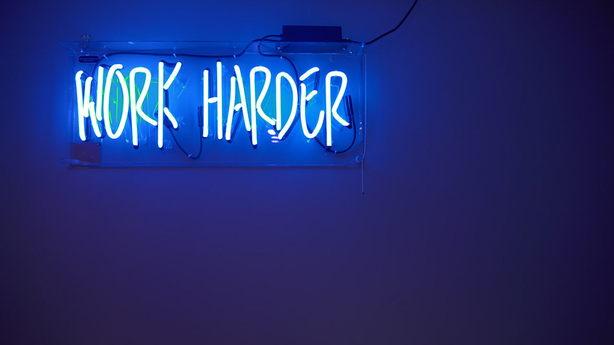
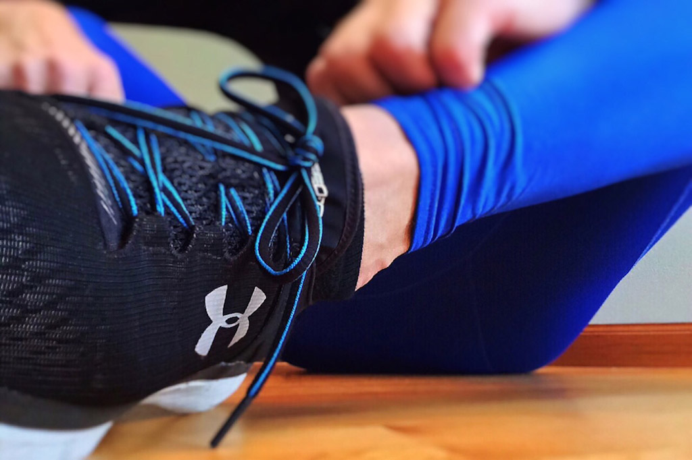

As a kid you usually do sports just for fun or maybe because your parents want you to learn how to get disciplined. Sometimes, the spark leaps over and you are hooked for fitness forever. Still it’s different when you’re working out for fun or because you have an actual goal, let’s say you want to lose weight, you want to work on your cardio fitness or you want to be leaner.

There are a few things I wished I had known before starting my workout routine. Maybe, results would have been visible earlier or maybe I would have taken some types of workouts more seriously. Anyways, I’ve asked some people what they wished they had known before starting to workout and I hope that their insights and mine will help you with your workout routine.

# 1. When working out, have a plan

For me, working out has always been fun. When I started, I didn’t really have a plan of what I wanted to do or what I wanted to accomplish. Even when I started going to the gym where they offered to work on a plan for you to start with, I didn’t take this offer. I thought I knew what I had to do and anyways, I just wanted to run on the treadmill, do some exercises on the mat and take a class every now and then. Now that I’ve started to do fitness on a much more serious level, I see how important it is to have a plan. Don’t just go to the gym and do whatever. Go in knowing the exercises you want to do, know at what speed, with which weight and resistance you want to perform and for how many reps and sets. Otherwise you will loose so much time wasting it on thinking about what exercise you want to do next and you will never go to your limits.

# 2. There will be setbacks and that’s ok

Tons of programs promise us all kind of success. You will be leaner with this workout, you will be more muscular with that program and more flexible with another. Yeah, it probably won’t work exactly like that. Often, especially when getting started with working out, you don’t start the right program for you immediately. Maybe you start a certain program and realise you hate the sport involved. It’s ok to have changing goalposts. It can be super frustrating when you have a firm idea in your head of what you’ll look like or what you’ll be able to do at a certain time and then not meet it. However, part of the fun of starting fitness is figuring out what works best for you. It’s such a fun process and you may be surprised what you like best. Just try it out and don’t be disappointed from setbacks. Simply try again!

# 3. Don’t rely on motivation

Being motivated is amazing. Your will is such a powerful muscle. However, there will be days when you’re not feeling motivated at all. There will be days when all you want is to stay home in front of the TV or doing whatever, just not working out. These are the days when you can’t rely on motivation, but have to focus on your discipline and your routine. While it’s ok to take a day off, it gets really hard to get back into your workout routine once you’ve lost it. Thus, consider fitness as a daily habit, just like brushing your teeth. Don’t rely on motivation. Even if you really love working out, there will be days when you don’t.


# 4. Don’t only follow your routine. Switch it up sometimes

If you’re following a routine, it takes time until you see the first results. This can be frustrating and finally make you stop working out all together. For variety and also for interest, look into other exercises parallel to your workout and try to incorporate different moves. For example, if you like cardio, you might want to look into bodyweight fitness as well. Only ten minutes added to your routine might be the perfect complementary workout to reach your goals or to spice up your routine.

# 5. Girls can own the weights section

As a lot of girls I was totally scared of the weights section at the gym. Not only was I scared of making a fool of myself while all the guys watching, I was also scared to become too muscular. Only later I learned that also as a girl you can lift weights without becoming a muscleman.


# 6. Continually tweaking carbs and calories is a recipe for disaster

In order to stick to a diet, it’s important to find one that suits you. Not every diet is made for you. Sometimes you see results but actually feel terrible. Continually tweaking carbs and calories is not the way to do it. You will get frustrated eventually which can even lead to the infamous Yo-yo effect. It’s important to know what’s good for you and your body but also to have a little treat now and then. It won’t hurt if you’re working out regularly and pay attention to what you eat on the other days.


# 7. Nutrition is more important than you might think

When I started working out I didn’t really have a goal in my head. I just did it for fun. Thus, I also didn’t pay attention to nutrition. It was only when I started working out with a personal trainer that I learned how important nutrition is for your body and your health. It really makes all the difference. So if you’re working out but don’t see any results, it might also be your eating habits that prevent you from  being successful.


# 8. Get out of your comfort zone

It’s so easy to stick to your three sets of 12 reps routine and just finish your workout after you’re done with it. The thing you should ask yourself is, did you go until failure? Could you have squeezed out one more repetition or even set? It’s natural to stop your workout once you’ve reached your numbers. When your muscles are burning it’s hard to go beyond. But trust me, that’s where the real magic happens.


# 9. Don’t overcommit

Once you’re on fire for fitness you might want to workout more often, maybe even more often a day. However, it’s important to listen to your body when it’s telling you it’s time to stop. Know that your nutrition and exercise regimen will change as your body changes. Don’t enter the gym expecting to do an hour of cardio and an hour of weights afterwards. You might be able to do that once or twice but after a while you’ll burn out.
From personal experience I know how hard it is to take a rest day. I really love to run because it really clears my head. Sometimes all I want to do is go for a run to get things in order in my head. If I can’t then, this can be really frustrating. Still, don’t overcommit. It will only hurt your body and get you nowhere.


# 10. Exercising is not an on/off thing

This point is such an important one for me. I always saw fitness as something fun to do whenever I had time for it. But I never really cleared my schedule to workout. Luckily, I have always been blessed with a healthy body so I didn’t have a reason to workout regularly. Except, of course you don’t only workout for the looks but also for your health. It took me a while to understand that and to see benefits other than losing weight, which I didn’t necessarily wanted. I now found my workout routine. These days, fitness is nothing that I do now and then but something that I do on a regular basis. It’s no longer an on/off thing which makes all the difference.

<Divider />

It took me more than ten years to figure out what it means to be serious about fitness. I have always liked and practiced it but never have I done it on the level I am now. The feeling after completing a tough workout is incredible and nothing compared to the feeling I had when I was just casually doing some sport. I'm still a defender of doing things in moderation and doing a little sport is better than doing nothing. I, however, wish I had known all these things about fitness I know today as I wished I could have experienced this joyful feeling earlier. Still, I am glad I know these things today and I hope they help you not to make the same mistakes I did.
