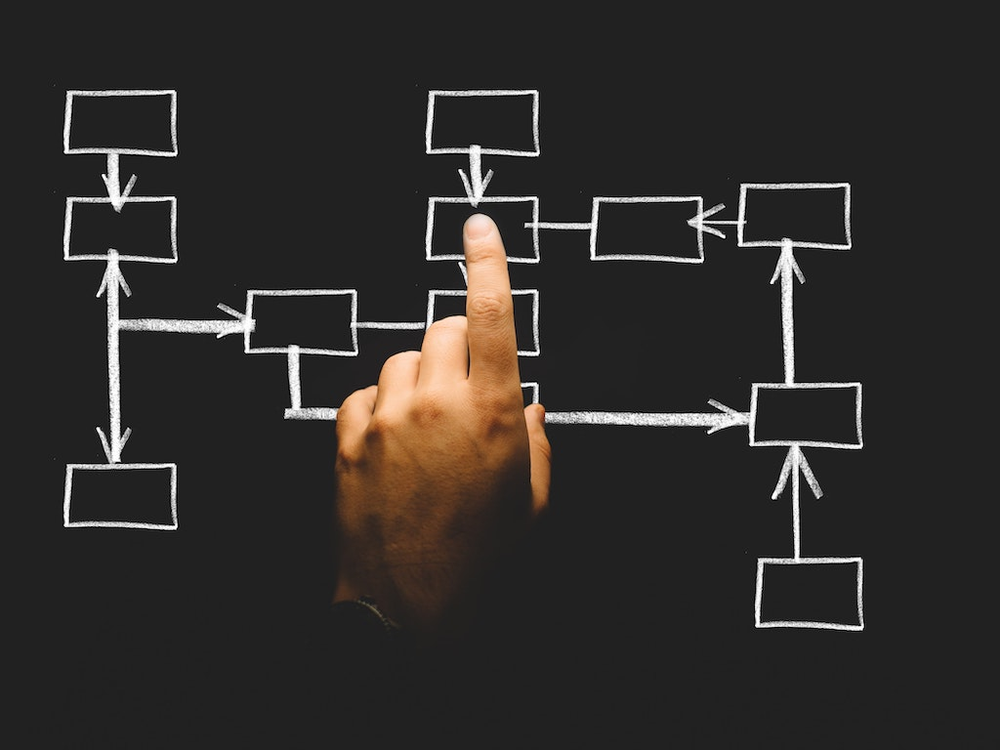

When in proper balance, hormones **help the body thrive**, leaving you feel **energized and well**. However, only small problems with hormones can be the cause of serious and life-altering symptoms. That is why it is crucial to listen to your body and be able to detect any imbalances in your hormonal system. In this introduction you’ll learn **what hormones are exactly, what functions they have, which hormones belong to the key players in your body and what symptoms can occur when your hormones are off**.

# What are hormones?

Hormones are **chemical messengers** that travel in our bloodstream to tissues or organs, controlled by the glands. They affect processes like:

- metabolism
- growth
- sexual function
- reproduction
- mood
- sleep pattern
- hunger
- emotions

Only a tiny amount of hormones can cause big changes in cells or the whole body - they are that powerful.
Hormones are **produced through the glands** which are part of our endocrine system:

Thyroid: calorie burning and heart rate
Hypothalamus: body temperature, hunger, mood, sleep, sex drive. It also controls the release of hormones in other glands
Pancreas: Produces insulin that helps control blood sugar
Adrenal: sex drive and cortisol, the stress hormone
Ovaries: secrete estrogen, testosterone, and progesterone, the female sex hormones

# How communication works among organs

The communication process starts in the **hypothalamus** in the brain. You can imagine its function like the MD. It **releases either stimulating or inhibitory hormone messages** to its manager, the pituitary, telling it what it needs to do. The **pituitary then communicates this hormone message to the other endocrine organs**, telling them exactly what they have to do. Once this cycle is complete, the end organs will send a feedback to the hypothalamus, reporting the current hormone status. Like this, the hypothalamus always knows what to do next.

# What are the major types of hormones?

Within your body exists a vast number of hormones, and while they all play an important role, some are more important for our well-being and overall health than others. Meet **oestrogen, testosterone, progesterone, insulin, thyroid and cortisol**. They all work together in synergy and ideally in balance. These hormones can be divided into two groups - the **steroid and the peptide hormones**.

1. **Steroid hormones**

Progesterone, testosterone, oestrogen and cortisol belong to the group of steroid hormones. They are **derived from lipids or to be more specific from fats, cholesterol and circulating LDL**, the ‘bad’ cholesterol, in your bloodstream. For those hormones, your **liver** plays an important role as cholesterol is used there to produce a precursor steroid hormone called **pregnenolone**. From this one all the other steroid hormones are synthesized. Maybe you can see now why the right fats in your diet and an optimally working liver are so important. **If you don’t get enough of these good fats, your body is not able to make the adequate amounts of oestrogen, testosterone, progesterone and cortisol**. Also, converting cholesterol to pregnenolone takes a high amount of energy which your cells get from a nutrient-dense diet.

2. **Peptide hormones**

Insulin and thyroid belong to the group of peptide hormones and are **synthesized from proteins (amino acids)**. Certain nutrients known as cofactors, such as selenium or B vitamins help with that process. Can you already see why a nutrient-dense diet is so important for a good balance of your hormones?

# The six key players

1. *Oestrogen* is the main sex hormone for women. It causes **puberty, prepares our body and uterus for pregnancy, and also regulates the menstrual cycle**. Throughout our menstrual cycle or during menopause, the estrogen level in our body changes which can cause many uncomfortable symptoms.

	A high level of oestrogen for example can cause **bloating, swelling and tenderness in the breasts, decreased sex drive or mood swings**.

2. *Progesterone*  also assists with the **menstrual cycle and plays a role in maintaining the early stages of pregnancy**. During the second half of the menstrual cycle it is secreted mainly by the corpus luteum in the ovaries.

	Either alone or in combination with oestrogen, progesterone is taken as an oral contraceptive (the pill) and it is also used in hormone replacement therapy to relieve symptoms of the menopause.

3. *Cortisol* is also called the **stress hormone**. By working with certain parts of the brain, it **controls mood, motivation, and fear**. Cortisol is produced by your adrenal glands - triangle shaped organs at the top of the kidney.

	Other functions cortisol takes on are **regulating blood pressure, keeping inflammation down or controlling your wake/sleep cycle**.

4. *Testosterone* is a hormone that is primarily made by testicles in men. However, women’s ovaries also make testosterone but in much smaller amounts.

5. *Insulin* is responsible to help **regulate your blood-sugar levels**. It takes the glucose that derives from the food we eat from our blood and transports it into our cells. The cells absorb the sugar and use it for energy. This way, your blood-sugar levels can go back to normal.

6. Your *thyroid* hormones, called thyroxine (T4) and triiodothyronine (T3) primarily influence the **protein synthesis and the metabolic rate**.

	Surely you have heard of hypothyroidism (underactive thyroid) and hyperthyroidism (overactive thyroid) and how it makes people either gain weight, be tired all the time and depressed or rapidly lose weight, be nervous or anxious and how those people are having difficulties sleeping? These are just a few symptoms of when your thyroid isn’t working properly.

If you want to learn more about these six key players of your hormonal system, I encourage you to read The six key hormones and their roles.

# What happens if your Hormones are out of Balance

There is a variety of symptoms that show that your hormones are not in balance and it would take forever to list them. So here are a few examples:

- Brain fog, fatigue, weight gain, thinning hair, constipation and miscarriage can result from a low thyroid
- Weight gain, anger, infertility, facial hair and acne can result from high testosterone
- Low self-esteem, low libido, moodiness and weight gain can stem from low testosterone
- PMS, constant hunger, Type 2 diabetes and elevated cortisol can result from elevated insulin
- High cortisol can lead to anxiety, belly fat and insomnia
- The feeling of being burnt-out, tearful, exhausted and drained can come from low cortisol
- Headaches, panic attacks, belly fat and low mood and libido can come from low oestrogen
- While high oestrogen can lead to PMS, cysts, heavy periods, endometriosis and even breast cancer
- Insomnia, PMS, irregular menstrual cycles, infertility and miscarriage can come from low progesterone

<Divider/>

As you can see, **an imbalance in your hormones might be able to explain a lot of symptoms or moods that we women experience**. That's why it is so important to keep our hormones in balance and treat any hormonal imbalances.

In the next part you will learn about factors that prevent your hormones to be in proper balance and how to handle them.