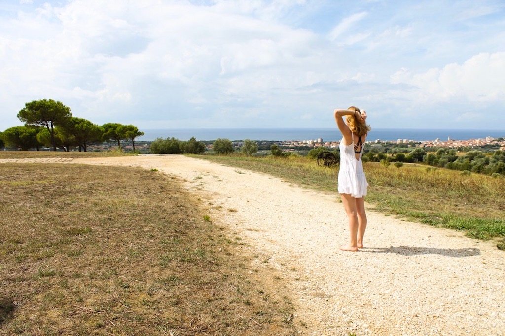
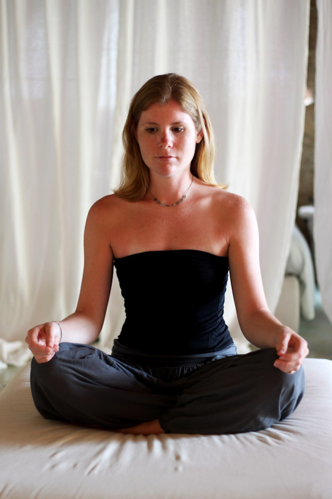

import { BlogLink } from '$components/Link';
import { Title, Subtitle, Divider } from '$components/mdx';

When you close your eyes and imagine the very best version of yourself, what do you see?

That was the question asked by <BlogLink to="http://ralfbohlmann.com/">Ralf Bohlmann</BlogLink> during a <BlogLink to="http://detoxrebels.com/">detox conference</BlogLink> I attended. Maybe you see yourself with five kilos less, maybe you have tighter thighs or more abs. I’m pretty sure you have a clear picture in your head. The question is, how do you become this version of yourself?

I know myself that the way is pretty hard. It usually means you have to skip dessert, go to the gym instead of to the cinema or go with the veggies instead of the French fries. So how do you stay motivated to finally become the best version of yourself and is sports and dieting alone really the answer?

I thought that this topic fits perfectly at the end of a year when everybody seems to be motivated to start into the new year better than they ended the last one. However, often those new years resolutions are unrealistic and leave us unsattisfied with ourselves. That's why it is so important to have a realistic view on what's feasible and what's good for us.

<Title id="five-components">The five components to become the best version of yourself</Title>

Becoming the best version of yourself, is indeed not only about dieting and sport. Instead, five components are essential:

1.  Food / Nutrition
2.  Motion / Sport
3.  Relaxation / Stress-Management
4.  Sleep
5.  Way of Thinking

It is not enough to do good in just one or two of these components. They all work together and if just one component is out of order, the whole system will be out of balance.

**1.  Food / Nutrition**

Food has one function mainly: it has to provide us with **energy**, **nutrients** and with **vital substances**.

**a. What is Energy?**

To grow, stay alive, be active, and stay warm we all need energy. The food and drinks we consume contain carbohydrate, protein, and fat, which then provide us with energy.

The amount of energy a food contains is measured in units of calories or kilojoules. The amount of energy per gram is called the energy density. The energy density of foods with fewer calories per gram such as vegetables, fruits, lean protein- and carbohydrate-rich foods is relatively low, while foods with a high fat and/or low water content such as fried snacks, crackers, nuts or chocolate have a higher energy density.

The most important source of energy for the body is the carbohydrate. It fuels both the brain and the muscles. You’ll find carbohydrate in starchy foods, e.g. rice, bread, pasta, potatoes or cereals.

**b. What are Nutrients**

In order to work properly, our body needs nutrients. An essential nutrient is one that our body cannot synthesize on its own. Therefore, it must be provided by the diet. The six essential nutrients include carbohydrates, protein, vitamins, water, minerals, and fat.

**c. What are Vital Substances**

To allow the smooth functioning of all metabolic processes, vital substances are essential constituents. They are needed in varying amounts. Vital substances are thought to include all the vitamins, trace elements and minerals as well as the amino acids, essential fatty acids, and fibre. All these substances are found in vegetable food. That is why as kids we are taught to eat five portions of fruit and vegetables a day.

**2.  Motion / Sport**

We all know how important it is to stay active in order to be healthy. That doesn’t mean that you have to go to the gym for hours, though. An active lifestyle can already be of help. In order to stimulate your body, you should be on your feet as often as possible. Take the stairs instead of the elevator, go to work by bike and leave the car or just go for a short walk during lunch break. Those tiny changes of your day can already help.

**a. How often should I workout?**

The American Heart Association suggests at least 150 minutes per week of moderate exercise or 75 minutes per week of vigorous exercise, to improve overall cardiovascular health. If we think of a six-day week with one day off that makes 25 minutes of moderate exercise. That should be doable! To really stay fit, though, it would be a good idea to also train your muscles two to three times a week and to really push up your heartbeat once in a while.

**3.  Relaxation / Stress-Management**

The problem with stress is not only that we tend to eat more and more unhealthy food, but also that a high level of cortisol, which derives from stress, slows down your metabolism, which might be a reason for gaining weight.

**a. Stress and your Metabolism**

Stress, whether it is physical or emotional, makes your body release a number of hormones, such as epinephrine and cortisol. To supply your body with the energy it needs to react to the stress, cortisol taps into your energy stores, including stored forms of fat, protein, and glucose. This process actually burns calories and increases your metabolism.

However, the hormone cortisol also breaks down muscle energy. We all know that muscles burn calories, thus a loss of muscles also means you burn fewer calories. So while you may be burning more calories from the stress at first, it may ultimately cause an overall decrease in your metabolism.

**4. Sleep**

It is not a secret that being short on sleep affects your body and also your weight. Maybe you already eat less and move more and still you’re not losing any weight or even worse, you’re gaining weight. Maybe that’s simply because you have forgotten to sleep enough. Sleep is the key to being rewarded for your fitness and diet efforts.

**a. How much should I sleep?**

The numbers provided by the Centers of Disease Control and Prevention are shocking: More than 35 percent of people are sleep deprived.

In order to get the best results from your diet and fitness efforts, you should at least sleep seven hours per night. If you don’t do that, benefits of dieting can be reduced and even undone, as published in the Annals of Internal Medicine.

In the study, people on a diet had different sleep schedules. Resting adequately, half of the dieters weight loss was from fat. When cutting back sleep, however, the amount of fat they lost was cut in half, even though they were still on the same diet. Apart from that, they also felt significantly hungrier, were less satisfied after meals and they didn’t have the energy to exercise.

**5.  The Way of Thinking**

You don’t have to be an esoteric to believe that the way we think and what we are thinking also affect our body. We are talking about "mind/body connection" here. Whenever we are stressed or anxious our body reacts to that feeling. Some are more sensitive to these reactions of our body and some are less, but the reaction is still there. We’re all familiar with that frantic heartbeat whenever we are nervous, or that nauseous feeling right before we have to talk in front of a big group of people. These are all reactions of our body to a state of mind we’re in right in that second.

**a. Positive Thinking and Weight Loss**

We all know how positive thoughts can put us in a "Yes, I can do this!" position. Negative or restrictive thoughts, however, can make losing weight a lot more difficult. Constantly focusing on what you’re not allowed to eat or what you cannot do can sabotage your weight loss efforts as you will be stuck with all the negative thoughts in your head, which make you feel bad. Wouldn’t it be much easier to focus on all the things you CAN eat and you CAN do instead of thinking about those that are restricted?

<Title id="becoming-the-best-version">So how do I become the best version of myself now?</Title>

I’m sure you are familiar with the power of images. The power of images is very strong. Thus, huge goals that you visualize in your head are a great motivation to become the best version of yourself. Try to really have a picture in your head. What do you look like, how do you feel?

In order to get to your goal, try to extend your comfort zone around your habits. Trying to change all at once and totally changing your lifestyle will only leave you frustrated. Maybe you can start with breakfast. Instead of bread with butter and jam why not try out some cereals with yogurt and fruits? And instead of subscribing to your local gym right away, why not go for a walk during lunch break? You will see that all those tiny changes will feel totally natural after a while. You will feel better, have more energy and maybe even lose a few kilos. But what’s most important: You will be healthier. And always keep in mind: Attractiveness is health that can be seen from the outside.

<Title id="recommendations">Recommendations</Title>

If you are interested in the topics mentionned above and would like to read more about them, I highly recommend these reads:

* <BlogLink to="https://www.amazon.com/Gifts-Imperfection-Think-Supposed-Embrace/dp/159285849X/ref=as_li_ss_tl?s=books&ie=UTF8&qid=1483011345&sr=1-9&linkCode=ll1&tag=21moves-20&linkId=b444919b494b3fedbc86fe57b9c0cf7e">The Gifts of Imperfections</BlogLink>

* <BlogLink to="https://www.amazon.com/Life-Earth-Understanding-Here-Ahead/dp/1401945570/ref=as_li_ss_tl?s=books&ie=UTF8&qid=1483011665&sr=1-25&linkCode=ll1&tag=21moves-20&linkId=91d2656a2826a98f6fffd7454f996ed0">Life on Earth</BlogLink>

* <BlogLink to="https://www.amazon.com/gp/product/1561706124/ref=as_li_ss_tl?pf_rd_m=ATVPDKIKX0DER&pf_rd_s=merchandised-search-4&pf_rd_r=GBGV2T61EQ6V3DNNV0SM&pf_rd_t=101&pf_rd_p=3ba4cf8e-6189-5ac2-acc4-4a9678f8e7bf&pf_rd_i=282868&linkCode=ll1&tag=21moves-20&linkId=3822013a040503d3bef91f67ee324e6b">Power Thought Cards</BlogLink>

* <BlogLink to="https://www.amazon.com/Nutrition-Physical-Degeneration-Weston-Price/dp/0916764206/ref=as_li_ss_tl?s=books&ie=UTF8&qid=1483011847&sr=1-4&linkCode=ll1&tag=21moves-20&linkId=6a9f72d0989d45a5217a2ac80d5814fa">Nutrition and Physical Degeneration</BlogLink>

