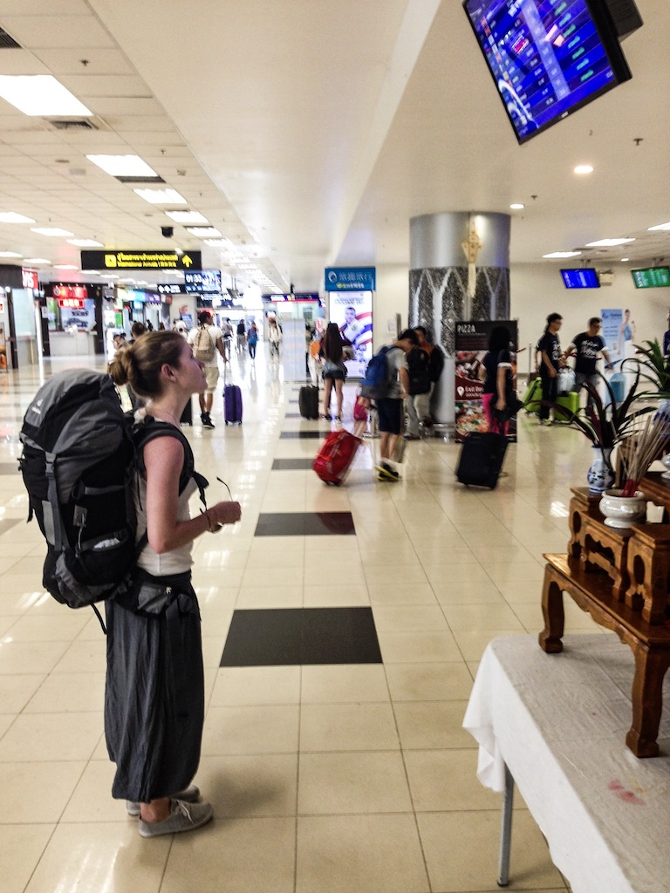
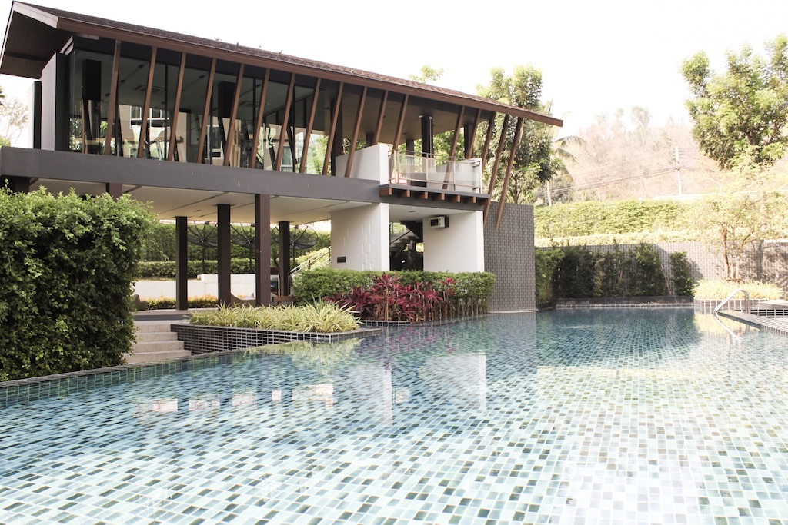
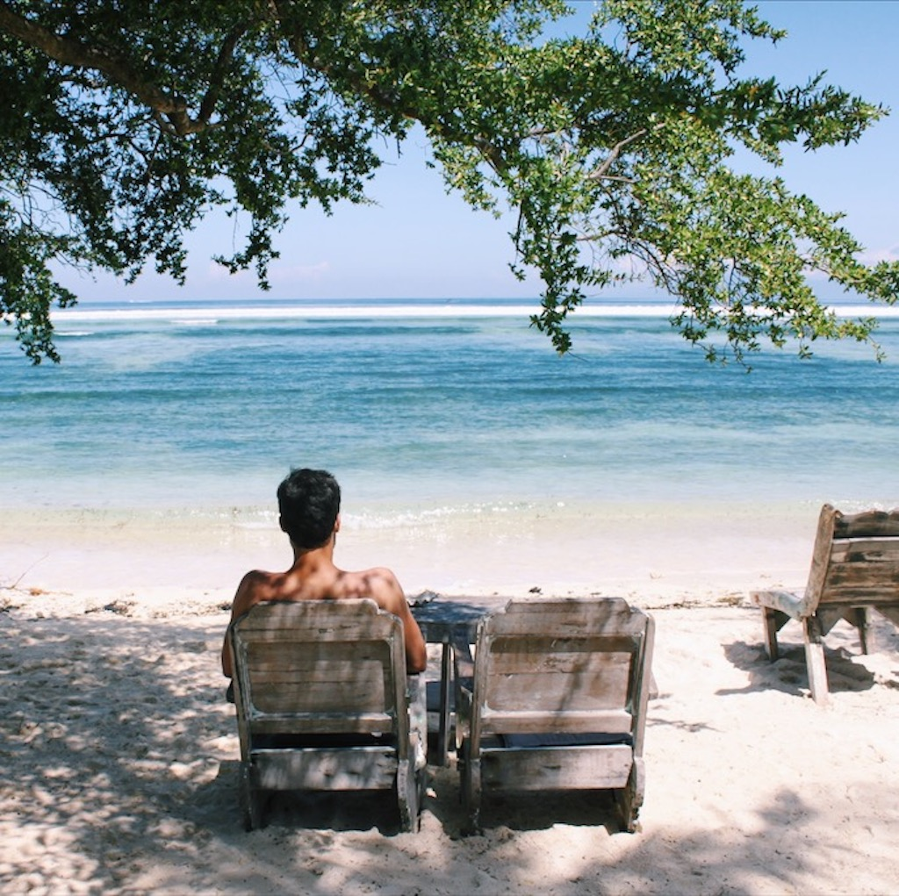
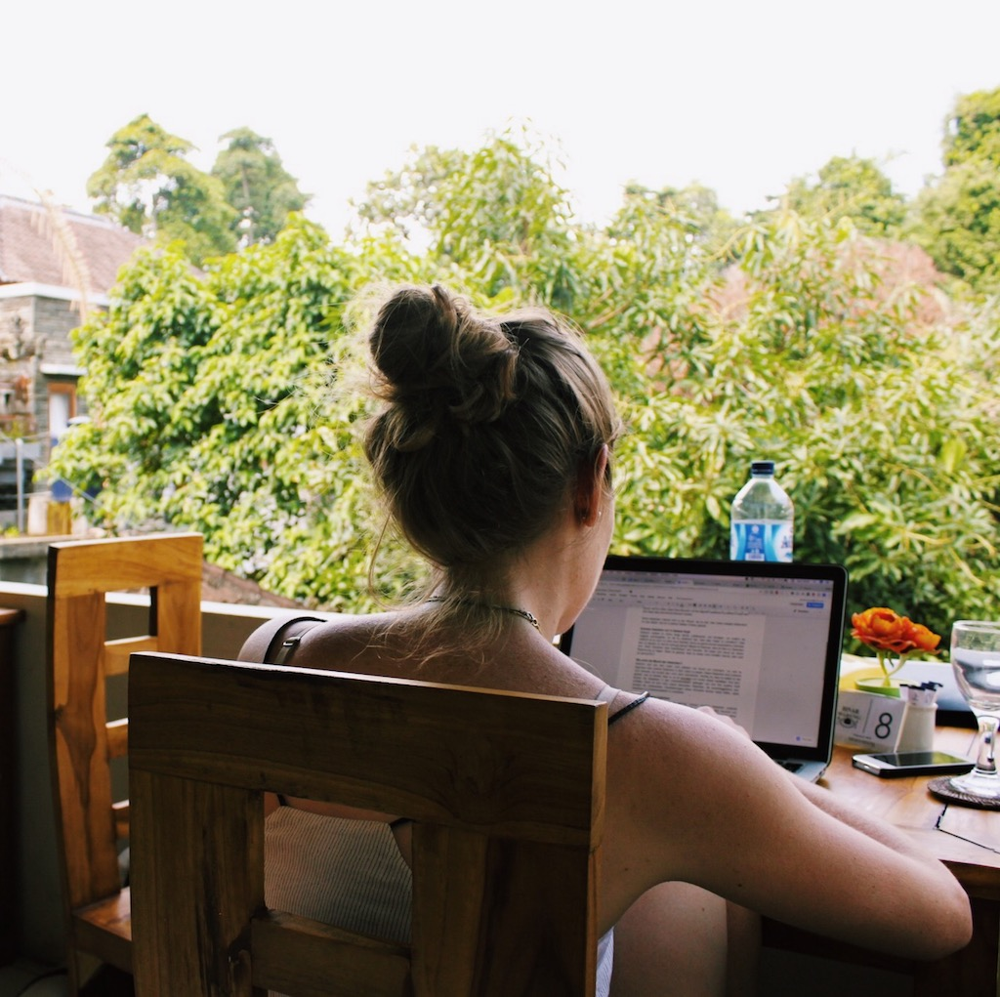

Working in such quick-changing industries such as marketing and web development, we are used to learning fast about new trends, technologies, and tools. This has always been one reason why we loved our work so much - there is no standstill and no boredom.

Lately, one other trend has fascinated us a lot - the digital nomadism. Digital nomadism seems to be huge these days. Ever since the technology became available, people in the online business packed their bags and started working on the go. This is made especially easy by the increasing number of communication channels like Slack,Skype, and Hangout.

As we have always enjoyed to travel the world, the idea of working and traveling has become very appealing to us. Although the concept was not entirely new to us (we actually did work and travel in Australia after school; even though only one of us really worked whereas the other part rather enjoyed the ride :D ), we had never really considered it to be an option now that we were in the *real* work life. The safety net, that an employer provides, always felt like such a nice thing to have.

# Throwing the Safety Net overboard

In November of 2017, we decided to throw our safety net overboard and try the digital nomad life ourselves. Back then, I lost my job for economic reasons so my net was already gone. I was thinking about new companies to apply for but couldn’t quite motivate myself to actually write any applications because none of these companies offered what I was looking for: Flexibility and purpose. I wasn’t just looking for any job; I wanted a job that fulfilled me. For some, this might be a way too romantic idea but I just can’t think of myself spending the next 40 years working for a company whose moral standards or way of operating I don’t approve.

# There’s only one way: Becoming a Freelancer

With no company offering what I was looking for, there was only one way for me to continue in my niche: Becoming a freelancer. Luckily, here in Germany we have a pretty good support system when it comes to starting your own business. With some effort, everybody is able to start a business here and get monetary support. That’s what I did. I took businesses classes, wrote a business plan and started looking for clients. It was a very stressful time but in the end it was worth it because I got all the support I needed. I could use my expertise for online clients to facilitate them with marketing ideas, strategies and content.

# Eying with the Idea of Becoming a Freelancer

Robin however, still was an employee at his old firm by the time we decided to try the digital nomad lifestyle. He had already built up a nice side project that was very successful and so he was also eying with the idea of becoming a freelancer. For him however, the decision wasn’t that easy. He was working at a great company with lots of perks and freedom. Giving all that up for a lifestyle that in the end might turn out to be not the right one for us seemed like a big risk. So we came up with an idea. Robin still had a lot of holidays from 2016 and also his holidays for 2017. In total, that would make six weeks of holidays. Our goal was to go abroad for at least eight weeks so Robin asked his boss for the opportunity to work remotely for two weeks. As I said, Robin worked at a really great company that values flexibility a lot and so his boss agreed.

# The Adventure begins

And so, in March of this year we started our digital nomad life for a trial period of two months. Our aim was to see if we can combine working and traveling, if we are able to get work done in countries where people usually go on vacation, and where we liked it most to potentially stay there for a longer time.

Our first stop was in Chiang Mai, Thailand. We stayed there for one week on campus of Chiang Mai University and enjoyed it a lot. We had a lovely one room apartment with a gym and swimming pool on campus. Close by were great cafés to work from. There is definitely a reason for Chiang Mai being called the city of digital nomads. We wanted to immerse in the culture of the Thai people, avoided mostly the popular Nimmanhaemin district for digital nomads, and came along in the cheaper yet non western areas pretty well.

Next, we went to Luang Prabang, Laos. We absolutely loved it there but realized right away that it wouldn’t suit our digital nomad lifestyle. For once, coffee was way too expensive :) Also, the internet connection was really bad which is an absolute no-go if you’re working online. It was too relaxed to get into a working atmosphere and somehow we missed all the opportunities which a bigger city would give us.

The next two weeks were spent travelling in Cambodia. For some people, it’s a dream destination. We however, didn’t like it that much. Maybe it was because it was raining all day or because every place seemed to be run over from tourists, but whatever it was, we didn’t want to stay much longer. Thus, we could cross off Laos and Cambodia from our list of nomad homes.

After Cambodia, we went to Indonesia, including east Java, Lombok, Gili Islands and Bali which was our last stop. And what shall I say? Everything they say about Indonesia is true: It’s simply A M A Z I N G! It is very digital nomad friendly with lots of coworking spaces and great coffee places, the food is delicious and the life is not too expensive. There were several places that we would consider living and working from, not only in Bali but in Indonesia in general. Yogyakarta for example was a great place, too. Really cheap, a lot of great places to see around, and awesome working spaces. Even though Bali is pretty touristy and western oriented, you can find some great hidden places to immerse into the Balinese culture. The Gilis however, were more of a holiday destination to us. With bad Wifi and no good cafés to work from, it is a beautiful place to relax, yet not to work.

After having visited four countries and a lot of great places, we put together a list with our favorite spots to work and live at. We considered the overall costs, internet connection, lifestyle, and countryside in our decision. Our top three locations are

1. Chiangmai, Thailand
2. Ubud, Bali
3. Canggu, Bali

# Now what about Work?

You might have gotten the impression now, that we were only traveling in our two months, but that’s actually not true. By the time we started traveling, I already had three clients for whom I also worked from abroad. It was actually super easy as long as the internet connection was good. If I had to do an important call with video capabilities, I booked a room in a coworking space to be sure to have a good internet connection. I never experienced any communication problems with my clients whatsoever and they were always satisfied with my work. If anything, my work was even better than before because I was super motivated to get things done as I knew that a beautiful day at the beach, great food, and awesome people were waiting for me.

For Robin, work was challenging in the beginning. He put his two weeks of remote work at the beginning which, looking at it now, might not have been the best choice. By that time, everything was new and exciting for us and the last thing we were thinking about were work deadlines and virtual meetings. It might have been a better idea to first settle a bit, get used to the new surrounding and all the traveling and do the remote work a little later. His other projects however, the ones he was working on for himself and started a bit later during our travels, went flawless. Motivated by the good weather and all the other digital nomads around, he got a lot of work done.

However, one thing we realized quite early on was, that it is not possible to work and travel a lot at the same time. Mostly, we were in one place for just a week which made it hard to get used to the surrounding. We were not able to setup any routine. Also, traveling is really exhausting. So after a long trip you might not really be up for working the next two or three days as you’re tired and want to see the area first. You also have to find a good work space first, places to eat etc. All that is very time consuming so we decided that we had to stay in one place for at least one month. Let’s better make it three.

# Know your Limits

These are all realisations that we would have had to find out first, if we had simply jumped into freelancing and nomading at the same time. Now however, we know how things work. We know how to find the cheapest places to eat or to sleep, we know where the internet works best and which mobile provider we should go for for the best connection, and which visa we need for which country. But most importantly, we know where we want to stay for the next three months, where we will feel at home and where we know we can meet fellow digital nomads yet immerse into the culture and meet local people.

An important experiment for us was to figure out our limits. You might know your own limits, but as a couple it is slightly different. You have to adjust your lower bar to your spouse's limits. It doesn’t work out if one of you eats Pad Thai for $0.50 at the local street market, but the other one would never touch it. Luckily, both of us crave for cheap but delicious street food. After a couple of years travelling and living together, it wasn’t that hard for us to test these boundaries. The same experiment applied for the apartment and the district you wanna live in. In both subjects luckily we had the same expectations.

# Get to know the Challenges

Most importantly, we wanted to figure out if we would hit the wall at some point during the experiment. Therefore, it is not only important to know your limits. You need to know how you can adjust yourself to different work environments. Is it fine for you to work from a coffee shop all the time or do you need a coworking space once in a while? Can it be a mix of both? What about the ergonomics during work time? A coworking space would allow you to sit comfortably with an adjustable chair, desk and display to avoid any back in the long run.

So we tried different working conditions and were fine with all of them even though we preferred any cozy coffee shop over a coworking space. It was cheaper, too. The only thing we knew is that we would have to bring more than just a MacBook to our workday. In order to not suffer any back pain in the long run, we bought a [keyboard](http://amzn.to/2xnBbYk], a [trackback](http://amzn.to/2xnePq6] and a [laptop stand](http://amzn.to/2y6NTtn].

Last but not least, we did a lot of fitness back in Berlin. Everyday we went to our work by bicycle. That were more than 10 kilometres a day. Next to it we worked out every third day and did a lot of running. That could go away when living in a city where you would go by scooter everywhere. So it became important to us to workout everyday during our travels. Looking for opportunities to run, to use a gym or to simply walk rather than taking the scooter.

<Divider />

By now, Robin also quit his job, we started traveling again, first stop: Chiang Mai. We also started the Wayfaring Society, a platform where we want to help fellow nomads with our knowledge in marketing and web development and share information on the digital nomad life. We want the Wayfaring Society to be a community for people to encourage each other and share stories and experiences as well as valuable knowledge. Because one thing is clear: If you are a solopreneur you have to get yourself out there. You have to stand out to land the gig and you have to know how to build a personal brand. That’s what we are there for. We are going to help you being the best digital nomad solo-preneur that you can be. How are we going to do that? Well, for starters, join our Facebook group where we will provide valuable information, industry insights, and more and where you can connect with likeminded digital nomads. We all have the same goal and we are all here to help and support one another. We want to create a community of passionate and creative digital nomads who can encourage and inspire each other. We believe that there is more to life than a 9 to 5 job and we want to help other people see that, too!

