Sometimes there are things causing you sleepless nights. We all have them - it’s totally normal. We all have responsibilities, deadlines, fears and stressful days and it is absolutely understandable that those things can even cost us our well-deserved sleep.

Whenever I’m having a hard time sleeping, some goodnight yoga exercises are my go to in order to calm myself down before going to bed. Today I want to show you my favorite Yoga moves before going to bed. By the way, there is a whole infographic with all the poses [at the end of the post](#infographic). I hope you like it!

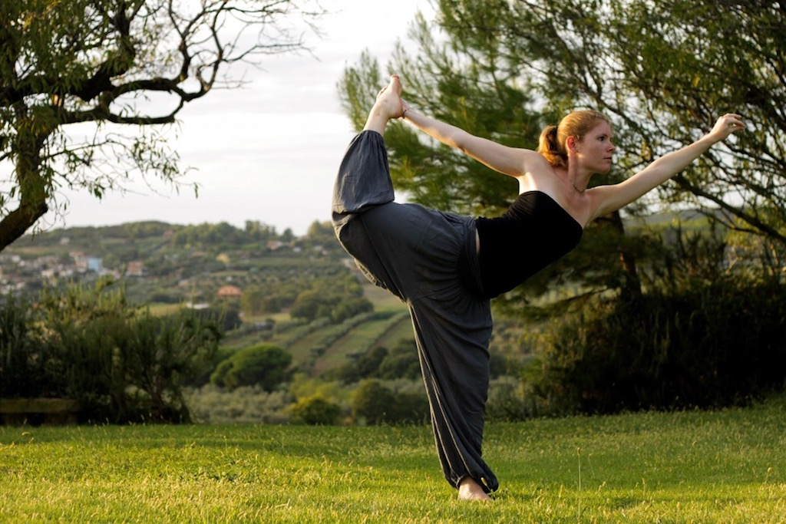

# What kind of Yoga is best before going to bed

As you want to find a routine that relaxes your whole body before going to bed, it is best to opt for a sequence of basic, soft and gentle postures. There should be no hurry in your bedtime Yoga workout. Take it nice and slow with a nice flow in your breathing. To finish your sequence, you should come into a seated meditation or Corpse pose. Don’t do any power poses, as they will just get you out of sleep mode. Simply give your body some gentle stretches and twists before you're going to bed.

# How long should I practice bedtime Yoga

Since your goal is to calm your mind and body and not to activate them, 15 minutes right before going to bed should be an optimum duration for a bedtime yoga routine. In the end however, how long you want to practice is totally up to you. You might want to finish halfway through the planned sequence or maybe stay in your stretches a little longer. Just listen to what your body tells you.

# Do I have to practice goodnight Yoga every night

Having a sort of ritual before going to bed can be very helpful to find better sleep. Soon it will become a habit and you will feel how good it is for you and your sleep. Routines help us to soothe our minds, which is exactly why we’re doing Yoga before going to bed. However, if you’re feeling way too tired to practice Yoga, there is no harm in breaking the routine for one night.

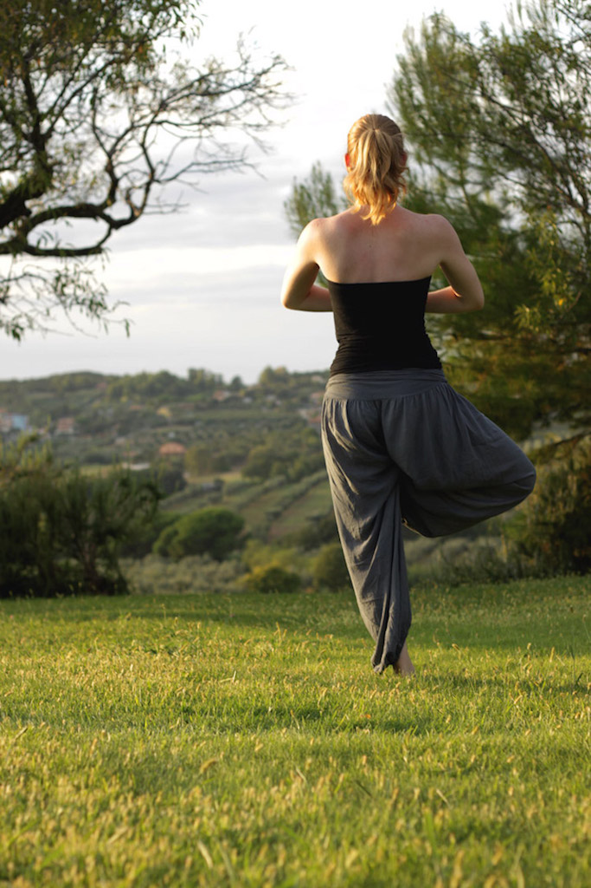

# Benefits of yoga before going to bed

There is a lot of evidence that evening Yoga can help to improve your ability to relax, rest, and get a good night’s sleep. It took the worlds of modern medicines and science some time to even consider things like yoga to be beneficial for healthcare. Nowadays however, the practices of yoga are acknowledged for their health benefits among medics and scientists. Primarily, they see the benefits of practicing yoga in the ability to handle stress better and in an improved general sense of well-being. Also, while practicing yoga we can release stress and tension that accumulate in our body. When letting go of stress and tension our body and mind are able to calm down, which helps us fall asleep more easily.

A study by [Jonathan Halpern, Ph.D. et al.](https://www.ncbi.nlm.nih.gov/pubmed/24755569) also found significant improvements in sleep quality, sleep efficiency, and sleep duration among older participants (age ≥ 60 years) suffering from insomnia who then attended yoga classes and practiced meditative yoga at home. Additionally, there were improvements in the level of stress, depression, and general well-being.

# Building up a bedtime Yoga routine

If Yoga before going to bed really that good, I cannot stop but wonder why we don’t do it a lot more regularly. As I stressed before, building a habit can help you so much to really do what’s good for you. So why don’t we just take 15 minutes of our time before going to bed to calm down and do some goodnight Yoga? For a starter, these ten poses can help you cool down after a stressful day.

* **1. Kneeling Pose with deep breathing** (*Virasana*):
Start out in a kneeling pose and pay attention to your breathing. Breathing in Yoga is considered to have a huge effect on our brain and body. Before starting with physical poses, it’s good to take a moment to yourself and to just focus on your in and out breathing. Breathe through your nostrils and try to lengthen the exhalation as long as possible.

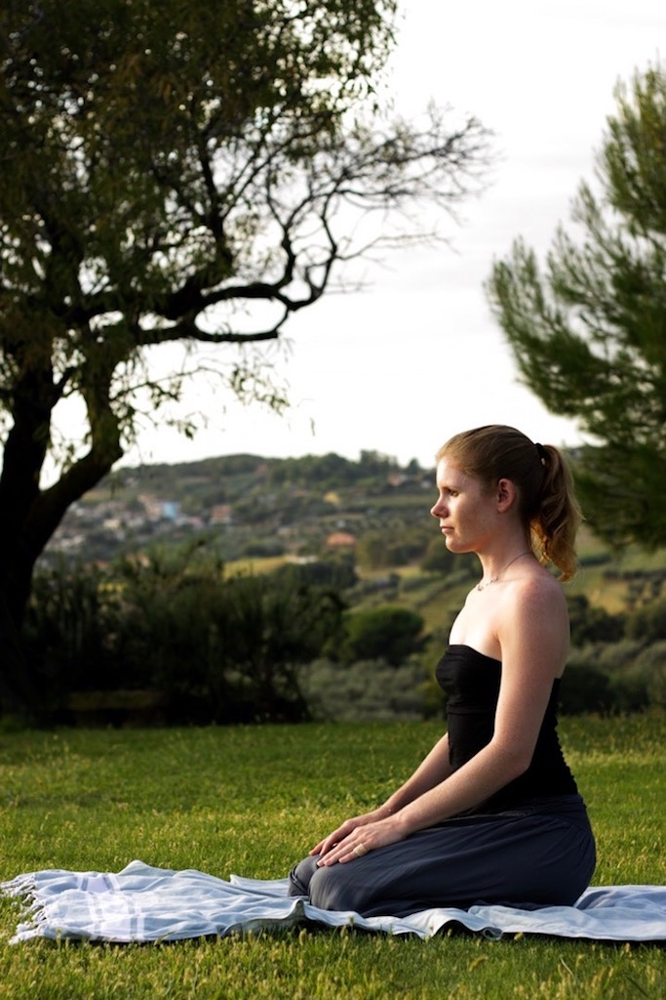

*  **2. Standing Forward Bend** (*Uttanasana*):
Now get up and stand with your feet hip-distance apart. Fold your hips forward and reach your fingertips toward the ground. Rest your rips on your thighs and bend both arms at the elbows, grabbing them with the opposite hand. Let your upper body relax. This part was especially difficult for me and I think in the picture you can still see that my upper body is not totally relaxed. Sometimes it’s just hard to really let loose.

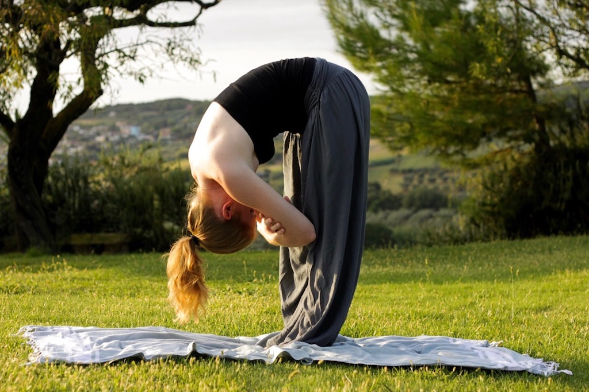

*  **3. Cat-Cow Pose** (*Marjaryasana* and *Bitilasana*)
This pose is all about relaxing and extending the spine. Get into a quadruped position, wrists directly under your shoulders, and knees under your hips. While inhaling, gently drop your belly towards the floor and lift your head and tailbone up towards the ceiling. Then exhale deeply, round your spine and tuck your chin towards your chest. Try to really sync your breathing with your movement.

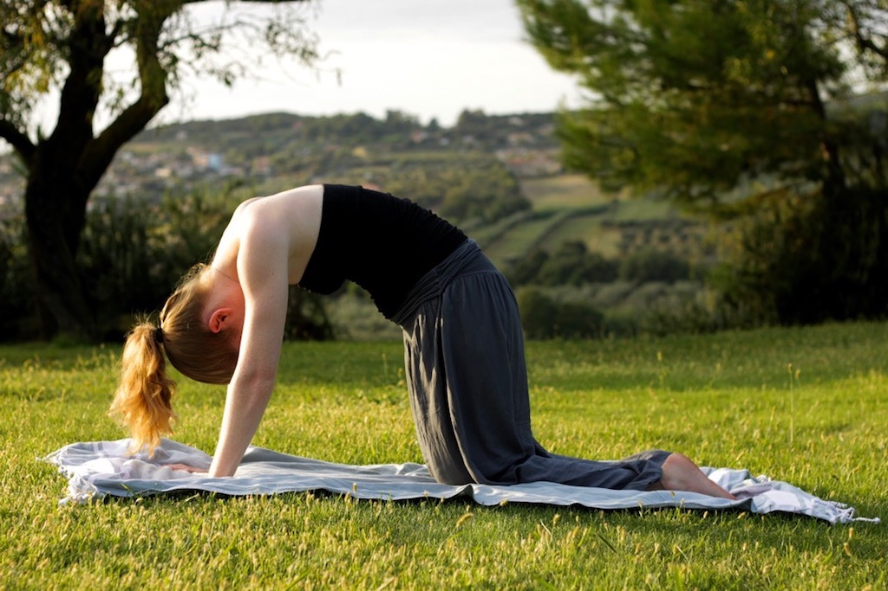

* **4. Plow Pose** (*Halasana*):
Lie on your back and gently bring your legs up and over your torso so that your feet touch the ground behind your head. Pay attention to your shoulders, they should be firmly on the floor. The center of your back is where the focus of your weight should be. This is an important pressure point, which, if opened, creates deeper breathing and relaxation.

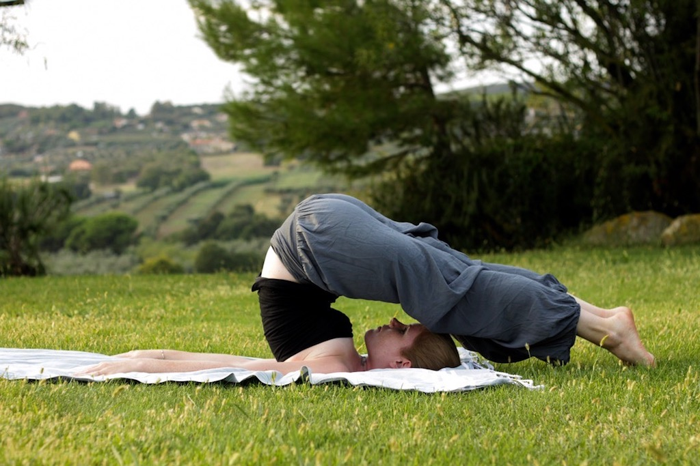

* **5. Child’s Pose** (*Balasana*):
Everyone who has ever been in the child’s pose knows how comforting and relaxing this position can be. Sit in Japanese-style and open your knees very wide. Your big toes should be touching. Lower your torso and rest your forehead on the floor. Pressing down the head like that really soothes the nervous system. Extend your arms in front of you but don’t lift your buttocks; they should be touching your heels.

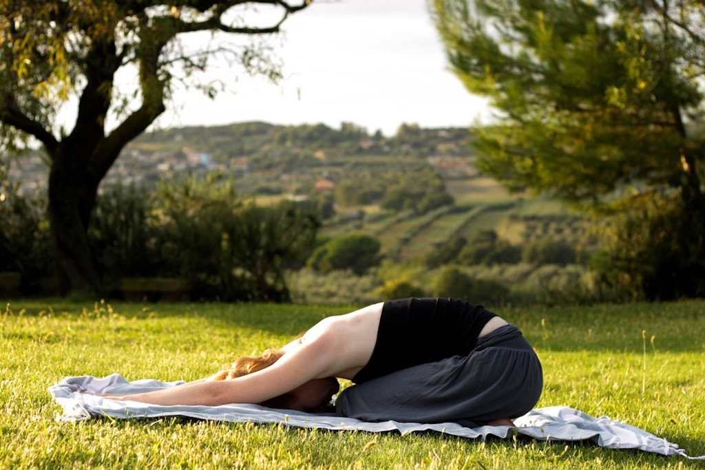

* **6. Extended Corpse Pose** (*Savasana*):
This pose may look simple, but the effect on your sleep will be great. Simply lie on your back and extend your arms overhead, making yourself really long. Bring your index fingers together and really stretch them. This helps relax your upper body, especially the shoulder part. Continue with your natural breathing and focus on relaxing your arms.

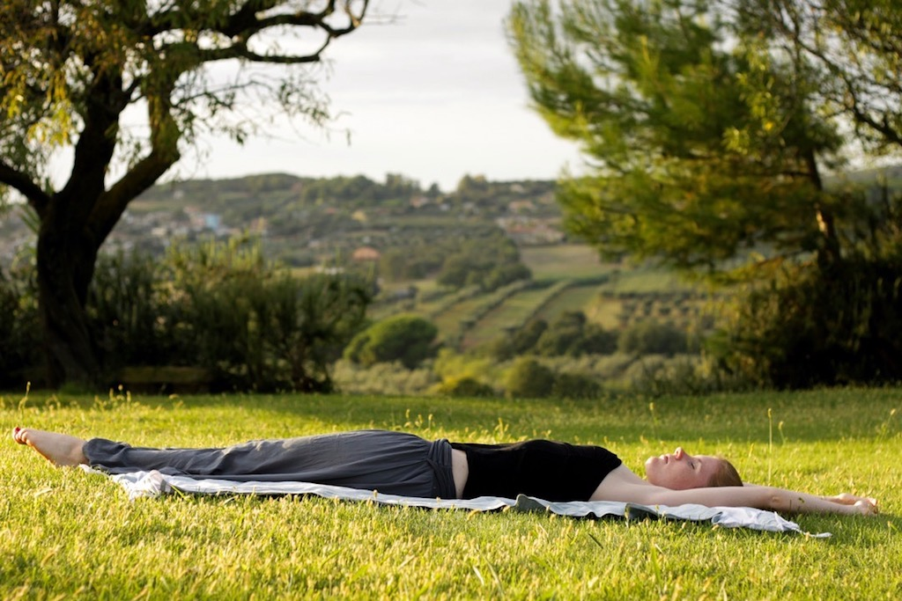

* **7. Reclined Spinal Twist** (*Supta Matsyendrasana*)
This twist can be performed to compress the spleen, as in Traditional Chinese Medicine it is responsible for digestion. Digestion however, doesn’t only mean digesting food, but also things that are going on in your life. Lying in this position will help your clear your head and shut out all the noises in it.
Lie on your back and extend your arms out to the sides. Pull your knees to your chest and then drop them over to the right side as you turn your head in the opposite direction. Your shoulders should be on the ground the whole time. Breathe in and out a couple of times, then switch the sides.

* **8. Seated Forward Fold** (*Paschimottanasana*):
This is one of my favorite exercises as it helps to unwind a distracted mind – and the hamstrings. Sit on the ground keeping your back straight and the legs together and stretched out in front of you. The feet should be flexed. Now bend forward with your hands reaching for your toes. Only go as far as you can; there mustn’t be any severe pain. Hold this position for 15 seconds.

* **9. Knee Hug** (*Apanasana*)
This yoga posture helps to relieve tension and pressure in the digestive system and back. Lie on your back and gently pull your knees up to your chest and hold them, rocking slowly side to side. Let your whole body relax.

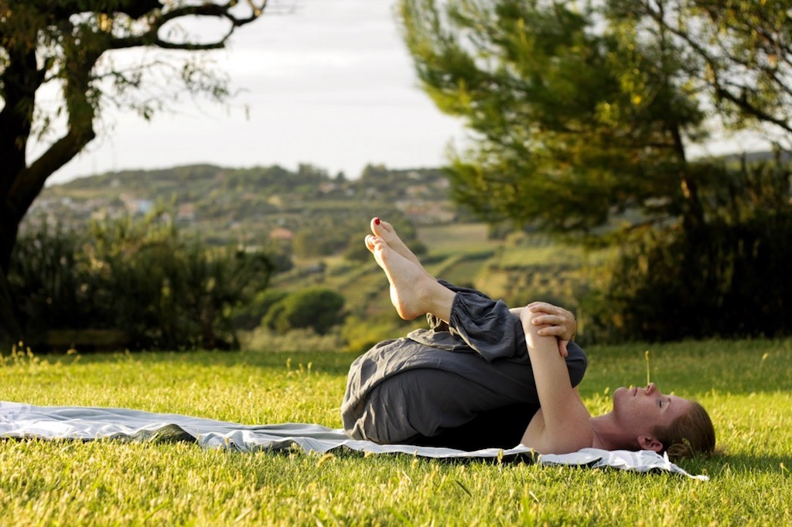

* **10. Camel Pose** (*Ustrasana*):
The camel pose is a great exercise for the back and also for your digestion after eating as it eases stomach problems. As it also reduces the excess of stress hormones it is a good posture to come into before going to bed.
Kneel on the floor and keep your knees in line with the shoulders and sole of the feet facing the ceiling. Hands should be rested on your thighs. Now inhale and arch your back and place your palms on the heels of your feet keeping the arms straight. Don’t strain your neck: just hold it naturally. Stay in this position for a couple of breaths.

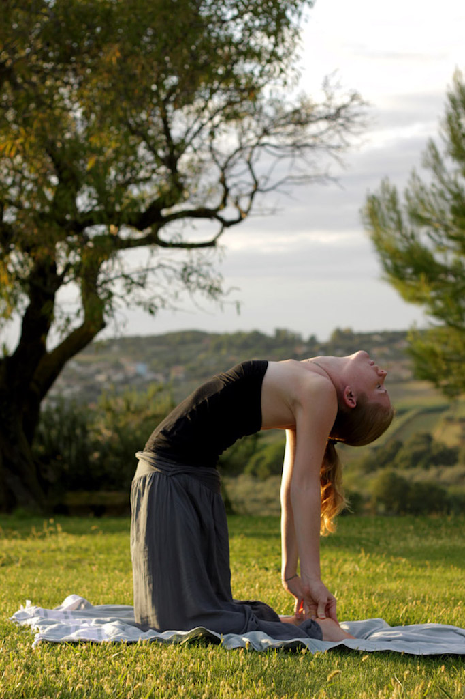

# A few book recommendations for more infos on this topic

If you want to read a little bit more about this topic, here are some recommendations:

* [From Sleep Deprivation to Sleep Tight with 12 Effective Yoga Poses](https://www.amazon.com/Sleep-Deprivation-Tight-Effective-Poses/dp/1500392057/ref=sr_1_15?s=books&ie=UTF8&qid=1478355424&sr=1-15&keywords=yoga+insomnia)
* [Yoga Therapy for Overcoming Insomnia](https://www.amazon.com/Therapy-Overcoming-Insomnia-Peter-Houten/dp/1565891740/ref=sr_1_2?s=books&ie=UTF8&qid=1478355399&sr=1-2&keywords=yoga+insomnia)
* [The Yoga of Sleep](https://www.amazon.com/gp/product/159179918X/ref=as_li_qf_sp_asin_il_tl?ie=UTF8&tag=21moves-20&camp=1789&creative=9325&linkCode=as2&creativeASIN=159179918X&linkId=ccb60e323fedfad7b71e95c486f10f38)

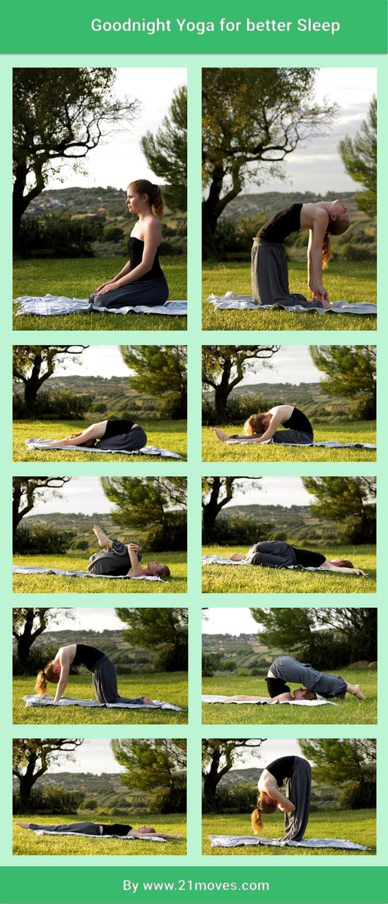

