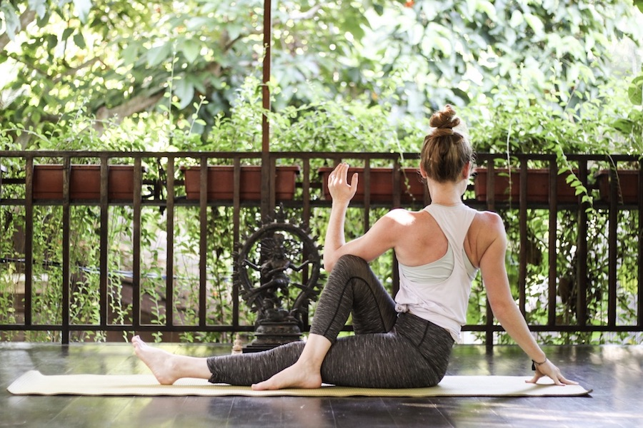
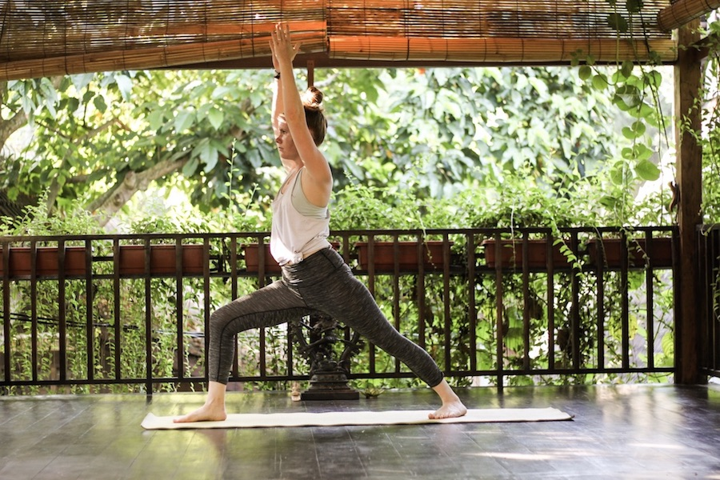
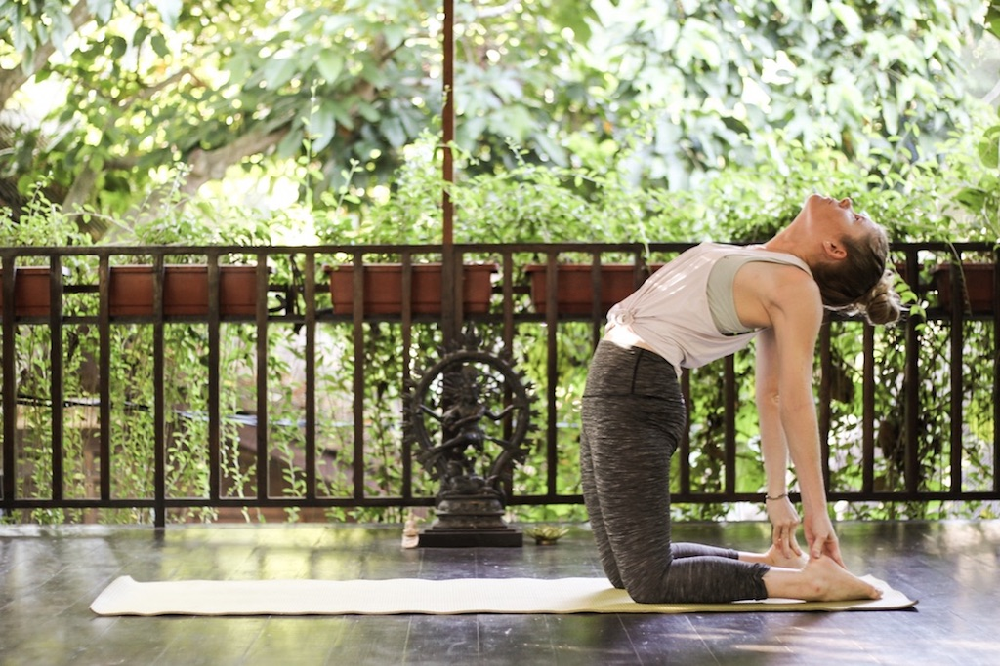
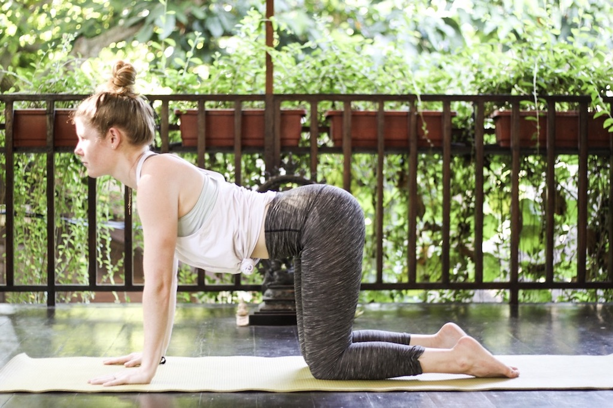
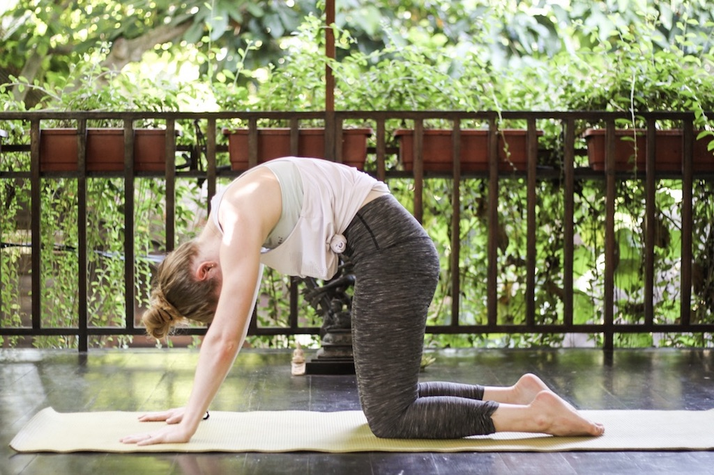
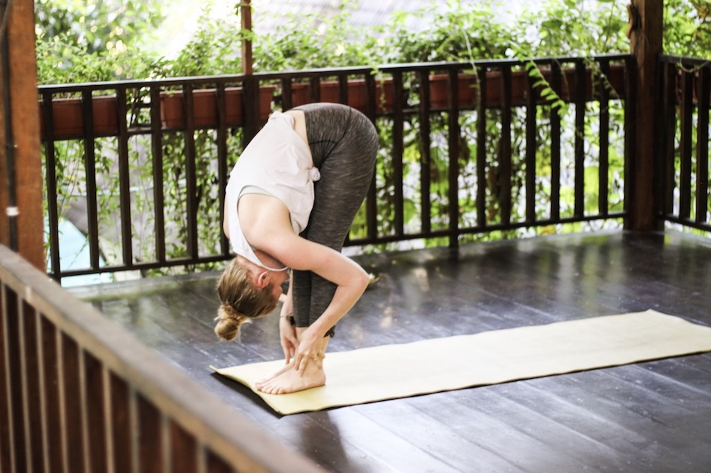
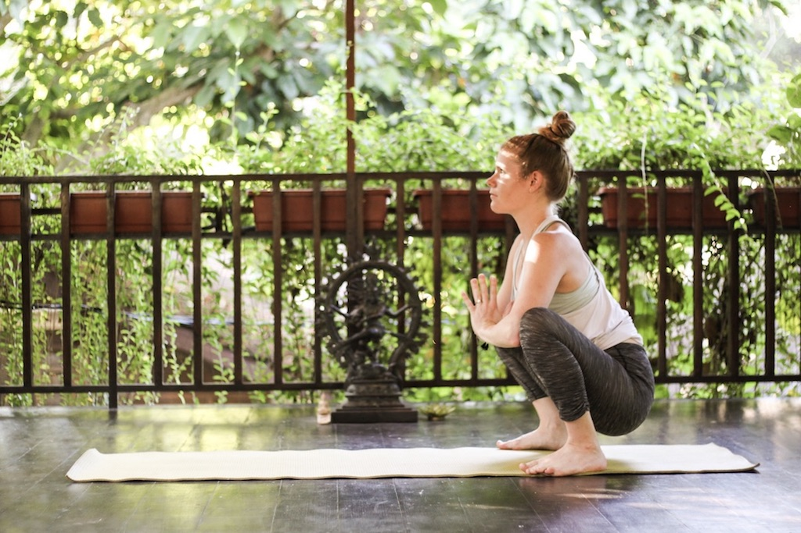
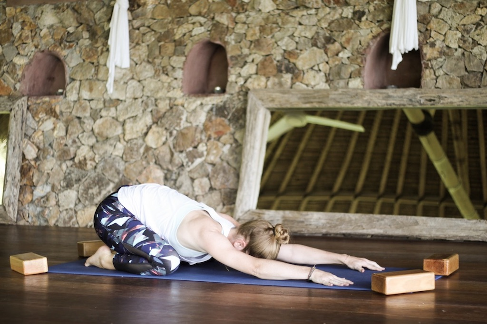
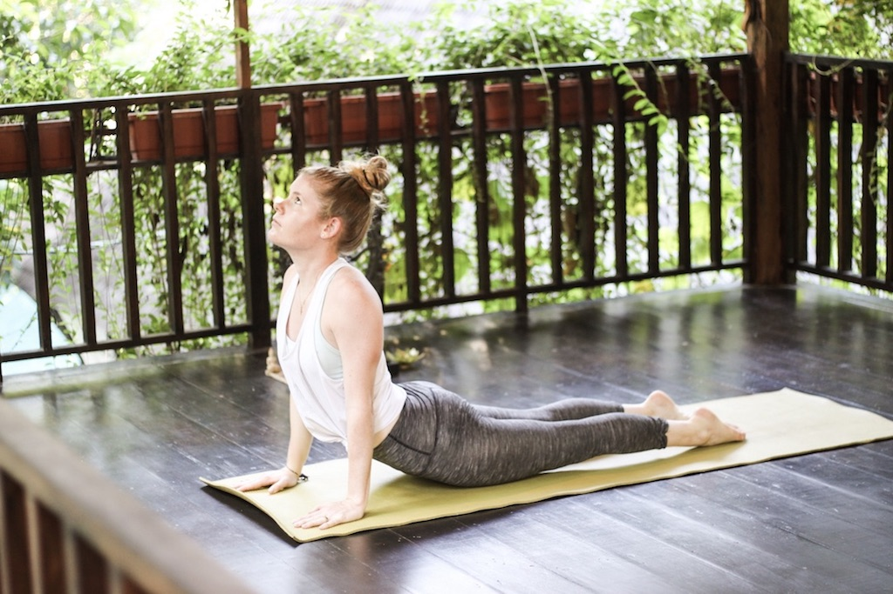
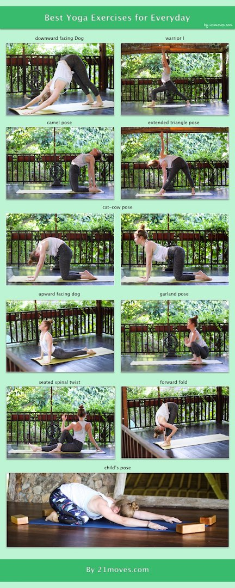

There are thousands of different yoga exercises that you could do each day. However, many of us struggle to even do half an hour of yoga a day although there are so many benefits to it. If your schedule is busy and you simply cannot spare half an hour to workout, you can always go for the light version of yoga. I am sure, everyone has ten minutes to do a few yoga exercises. You don’t have to spend a lot of time exercising to experience the benefits of it. Even these ten yoga exercises are a great benefit to your body and you should definitely consider building them into your timetable.

# 1. Downward-facing Dog

**How to do it:**

Come to all fours with your wrists under your shoulders and your knees under your hips. Then tuck your toes under and lift your hips up the floor. Walk your hands forward just a little.

Press your heels into the ground and activate your arms. Rotate your elbows towards each other and push your hands into the ground. Try not to pull your shoulders up to the ears but keep them relaxed.

**Benefits of the yoga pose:**

1. It opens the back of your legs: Most of the things we do during the day, walking, standing, sitting, brings tension to the backs of our legs. Downward-Facing Dog helps opening the backs of your legs again.
2. It elongates the spine: Downward-Facing Dog is one of the best postures when it comes to elongation of the spine. This is due to the traction you get from planting your feet into the ground and pushing your hands strongly into the mat.
3. It opens up the chest: Most of us are sitting in an office chair for most part of the day in kind of a „hunched“ position. For that reason our chest muscles aren’t necessarily strong but rather tight. Downward-Facing Dog is a perfect posture to open up your chest and strengthen it at the same time.

# 2. Warrior I

**How to do it:**

With your right foot make a big step forward and start bending your knee. Make sure that your knee is right above your ankle, not further. Now raise your arms toward the ceiling, paying special attention to the shoulders. Don’t pull them up to your ears but rather reach to the sky by actively reaching through the little-finger side of the hands.

Turn your left foot in a 45 to 60 degree angle to the right foot and align the right and left heel. Now rotate your torso to the right to square your hips as much as possible. Arch your upper torso back slightly.

**Benefits of the yoga pose:**

1. Warrior 1 helps strengthening your feet, quadriceps, hamstrings, and gluteus as well as your shoulders, arms, and the muscles of your back.
2. It’s an amazing posture to stretch you chest and lunges, shoulders and neck, groans, and your belly.
3. It’s a great pose to open your hips.

# 3. Camel Pose

**How to do it:**

Kneel down on your knees with your heels and knees hip-distance apart. Place your palms on your lower back for support with your fingers pointing down. Your elbows should be drawn together behind your back. Now inhale deeply and lengthen up towards the ceiling. Exhale and arch back, carefully releasing your head down as well. Stay here or intensify this yoga pose by reaching for your heels with your hands. Push your hips forward while arching your back.

**Benefits of the yoga pose:**

1. Camel pose increases the flexibility in the spine, opens the chest and shoulders, and stimulates the nervous system as well as the thyroid.
2. While you’re probably working your spine only in one direction all day long, namely forward, camel pose is a perfect yoga pose to also practice your backbend and restore the natural flexibility of your spine.
3. Camel pose also helps to increase circulation. Therefor it has a detoxifying effect on your body. It also increases the blood flow to your face which creates a beautiful complexion.

# 4. Cat-Cow Pose

**How to do it:**

Come to all fours with your wrists under your shoulders and your knees under your hips. Keep your spine in a neutral position. Slowly inhale, arching your spine so that your belly lowers to the floor. Tailbone, shoulders, and crown of your head are lifting up slowly. Look up slightly to get a nice stretch in your neck. Then start to exhale, tuck your chin to your chest and start to round your spine while pulling your navel in. Repeat this several times, then return to a neutral spine.

**Benefits of the yoga pose:**

1. Cat-Cow Pose loosens up the back muscles, hips, and abdominals. It also strengthens the back and the neck which helps improving your posture and balance.
2. It massages and stimulates organs in the belly and aids breathing by stretching chest and lungs.
Cat-Cow is also a very relaxing yoga pose that creates emotional balance.

# 5. Seated Spinal Twist

**How to do it:**

Sit down on the floor with your legs extended in front of you. Bend your left knee and place your foot next to the inside of your right leg, approximately the hight of your right knee. Bring your left palm right behind  your glute. Now hug your left knee with your right arm or for an even deeper stretch, place your right elbow outside of your left knee with your hand reaching up to the ceiling. Then inhale and lengthen the crown of your head toward the ceiling. With each exhale try to get deeper into the twist. Don’t forget to switch sides.

**Benefits of the yoga pose:**

1. Practicing Seated Spinal Twists is an excellent way to clean and refresh your body. Imagine wringing a wet towel to release the water stored inside. That is what’s happening to your body when doing twists.Twisting your body helps compressing the organs, restricting blood flow.
2. Performing spinal twists everyday helps restoring and maintaining normal spinal rotation. Most people loose spinal mobility over time. Simple twists help lengthening and releasing these muscles, permitting mobility.

# 6. Forward Bend

**How to do it:**

Stand straight with your feet hip-distance apart. Fold forwards at the hips, keeping the spine long. Only go as far as your hamstring allow you to. To protect your lower back, keep your knees bend just a little. To increase mobility in your shoulders, you can also clasp your hands behind your back and slowly bring them overhead.

**Benefits of the yoga pose:**

1. Most of us are hunching over the computer the biggest part of the day. Forward bends are a great counter movement to that.
2. It provides a great stretch for the entire backside of your body - from head to heels. It builds strength and flexibility in the spine and releases tension in the upper and lower back as well as the neck.
3. Forward folds also stimulate and tone the internal organs. The circulation to the abdominal organs is increased which then improves digestion and stimulates the matabolism.

# 7. Garland Pose

**How to do it:**

Your feet should be wider than hip-width apart with your toes turned out slightly. Keep your spine straight and start going down as if wanting to sit on a chair. Bring your hips as low as you can without rounding your spine. Once you’re down put your hands before your chest in prayer pose and use your elbows to press your knees wider apart carefully to further open your hips.

**Benefits of the yoga pose:**

1. The most obvious benefit is the hip opening effect of the pose. At the same time it gives the lower back, the sacrum, and the groin a good stretch.
2. The pose is also known to take care of your metabolism, leading to a good and fast digestion.

# 8. Child’s Pose

**How to do it:**

Start with your knees on your mat, either knees touching or about hip-width apart. Then lower your butt onto your heels and your torso down toward the floor. Rest your forehead on the mat and either extend your arms in front of you or behind you.

**Benefits of the yoga pose:**

1. Placing your head down the mat and taking a rest has an instantaneous effect of your mind, soothing you and calming you down. It’s a great pose if you have thoughts swirling around in your head.
2. With us sitting in front of a computer most part of the day, chances are that you too have lower back problems. Child’s pose is a perfect pose to stretch our back and to open this area of our body.
3. Resting your belly on your thighs is a great way to massage your internal organs which may help improve your digestion.

# 9. Extended Triangle Pose

**How to do it:**

Stand with your feet on the floor and take a big step to the side with your right leg (about 3,5 to 4 feet), keeping both legs straight. Let your left foot face forward while your right foot should be rotated 90 degrees. Heels should be aligned. Exhale and extend your torso to the right directly over your right leg while reaching your right hand along parallel to the floor as far as you can. Once you can not reach any further with your right hand, rest it on your shin, your ankle, or the floor outside your right foot. Then stretch your left arm toward the ceiling and keep your shoulder in line. Slightly gaze up to your left hand.

**Benefits of the yoga pose:**

1. This pose is amazing for stretching and opening the often neglected side-waist.
2. It belongs to the family of heart opening poses, though it’s not an extreme one. When rotating your chest up toward the ceiling, your upper body will be opening.
3. Extended Triangle Pose is also a great pose to workout your core. To practice it you have to extend through your bottom ribs and hold your chest open slightly while balancing with your feet. That way, your abdominal and back muscles will be working hard to keep you balanced and standing. Be sure not to place too much weight on your bottom hand but rather use your core to hold up.

# 10. Upward Facing Dog

**How to do it:**

Lie on your stomach, legs straight behind you. Bend your arms and place your hands next to your chest. Then inhale and start pushing up your torso and while straightening your arms. Also lift your legs a few inches. Make sure that you don’t pull your shoulders up the ears but firm the shoulder blades against the back. Keep your gaze forward.

**Benefits of the yoga pose:**

1. Upward Facing Dog is a great pose to strengthen your back as you’ll be flexing all of your back muscles in order to create the backward arching shape. You’ll also be using the strength of your back to lift your body off the ground.
2. With this pose you’ll not only open your chest, it also helps to bring space to your abdomen.
3. It also strengthens the spine, wrists, and arms.

# Benefits of a daily yoga practice

Practicing yoga daily has many benefits to you and your health. Once you start your routine, you will soon realise how much better you’re feeling. Your flexibility will increase, your strength improve and you will feel powerful and confident. Also your immune system will benefit from your daily yoga practice.

Starting your day with a yoga flow will totally change your energy throughout the day. You will feel fitter and more energetic. It will also help you to get your blood, breath, and muscles moving before breakfast, therefore allowing the nutrients from your food to be better absorbed.

If you’re suffering from anxiety, yoga will also help you with that. Shallow breathing, bad posture and tense muscles are all causes for anxiety. With yoga you will learn a deep breathing, your posture will improve and your muscles won’t be tense anymore, signalling your body that everything is just fine. It will also help you to walk through your day with a healthy potion of mindfulness.

Apart from all these benefits, you will also work on your balance, stand taller, breath deeper, and do something good for your spine.

# Some further reads

If you are interested in reading more about yoga and how to practice it, I found these books really helpful:

* [Yoga Anatomy](http://amzn.to/2qMK9Kg)
* [The Yoga Bible](http://amzn.to/2r9t2U3)
* [Yoga and Mind Handbook](http://amzn.to/2r9dLCr)

