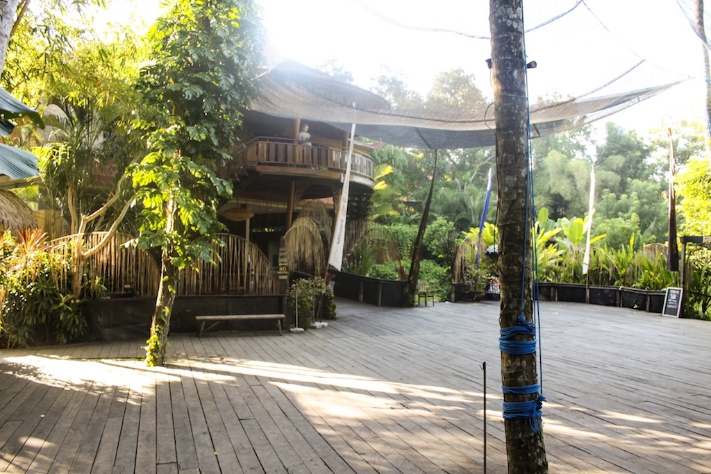
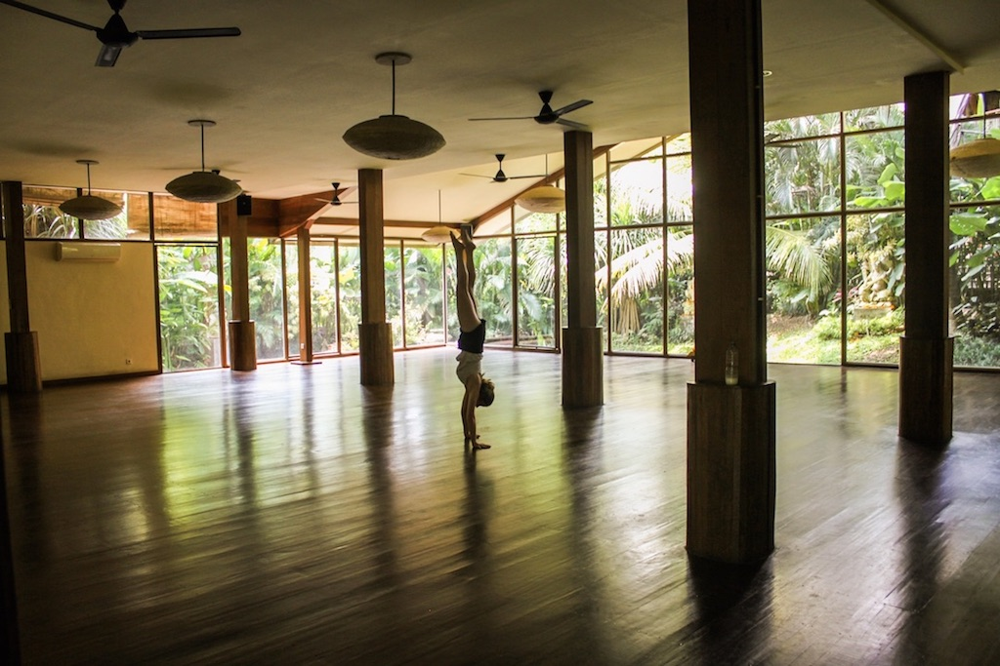
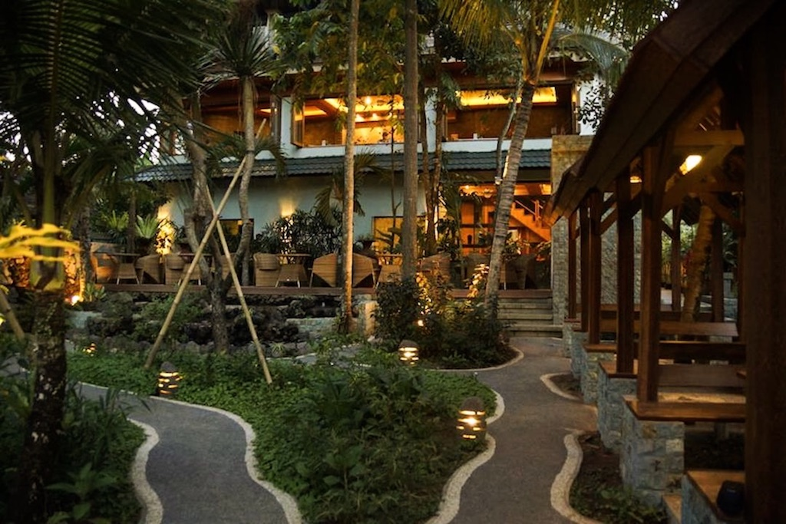
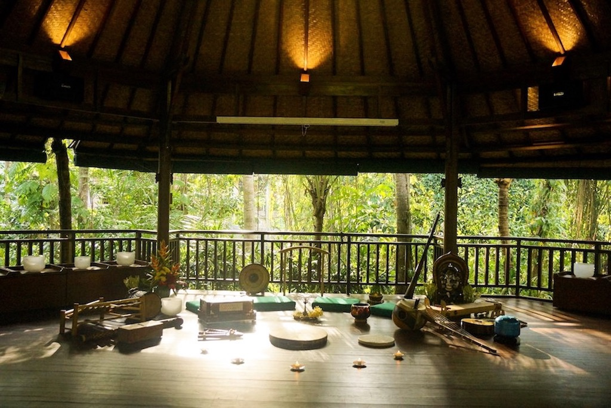
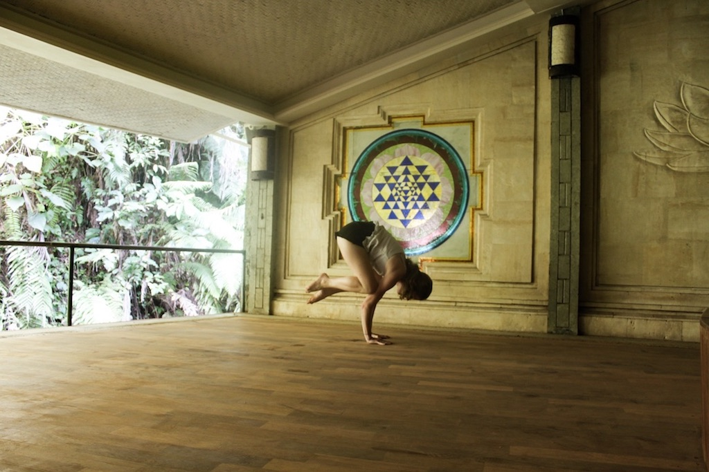
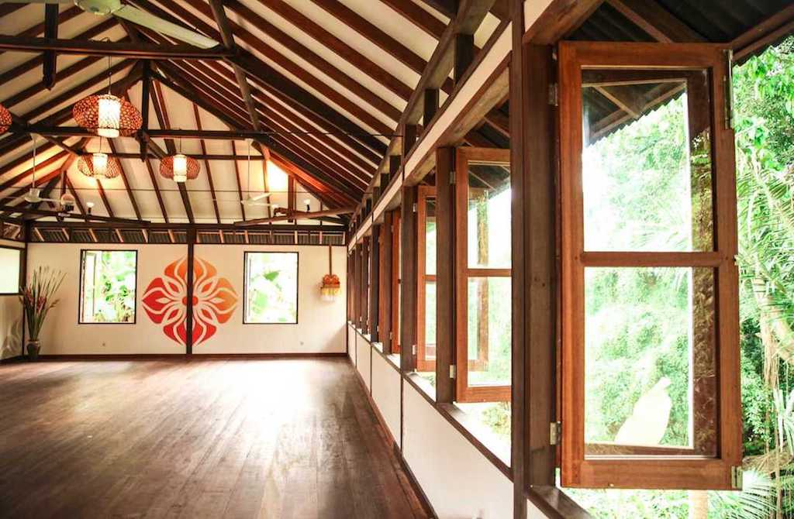

Right now, Bali seems to be the stronghold with regards to Yoga. Everybody is going to Ubud for Yoga, to become a yoga teacher, or to take part in a yoga retreat. Deepening my practice was my goal. I wanted to take the chance of participating in classes with amazing teachers, of overall cheaper classes, and of training in an amazing location, to really get on with my yoga practice. And that’s what I did. I practiced yoga everyday for as long as I was in Ubud and let me tell you, it felt amazing!

During my time in Ubud I visited several yoga studios in order not to miss out on any potentially life changing classes. At the end, I found my three go-to yoga studios that I am missing so much now that I am sitting here writing this article.

Today I want to share with you a little bit about my yoga practice in Bali and introduce you to my favorite yoga studios in Ubud.

# Yoga at The Yoga Barn

I guess, as a yogi, you can’t come to Bali and not practice at [the Yoga Barn Ubud](http://www.theyogabarn.com/) at least once during your stay.

The Yoga Barn is not only a yoga studio, it’s a whole unit with restaurant, smoothie bar, wellness, a guest house, and, well, yoga. It’s set amidst terraced rice paddies pretty much in the center of Ubud and is dedicated entirely to Yoga, to Healing, and to bring together a strong community of likeminded people.

## The Space at Yoga Barn

I remember the first time that I walked into this huge space I was totally overwhelmed. It is absolutely beautiful and well thought through in every aspect. As the yoga studio is downstairs you have to walk through the whole unit first. It’s hard to imagine anyone would be able to enter this place and not feel more at ease and calmer instantly. It’s such a peaceful space which is only more visible in the way they have constructed it, namely as environmentally friendly as possible. Everything is made out of wood and the wood floors have been recycled from old growth timber. There was no use of chemicals at all. Also the mud walls and paints are natural, and the roofs are made of alang-alang which is the traditional Indonesian grass-thatch. You can see where the Yoga Barn got its name from.

## The Yoga Barn Studio

Yoga Barn in Ubud actually has two studios: one that is upstairs, accommodating up to 30 students, and one that is downstairs. Here, another 25 students can take part in a yoga class. I had classes in both studios, though I actually prefered the one downstairs. Entering the studio made you feel like you were in a greenhouse. There was this huge glass front with all kinds of green plants in front of it. As this studio was so huge, you felt really liberated and free during your practice although it could get quite stuffed from time to time.

The upstairs studio was beautiful as well. It was more open which I liked, however, that also meant more mosquitos and most of the time the shutters were down anyways as the sun was shining inside a lot.

Of course, The Yoga Barn offers all the props that you need during your class for free. You’ve got mats, blocks, blankets, and straps. But as always, feel free to bring your own stuff.

## The Classes at Yoga Barn

The Yoga Barn offers daily yoga classes of all kinds. There are more than 15 classes to choose from, offering a really diverse schedule, including Yin, Hatha, Vinyasa Flow, Power Yoga, Yoga with weights, Tai Chi, Iyengar and Anusara Inspired. For those looking for a little bit more relaxation, there is also Restorative Yoga, Sound Healing, Meditation, Tibetan Bowls and more.

It’s always possible to just drop-in for a class, though it’s best to be there a little earlier as classes fill up quickly. For one drop-in class you would pay 130.000 IDR which is around 10 USD. There is a discount if you buy a three times (330.000 IDR), five times (500.000 IDR), ten times (900.000 IDR) or 20 times ticket (1.400.000 IDR). Most classes take 1.5 hours except for one around lunch time and the last evening class - these are only one hour.

Most of the time, classes are suitable for every level. If this is not the case, you will see that on the schedule. When I was there, there were a lot of first time yogis and I was really impressed with how much patience the teacher explained everything and took extra care of them. The classes I took were all amazing. Mostly, I would visit Vinyasa, but I also went to Hatha and to Power Yoga classes. All of the instructors I met did an amazing job. There instructions were clear and their lightheadedness was really contagious. The Vinyasa Flow was very creative and beautifully put together. You can really feel in each class how positive, how engaged, and how professional the teachers at The Yoga Barn in Ubud are.

# Taksu Yoga Studio

[Taksu](http://www.taksuyoga.com/) is Balinese and means “the indescribable essence of Spirit. Walking into Taksu I could feel this spirit. It’s such a beautiful place. Just like The Yoga Barn it’s not only a yoga studio. You can also come here to get some delicious and healthy food or to get a Spa treatment.

There are several smaller yoga studios at Taksu and they are all beautifully located amidst palm trees and plants and as they are all very open you can enjoy the nature around.

## The Classes at Taksu

I only took a few classes at Taksu, still I have to say that they were all excellent. Taksu offers three to four classes a day, including Hatha Yoga, Yin Yoga, Vinyasa, Power Vinyasa, Vinyasa Flow, Restorative and Gentle Yoga. During my classes, we were really only three people taking the class which was great to escape the crowdedness at Yoga Barn. Sometimes with so few people you might lose the “vibe” at a class because there is always such an exceptional ambience with other committed yogis. And that’s actually what I was afraid of. But it definitely wasn’t the case as the teacher created such an amazing flow that it was easy to get into the spirit.

The instructor was very attentive and adjusted postures whenever necessary. The postures themselves were quite strong, but there was no pressure to do too much at all. Actually, the postures were so well explained and fitted into the flow perfectly, that they sometimes even seem to come naturally. I learned some amazing new poses during these classes.

One class takes 1.5 hours and it costs 120.000 IDR, which is 9 USD and you even get a delicious Jamu or a green smoothie for free after class. As always, there is a discount if you buy multiple tickets. You don’t have to bring a mat or any prop, they provide everything.

# Yoga at Radiantly Alive

I went to [Radiantly Alive](https://www.radiantlyalive.com/) because a local told me that it was an excellent yoga studio. And she didn’t promise too much. From all three yoga studios I felt like Radiantly Alive was the most advanced in the practice. Contrary to Yoga Barn and Taksu, Radiantly Alive is purely a Yoga and Healing Studio, offering Acupuncture, Healing Massages and more. It is a very beautiful, big, wooden and open space. The term eco-hip, as Radiantly Alive describes their facility, really does fit.

Yoga classes take place in two shalas (yoga room) that are spacious and bright and they cost 10 USD for a 1.5 hours class with a discount if you buy a multiple ticket. During the week you can take part in more than 45 yoga and movement classes. Among the usual Vinyasa, Ashtanga, and Yin they also offer Arm Balances, and Sky Yoga (Aerial Yoga).  Radiantly Alive also offers retreats, workshops, and Yoga Teacher Trainings. Of course you also don’t have to bring anything, mats and all sorts of props are available at the studio.

## The Classes at Radiantly Alive
The class started with the teacher coming to each student, introducing herself, asking about injuries and about preferences in the practice. I thought that was a very nice way to start the class.

As with Taksu, I only had a few classes at Radiantly Alive but those I had were amazing. Many more experienced yogis seem to be coming to Radiantly Alive as it seems to be quite popular with teachers in Australia so they would advise their committed students to go there. I must say that even though I had been practicing yoga for quite a while, the classes were challenging for me. But everyone who knows me, knows that I like a challenge! The poses were quite advanced and the pace high. However, the teacher was always very attentive, corrected postures and spread a positive vibe.

