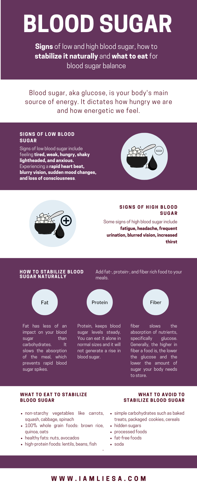

Your blood sugar is an essential measure of how healthy you are. High blood sugar is usually associated with all types of diabetes and it can damage your body and lead to further health issues. But even though sugar usually gets a bad rap, it’s not always bad.

Learn here, what blood sugar is, when it’s produced and how it affects our body.

Blood sugar, aka glucose, is your **body’s main source of energy**. When we it carbs, they break down into blood sugar which is then used for energy by our cells to fuel our brain, heart, and muscles. 

Blood sugar also **dictates how hungry and energetic we feel**. The key idea when it comes to blood sugar is **balance**. When our blood sugar levels are balanced, that’s when we feel our best and lose fat. Pairing carbs with protein, [healthy fat](https://www.iamliesa.com/stocking-healthy-kitchen-fats), and fiber at each meal can also help to stabilize our blood sugar levels so that you have consistent energy throughout the day. 

Each time you eat, you have the ability to either balance your blood sugar and with that decrease the amount of [inflammation in your body](https://www.iamliesa.com/inflammation-cause-definition-treatment-symptoms) as well as reduce your weight. 

# When is blood sugar produced and what does it have to do with insulin?
When we eat any sort of carbohydrates, they **break down into blood sugar**, or *glucose*. Your pancreas then produces a hormone called *insulin*, that helps **transport glucose into your liver-, muscle-, and fat cells**. That way, insulin aids to keep our blood sugar levels at bay. A normal blood sugar range lies anywhere between **80 mg/ml and 120 mg/ml**. 

When your body has used all the energy it needs, leftover glucose is stored as *glycogen* in the liver and muscles. It can store enough to keep you energized for the whole day. 

When we eat sugary food or food that is quickly processed into blood sugar, our pancreas goes into overdrive to produce insulin that is necessary to store all the blood sugar. Your insulin levels spike, signaling your body that plenty of energy is available and that it should stop burning fat and start storing it.  

## Low blood sugar.
When the insulin surge causes **too much blood sugar to be transported out of the blood**, that’s when low blood sugar (*hypoglycemia*) occurs. As a result, you may feel tired, weak, hungry, shaky, lightheaded, and anxious. You may even experience a rapid heart beat, blurry vision, sudden mood changes, and a loss of consciousness. 

You will also crave more sugar and carbs, thinking that this is what your body needs to pick itself back up. In reality, however, this is when the vicious cycle begins. In the process, **more fat is stored, [inflammation](https://www.iamliesa.com/inflammation-cause-definition-treatment-symptoms) is promoted and our body’s aging processes set in**.

## High blood sugar and insulin resistance. 
When at normal levels, sugar is a precious fuel for all our body’s cells. When the insulin is **unable to transport enough blood sugar out of our blood**, high blood sugar (*hyperglycemia*) occurs. This can have toxic effects on our body, leading to all sorts of health issues such as heart or kidney disease, stroke, and nerve damage.

Sometimes, cells stop responding to insulin correctly. This phenomenon is called *insulin resistance* and may be the root cause for many diseases such as heart disease and high blood pressure.

When this happens, your body produces even **more insulin to get rid of glucose in your blood**. As a result, the insulin levels in your blood spike as well.

Over time, your cells may **stop responding to insulin and become increasingly resistant**, leading to both more and more glucose and more and more insulin in your blood.

After a while, this may lead to **damages in your pancreas** - the place where insulin hormones are being produced - resulting in a decreased insulin production. 

Once your blood sugar levels exceed a certain threshold, you may be diagnosed with conditions such as *type 2 diabetes*. 

**Some signs of high blood sugar include:**
* fatigue
* headache
* frequent urination
* blurred vision
* increased thirst

When we have balanced blood sugar levels and no excess insulin, this is when you’ll **feel your best** and **start losing weight**. This usually happens between meals. It is therefore important to understand how to stabilize our blood sugar levels in order to facilitate long-term healthy fat loss and beaming energy levels. 

# How to stabilize blood sugar naturally?
By **avoiding simple carbohydrates and hidden sugars**, you can naturally stabilize your blood sugar levels. Simple carbohydrates are naturally found in foods such as **fruits (fructose), milk (lactose), and milk products**. Other sources are **processed and refined sugars like candy, table sugar (sucrose), syrup, and soft drinks**. The food industry also likes to sell us fat-free foods as healthy which are in turn packed with sugar. 

Instead of sugary and simple carbohydrate rich foods, opt for **protein-, fat- and fiber rich foods** like vegetables and whole grains that support your blood sugar levels by slowly releasing sugar into the bloodstream. 

Fat has less impact on your blood sugar than carbohydrates. In fact, when consumed alone, it doesn’t have any impact on circulation blood sugar. When paired with other foods, fat slows the absorption of the meal which helps you avoid those rapid blood sugar spikes.  

Protein, too, keeps blood sugar levels steady. You can eat it alone in normal sizes and it will not generate a rise in blood sugar. However, it shouldn’t be consumed in excess, as it then may be converted to glucose through a process called [*gluconeogenesis*](https://en.wikipedia.org/wiki/Gluconeogenesis).

Just like fat, fiber slows the absorption of nutrients, specifically glucose. Generally, the higher in fiber a food is, the lower the glucose and the lower the amount of sugar your body needs to store. 

Finally, try to keep glucose-forming meals to an **appropriate serving size** of carbohydrates per meal. This will make sure that your glucose is stored only as fuel in liver and muscles and not as fat. Additionally, it will also prevent your blood sugar levels from spiking.

# What is the normal range for blood sugar?
When it comes to testing your glucose levels, we are always talking about fasting blood sugar, meaning you haven’t eaten for at least eight hours. Normal blood sugar levels for adults without diabetes are less than 100 mg/dL after fasting, though ideally, you’re aiming at less than 90 mg/dL. Two hours after eating, they shouldn’t be higher than 149 mg/dL.

Just before meals, when you haven’t eaten in a long time, blood sugar levels tend to be the lowest with around 70 to 80 mg/dL.

# Hidden Sugar.
Do you still feel like you’re not losing weight even when watching what you eat? Hidden sugars may be the culprit. The most important advice I can give you: **Read the label and get informed about sugar**. 

There are a ton of different names out there for sugar. You already know the most common ones lactose, fructose, sucrose, and glucose. But the list doesn’t end here. Maltose, dextrose, or xylose are other names. And don’t be fooled into thinking the natural alternatives would be any better. Honey, agave, brown sugar, date sugar, maple syrup, and coconut sugar have the same effect.

The greatest sources of hidden sugars are **processed foods** like ketchup, bread, salad dressing, and soups. 

Hidden sugars can also be found in **beverages** such as alcohol, juices, and soda. Here, it is even worse as liquid sugar creates the fastest insulin surge. 

They are also added to **fat-free food** as a replacement for the flavor lost by removing the food’s fat. 

# Fructose.
Let’s quickly talk about fructose. 

Have you ever realized that you felt more hungry after drinking a fruit smoothie than after eating an egg omelette? The reason for that is sugar, fruit sugar to be more precise. Sugar in whatsoever form, can be quickly metabolized and is therefore most likely to cause an insulin surge. The subsequent glucose crash will have you eat and crave more throughout the day.

Most of the fructose we consume is stored as glycogen in our muscles or burned as fuel. It is **metabolised 100% in the liver** as [muscles cannot easily use fructose as a fuel.](http://theconversation.com/fructose-friend-or-foe-74431) 

Although fructose doesn’t create the same surge in blood glucose, it is thought to have a negative health impact due to its special metabolism in the liver. 

When fructose is metabolized, it converts to an activated form of glycerol that is directly used to **turn free fatty acids into triglycerides or fat**. The more fructose you consume, the more glycerol it converts into, and the more fat you store. 

The metabolization of fructose also leads to **waste products**, including uric acid which in excess can lead to high blood pressure and gout.

Research also suggest that the [overconsumption of fructose leads to **inflammation** in all cells that metabolize it rapidly.](https://www.ncbi.nlm.nih.gov/pubmed/29225114) As fructose reacts with proteins and polyunsaturated fats, *advanced glycation end-products* (AGEs) are created. These are compounds that create oxidative damage in our cells and therefore **contribute to inflammation** and a host of chronic diseases such as insulin resistance, metabolic syndrome, and obesity.

# The connection between blood sugar and inflammation.
We have talked about the [negative consequences of chronic inflammation](https://www.iamliesa.com/inflammatory-diseases-inflammation) a lot in the past posts. 

Inflammatory diseases are among the top killers worldwide, so keeping inflammation in the body at bay is immensely important. 

Studies show that with insulin resistance and the resulting excess insulin in the body, **levels of the [C-reactive protein (CRP)](https://www.iamliesa.com/inflammation-cause-definition-treatment-symptoms) rise**. CRP is a common inflammatory marker that is linked to cardiovascular disease, lung- and brain inflammation (neuroinflammation), and even dementia and Alzheimer’s. 

*Neuroinflammation* specifically occurs when blood sugar levels are too high or if you’re constantly fluctuating between high and low blood sugar levels. It leads to the activation of *microglia*, the brain’s immune cells. This sets an inflammatory cascade of in the brain in motion. The consequences of that can be seen both long- and short term. 

The transmission speed of signals in the brain immediately slows down which leads to a **feeling of brain fog and a drop in brain endurance**. In the long run, neuroinflammation leads to [sustained microglia activation](https://www.nature.com/articles/emm200640.pdf?origin=ppub) which contributes to and expands **neuro-destructive effects and neuronal death** [due to the overproduction of neurotoxic mediators as a consequence of microglia’s sustained activation](https://en.wikipedia.org/wiki/Role_of_microglia_in_disease#Role_in_chronic_neuroinflammation).

<Divider />

<NotADoctor />

