Have you ever heard of Boxingyoga? Just until a little while ago neither have I. Then I got the chance to participate in an event organized by [Somuchmore](http://somuchmore.de/) and [Chimosa](http://chimosa.de/), which introduced me to the new fitness trend. Today I want to tell you about this new form of yoga and show you some of the exercises we peformed.

There are so many different Yoga styles, but Boxingyoga sounds really strange in the beginning. I was wondering: how can you combine the „tough guy’s sport“ boxing with the smooth and soft movements of Yoga?

# Opposing forces: It’s all about contrasts

Apparently, that’s exactly what Boxingyoga is about. Keeping the Yin and Yang, the hard and the soft parts in balance. Thinking about it again, it makes total sense. We all have soft and hard characteristics in us. Sometimes the world demands us to be tough; then again we can be totally soft. Why not combine those two contrasts in your workout?

# Boxingyoga: Where does it come from

The longtime boxer Matt Garcia from London wanted to offer a fitness training that combines stretching with a strengthening of the musculature of trunk. He started to visit many Yoga classes but couldn’t really find what he was looking for. Then he met Kajza Ekberg. Together with the dancer and Yogi, he developed what is now known as Boxingyoga. Along with physiotherapists, osteopaths, and other athletes, Kajza and Matt combined stretching and strengthening from Yoga exercises with basic boxing exercises. Boxingyoga was born.

# Boxingyoga basics

Traditional yoga classes tend to start with chants or meditation. Boxingyoga abandons those traditional elements – no chants, no Sanskrit terminology, no esotericism. Instead, Boxingyoga follows a targeted fitness- and stretching program, focusing on a streamlined activity aiming to directly improve sporting performance and flexibility.

By systematically stretching your body, you can prevent muscle tension and shorten recovery time after a hard boxing class. Even sporting injuries can be prevented or heal faster with a targeted training.

# Utilizing the whole body

Boxingyoga utilizes the whole body in a kinetic chain reaction with the power of the core and spiral dynamics of the spine in order to maximize performance. The goal is to stretch the whole body, thus Boxingyoga looks at the whole pattern of movement in the musculoskeletal system.

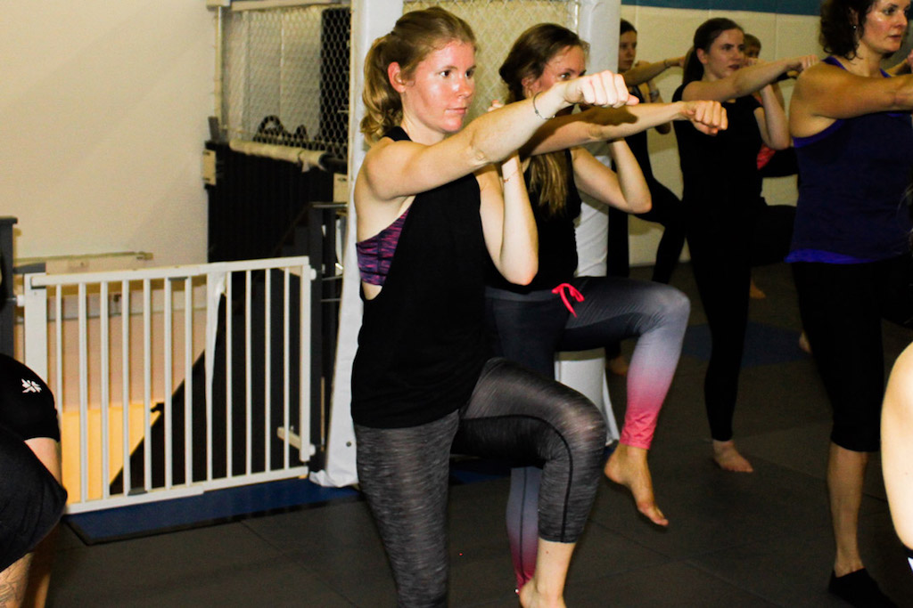

# Benefits of Boxingyoga

The benefits of Boxingyoga are manifold.

* It is a good start for those, who always wanted to do boxing, as it provides an insight into the science behind the sport, its technical aspects, and challenging workout. That way you can have a first glance into the world of boxing and see if you like it
* It increases the whole-body power and strength through emphasizing on correct form and multi-strengthening exercises in sequence
* It loosens up and counter-stretches tight muscles. That prevents repetitive-use injuries, expands flexibility and range of movement and
* it reduces recovery time, muscle soreness, and stiffness.
* It trains your mental toughness, concentration, and focus as you have to endure intense postures
* By concentrating on alignment, flow, and coordination, body-awareness is being developed
* As exercises are aligned with breathing, Boxingyoga teaches controlled breathing
* Practicing Boxingyoga, you will feel super powerful, motivated, and confident

# Who benefits from BoxingYoga

The Boxingyoga workout was developed for boxers, who wanted to stay flexible, in the first place. However, not only boxers profit from this intense workout. Boxingyoga focuses on the musculator of trunk. A strong body center is very important in our daily life, thus everybody benefits from Boxingyoga exercises. You can prevent a backache and strengthen your whole body without losing any flexibility. If you’re excited to experience Yoga in a totally new way and want to combine the power of boxing with the stretching and strengthening exercises of Yoga, Boxingyoga is definitely made for you. If you’re however, looking for a spiritual, meditative workout, Boxingyoga is not for you as the Indian traditions are abandoned altogether.

* [Boxing Hand Wraps](https://www.amazon.com/RDX-Training-Boxing-Protector-Bandages/dp/B00PCIWZQC/ref=as_li_ss_il?ie=UTF8&qid=1485777988&sr=8-13&keywords=boxing&linkCode=li1&tag=21moves-20&linkId=3496ed2f2432b7a4723871954a4810d7)

# BoxingYoga: That’s what a class looks like

The Boxingyoga class starts with a warm-up to activate the core and wake up the hamstrings, hips, and spine. Also, the awareness is drawn to the breathing, which is an important part of the whole class. During the warm-up, we also focus on balancing and strengthening poses and bring our attention to our body.

Every major muscle group is being worked during the strength phase. With planks, sit-ups, and cobra-poses the focus lays on the core.

The peak of the class is the third stage when the exercises are put together into an intense flow. Now strength, mobility, alignment, and endurance are emphasized.

With a cool-down, the Boxingyoga class comes to an end.

# Where can you take BoxingYoga classes

Boxingyoga was developed in London, thus the UK is of course pioneer when it comes to classes. The popularity of Boxingyoga spread quickly throughout boxing gyms in Europe, especially Scandinavia and The Netherlands, and even Asia. In the USA it’s particularly famous in San Francisco, with [Yoga Garden](http://www.yogagardensf.com/) offering Boxingyoga classes as an alternative to traditional yoga. In Germany, boxing gym [Chimosa](http://chimosa.de/) in Berlin is one of the first to offer the boxing and yoga hybrid class.

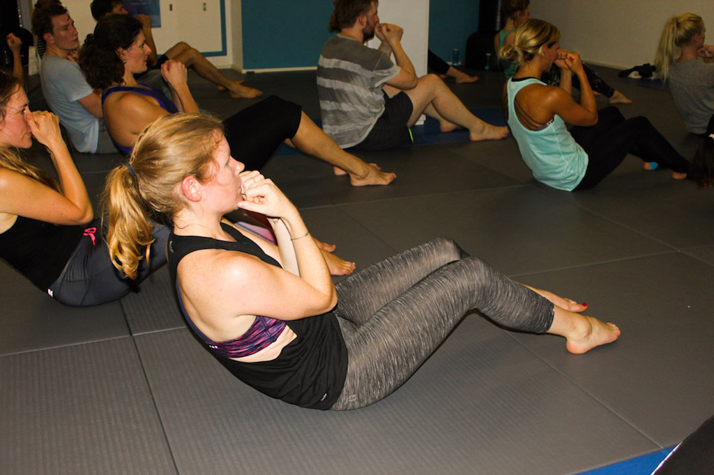

# Chimosa and Somuchmore BoxingYoga Event

One of my favorite fitness events last year was the [Somuchmore](https://somuchmore.de/) X [Chimosa](https://chimosa.de/) BoxingYoga event. During that event they offered a trial lesson and I was eager to learn about the new fitness trend.

We started with a boxing class and let me tell you, it was intense. Boxing is such a good cardio workout and it trains your upper body alongside. I was already sweating after just a few minutes. During that lesson, we learned how to move, punch and get back in a defensive position in a very playful way.

Following the boxing class, we started with the actual Boxingyoga. I’ve been practicing Yoga a while now and I really like it. However, sometimes all I want are some Yoga-style strengthening exercises without the ommms and the singing. Boxingyoga abandons all that, still there were all the Yoga elements in the workout that I really appreciate during a traditional Yoga workout.

The workout itself was really intense. I could feel every muscle and I really liked how it focused on the musculator of trunk. They were really shaking.

All in all, I have to say that the event was really awesome. I liked the mix of cardio in the beginning and strengthening exercises in the end. Both workouts, the boxing, and the Boxingyoga, were really demanding yet in totally different ways. With boxing, I was sweating and totally out of breath while the actual Boxingyoga left my muscles shaking. I will definitely go to Chimosa again.

# Boxingyoga Exercises

To help you get an idea of what Boxingyoga looks like, I now want to show you five exercises. They actually don’t look that different from the Yoga as we know it but often come with a little twist.

**The Side Plank Crunch Sequence**

This exercise develops shoulder and core strength and stability whilst also improving balance, control, and coordination.

Come into a side plank position, and then bend the elbow and upper knee to make a physical connection. Pay attention to the spine, it should be straight, hips lifted up.

Slowly rotate in a 90-degree-angle, curl the back and crunch the abdominals. Now lower the raised hand to the floor next to your other hand and extend your lifted leg. Exhale, bend the elbows as if you wanted to do a push-up and come into an upward-facing dog. You can also do a push-up here for real to train your arm muscles.

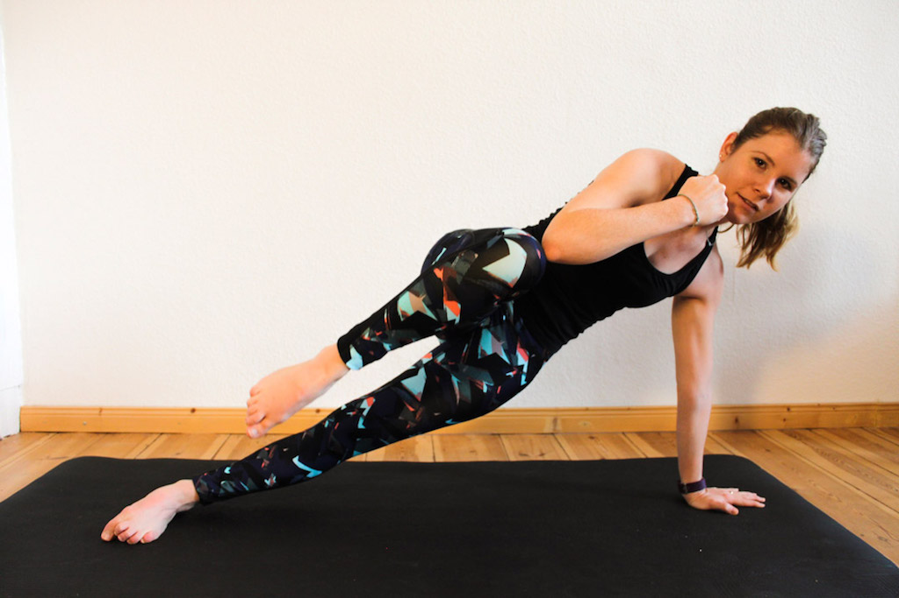
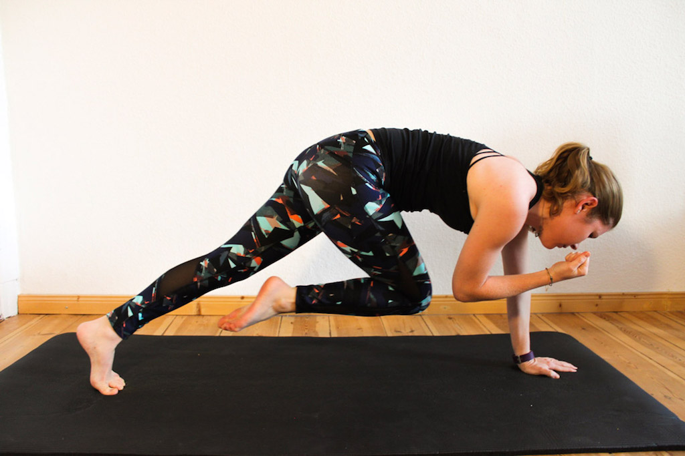
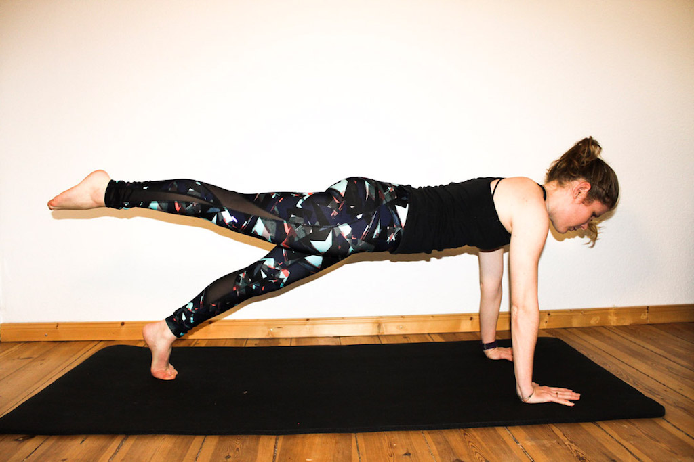

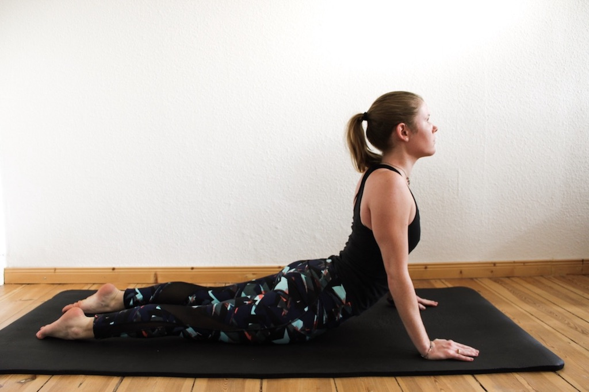

**Threading the Needle**

This pose increases the range of movement by offering a deep twist of the spine. The shoulders are opened and stretched.

Come into a tabletop position; then slide one arm under the torso. The palm is facing up. Shoulder and head are gently rested on the floor.

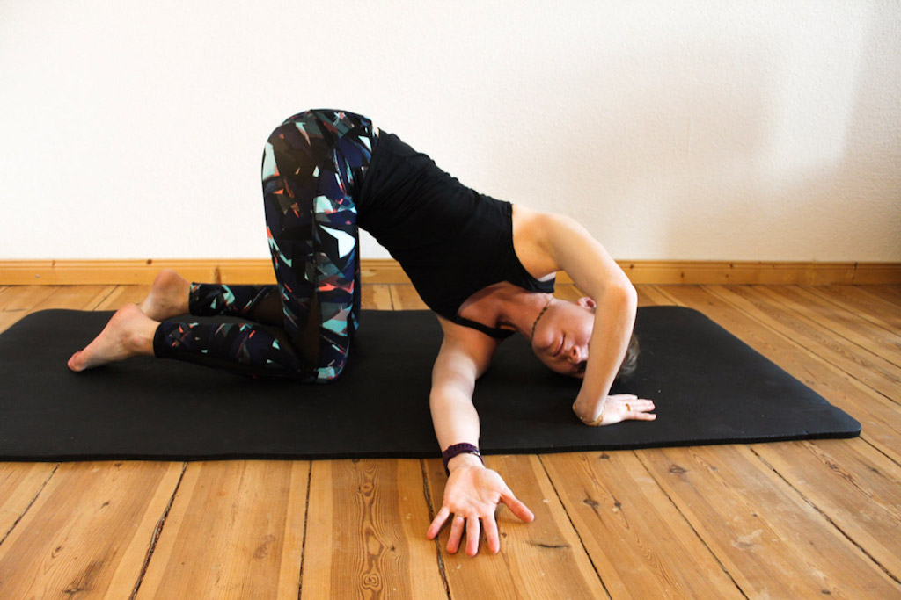

**The Boxers’s Lunge II**

This exercise combines upper body boxing technique with stretching the hips and hamstrings. It also helps to coordinate upper and lower body biomechanics.

Come into a high lunge position and hold it. The front leg is in a 90-degree-angle, the back leg is kept straight. Clench your fists and cover your jaw. Now extend the reach of the lead arm and rotate the torso slightly to the side.

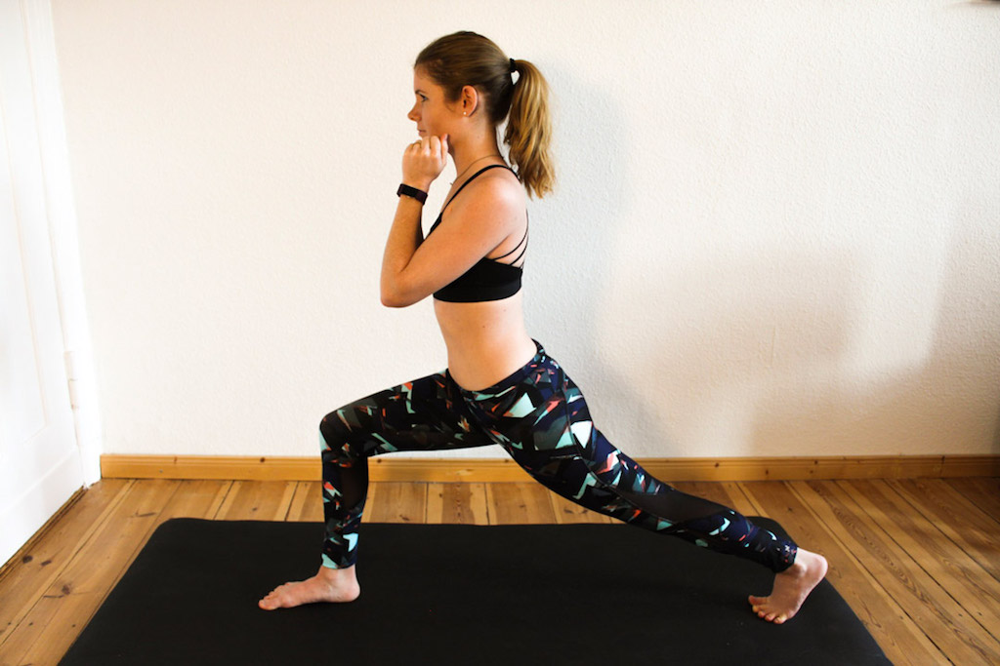

**Crunch Punch**

This is a perfect exercise for your core. Lie down on the mat and keep both of your fists close to your jaw. Now slightly move up to the left side and move your right fist between your knees.  Repeat the same on the other side.

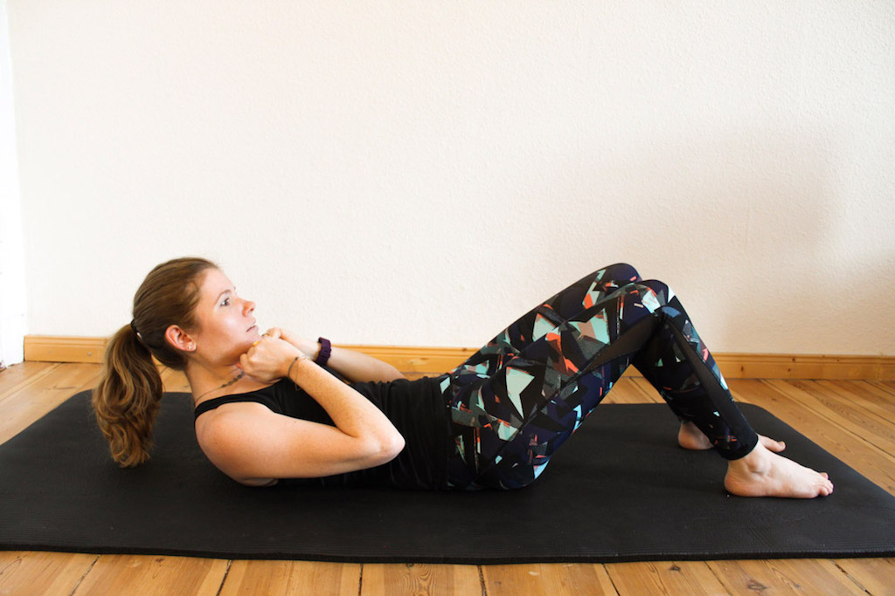
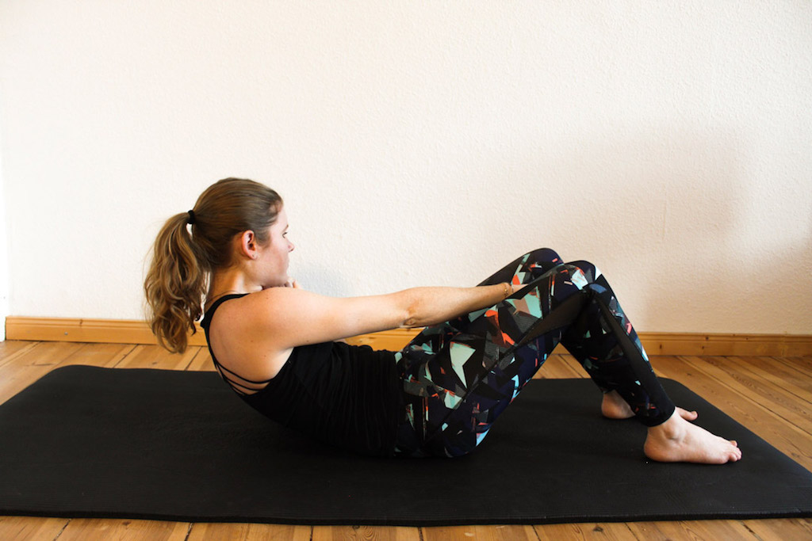

**Downward-Facing Dog Variation**

This pose is really good to open your hips and makes killer side abs.

Come into a downward-facing dog and lift up your leg until you can feel your hip opening. Then bend your knee and bring it to your elbow. Now rotate your hip and move the raised leg under your body to the opposite site; then straighten it.

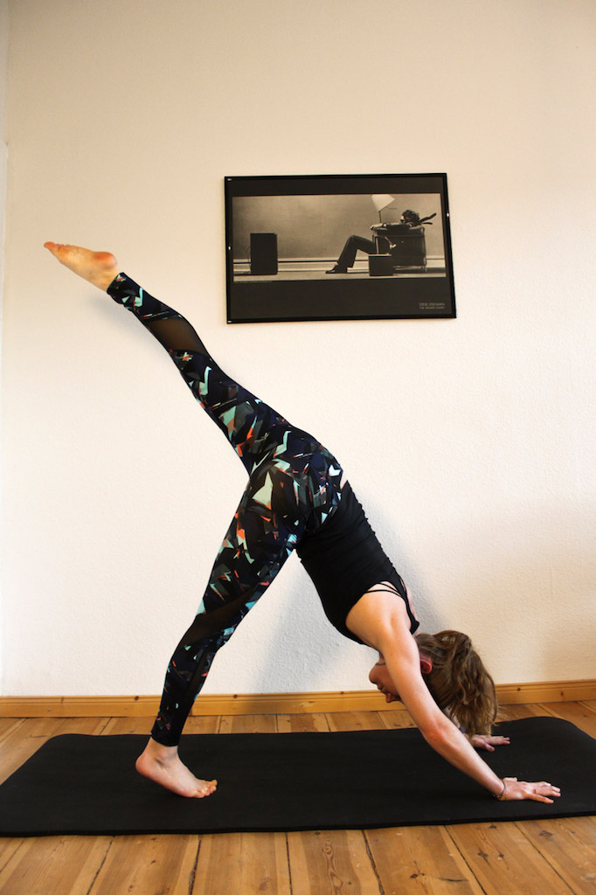
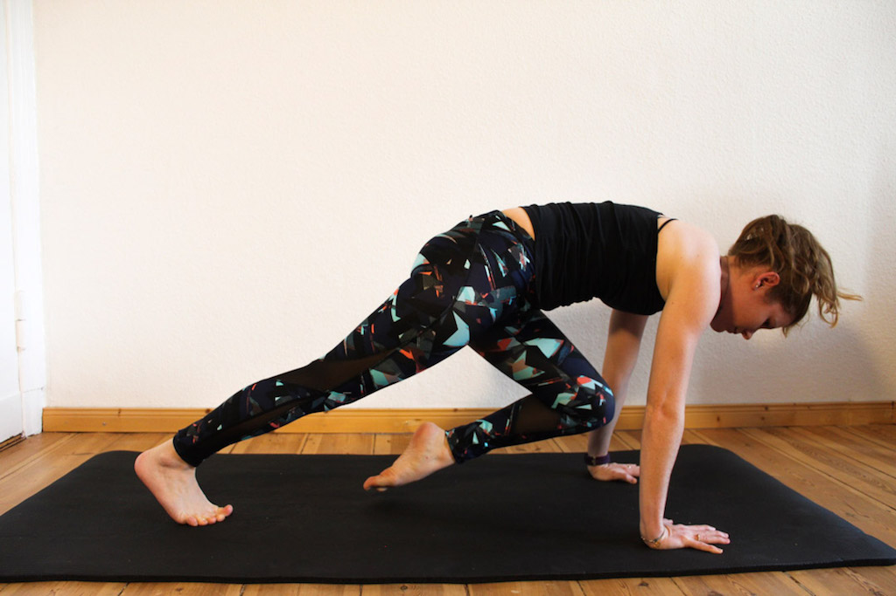
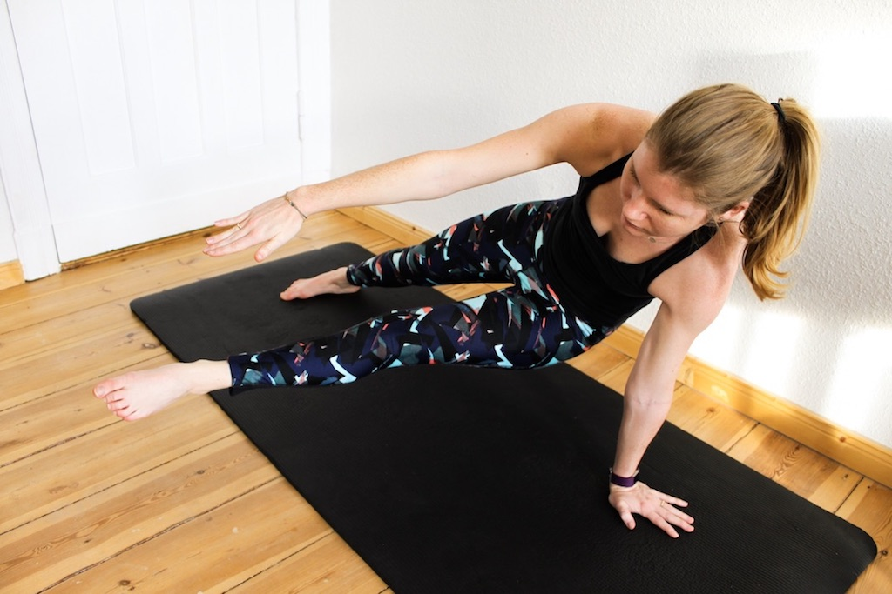

What I am wearing: leggings by [Next NX Sport](http://de.nextdirect.com/de/g50160s3#722636), shirt and bra by H&M

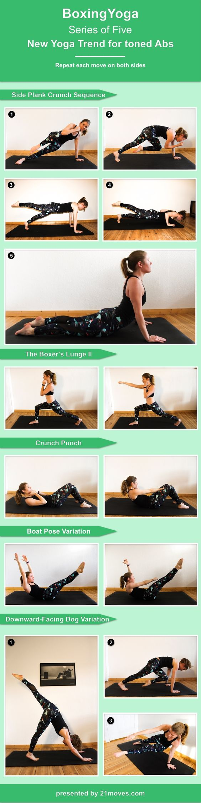
