Downward-Facing Dog or Down Dog (Adho Much Svanasana in sanskrit) is one of the most famous, if not the most famous, yoga pose. It’s probably the pose you do most often in yoga classes. Therefore, it’s important to perform the Downward-Facing Dog correctly, not only to avoid injuries but also in order to make it as effective and as comfortable as possible. Although practiced so often, the Down Dog is often not carried out correctly as it is more complex than it may look. There is a lot to think about in this pose and I want to show you what exactly that is.

Also, a lot of people don’t know how many benefits the Downward-Facing Dog offers. Apart from the obvious ones such as stretching and strengthening, it offers manifold other benefits. In this post, I want to present you the benefits of Downward-Facing Dog and show you how to do the pose correctly. I also want to make you attentive for some common mistakes in the carry-out of this pose and show you some of my favourite Downward-Facing Dog variations.

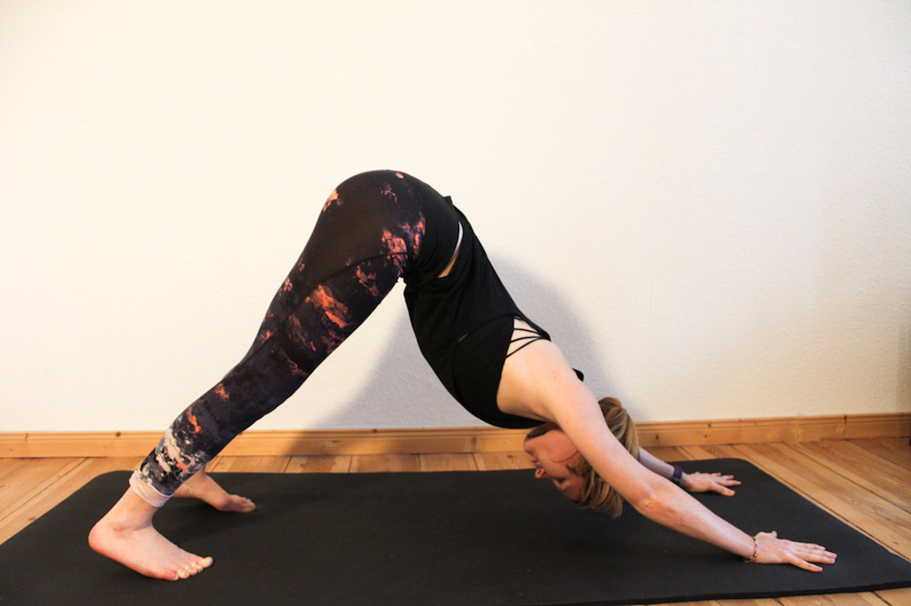

# 5 benefits from Downward-Facing Dog
Before we jump into how to carry out Downward-Facing Dog correctly, let me first explain to you the many benefits of this posture. Of course we know that it is a great strengthening and stretching exercise. But apart from that there are even more reasons to practice Downward-Facing Dog on a regular basis.

1. It boosts circulation:
With the heart being higher than the head, Downward-Facing Dog counts as a mild **inversion**. Any of these exercises are good for the **circulatory system**, because it encourages **blood flow** throughout the body. An active circulatory system helps you to keep your **immune system in shape**, it helps regulate the **blood pressure**, and it **flushes toxins from your body**. Furthermore, the flow of blood to the brain **calms the nervous system**, improves the **memory and concentration**, and is a great **stress reliever**. It also holds all the other benefits of inversions such as **relieving you from headaches**, **insomnia**, **fatigue**, and **mild depression**.

2. Eliminates stiffness and back pain:
By performing Downward-Facing Dog the upper back becomes **more flexible** and **less likely to store so much tension**. It also **lengthens the spine** and creates space between the vertebrae.

3. It stretches your body:
One of the most obvious benefits of practicing Downward-Facing Dog is the fact that it **stretches** your body, particularly your **hamstrings**, **shoulders**, **calves**, **arches**, **hands**, and **spine**.

4. It strengthens your body:
To fully lengthen your spine, Downward Dog uses the strength of your arms and legs. This way it also **strengthens your quadriceps and ankles**. Besides of that Downward Dog is also a great **balance training**.

5. It wakes you up:
Downward Dog is one of the best poses to do when feeling tired. To feel an effect, you should hold the Downward Dog at least for one minute. For runners it is also a great exercise to do after a long run.

When practiced regularly, Downward-Facing Dog can also improve the **digestion**, **relieve back pain**, and **help prevent osteoporosis**.

# Downward-Facing Dog: How to do it correctly - 10 Alignment Tips
Now let’s dive into the practice. As I already said, a lot of people see the Downward-Facing Dog as a very basic and easy posture when actually there is a lot to think about. That’s why I want to give you these 10 alignment tips to improve your Downward Dog.

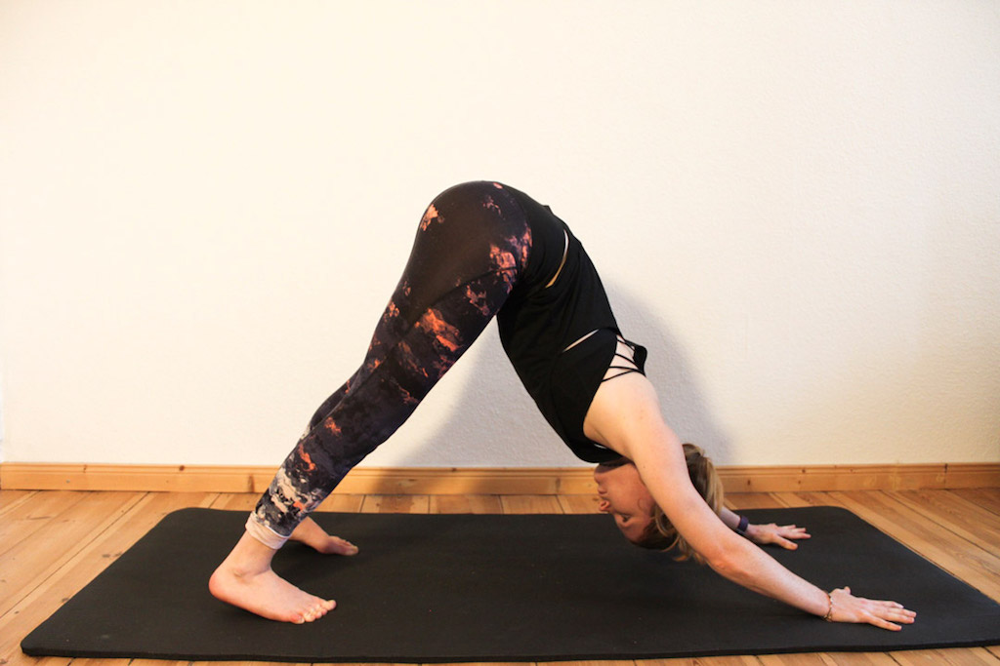

1. **Hands:** Your hands should be **shoulder distance apart** with your fingers spread wide. Really root the whole hand into the mat for stability.

2. **Upper Arms:** The upper arms should be **externally rotated** while the forearms **rotate inwards**, kind of as if the eyes of the elbow are facing each other. This will keep your shoulders away from your ears, giving more space in the neck.

3. **Shoulders:** Pay attention to **firm shoulder blades** to provide space and stability in your pose. The shoulder blades should draw down towards the tailbone and broaden across the upper back.

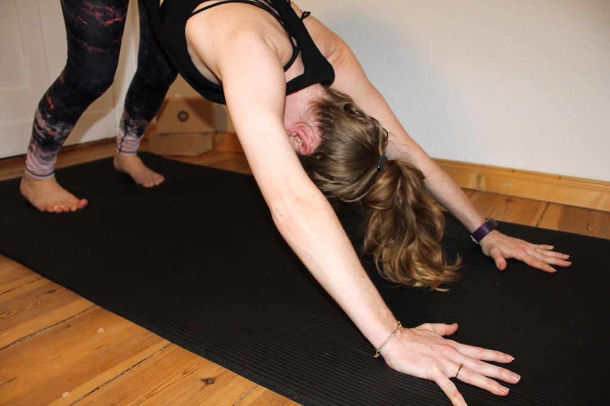

4. **Neck and Head:** Neck and head should continue along the same line as the spine. As the neck is part of the spine, it should follow the same natural line. The head is between the upper arms. It should neither just hang loosely, nor should it crunch the neck too far up.

5. **Spine:** When doing the Downward-Facing Dog we always want our spine to be nice and long in a **V-shape** rather than rounded.

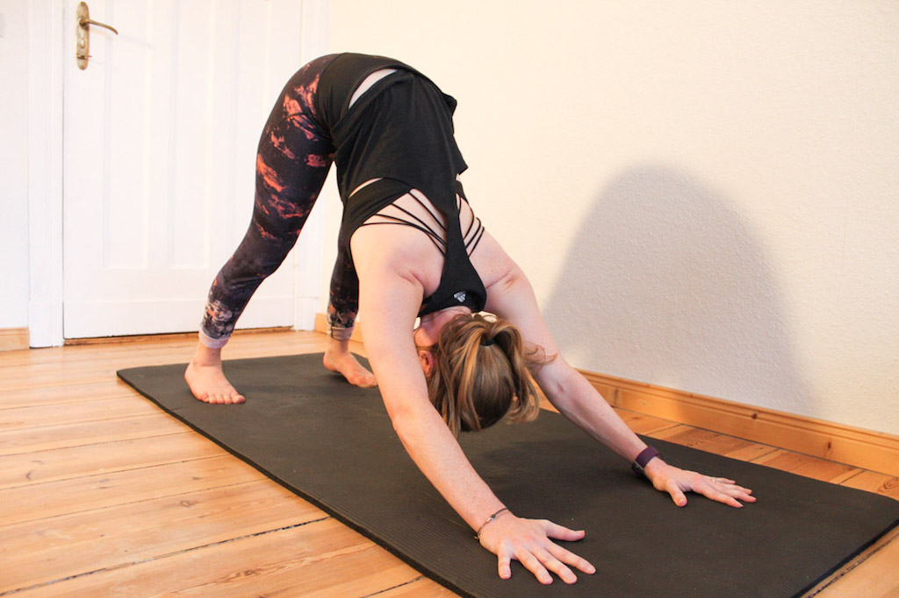

6. **Rips:** The rips should be soft. Often, people start sending the rips outwards to get the arch in the spine. Don’t do that. Draw the belly towards the spine and leave the rips nice and soft.

7. **Tailbone:** To perfectly feel the stretch all the way up the leg, the tailbone should be lifting up towards the ceiling.

8. **Legs:** The inner thighs should **rotate inwards** while **firming the outer thighs**. Straighten the legs but don’t change the shape in the spine or pelvis. You want it straight and long.

9. **Feet:** Your feet should be **sit-bone** or **hip distance** apart, pointing to the front.

10. **Heels:** The heels should always **reach towards the ground**. Also, press them out slightly to effectively work your inner thighs, hamstrings, and calves.

* [Yoga Mat](https://www.amazon.com/Liforme-YOG-MAT-ORI-PIN-UNI-F-Yoga-Mat-Pink/dp/B01CGLCGRA/ref=as_li_ss_il?s=exercise-and-fitness&ie=UTF8&qid=1485957699&sr=1-112&keywords=yoga+mat&th=1&linkCode=li2&tag=21moves-20&linkId=36e8ea41cf521715ffc6d5c9fef38fc5)

# Common Mistakes in Downward-Facing Dog

Although Downward-Facing Dog is one of the most practiced yoga exercises in classes, it is still one that so many people do in the wrong way. It looks like such an easy exercise - just bend forward, hands and feet a little apart, and there you go. However, this impression is wrong. There are so many common mistakes in Downward-Facing Dog which limit the effect of this great posture. With so many things to think about in Down Dog, it is easy to not carry it out correctly. Thus, when performing Down Dog, keep in mind those common mistakes.

1. **The lower back is rounded**
Having a rounded back, rather than a V-shaped one is a very common mistake for beginners as it is kind of a natural way of shaping the back. However, in Downward-Facing Dog we want to lengthen the spine but a rounded back shortens it. A rounded back could be a sign for tight hip flexors, shoulders, or hamstrings.

2. **Sitting bone is not lifting up**
By now it should be clear that Downward-Facing Dog is all about lengthening the spine. In order to achieve that, the sitting bones should be lifted towards the ceiling.

3. **Weight is dumping into the shoulders**
The weight of your body should be equally spread on your feet and hands. The energy should move up from the fingertips and down to the heels.

4. **Hands are not rooted down into the mat**
This is a very common mistake when practicing Downward-Facing Dog and the reason why many beginners have stability problems. Also, not rooting down the hands into the mat really stresses your wrists.

5. **Shoulders are shrug up towards the ears**
When practicing Downward-Facing Dog there should be no tension in your shoulders. Beginners often tend to be stiff and stressed in a Downward-Facing Dog which causes the shoulders to shrug towards the ears. Not only is that really uncomfortable, it will also give you serious neck pain.

6. **Heels are reaching up towards the ceiling**
Another very common mistake when practicing Downward-Facing Dog is having the heels reaching towards the ceiling rather than into the ground. It’s ok if there is a gap between the feet and the ground. The important thing is that the heels are pulling down. If they are high off the ground, this could indicate tight hamstrings, calve muscles or hip flexors.

7. **The feet are too close to the hands**
A lot of beginners place their hands too close to their feet because it gives them a feeling of better stability. This is basically cheating. So you don’t want your hands and feet too close to each other but neither do you want them to be too far apart, that can make the Downward-Facing Dog a real agony.

# 3 Downward-Facing Dog Tips for Beginners

You already know by now how to do a Downward-Facing Dog correctly and you know what mistakes to look out for when performing it. However, especially beginners tend to restrain from modifying their Downward Dog when it feels uncomfortable because they feel like it has to feel this way. One thing the Downward-Facing Dog should never be is uncomfortable. Therefore, I want to show you some Downward-Facing Dog tips for beginners.

**How to find the right distance between hands and feet:**
A lot of beginners don’t know how far apart the hands and feet should be. They are often standing in a Downward Dog with either feet and hands too far apart or too close together. A good way to find the perfect distance for you is to come into a high plank with your shoulders right above your wrists. Now wave your body all the way back and come into the Down Dog. A lot of times this feels a bit too far apart. It’s ok to wriggle your feet in a tiny bit and that is about the perfect spacing of your hands and feet.

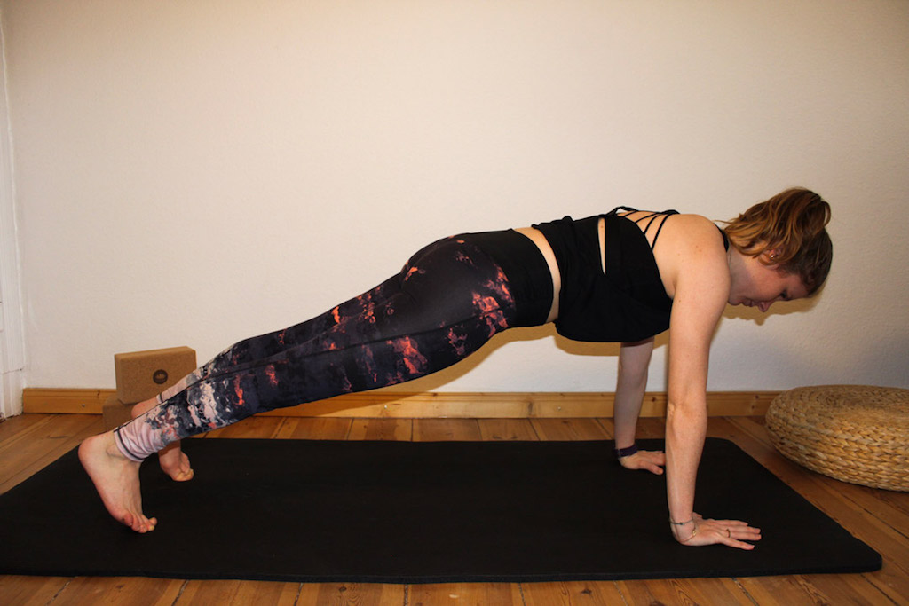
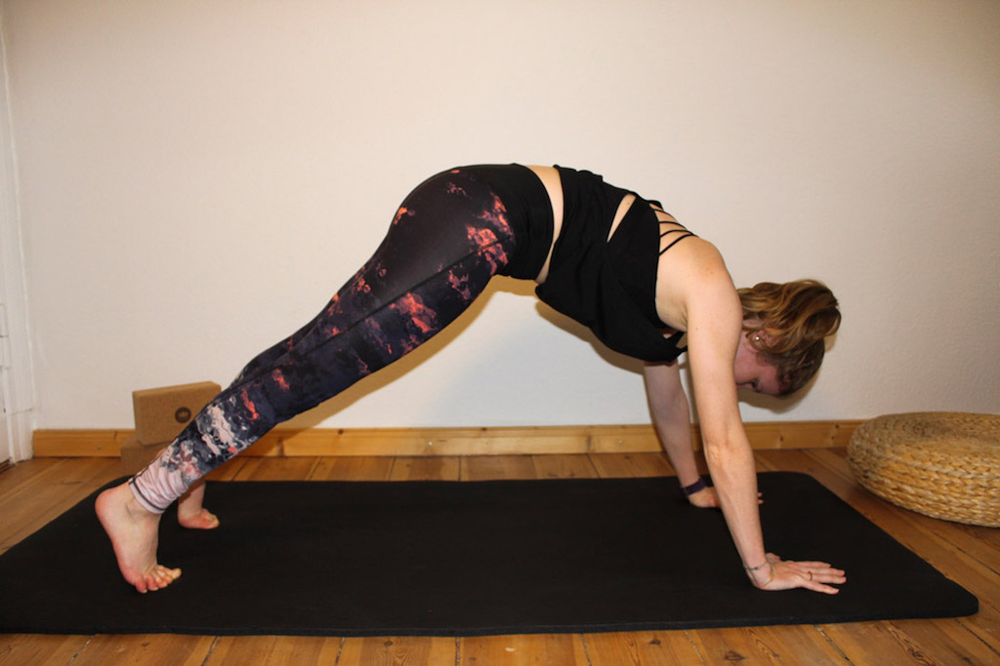

**It’s not a shame if you have to bend your knees:**
We all know these pictures from Instagram & Co. with a perfect Downward-Facing Dog and nice straight legs. However, not everybody is flexible enough to straighten the legs. Most of the time if the hamstrings are too tight, we compensate that by rounding the spine. The spine, however, should be, as you know by now, nice and long. The best way to do it is to bend your knees softly so you can concentrate on a nice and long spine. And yes, even though you should try to straighten your legs, it is totally fine to bend the knees slightly.

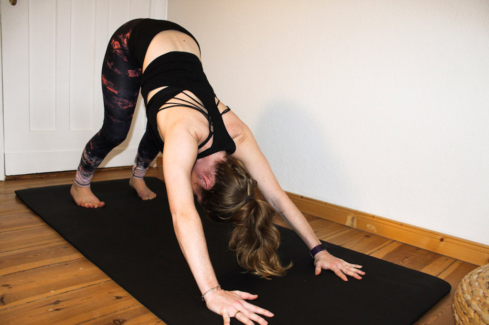

**Don’t worry if your heels don’t touch the floor:**
When performing the Downward-Facing Dog your heels should always reach towards the floor. So often people are frustrated when they can’t reach the floor but that’s actually ok. You don’t necessarily have to touch the ground with your whole foot but rather have the feeling of the heels drawing down.

# My favourite Downward-Facing Dog variations

The Downward-Facing Dog posture is a great pose, so great that there are even different variations of the Downward-Facing Dog for those who can’t get enough. These are my four favourites:

**Downward-Facing Dog Twist:**
Twists are a great way to detoxify your internal organs and keep your spine nice and flexible. It’s also a great way to work on your balance. Start out in a Downward-Facing Dog position. Make sure your hands are stable and really rooted into the mat. Then take one hand across your body and bring it to the opposite ankle. Keep holding on to your ankle while bending your elbow to pull your chest through. You should now be looking up under your armpit. Don’t forget to breathe in deeply. With each exhale try to get a little bit deeper into the twist. After 10 breaths change sides.

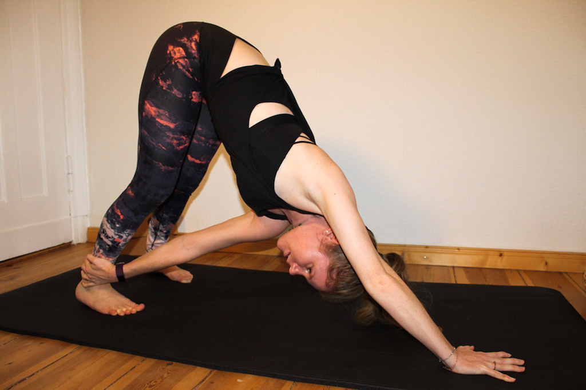

**Three-Legged Down Dog:**
Along with strengthening the arms, thighs, and upper back this variation of the Downward-Facing Dog will bring a great stretch to your hamstrings. Begin in a Downward-Facing Dog position. Your feet should get closer together, your toes should be almost touching. Then shift your weight onto your hands and your right foot equally. Inhale and raise your left leg towards the ceiling. It’s important to keep your shoulders parallel with the ground. In order to stretch the hamstrings try to really press your right heel down toward the mat. Hold this position for a few breaths. To open the hips even more you can then make circles in the air with your lifted leg.

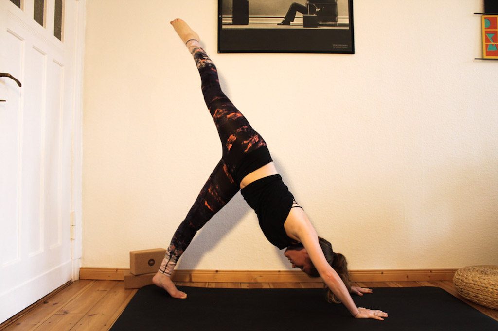

**Three-Legged Downward-Facing Dog, Hip-Opening Variation:**
This Downward-Facing Dog variation starts quite similar to the basic Three-Legged Downward-Facing Dog. From the three-legged stance try to really lengthen through the spine and open your hip. Bend the knee of the extended leg and reach to your bum with your heel. Your shoulders should always be even and your belly should be pulled to your spine.

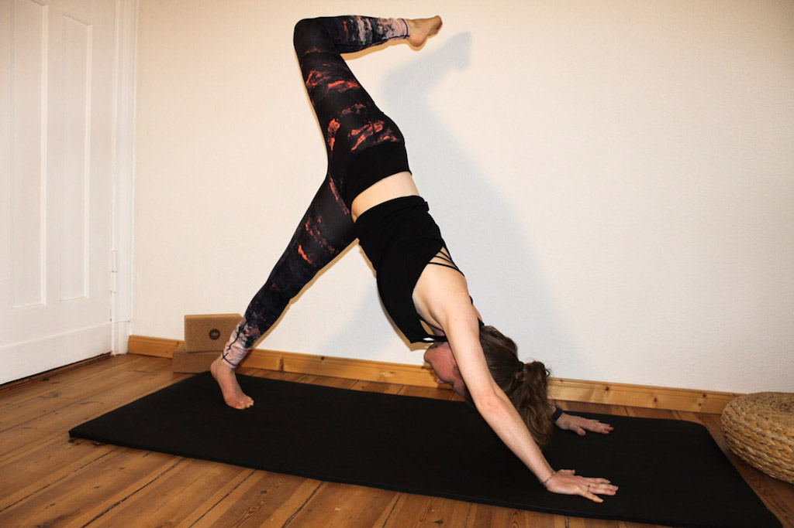

**Quarter Dog:**
This pose helps strengthening your upper body and loosens tight hamstrings. Again, you start out in a Down Dog and really spread your fingers wide. Exhale, then lower your forearms to the mat. Your elbows should make a straight line with your middle fingers. As with the Down Dog, try to straighten your legs and lower the heels towards the ground. Keep your head relaxed, your gaze should go between your palms.

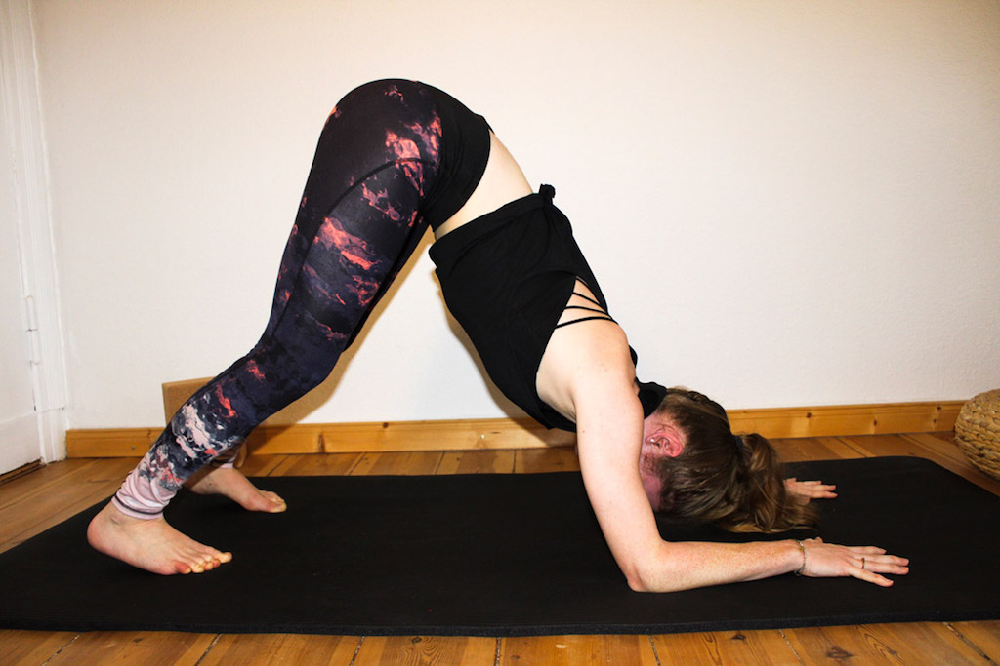

With all this knowledge about the Downward-Facing Dog you should be perfectly prepared for your practice.

For your further practice you might also be interested in:

* [Restoring Flexibility](https://www.amazon.com/Restoring-Flexibility-Yoga-Based-Practice-Increase/dp/1612434916/ref=as_li_ss_tl?s=books&ie=UTF8&qid=1481387313&sr=1-10&keywords=yoga+stretching&linkCode=ll1&tag=21moves-20&linkId=9a42dc382c2075854ce2aa1e2d379954)

* [Anatomy, Stretching & Yoga Training](https://www.amazon.com/Anatomy-Stretching-Training-Step-Step/dp/1628736372/ref=as_li_ss_tl?s=books&ie=UTF8&qid=1481387313&sr=1-2&keywords=yoga+stretching&linkCode=ll1&tag=21moves-20&linkId=e25c07f904b741ba1623d899381c1de1)

# Please Pin for later if you like the Article

* [Pinterest](https://www.pinterest.com/pin/488570259561985928/)

