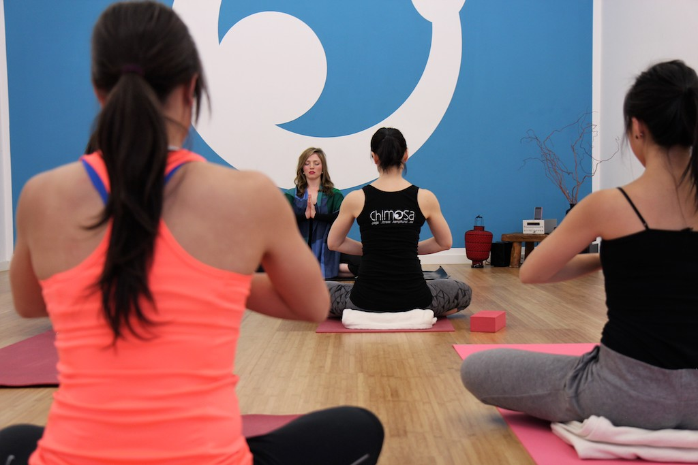
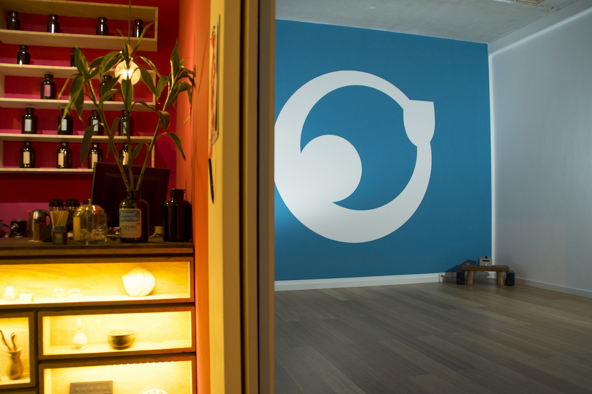
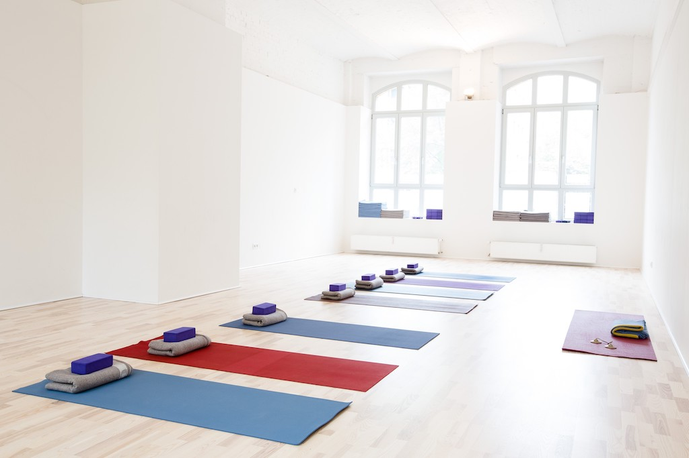
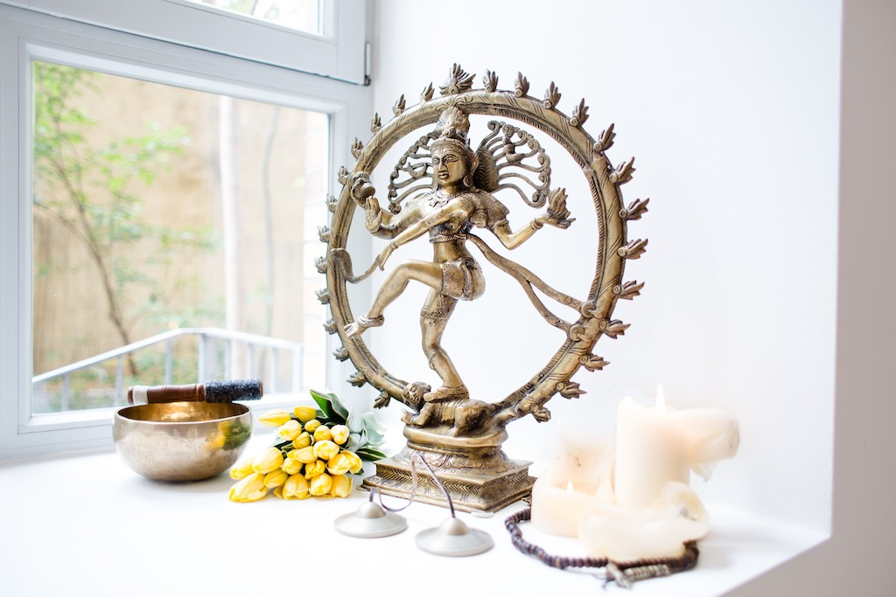
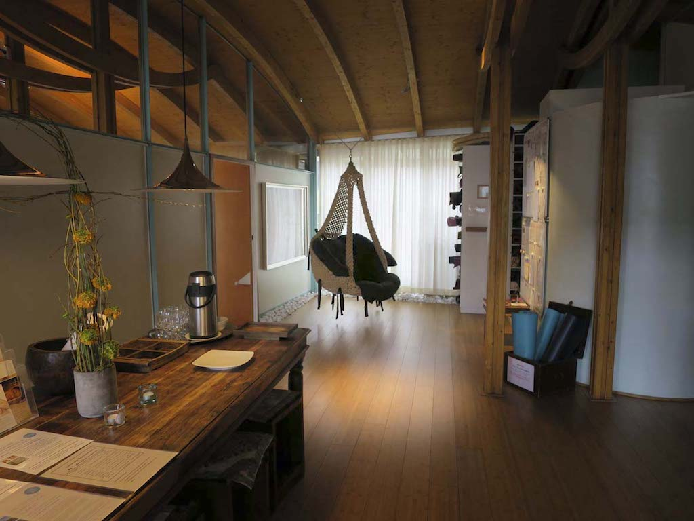
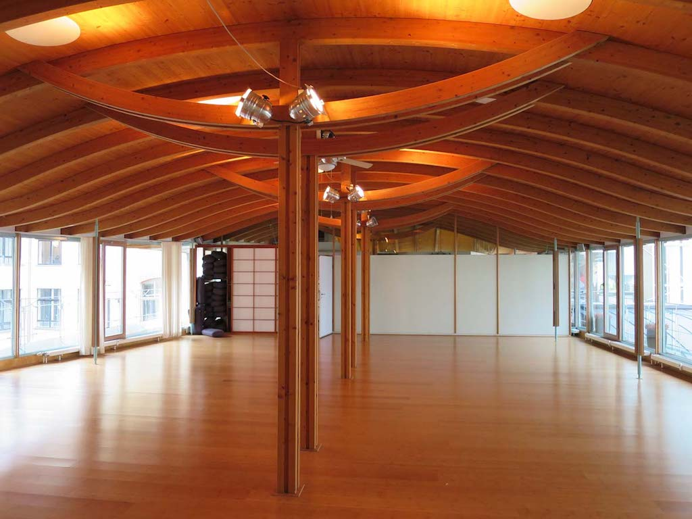

Yoga is booming in Berlin and there are opening up studios everywhere. Also, it feels like every second person I meet here either is a yoga teacher or is on the verge of becoming one. This is great but sometimes a wide choice makes it hard to find what you like most and to really stick to it. I have visited countless yoga classes in Berlin and have seen so many studios. In the end, I have fallen in love with three yoga studios that offer amazing classes, have a great atmosphere and super nice teachers.

# Chimosa: For a powerful Practice

[Chimosa](https://www.chimosa.de) is a fascinating studio to me, as they don’t only offer yoga classes, but also boxing classes. At first, it might sound a bit odd as martial art and yoga sound so far away from each other. Chimosa however, combines these opposites in the most perfect way. Calmness and movement, asian and western culture, tradition and modern age seem to merge into one here as you can see for example in their [Boxingyoga](https://www.21moves.com/boxing-yoga-the-new-yoga-trend/) classes. If you haven’t heard of that, it’s time to check it out. It is so much fun.

The name Chimosa derives from the home countries of the studio’s founders: Chi for China and Mosa for Taiwan. Mental and physical well-being go hand in hand in these countries. Chimosa wants to take up on that and offers its own interpretation of the traditional lifestyle and translates it into a more modern way.

When visiting Chimosa, I especially love their Power Yoga classes. They really make you sweat. The sequences are always challenging and never boring. The focus is never solely on the exercise. Mind and body form a unit here that’s why there is always great emphasis on the breathing and flowing as well.

Apart from Power Yoga, Chimosa also offers Akro Yoga, Gentle Yoga, Yoga for beginners and Masterclass Yoga for very ambitious Yogis and teachers.

Classes are either in German or in English. Depending on the class you take, they are either an hour or 1.5 hours long. I really like to go during lunch time. After that I feel fit to conquer the rest of my working day.

The studio itself is conveniently located in Berlin Mitte. The yoga room is bright and friendly and equipped with everything you need for a strong practice. It is not very big but they never let it get over-crowded. The changing room comes with two open showers and rooms are seperated for boys and girls.

# Yogatribe: For a strong Flow

[Yogatribe](http://www.yogatribe.de) is Berlin’s Anusara studio. If you don’t know what anusara is: it is a modern-day Hatha Yoga practice, founded by John Friend.

With more than 40 yoga classes each week, everybody can find time for their yoga practice here. The classes are aligned with the yogis level of knowledge. Thus, you can find constructive beginners classes, powerful morning classes, relaxing lunch classes and restorative evening classes. There are also great events and workshops with international guest teachers on a regular basis.

When I go to Yogatribe, I usually like to go to the morning classes. It’s really beautiful how they are sequenced: From a more calm and meditative beginning to a strong and playful practice with a very nice flow. Afterward, I always feel very refreshed and ready to take on the challenges of the day.

The studio is in the perfect location in Berlin Mitte amongst nice coffee and food places. The two rooms to practice are bright and big with a very cozy atmosphere. Of course, you’ll also find all the yoga props that you need for your practice. The changing rooms come with one shower and racks to leave your stuff.

Classes are mostly in German with just two classes in English. However, whenever someone doesn’t speak German, the teachers try to also explain things in English a bit. And besides, yoga is pretty universal after all. With drop in prices of 17 Euros, Yogatribe isn’t cheap, but it is definitely worth it.

# Spirit Yoga: For a Practice that connects Body and Mind

[Spirit Yoga](http://spirityoga.de/) likes the play with the opposite. Here you can practice to build up strength and to let go at the same time as well as to get energized while also relax your body. Breathing, body consciousness and mindfulness are the pillars of the practice.

Spirit Yoga has three studios in Berlin: one in Mitte, one in Charlottenburg and one in Zehlendorf. As the one in Mitte is the most convenient for me, that’s the only one I tried out. I went there during my lunch break and was really excited about the practice. It was very dynamic, powerful yet very mindful. The teacher put great emphasis on listening to your body while practicing. That way, you know how far you can go and what your body needs at this exact moment.

After the practice, Spirit Yoga offered fruits and delicious tea to nourish your body. That was a really nice opportunity to talk to other yogis.

The studio in Berlin Mitte is really beautiful with a big room to practice that is very cosy due to a lot of wooden elements. It is very bright and equipped with everything you need for your practice. The yoga classes are usually in German and cost 22 Euro for a drop in class.

