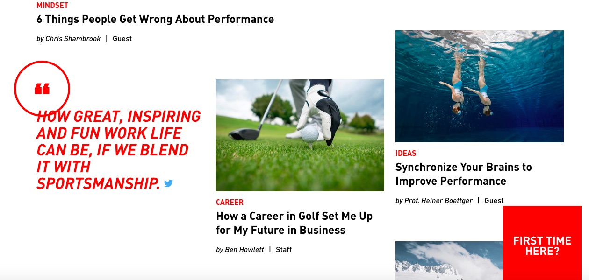
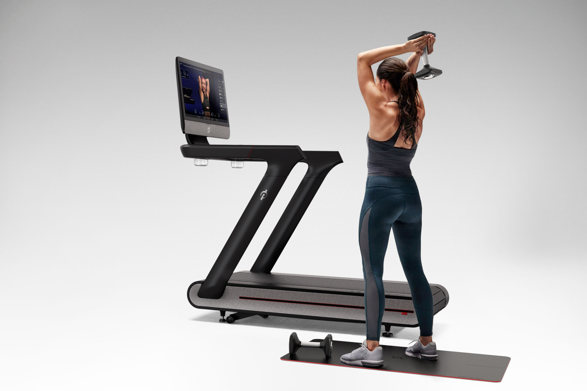
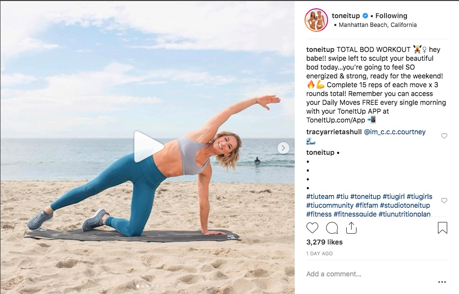

import YouTube from 'react-youtube';
import { BlogLink } from '$components/Link';
import { Title, Subtitle, Divider } from '$components/mdx';

No industry has tackled content marketing quite as well as the fitness industry. For good reasons: Staying fit and living healthy starts with a mental decision. From incorporating workouts into your busy schedule to believing that you can achieve anything - the right mindset is irreplaceable. That’s where content marketing comes into play: The right storytelling  can motivate and inspire people to perform their best and build communities of like-minded people on social media.

Here are the biggest fitness content marketing trends in 2018 for fitness brands to get their audience hungry for their next workout!

<Title id="fintess-content-marketing-blog">An Inspirational (fitness) blog</Title>

Writing a blog almost feels like an old hat when it comes to marketing your business. It seems like everybody has one these days. But it’s not so much in having a blog but rather what you put on there that makes you stand out from your competition. Sure, there are a lot of fitness brands out there that offer workouts, single moves or fitness trends on their blog. So do you have to do it, too? Of course not. If you want to differentiate yourself from the crowd, you have to dare to be different, you have to come up with your own fitness content ideas.

Let’s look at a company, that is using fitness content marketing in a different way and still manages to inspire and motivate people.

<Subtitle id="fitness-content-marketing-adidas">Fitness Content Marketing with Adidas</Subtitle>

Adidas has their own digital magazine but they are not hunting the next best fitness trend or showing workouts. Rather, they have published a magazine with an HR spin. The topic: How can you use your athletic mindset to perform best in the workplace?

Tackle work life with an athlete’s hear, that’s the slogan of <BlogLink to="https://www.gameplan-a.com/">Adidas’ Game Plan A blog</BlogLink>. Focus here is on work-life-balance, workplace wisdom, and better business practices. With this kind of content Adidas aims to inspire current and future members of its workforce. The goal of the blog is not to make the next sale, but to build a strong company culture to attract future employees and keep the ones working at Adidas happy and satisfied.

<YouTube
  videoId="ad-85B8EwL_nu0" opts={{ width: '100%' }}
/>

The blog has become super popular among Adidas’ employees and athletically minded employees elsewhere. Articles like “Swim your way to better work performance” or “The secret behind our habits - 3 learnings from successful athletes” have achieved more than 15k views.

<Title id="fitness-content-marketing-connected-devices">Streaming live videos for athletes using connected devices</Title>

In 2018, you don’t have to go to the gym or your local workout studio anymore to take part in your favorite workout classes. One of the biggest trends in fitness content marketing is serving content via connected devices, so that “It’s raining outside, I can’t go” or “I don’t have the money to pay for the class” is never going to count as an excuse again. Look how this company is making use of this fitness content marketing trend.

<Subtitle id="fitness-content-marketing-peloton">Fitness Content Marketing with Peloton</Subtitle>

Companies like Peloton offer training equipment that come with an interactive screen. This screen functions as the gateway to hours of excellent fitness classes, broadcasting live and on-demand classes happening elsewhere. Now you don’t even have to leave your home to get fit and healthy!

The company streams 12 hours of fitness content everyday. But if you think that broadcasting workouts is all they do, you’re wrong. You’ll get the drill from an instructor who is shouting personalized messages to you and you’ll be able to compare how you’re holding up with those subscribers, that are taking the same class. That’s interactivity on a whole new level that makes you feel as if you were right in class.

<Title id="fitness-content-marketing-social-media">Building inspirational social media communities</Title>

On social media, engagement is the key to success so it should always be your priority. Community-building is crucial for an industry that lives from passion and like-minded individuals.

Social media is like a second reality and everybody is using it. That makes it the perfect platform for storytelling. People just scroll through their feed and might even get motivated to break a sweat by fellow members of the community.

Here is how fitness stars Karena and Katrina from Tone it Up are leaveriging their community.

<Subtitle id="fitness-content-marketing-Tone-it-up">Fitness Content Marketing with Tone it Up</Subtitle>

The key to Tone it Ups success is a strong community behind them. They started to film workout videos and short sequences that they shared with their followers. Today, they’ve created a large community of fitness enthusiast and those looking to get in shape with their easy-going, motivational and inspirational personalities.

#tiutransformation gives people the possibility to share their fitness success with the rest of the community. Everyone can use this hashtag to tell their own success story and they might even get featured on the Tone it Up Instagram account. Another even more popular hashtag is #tiuloveyourbody where people openly speak about their body issues. These kind of stories help people to really open up to one another and build a feeling of togetherness. Another bonus: clients become free brand evangelists and help the company spread their message.

<Title id="fitness-content-marketing-voice-control">How Fitness Brands can use Voice Control</Title>

Another massive content marketing trend for fitness in 2018 is voice-activated content and I am not talking about podcasts here. Fitness Brands like Fitbit or alpfit are already having collaborations with Amazon’s echo. Fitbit users can now ask Alexa about their daily progress via an integration with the Alexa API.

<Subtitle id="fitness-content-marketing-Fitbit">Fitness Content Marketing with FitBit</Subtitle>

With Amazon’s echo, FitBit users simply have to say something like “Alexa, ask FitBit how I’m doing today,” and the device will tell you exactly how you’re doing. It also lets you know how well you slept last night or how many calories you’ve already burnt. In addition to that, it comes with some motivation to walk or exercise more.

The response you’re getting from Alexa will even be tailored to the specific time you’re asking. If you, for example, ask how you’re doing at 9 am, you might get an answer like “You’ve got to start somewhere,”.

<Subtitle id="fitness-content-marketing-Virgin-Active">Fitness Content Marketing with Virgin Active</Subtitle>

Virgin Active is the first gym to use Amazon’s Alexa to integrate its fitness classes schedule to make it even more convenient for members to check their favorite classes and their locations from the couch.

The goal is to bring members even closer to their workouts by giving them the opportunity to schedule their first fitness regime through Alexa. They now get answers about the class schedule and type, the workout location and the duration of the workout.

<Title id="fitness-content-marketing-Conclusion">In Conclusion</Title>

You see, there are a lot of great possibilities to leverage fitness content marketing besides the traditional blog. With new technologies arising, marketers get more and more options to market a service or a product. Think outside of the box and don't be afraid of technology because if you are, at some point your company will get left behind.

