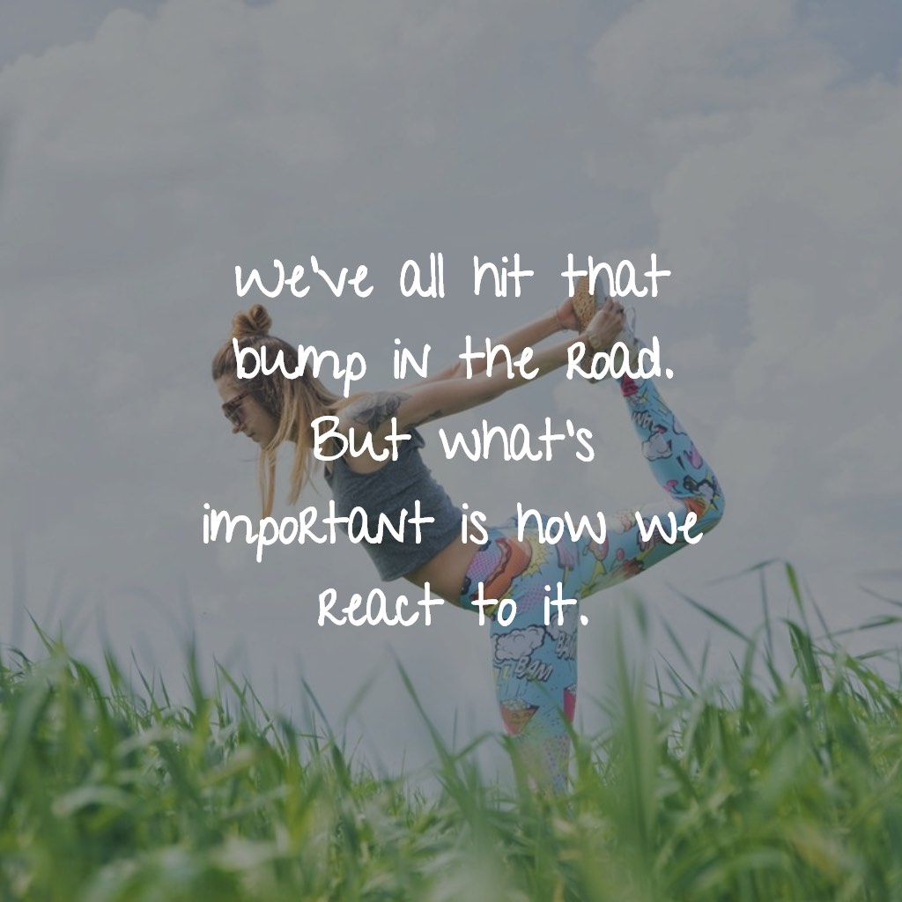
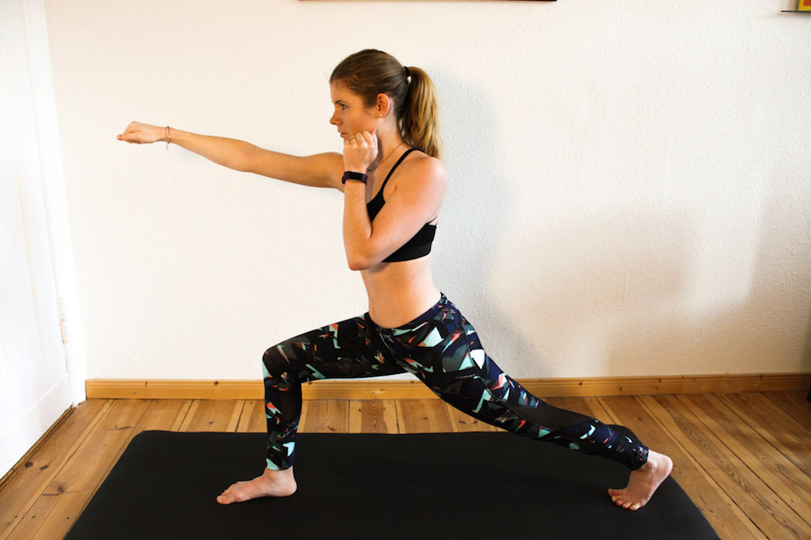

Fitness isn’t always easy and we’ve all hit that bump in the road, the setback. A lot of the time it takes hard work and a lot of time to be able to see the first results. Many people even quit before having had any success. Others saw the first results, only to fall behind them after some time. What’s important is how you react to that bump. Are you one to give up or are you taking back control and steer yourself up?

I too have these phases where I feel like quitting and giving up. I have been training for the splits for months and I am still not able to get fully into them. There are days when I feel more flexible and almost make it and then there are days when I am not even getting close. This is frustrating! But am I giving up because of that? Definitely not! And why is that? Because I have some great strategies that I am always coming to when feeling like giving up and I want to share them with you today.

# The right mindset

You might think that working out is only physical so the mental part doesn’t play a big role, but that is actually not true. Sometimes the mindset plays an even bigger role than your actual physical status. Maybe you’re the most flexible person, but if you never stretch it won’t get you anywhere whereas a person that is not so flexible but really willing to give it all he/she can might even surpass you at some point. Therefore, make sure that you have the right mindset whenever you do your workouts.

**1. Be focused on the things you can do**

There will always be something you’re not good at. Maybe you’re trying to get into this one special yoga pose but can’t seem to make it or you want to run your first five k but you’re totally out of breath after three already. Don’t panic. Just focus on what you can do instead of what you can’t. Keep working on that  instead of forcing you into an uncomfortable position. You will see progress eventually. By focussing on what you can do instead of what you can’t do, you will prevent feeling all depressed and wanting to give up. Just do your best and test your progress now and then.

**2. Keep your eyes on the prize**

Remember that setbacks are temporarily. You will get back into your old routine eventually, just don’t give up. Always remember why you started working out in the first place. Make it really visual and have a picture of your final goal in mind. Don’t lose this picture. So you didn’t make it this time, so what? Keep trying and know why you’re doing it.

**3. Set yourself realistic goals**

Sometimes we simply have to admit to ourselves, that our goals aren’t manageable for us. Instead of getting all frustrated about that and giving up, make the adjustments that are necessary to meet your goal. Remember: Goals must be challenging, yet they must also be realistic. Otherwise they will only demotivate you.

**4. Enjoy the ride**

No one will ever start out with fitness and immediately be on top of the world. See your fitness evolution as a kind of journey whether you’ve just started out or encountered a serious setback. Stay curious and open-minded about where the journey might take you. Maybe you’ll even see progress in fields that you wouldn’t have expected like being more flexible or getting rid of back pain. Whatever it is, fitness is a journey without an ending - just enjoy the ride.

**5. Give it the best you can - A little is always better than nothing**

Keep in mind that no workout whatsoever is a failed workout. Even if you felt like this workout wasn’t as good as the others, you didn’t run your 5 k or you didn’t make it into the splits, you still did *something*. This is always better than doing nothing, so just starting your workout is a win itself!

# Finding your motivation

Having the right mindset is great, but sometimes we are still lacking motivation to get back in the game after a setback. After all, we’re only humans, right? So after your mindset check you need to find a way to motivate yourself. But how do you do that?

**1. Find a workout partner**

Everything is just so much easier, if you’ve got a partner, don’t you think? It’s great to have somebody by your side who motivates you and gets you up when you have fallen. Set a date with your partner to make sure that you both stick to your plans. After all, dates are mandatory, right?

**2. Learn from your setbacks**

Nobody likes to be set back but try to look at it from a different angle: Instead of being frustrated, ask yourself what went wrong and what you can improve on next time you try. Only if you learn from your mistakes you know what you need to work on. So look at it as a chance to become even better.

**3. Look for inspiration**

Do you have fitness role model? Someone who, in your eyes, has the perfect body and crushes every workout? Use that person as a source of inspiration. Let him/her be your mentor whom you can emulate. Ask yourself, what it is that makes this person so special and how you can copy that for yourself.

{}

# Setbacks are not the opposite of success

Fitness and setbacks honestly go hand in hand. There is no straight way up to the top, it’s all hard work. Try to remember that from the very start. Setbacks don’t mean that you failed, they simply mean that you have to start over. Only if you don’t do that, you really have failed. It doesn’t matter how often you have to start over. You will get better each time you try anew. These little steps should be your measurement of success. So don’t quit if you don’t get the results you wanted right away. It’s a journey and who knows where it will take you.

