Last month I travelled to Italy for a long overdue holiday. Although I live in Europe, it was my first time in the country of Pizza, Pasta and Wine.
As work was pretty stressful the weeks before my vacation, I was really looking forward to some quiet time. My dream was to work out in the morning, go for a swim, read a good book and pet the animals. Maybe have a good glass of wine in the evening and of course Pizza.

# The most beautiful place

When we arrived at Lago sul Trasimeno I immediately felt that this place would be good for me. The apartment was located on a hill with a breathtaking view on the Trasimeno Lake. It wasn’t very spacious or even luxurious, yet still it was this simplicity that made the place even more special.  A few steps up the hill there was a huge pool with an even more beautiful view. It was the perfect spot for me to workout and to seriously start my morning Yoga routine.

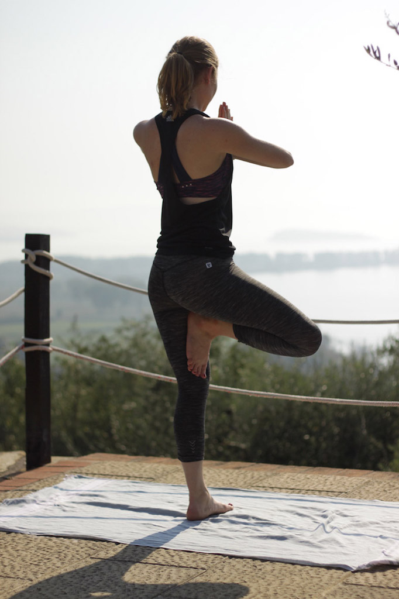

# A place just to ourselves

There weren’t many other people around our accommodation. We also didn’t have a TV or a radio and of course I didn’t bring my laptop with me. In the evenings when we were sitting outside with a glass of wine it was so quiet, all you could hear were the mosquitos and the crickets. It was my first vacation after nine months of nonstop working. To get a little distance from my life at home this was exactly what I had needed.

# Working out in the morning with a spectacular view

The view from up the hill where the pool was had such a soothing effect on me. I felt like I was finally able to breath freely again, to calm my mind and to forget what was troubling me. Working out on top of the hill, the most beautiful view below and the noise of some horses above, definitely motivated me to try out some new things in Yoga.  I tried out the crow and guess what, I finally succeeded. I also took my holiday workout routine to the poolside.

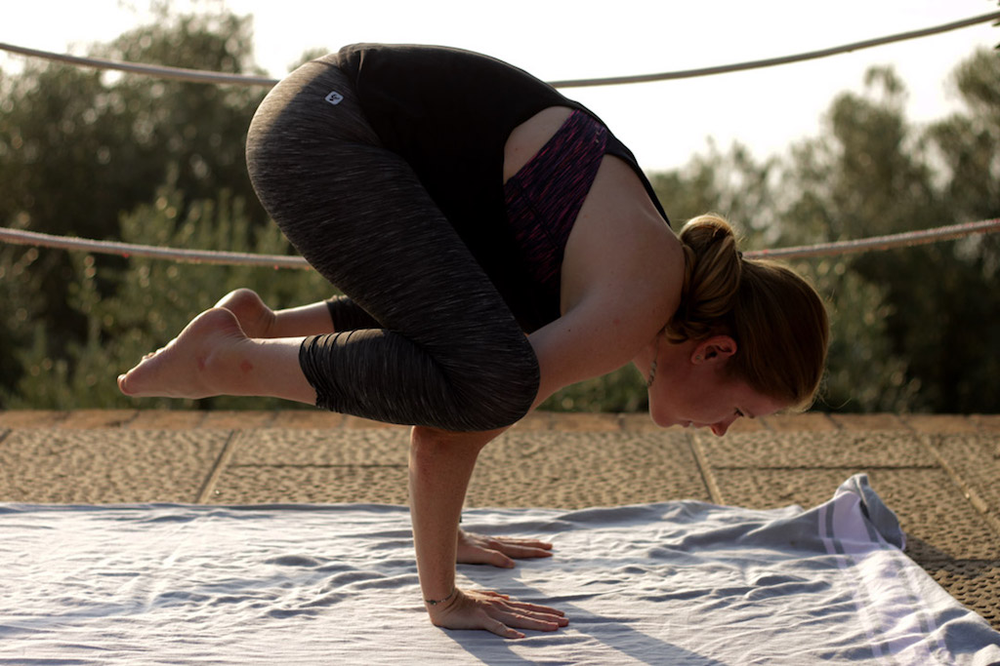

# Trying to incorporate this clarity and calmness into my everyday life

The hardest part however, is always getting back from a holiday. Suddenly you are in the real world again. Here it is again, the hassle that you thought you had left behind. And now everything feels even louder than before. To keep this calmness and incorporate it into your everyday life is challenging. I’ve been struggling to find my inner balance for a long time. However, now that I work out on a regular basis, I finally feel like I have a way to release all this tension and stress. Of course, building up a routine needs time and work but I definitely feel that it is worth it. I never thought that I would find Yoga for me. It never felt like actual sport to me and I actually didn't want to pursue it. Now I am happy that I didn't quit on it.

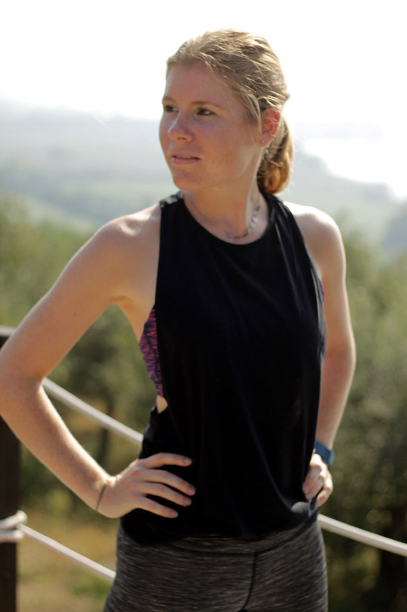

# I finally understood what Yoga was about

As I said I was never really able to identify myself with the practice of Yoga. Now I’ve finally understood that it is all about the balance; body and mind work together in Yoga. And if I manage to incorporate my everyday Yoga into my life, I am sure I can also incorporate some of the clarity and calmness into my life. The same calmness that I felt in Italy.

# My every morning Sun Salutation (Surya Namaskar)

The sun salutation is the perfect exercise to wake up your muscles and to get your circulation flowing. It also gently massages the inner organs and leads to a deep and strong breathing. Do at least two runs of *Surya Namaskar*. Here is how you do the sun salutation:

Get on your mat with feet closely together. Arms are hanging loosely next to your body. Breath in and out deeply.
Now fold your palms in front of your chest. Keep your shoulders down.

Tense your glutes and legs. Stretch your arms upwards and bend your upper body back. Inhale while bending back.
Breath out and bend your upper body forward.

Breath in, bend your legs and do a big lunge back with your right foot. Keep your gaze up.

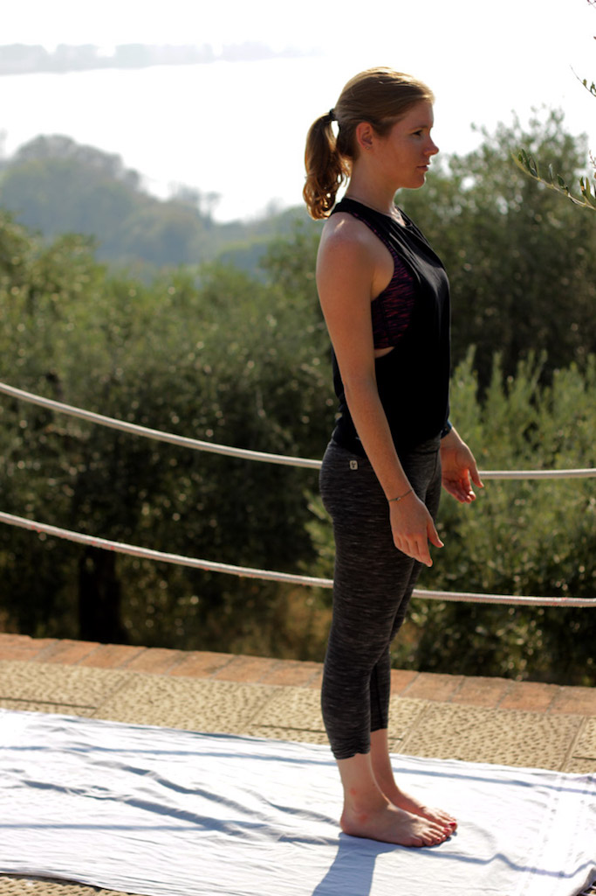
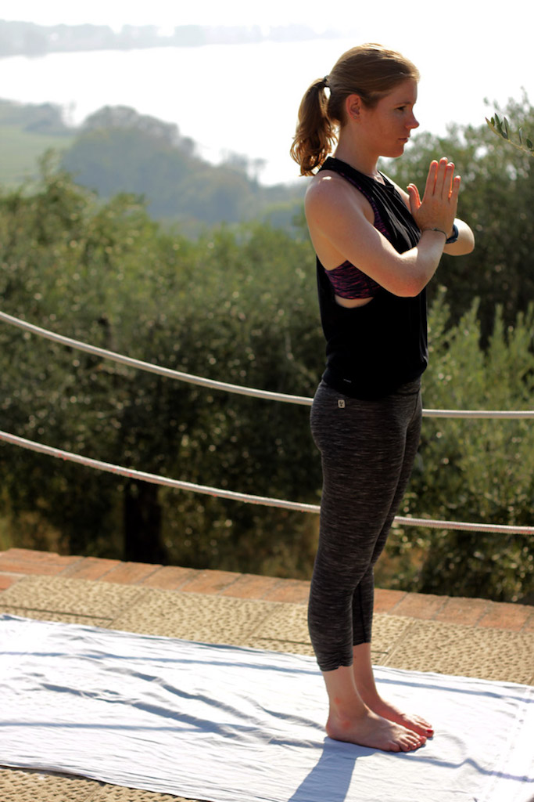
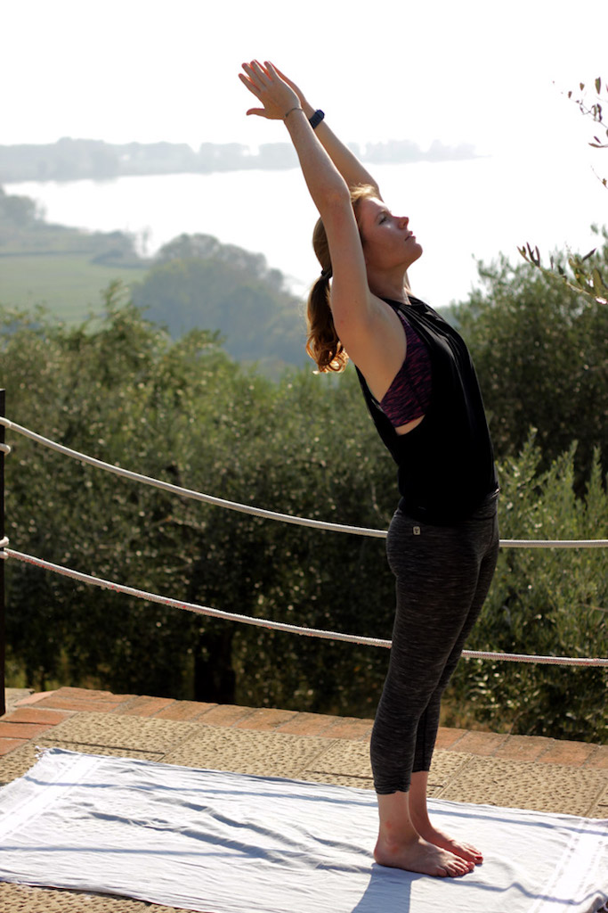
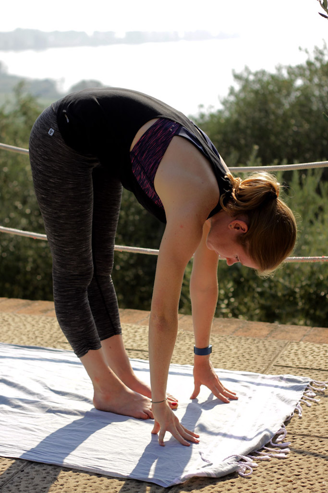
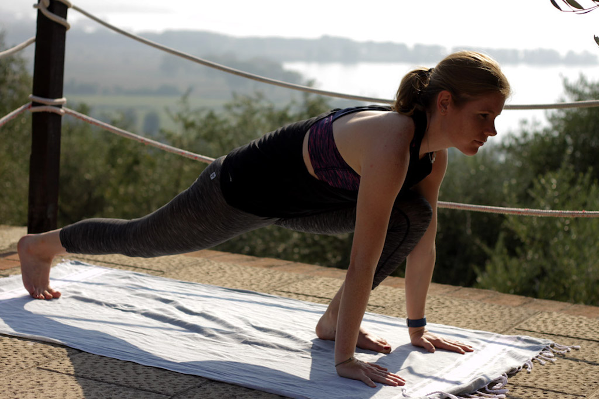

Bring the left foot to meet the right at the end of your mat, breath out and come into a plank position. Upper body and legs should be in one line, wrists are under the shoulders, keep your back and tummy tight.

Breath in and out again. Place your knees on the mat and bend your arms until forehead and breastbone touch the ground. Elbows should be hugging your ribs. Lift your butt up a little.

Breath in. Place your whole body on the ground. Now build up tension in your arms. Push your upper body up, the lower ribs should barely touch the ground. Come into a cobra. Put your head into your neck.

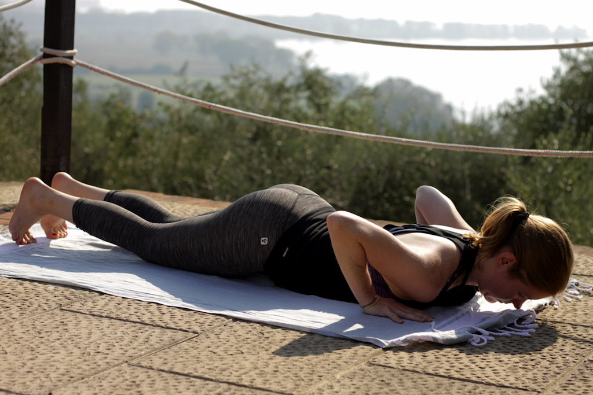
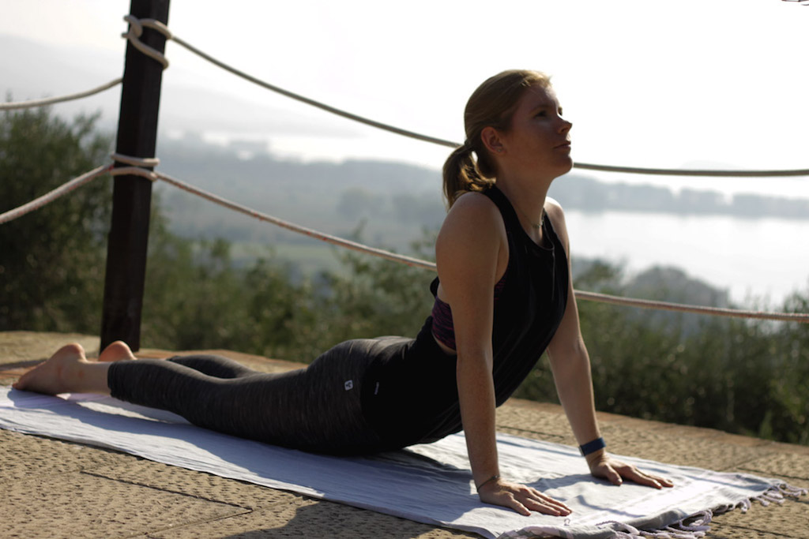

Breath out and come into a downward facing dog position.

Breath in, bring your right foot between your hands. Lay your left knee on the ground and raise your upper body. Stretch your arms to the sky, palms together. Push your left hip to the front.

Breathe out, put your left leg next to your right. Extend your legs but don’t force your knees through. Keep your upper body bent over.

Breathe in deeply and slowly raise your upper body again while stretching your arms up to the sky.

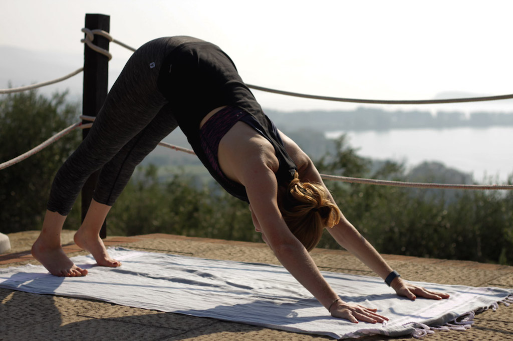

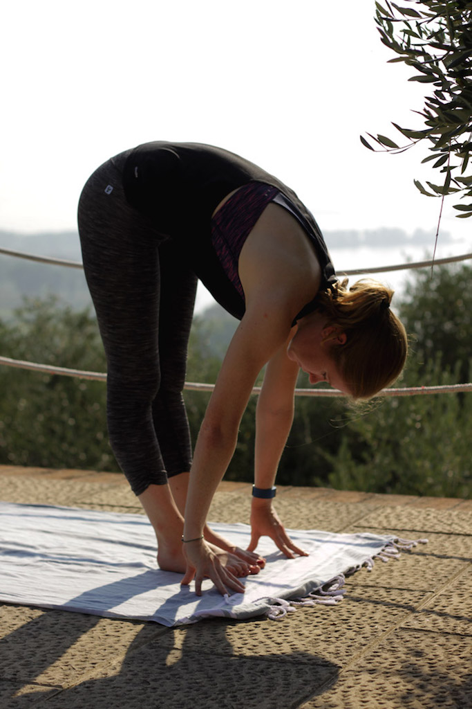
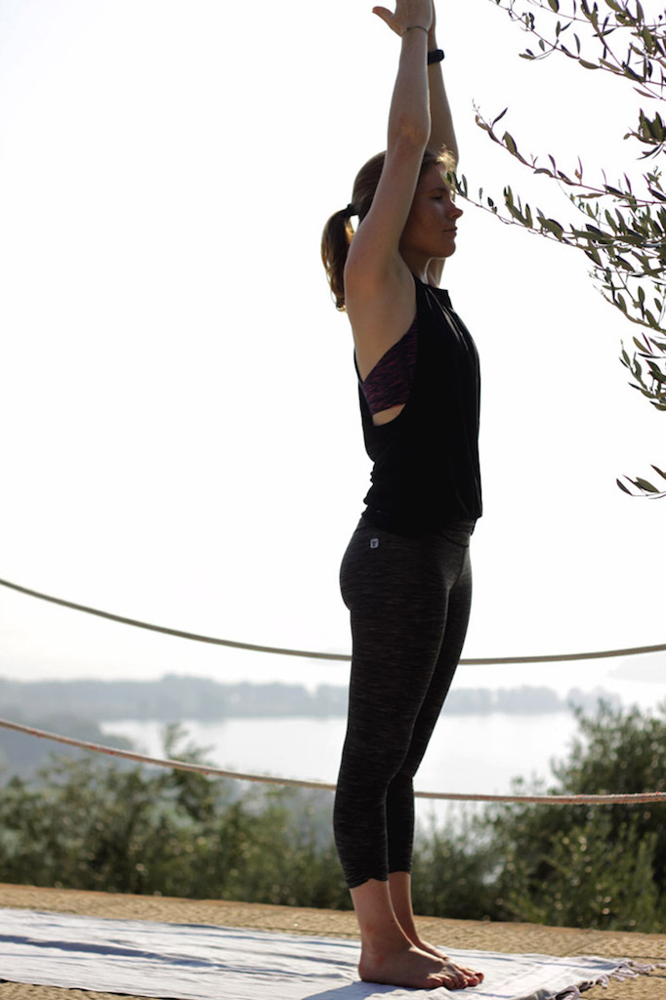

Take your arms down again while breathing out. Put your palms together in front of your chest and keep your shoulders relaxed.

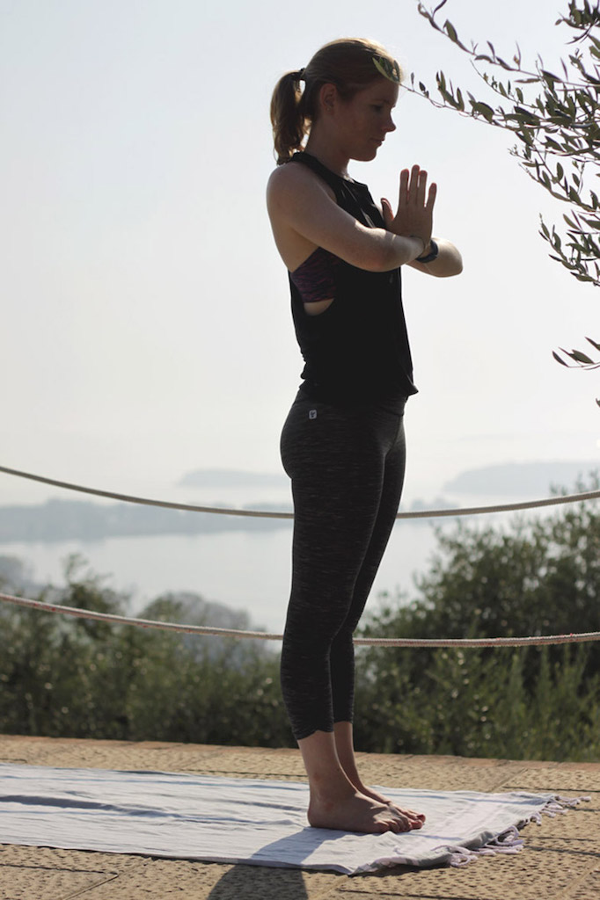

By the way, there is an infographic with the whole sun salutation flow [at the end of the post](#infographic). I hope you'll enjoy it!

# Origin of the Sun Salutation

The Sanksrit word *Namaskar* derives from the word *namas*. This means “to bow to” or “to adore”. Each Sun Salutation begins and also ends with your joined hands in front of your chest, touching your heart. This gesture means, only the heart can know the truth. Yogis believe that in the heart lies the consciousness and higher wisdom (*jnana*).

The Surya Namaskar has a long tradition. However, there is some disagreement over how old the sequence really is. Some say it is at least 2.500 years old or even older and originated during Vedic times. It was seen as a ritual prostration to the dawn, containing mantras, offerings of flowers and rice, and libations of water.  Others however claim that Sun Salutation was an invention of the raja of Aundh (a former state of India, now it’s part of Maharashtra state) in the early 20th century. In the 1920s or 1930s it found its way to the West.

# The Breathing

Yoga Breathing or *Pranayama*, is the foundation of yoga practice. During challenging positions or movements we tend to hold our breath or use stress induced breathing. Yoga however is supposed to calm us down and create a relaxed body. This is why every Yoga exercise is synchronized with your breathing.

# The different types of yoga breathing (Pranayama)

There are several types of yoga breathing.  There would be *Ujjayi pranayama*, which consist of a gentle breath that is both energized and relaxed, allowing for balance. Then there is *Kapalabhati pranayama*, known as the skull-shining breath for good reason. *Nadhi sodahana pranayama* allows for great expansion of our lungs and equal breath through both nostrils. Finally, there is *Sithali pranayama*, which is a cooling breath with an immediate effect on the temperature of your entire body.

# Recommendations

**If you'd like to get more information on Yoga, I highly recommend these reads:**

* [Light on Yoga](https://www.amazon.com/gp/product/0805210318/ref=as_li_tl?ie=UTF8&tag=21moves-20&camp=1789&creative=9325&linkCode=as2&creativeASIN=0805210318&linkId=92811be5cc147e135bc75159225fad2a)

* [The Yoga Tradition](https://www.amazon.com/gp/product/1890772186/ref=as_li_tl?ie=UTF8&tag=21moves-20&camp=1789&creative=9325&linkCode=as2&creativeASIN=1890772186&linkId=2606286d2dde31a674930d54217d2e12)

Also, I couldn't stop reading Rachel Brathen's [Yoga Girl](https://www.amazon.com/gp/product/1501106767/ref=as_li_tl?ie=UTF8&tag=21moves-20&camp=1789&creative=9325&linkCode=as2&creativeASIN=1501106767&linkId=aaf2482787662f48d706b8b030dffc13). It's such an inspirational story about how she has come to Yoga.

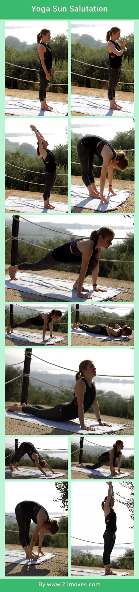
