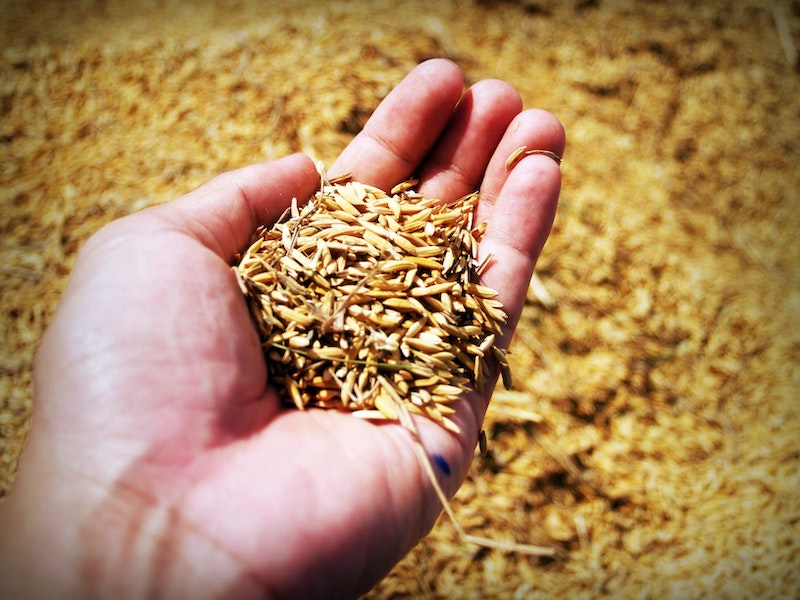
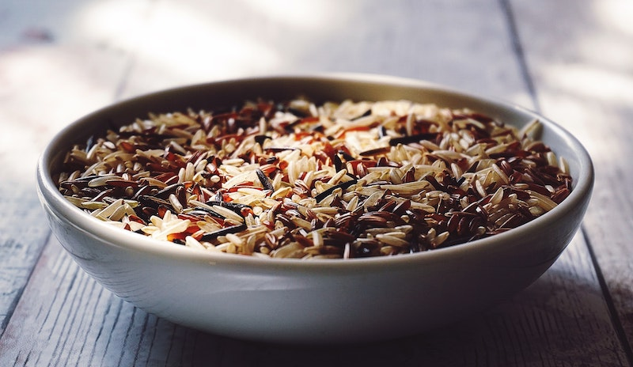
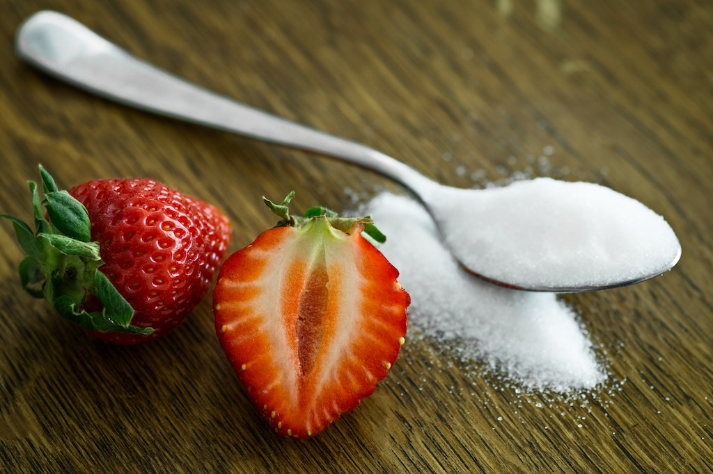
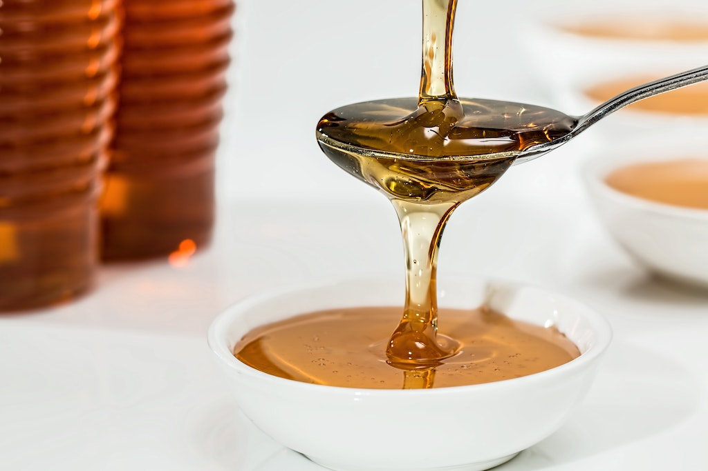

Grains belong into the group of **carbohydrates**. Carbohydrate evoke different emotions around health enthusiasts and there is always a big debate going on whether they are an essential component of a healthy diet or whether they are harmful.

In the US, health authorities recommend eating 5 to 6 servings of grain for women, and 6 to 8 for men. On the other hand, some health experts recommend to steer clear from grain altogether.

However, grains are not all equal and whole grains can indeed be part of a healthy kitchen.

# What are whole grains?

Whole grains are **complex carbohydrates**. They are complex because they are **wrapped in fiber**. For that reason, our body needs **longer to break them down and digest them**.

The slower absorption of whole grains is beneficial for us as it helps **regulate glucose levels** - your blood sugar. When the body absorbs the food more slowly, we don’t experience those blood sugar spikes that crash down again after a short while, leaving us hungry and craving for more food.

Whole grains, contrary to refined grains, tend to be very **nutrient-rich**. They are high in **B vitamins, magnesium, iron, zinc, selenium and manganese**.

They also contain antioxidants and phytochemicals that help prevent diseases such as cardiovascular disease, type II diabetes and certain types of cancer. [1](https://www.ncbi.nlm.nih.gov/pubmed/20301011), [2](https://www.ncbi.nlm.nih.gov/pubmed/28155258)

Grains are seeds that grow on grass-like plants called cereals and they are small, hard and edible. By grinding the grain you’ll get flour that is essential in most kitchen for making bread, cake, pastries or pasta.

A whole grain consists of three parts:

1. The bran: This is the hard outer shell that contains fiber, minerals, and antioxidants
2. The endosperm: This is the biggest part of the grain; it’s the middle layer that contains mostly carbs
3. The germ: This is the nutrient-rich core. It contains vitamins, minerals, proteins, fats, antioxidants and various phytonutrients. As the embryo of the germ, this part also gives rise to a new plant. It’s also the part where gluten, gliadin and wheat proteins are found.

# Whole grains vs. refined grains

While whole grains still consists of all those three parts, a refined grain only consists of the endosperm - the germ and the bran are removed. Thus all of the good stuff is lost. What’s left is the high-carb, high-calorie endosperm.

Refined grains are so called **“empty calories”**, as the fiber and nutrients have been stripped out.

Because the fiber is lost leaving only the carbs, the body can quickly digest refined grains. They get **broken down fast, leading to rapid spikes in blood sugar**, leaving us hungry and unsatisfied with our food soon thereafter.

Numerous studies show that eating foods that are high in refined carbohydrates lead to overeating and might therefore be a cause for **weight gain and obesity**. ([1](http://pediatrics.aappublications.org/content/103/3/e26.short), [2](https://onlinelibrary.wiley.com/doi/10.1002/iub.418/full))

Because of their effect on blood sugar, refined carbohydrates are also linked to insulin resistance, type II diabetes, and heart diseases. ([1](https://www.ncbi.nlm.nih.gov/pubmed/24008907), [2](https://www.ncbi.nlm.nih.gov/pubmed/24265366), [3](http://journals.cambridge.org/action/displayAbstract?fromPage=online&aid=9197946&fileId=S0007114513003486))

From a nutritional point of view, there is **nothing that speaks in favor of refined grains**. They are **low in nutrients** and they ace accessible so quickly that we’ll experience **rapid spikes in blood sugar**, consequently leaving us hungry and craving more food.

Whole grains however, are a totally different story. As they are high in fiber, they don’t have the same metabolic effect as refined grains.

There are a lot of studies showing that whole grains actually have **beneficial effects on our health**.

It was shown that eating more whole grains puts you at lower risk of becoming obese and it’s linked to having **less belly fat**. ([1](https://www.ncbi.nlm.nih.gov/pubmed/23803885), [2](https://www.ncbi.nlm.nih.gov/pubmed/25300424), [3](https://www.ncbi.nlm.nih.gov/pubmed/22983848), [4](https://www.ncbi.nlm.nih.gov/pubmed/18005489))

Eating whole grains apparently also **lowers the risk of getting sick of type II diabetes, heart diseases and colon cancer**. ([1](https://www.ncbi.nlm.nih.gov/pubmed/24158434), [2](https://www.ncbi.nlm.nih.gov/pubmed/25599007), [3](https://www.ncbi.nlm.nih.gov/pubmed/12740069), [4](https://www.ncbi.nlm.nih.gov/pubmed/10479204))

However, all these studies should be taken with a pinch of salt, as they cannot prove that whole grains actually caused all those health benefits, simply that they are associated with them.

# Grains and gluten-intolerance

A lot of people are gluten sensitive or even allergic. This allergy is called **celiac disease** and it is in fact not an allergy but an **autoimmune disease**. Those people suffering from it must eat gluten free.

Gluten is a wheat protein that some people are intolerant to. Generally, we have protease to [break down this wheat protein](http://science.sciencemag.org/content/297/5590/2275). However, some people cannot break it down *completely*.

One of the pieces, that we cannot break down, is called gliadin. Gliadin reacts with an enzyme called transglutaminase that triggers an autoimmune response in celiac patients due to a gene mutation.

Around 0.7 to one percent of the population are affected by celiac disease. The numbers for gluten sensitivity however, vary and lie between 0.5 to 13 percent.

While probably less than ten percent of the population is sensitive to gluten, this number still amounts for millions and millions of people worldwide who suffer from digestive distress and other symptoms when eating gluten.

Luckily, these days there are a lot of gluten free grains as an alternative to traditional wheat. These include:

* Amaranth
* brown rice
* wild rice
* quinoa
* buckwheat (kasha)
* sorghum
* millet
* oats - (only if milled in differents mills than wheat, otherwise they are contaminated!)

All these gluten free grains can also be made into flour, so baking, too isn’t that big of a problem anymore.

Whether you buy gluten free or not: Try to buy organic and whole grain!

# Sugar in the kitchen

Sugars come in many different forms, including **raw or organic**. It is **highly addictive** and can lead to health problems such as **heart diseases, obesity, diabetes** and it can even put you at higher risk for **certain types of cancer**. ([1](https://www.ncbi.nlm.nih.gov/pmc/articles/PMC2235907/), [2](https://www.health.harvard.edu/heart-health/the-sweet-danger-of-sugar))

Most sugars are made of **sucrose**, a disaccharide made of two monosaccharides: Fructose and glucose. These monosaccharides are digested differently by our body.

## Absorption of fructose

Fructose is metabolized and stored **completely in the liver** as a glycogen. Its storage isn’t endless though, so once it’s filled up excess fructose is converted into **fat**.

Many studies suggest that excess fructose may be the key driver of many serious diseases these days such as **high blood pressure and heart disease, insulin resistance, or fatty liver disease**. ([1](https://www.ncbi.nlm.nih.gov/pmc/articles/PMC2673878/), [2](https://www.ncbi.nlm.nih.gov/pubmed/27194405/), [3](https://www.sciencedirect.com/science/article/abs/pii/S0168827808001645))

It’s important to realize though, that these health issues refer to **fructose from added sugars**, not to fructose from whole fruit. These contain lots of fiber, making it hard to overeat. **You would have to eat a lot of fruits to reach harmful fructose levels**.

## Absorption of glucose

Glucose is the **main source of energy** and it can be utilized by just about every cell in the human body. It comes from the greek word for “sweet” and is a sugar that you get from the food you eat. Mainly, these foods are **rich in carbohydrates**, like bread or potatoes.

Glucose is managed by the insulin hormone. Insulin moves glucose from your blood into the cells for energy. If it is not used as energy shortly after being consumed, **glucose is converted to and stored as fat**.

When glucose builds up in your bloodstream, your **blood sugar levels rise**. Chronically elevated glucose can put you at risk for serious diseases such as **heart and blood vessel disease, poor kidney function or nerve damages**.

## How much sugar should I eat?

**The single worst enemy of your body and health is added sugar.**

Added sugar **doesn’t provide any nutrients**, only calories and they can damage your metabolism in the long run.

However, it is important to differentiate between added sugars, and sugars that occur naturally in your food as in fruits and veggies.

These are healthy foods as they contain lots of fiber and valuable nutrients and they are absolutely fine in your diet.

Added sugars are a different story. They can be found in candies and processed foods such as baked products and soft drinks.

Answering the question of how much sugar is ok, is tricky. Some people seem to be able to eat lots of sugars without any harm, others need to strictly avoid it.

The [American Heart Association (AHA)](https://www.heart.org/en/) recommends **not eating more than 150 calories per day ( 37.5 grams or 9 teaspoons) for men and no more than 100 calories per day (25 grams or 6 teaspoons) for women**.

Others say that sugar shouldn’t make up for more than five to ten percent of your daily caloric intake.

But however much is the “right” recommended amount, remember that there is no need for added sugars in your diet and **the less you eat, the healthier you’ll be**.

# Natural sugar alternatives

By now, you surely understand why sugar is bad for you and that it should be avoided. Luckily, there are a lot of natural sugar alternatives these days that make for a better choice.

**#1 Stevia**

Stevia is a natural sweetener, that is sugar-free and non-caloric. It is made from the leaves of the stevia plant. The great thing about it: It doesn’t raise blood sugar.

Not only does it contain zero calories and not raise blood sugar, it is even associated with certain health benefits. Several studies found that one of the sweet compounds in stevia can be linked to lowering high blood pressure by six to 14 percent. ([1](https://www.ncbi.nlm.nih.gov/pubmed/10971305), [2](https://www.ncbi.nlm.nih.gov/pubmed/10971305), [3](https://www.ncbi.nlm.nih.gov/pubmed/14693305))

Use stevia for baking or to sweeten up your morning coffee.

**#2 Monk Fruit**

Monk fruit has been used as medicine in southeast Asia for centuries. It doesn’t contain any calories and is much much sweeter than sugar - up to 300 times more sweet, in fact.

It is generally regarded as safe to use and is currently researched for its vital chemical and anti-cancer properties as well as for its anti-inflammatory benefits. ([1](https://www.naturalhealth365.com/monk-fruit-cancer-cell-1876.html), [2](https://www.ncbi.nlm.nih.gov/pubmed/21631112))

**#3 Honey**

Honey is made from a blend of fructose and glucose. It contains trace amounts of vitamins and minerals and an abundance of other beneficial antioxidants.

Honey is also touted for its antimicrobial and antibacterial activities. Other studies show that eating honey might even [lower bad cholesterol](http://www.tandfonline.com/doi/abs/10.3109/09637480801990389) and increase the good one (HDL).

But even though honey is a natural sweetener, you still shouldn’t eat too much of it.

**#4 Maple syrup**

Maple syrup is an unrefined natural sweetener and thus a much better option than syrup made from high fructose corn syrup.

It contains certain minerals, including potassium, calcium, iron, zinc and manganese. Plus it contains at least [24 different types of antioxidants](http://cfs.nrcan.gc.ca/publications?id=28297).

Despite all that, maple syrup is still very high in sugar. Its glycemic index is a little lower than regular sugar, so it doesn’t raise blood sugar levels quite as quickly. Still it does raise them so you shouldn’t eat too much of it, either.

**#5 Yacon Syrup**

This syrup is extracted from the yacón plant in South America. It tastes sweet, has a dark color and a thick consistency.

Yacon syrup contains fructooligosaccharide, which feed friendly intestinal bacteria and help the metabolism. Studies also show that fructooligosaccharides can decrease the hunger hormone ghrelin, which may help eat less as the appetite is lowered. ([1](https://www.ncbi.nlm.nih.gov/pubmed/15877889), [2](https://www.ncbi.nlm.nih.gov/pubmed/16923230))

liquid: some are more natural than others e.g. yacon syrup, honey and maple syrup
yacon syrup contains fructooligosaccharide - feed friendly intestinal bacteria and help metabolism; studied on effects on obesity and insulin resistance

Generally, eating yacon syrup is considered safe. However, eating too much of it may lead to excess gas, diarrhea and other digestive problems.

**#6 Coconut sugar**

Coconut sugar is made from the sap of the coconut palm. It is less processed as the sap is extracted and then placed in the heat to dry.

Coconut sugar also contains a few nutrients such as zinc, iron, potassium and calcium, as well as antioxidants.

Its glycemic index is also lower compared to regular sugar which [helps stabilizing blood sugar levels as it contains inulin](https://www.ncbi.nlm.nih.gov/pmc/articles/PMC3259296/), a prebiotic fiber that slows down glucose absorption.

Still, coconut sugar is high in calories - it actually contains the same amount of calories as regular sugar and should only be used sparingly.

<Divider />

At the end of the day, these are all better alternatives to regular sugar, but still it's sugar. Whenever possible, you should steer clear of white table sugar.

