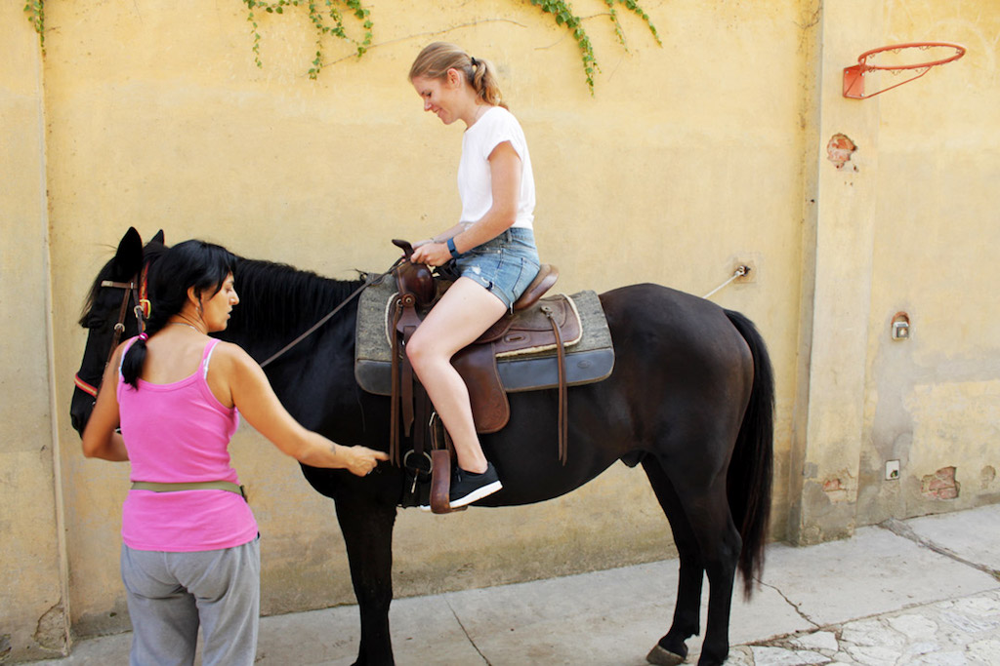
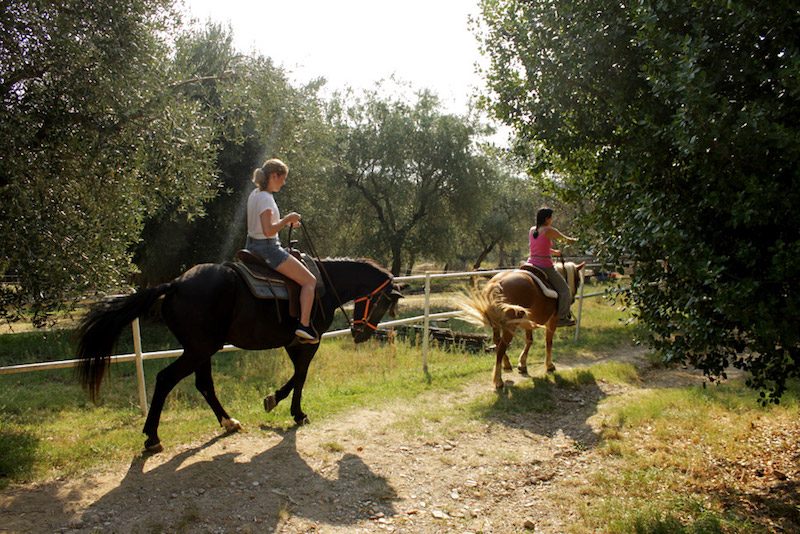
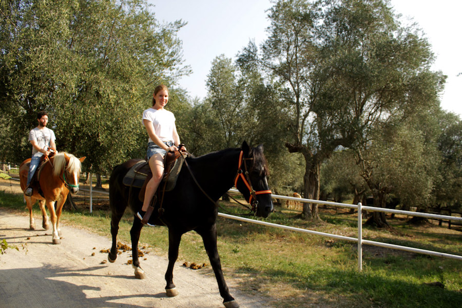

I always wanted to go horse riding through the countryside. I had never even really been on a horse and still I thought that it must be magical, riding through the countryside and seeing the things from an upper level. Especially riding through the vineyards had always been a dream of mine.

When we were on vacation in Umbria I finally had the chance to make this dream come true. We were staying in a lovely Airbnb apartment with a little farm. There were sheeps and rabbits and pigs and horses. So even though my riding experience was close to zero, I really wanted to try give it a try.

# Horseback riding through the tranquil countryside of Umbria

We started our horseback riding tour at a little farm, where we first had to pass a few rocks and go down some hills. This was already pretty challenging for me as I was really scared that the horse might trip or slip. Having no experiences in riding, I really don’t know how well horses can cope with uneven grounds. But we managed it and I soon trusted the horse enough to not be scared anymore. Now and then we had some trouble with the seductive green grass growing on the side of the road and we had to settle first who is in charge – the horse or me.

When we finally arrived at the vineyard, I was in total aw. This was exactly how I had imagined the ride to be. It was only ten o’clock in the morning, the sun was shining, everything was so calm and the grapes were sparkling in the sun.

# Passing beautiful Lago Trasimeno

However, this was not the highlight of our tour. The highlight was when we arrived at Lago Trasimeno. Lago Trasimeno, or Thrasimene as it is called in English, was huge, it was much bigger than expected. In fact, the lake has a surface area of 128 km2 (49,4 sq mi), thus it is only slightly smaller than the lake Como. There are even three islands in the lake. With almost 1 km2, Isola Polvese is the largest of these islands. The only inhabited island however, is the second largest of them, Isola Maggiore. With a ferry you can also visit those three islands, which is actually a pretty nice one-day trip.

Another cool thing to do at the lake is Stand Up Paddling.  Unfortunately I didn’t have the time to do it but judging from the pictures it must be pretty awesome. But let’s get back to the horse riding.

# Another view from the saddle

Passing Lago Trasimeno by horse was pretty amazing. Of course I had seen the lake before my horse ride. But somehow you get a totally different view from the saddle. Everything looks totally calm and peaceful. Feeling the horse underneath you and seeing this beautiful nature gives you a feeling of total inner balance. I can honestly just suggest everybody to try out horseback riding for himself, especially if you have such great nature around.

# Horseback riding is indeed fitness

There are a lot of people saying that horseback riding is no real fitness as the horse does all the working. I can assure you, horseback riding is indeed fitness. After I climbed out of the saddle, my legs were totally wobbly. That’s because you always grip your thighs pretty close to the horse’s body to hold on and give him directions by using your legs. And of course you also use your arms to control the reins. The next day, my butt hurt so much. I am not even kidding. It was painful. And I hadn’t even been galloping with the horse. Just plain walking was involved. In my opinion, horseback riding in the countryside is a great activity to improve your fitness, get active and enjoy the beautiful nature.  And it has so many more benefits, let me tell you.

# Benefits of horseback riding

The benefits of horseback riding are numerous. Your core and legs will get stronger, your confidence will get a boost and you will get mentally calmer; just to name a few of them.

## Coordination and balance

Horse riding helps to develop balance and improves coordination and motor functions a lot. Sitting up straight on the horse, holding the reins, steering your horse and posting may look easy, but believe me, it is not. Of course, staying balanced becomes more challenging the faster the horse moves. Coordination is very important. You have to develop coordination skills to move the body with the horse. This also helps the horse to stay balanced.

## Core strength improvements

Sitting on a horse, an unpredictable animal, it is important to keep your upper body stable. Thus, your core has to work. Poor posture will hinder your control over the horse. That’s why you have to sit straight and cannot slouch. Also, horses have a three-dimensional movement, which means, that while the horse moves forward, it also sways side-to-side. This causes you to involuntarily use many more core muscles than if you were walking or sitting.

## Flexibility and Muscle Tone

Along with your core muscles, also your inner thighs and pelvic muscles get a great workout. In fact, experts say that the muscle strengthening can even be as effective as a typical weight-bearing exercise. It’s just so much more fun.

As a rider you must be especially flexible in the pelvis and hips. Your flexibility can be greatly improved by the rhythmic movement of the horse as it closely approximates the movement of your pelvis during walking.

## Burning calories and stimulating the internal organs

Just as walking on foot, riding a horse at a walk stimulates the internal organs. This is good for your liver function and also helps your digestion. And of course, as with every workout, you will burn calories. While riding you will burn calories at the rate of five calories per minute for a 10.5 stone woman. Of course, increasing the speed will burn more calories.

## Inner balance

The benefits from horseback riding are not only physical, but also mental. From learning how to control and interact with such a huge animal derives a form of inner confidence. You really learn a lot about yourself while sitting in the saddle.

Of course horse riding is also a very calming and relaxing experience. You can really forget about everyday life and recharge your batteries. It is totally grounding. The connection with the horse and the peace of mind that you experience while riding are the true benefits of horseback riding.

# Horseback riding in the countryside – give it a try

As I said I am not experienced with horses at all. Still the ride was such a magical experience for me. Connecting with the horse and with nature gave me a feeling of total inner peace that I hadn’t experienced for a long time. And even though I am a firm believer in the physical benefits from horseback riding, what really makes it dear to me is the feeling I get while sitting on the horse. So if you have the chance to go horseback riding don’t be scared and try it out for yourself.

