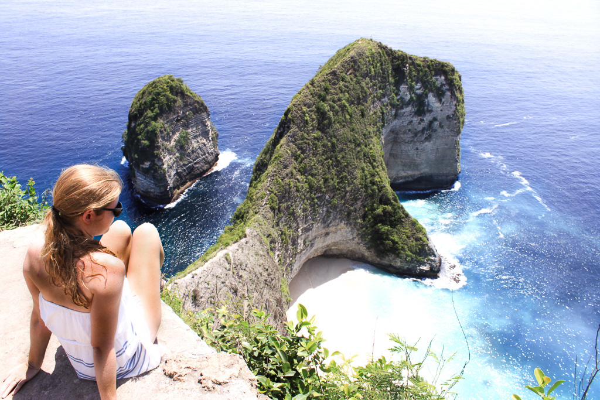

As some of you may know, I ended my corporate job a while ago. It was a job I absolutely disliked. I couldn’t identify with the company’s work ethic and morals regarding the way they treated their employees, neither did I like the work I had to do. Thus, leaving the company was the best decision for me. Naturally, I was really scared and insecure then and wondered if I had made the right decision.

When I was thinking about new job opportunities, something twisted in my stomach. I felt awful just thinking about having to apply and work for companies that a lot of the times don’t even value your work. So I did the only thing that made sense to me back then: I created my own business.

The start definitely wasn’t easy and I had several sleepless nights wondering if I had made the right decision. So maybe you’re asking yourself, why the hell I went that road then.

# Why we started our own business and travel the World

After five years of university, Robin and I started to work in a usual 9 to 5 job right away. We both were eager to build up a career, learn as much as possible, and make a killer salary. However, the enthusiasm quickly faded when we realized that there really wasn’t much more than going to work, weekends, and some holidays.

After a while, we started wondering why we should build somebody else’s dream and live a mediocre life.

A lot of our friends, coworkers and family member would say, that this is just the way it is and that we should get used to it.

But we have never agreed to that.

We wanted to work *for us* and on our own terms. So we thought, why not create something that we are passionate about? And so the idea of freelancing was born.

If you’re now thinking that it was irrational to leave corporate life and start freelancing without any real client base or even a concrete idea of what to do, you might be right. But do we regret it? Hell, no! Was it a risk? Absolutely! But now we have the freedom to work from wherever we want for whomever we want. And that is worth so much!

So, how did we do it? How did we start our full-time online business? Well, here are the exact steps we took.

# We started with an Experiment

We didn’t jump all in as many other digital nomads did. Instead, we wanted to validate that this lifestyle was really what we wanted and that we were able to work from places that are all about sun, beach, and fun. So we sublet our apartment, bought a ticket to Thailand and started exploring the “Remote Revolution”. In two months we visited four countries and had 19 different accommodations. That way, we were able to find out where we liked it best, what provided the best conditions for us as freelancers, and what was actually affordable.

At that time, Robin had not yet quit his job but was actually on holidays (but working on some side-projects, too) while I was working hard to find my first clients. After we came home, though, and saw that working and traveling actually worked, we were determined to continue this lifestyle. Next step: Robin had to quit his job which he did just a few weeks after returning home.

# This time, we really did it: We booked one-way Tickets to Thailand

Without any real plan but with big dreams we bought our ticket to [Chiang Mai, Thailand](https://www.wayfaringsociety.com/why-starting-digital-nomad-chiangmai/). We decided on Chiang Mai because it had an awesome digital nomad spirit, was very cheap and had a lot of beautiful attractions to offer.

Was it naive to go without having a real plan? Maybe. But in the end, who does have a real plan after all?

Again, we sublet our apartment and were even able to save a little money whilst working in paradise. Here’s how freaking low our costs were:

- One-room apartment (with pool and gym): 270 Euro for both of us. I guess this is the perk of traveling as a couple
- Costs for a meal: one to two Euros each
- Groceries (mostly Cookies haha): five Euros a day for the two of us
- Costs for a coffee (not just any coffee, the *best* Cappuccino): one Euro each
- Costs for Uber to the city: 10 Euros per week
- Massage: six Euros for an hour
- Monthly Yoga Flatrate: 75 Euro each

So, in between sipping on Cappuccinos and locating our inner zen, we also found our entrepreneurial spirits. And so our work began.

# Reading, learning, and soaking up everything

Building up a portfolio to show potential clients is serious business. Standing out from the rest of the crowd isn’t easy and requires a lot of Marketing skills. Luckily, I studied communication sciences and worked in the industry before starting my own business so I already knew one thing or another. Plus, as Robin is a developer, he was able to create awesome websites (including this one) as a sort of online business card. It was actually a blessing in the sky that we were able to team up and join forces on what each of could do best.

However, as the marketing industry is changing super quickly, also we had to learn and master some things. So basically, we read a lot, we watched YouTube tutorials, and took online classes.

Here are some of the platforms that we used to learn:

- Udemy
- Coursera
- YouTube

I then discovered my passion for social media and blogging and so among the first things I offered were bundles of blog- and social media posts. And hell was I nervous and insecure about these even though I had already done all of this before at my last job. But I kept going, I continued learning and reading. I am still insecure sometimes. The marketing industry is changing so quickly that it’s almost hard to keep up with everything. But the way I’ve been building up my online business makes me pretty confident that I did a good job marketing it.

# I got myself out there

The hardest part for me was getting myself out there. But of course it’s probably the most important part of all. Because how shall anybody know about your fabulous services if nobody knows who you are? Simply relying on Google won’t get you anywhere, I’m afraid.

That’s why the first thing I did was creating my website. As I said, I was lucky to have Robin by my side who created a gorgeous site. All I had to do was create the content. Apart from the About Me section, that is so important, you need to also provide some work samples.

I know - where should you take work samples if you have never actually worked as a freelancer before? Well, just get creative! If you want to be a copywriter, just write a text that you would offer client X. If you want to be a photographer, I am sure you have tons of photos that you could put on your website. That will show your potential clients what you can do for them.

That brings us to the next question: How is anybody supposed to find your website amongst all the other copywriter, photographer, and virtual assistant websites? The answer: You have to lead them there. But how do you do that?

Being part of Facebook groups for example is an excellent way of getting potential clients to your website. You should be part of as many groups in your niche as possible. Try answering questions, provide value, and then, after some time you can just casually drop your website. I know, it’s an awful lot of work but nobody said it would be easy.

You can also try to get clients via platforms like [Upwork](https://www.upwork.com/) or [Peopleperhour](https://www.peopleperhour.com/). However, most people complain that clients don’t pay very well there and you have to build up some kind of reputation before you can actually start to charge big. When I started my own business, I visited these kind of platforms a lot but quickly realized that it wasn’t for me. I got frustrated with people asking for insanely low prices so I stopped applying for jobs on these platforms all together.

# Work, Work, Work, Work, Work

There is no way around it: the beginning is work, work, work, and work. Apart from working for the few clients you might have, you have to put all you got into looking for new jobs.

My days were usually spent at our local coffee place, the pool, or the yoga studio I was going to. That might sound fancy, and yes it was, but don’t let that fool you. While I was able to take breaks and go for yoga or a quick swim whenever I wanted, I was also working a lot. Back at my corporate job I had a pretty clear time frame which was usually 9 to 6, now I would start earlier and work even longer. It was the best feeling, though, because I was the one making the rules. I decided when to take a break, when to start work and when to finish it. And with a yoga and / or a swim break in the early afternoon, the days didn’t feel that long and they definitely didn’t feel like an all-work-day.

During that time I was able to get three clients to work with me which made a pretty decent start. The work started to pay off.

# We started traveling more

Now that we managed the first stage of creating our online biz, which was staying in Chiang Mai for three months, creating our portfolio, getting ourselves out there, and finding our first clients, we decided that it was time to continue traveling.

One reason why we wanted to become our own boss was our wish to be more flexible, work from wherever we wanted and see the world.

While we still think it is important to stay at one place for a little while to get used to everything and to actually work, we decided that now that we didn’t have to try so hard anymore to get new clients (which saved us so much time!), we could spend that time on traveling more. So now our next stop is gonna be Indonesia.

What is important for us though is to realize that we are not on vacation. We are still working. I know, that’s crazy! You’re at the most beautiful place in the world and actually have to work! However, it is the best feeling ever to be able to jump into the pool or the ocean, rent a scooter and just drive around, or take a relaxing yoga class after a day of work. That feels so much better than returning home late from an unfulfilling corporate job, sitting on the couch and maybe, if you are not too tired, watch a movie.

We are finally able to live our lives according to our own rules and so can you! On this blog I want to provide all the skills you need to have in order to build an awesome business and travel the world!

So, if you are a digital nomad already or want to become one, follow me for insights into this amazing lifestyle. I want to provide you with all the information that are necessary to get started with your online business. Along the way, you will find out about marketing tips to launch your idea and facts to create your personal brand.

I want to share my knowledge with you from zero to location independent. I experience all these things first hand for you, but also want to deliver case studies about our travels and others living this lifestyle as well as insights into my ideas and projects. So follow me on my journey on [Instagram](https://www.instagram.com/i_am_liesa/) or stay updated about the latest Marketing tips and nomad hacks on [Facebook](https://web.facebook.com/iAmLiesa/).

