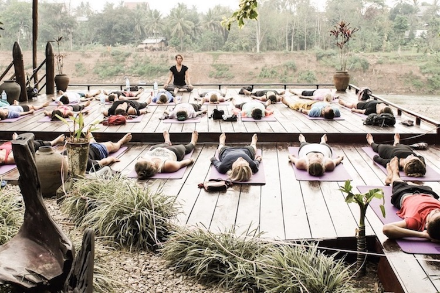
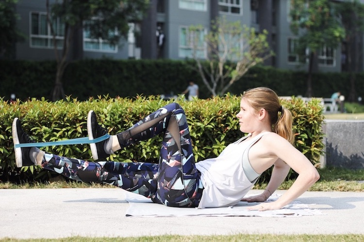
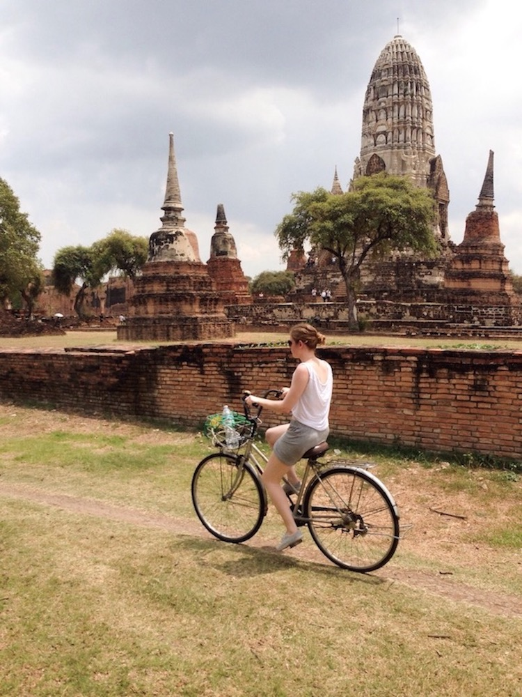
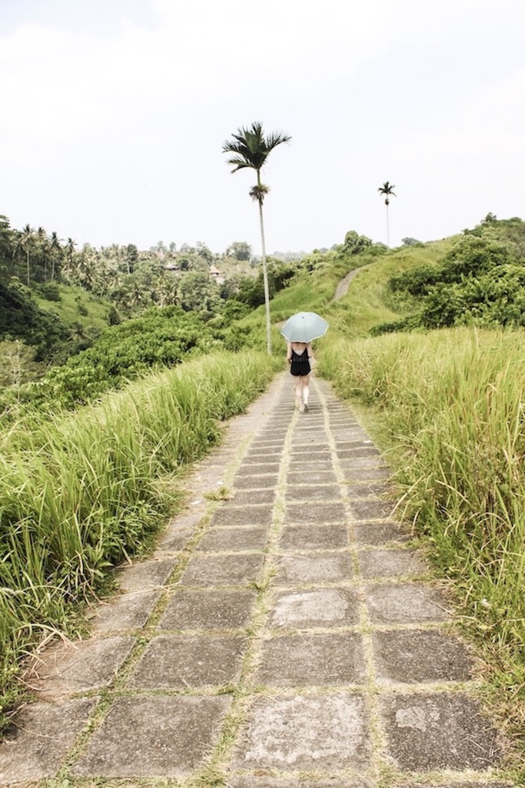
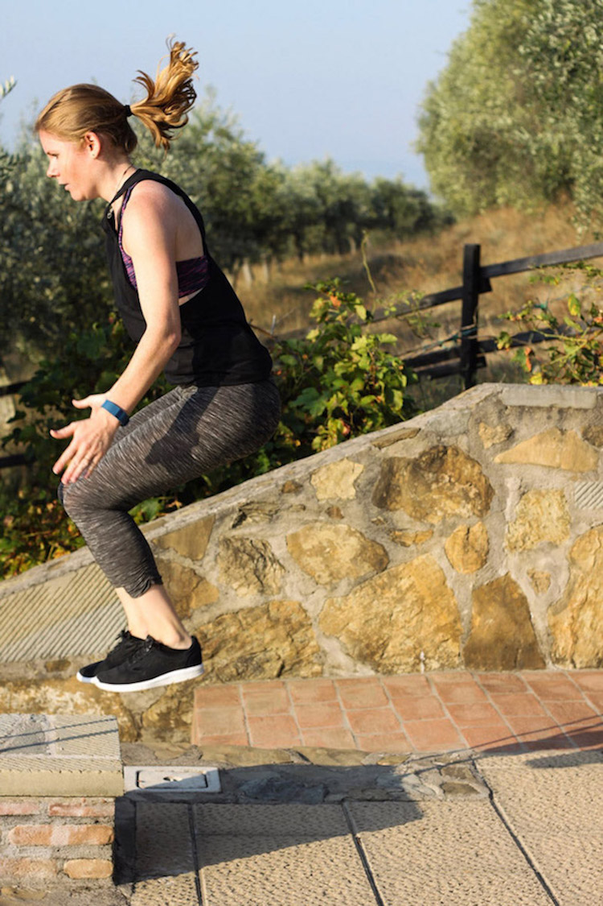

Traveling is great but it is not particularly helpful if you're in a workout routine. Continuing that routine while traveling can be really tough as you usually don't have the equipment and the setting you're used to when working out. Thus, figuring out how to workout while traveling can be difficult. However, traveling is not an excuse for being lazy. You can easily continue working out even if you're on the road. You just have to adapt to your new conditions.

When I traveled through Thailand, Laos, Cambodia, and Bali for eight weeks, I still managed to workout at least three times a week. It wasn't easy especially since I wasn't used to the Asian heat. And of course there were times when I rather wanted to go sun bathing or visiting some local attractions. You definitely need to be disciplined and it won't work without any sort of routine. But once you have established this routine, it will be just like working out at home.

I hope that my 10 tips on working out while traveling will be helpful for you. For me, they have proofed to be very valuable.

# 1. Book an Airbnb or a Hotel with a Gym

Most hotel chains and even some Airbnbs have a gym nowadays. Especially in Thailand, where they have a lot of resorts you can book via airbnb, offer one. Sure you won't find all the equipment you know from your hometown gym, but they have the most necessary machines and equipments such as treadmills and dumbbells.

# 2. Visit local Fitness Classes

Visiting local fitness classes doesn’t only help you to continue your workout routine, it's also a great way to get to know people and to see what classes abroad are like. When I traveled through South East Asia, I visited a lot of local yoga classes and they helped me so much in my personal yoga practice. Although yoga poses are pretty much the same all over the world, the approach to the exercises can be different, as I experienced myself.

# 3. Make Use of Apps or YouTube Videos
Sometimes small hotels don't leave you with a lot of space for your workout. Still there are a lot of videos on YouTube showing you how to workout even in small hotel rooms. And if your room offers a little more space, you can even use some apps that suggest you various workout flows. Here are some of my favorite fitness channels on YouTube:

* [Cat Meffan](https://www.youtube.com/channel/UCVrWHW_xYpDnr3p3OR4KYGw)
* [Boho Beautiful](https://www.youtube.com/user/cexercize)
* [Mike Donavanik](https://www.youtube.com/user/MikeDFitness)
* [Zuzka Light](https://www.youtube.com/user/ZuzkaLight)

# 4. Use convenient Equipment

Of course you won't be able to bring all of your workout equipment on your travel. Still there is some you can easily bring with you. I for example never travel without my jump rope, my tubes, and my rubber band. It's super light weighted and small so you can just squeeze it into any corner of your suitcase.
Even if you don't want to bring any equipment whatsoever, you can easily use a water bottle as a substitute for a dumbbell or use a chair for chair dips to strengthen your arms.

Here are some fitness tools that I never leave at home:

* [Resistance Band](http://amzn.to/2skEVmk)
* [Loop Resistance Band](http://amzn.to/2scy1Aq)
* [Jump Rope](http://amzn.to/2scAf2S)

# 5. Use your own Bodyweight

There are so many great exercises you can do with your bodyweight. Of course everyone knows the classics such as sit-ups, squats, or push-ups, but there are actually so many more. On [Pinterest](https://de.pinterest.com/IamLiesaMaria/fitness-full-body-workouts/) you can find so many complete workouts that will leave you sweating on your hotel floor.

# 6. Explore your Place with a Bike

Exploring a place via bike is a great way to combine working out and sightseeing. You will get everywhere much faster than if you're walking, it's much cheaper than going everywhere by cab or by train, plus it's a lot of fun.

# 7. Do a lot of Walking

If you don't want to explore a place by bike, just opt for walking. Doing a sightseeing tour for a whole day burns tons of calories as you're up on your feet almost the whole time. You might not feel it right away, as you'll probably be distracted by all the new things you'll see, but in the evening you'll surely see that even walking can replace your daily workout and still count as one.

# 8. Squeeze in some Moves now and then

Even if you feel like you don't have the time to continue your workout routine, you still don't have to be lazy and do nothing at all. You can always squeeze in some little moves such as a wall-sit or standing butt pulses while brushing your teeth or waiting in a queue.

# 9. Go to local Meet-Ups

Similar to local fitness classes, going to [meet-ups](https://www.meetup.com) is a great way to get to know people and stay in shape while traveling. The big advantage is that they are much cheaper than classes and some are even for free.

# 10. Create your own outdoor gym

You have so many opportunities to workout outdoors and to create your own little gym. Use a bench for your arm workout and do some arm dips, go jogging, or create your own parkour in the forest.

<Divider />

In order to make exercising a constant, it's important to build up a routine. You won't get anything done if you haven't built up one. Maybe you found your routine at home, but finding it while traveling is a totally different story. Suddenly you don't have access to the gym anymore, you don't have the equipment you're used to, and you're not preparing your own meals anymore. That makes it extremely difficult to set up a workout routine. Still it's possible. People don't only want a routine in their life, they are also very competitive and ambitious once they are hooked to workout. Use that and challenge yourself while you're traveling. Set your goals high especially if you're a long term traveler. There are also so many challenges on Instagram and on the Internet in general. Programs like [Kayla Itsines](https://www.kaylaitsines.com), [Amanda Bisk](http://www.amandabisk.com), or [Tone it Up](https://www.toneitup.com) always feature amazing fitness accomplishments. Try to pull through with those programs while you're traveling. Usually, they don't even need a lot of equipment. That way you will be motivated to keep working out as you have a goal and a workout plan already at hand.

