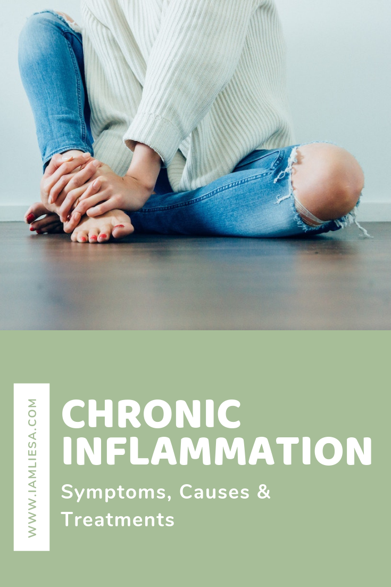
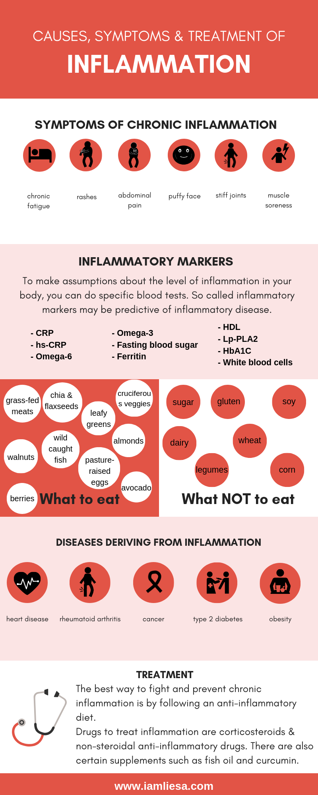

What is inflammation exactly? What are inflammation causes and symptoms of inflammation and what does an inflammation treatment look like? We will go into detail about these questions and more in this article. 

Inflammation affects almost every function of the human body, from gut health to aging to allergies and more. Chronic inflammatory diseases belong to the main causes for death and the World Health Organization (WHO) even ranks it as the greatest threat to human health. Diseases associated with chronic inflammation is anticipated to increase persistently over the next 30 years in the US. In 2000, [125 million Americans were affected by chronic inflammation and 61 millions (21%) had more than just one chronic condition](https://www.ncbi.nlm.nih.gov/books/NBK493173/). Worldwide, 3 out of 5 people die due to chronic inflammatory diseases like stroke, heart disorders or cancer.

At the end of it, you will understand what inflammation is and why it can also be a good thing. You will also be able to identify signs of inflammation and learn which diseases are associated with inflammation. Finally, you will learn what you can do about inflammation because really, inflammation is just too dangerous to be left untreated. Let’s dive into it. 

# What is inflammation?
Inflammation is part of the response of your body tissues to harm, e.g. infection, injuries, toxins, or damaged cells. It is the body’s way of protecting itself by releasing **inflammatory cells** that promote healing of the tissue. 

There are two types of inflammation: **Acute and chronic inflammation**. 
Acute inflammation is the one we would consider as being helpful as it is actually a defense mechanism of your body. It is a short-term inflammatory process and an almost immediate response to damage of tissue. 

This means, acute inflammation aids with wound healing. It aims at removing the injury agent and its purpose is to restore the damaged parts to their natural functions. Therefor acute inflammation is a sign to your immune system to heal and repair damaged tissue and to defend itself against invaders such as viruses and bacteria. 

# Inflammation: symptoms of acute inflammation.
**Common symptoms of acute inflammation are:**

* redness
* heat
* swelling
* pain
* loss of function

Imagine you cut your finger. It will immediately start to bleed. Maybe it aches, gets red and maybe you even go to see a doctor. The symptoms you experience are due to an increase blood flow to the injured part of your body. Your blood vessels dilate and blood flow increases. White blood cells swarm the injured body part to “eat” germs and the dead or damaged cells.

From the white blood cells *cytokines*, small secreted proteins, are released into the blood or affected tissue. They signal your body’s immune cells, hormones and nutrients to fix the problem and to protect your body. This release of chemicals increases the blood flow to the injured part of your body which may result in warmth and redness. Some of the chemicals also cause a **leak of fluid** into the tissue to wall off the damaged area from the healthy tissue to stop it from spreading. This is why the inflamed area appears swollen.

There are also other chemicals that leak into the tissue that are the reason for your pain when you cut your finger. Because of them, the nerve fibres that transmit pain signals can become activated far more easily resulting in pain and aching at the area of damage.

As the body heals though, the acute inflammation gradually subsides.  

# How do you get chronic inflammation? 
Chronic inflammation differs from acute inflammation in that **it does not subside**. You might not even notice that you are inflamed over years or even a lifetime. 

With chronic inflammation the activation and mobilization of inflammatory agents occur for long periods of time. Long-term damage of specific tissue might be the cause for the progression of a certain disease.

With chronic inflammation **symptoms are not obvious** and a serious problem can take years to develop. That is why chronic inflammation was titled “the silent killer” in the news - which is not even an exaggeration. That is because most damage done in the body by chronic inflammation begins at a **cellular level** so that you don’t experience any symptoms. Still, there are signs that your body is inflamed.

# Chronic inflammation: Symptoms.
While acute inflammation often comes with noticeable symptoms, such as pain, redness or swelling, chronic inflammation symptoms are more subtle and as said before not always obvious which makes it harder to diagnose.

**Symptoms of chronic inflammation may be:**
* chronic fatigue
* rashes
* fever
* abdominal pain
* mouth sores
* puffy face
* stiff joints
* muscle soreness
* body pain

These symptoms of inflammation vary in intensity and can last for months or even years without being connected to chronic inflammation. This makes chronic inflammation so dangerous because without being treated it can lead to serious diseases. 

**Other warning signs to look for that may signal inflammation:** 
* high blood pressure
* excess fat around waist
* obesity
* digestive or gut issues
* chronic fatigue
* depression
* allergies
* asthma
* headaches

# Inflammation: Causes are manifold. 
The question of what causes inflammation is a loaded one and the truth is, there are many culprits. Nearly everything around us has the potential to produce some level of inflammation, from the toxins that we are exposed to (there are around 80.000 environmental toxins around us), to chemicals, our diet, air pollutants or tobacco smoke.

Identifying the cause of acute inflammation is quite easy. It occurs when you cut your finger, have a sprained ankle or a sore throat. Its effects are short-term and they are localized, meaning you will feel the effect exactly where the problem is.

Another cause for inflammation is physical trauma such as burns, frostbite, and radiation which can damage tissues and thus bring about inflammation.

With chronic inflammation, causes can be manifold and identifying them is much harder.
Chronic inflammation **develops over time**. You don’t just wake up one morning and are inflamed. It happens when **the agent causing an acute inflammation isn’t eliminated with the help of acute inflammatory mechanisms**. These agents may be infectious organisms such as **fungi, some types of virus, protozoa, Mycobacterium tuberculosis, and other parasites** that are able to resist host defenses and remain in the tissue for a longer period of time. By entering and destroying cells of the body, they give rise to inflammation.  
 
Chronic inflammation is also called *persistent, low-grade inflammation* as it produces a steady, low-level of inflammation throughout the body. That means, even when the initial threat has been eliminated, the inflammation may stay active.

In some cases, even with no apparent injury or disease, low-level inflammation becomes activated. The body then perceives an internal threat even if there really is none. Thus, *white blood cells* are released but don’t have anywhere to go and nothing to do. Eventually, they may **start attacking internal organs or healthy tissue cells**, directly affecting your cellular health.
Being under a lot of pressure, arteries and organs may also break down, leading to other diseases such as cancer or diabetes. 

**Long-term exposure to certain toxins or chemicals** such as acids, alkalis, and oxidizing agents that cannot be eliminated by enzymatic breakdown can be the cause of chronic inflammation, too. This is particularly connected to cases like asthma, allergies and autoimmune diseases. The body sees toxins as foreign invaders that it has to fight off which starts the whole inflammatory response. 
Environmental endocrine-disrupting chemicals (EDC) are hormone-like chemicals found in plastic, sunblocks, lotions and make-up and they lead to a dramatic change in cytokine production.

Furthermore, autoimmune diseases such as arthritis or allergies trigger inflammatory responses. With autoimmune diseases the body is sensitized to the normal component of the body and the body’s immune system **attacks itself and causes damage to its own tissue** thus giving rise to diseases such as rheumatoid arthritis.

*Oxidative stress* and inflammation go hand in hand. They both occur on a cellular level and they both play a role in nearly every disease. 

Oxidative stress occurs due to excessive *reactive oxygen species (ROS)*, or *free radicals*, leading to **cell and tissue damage**. Usually, *antioxidants* are effective in blocking harmful effects of ROS. However, the antioxidant system can sometimes be overwhelmed leading to an imbalance between reactive oxygen species and antioxidants. This is when oxidative stress occurs.

Uncontrolled oxidative stress can also **accelerate the aging process** as it is a result of free radical damage.

Chronic inflammation manifests in many gut-related conditions e.g. *leaky gut syndrome*. Leaky gut is a condition where  molecules like partially-digested food make it through the gut wall. The immune system sees those molecules as invaders and attacks. This then leads to inflammation.
A defective intestinal tight junction barrier, as it is the case in leaky gut, is a major risk factor for *inflammatory bowel disease* and other inflammatory conditions of the gut.

Finally, **recurrent episodes of acute inflammation** may lead to chronic inflammation. Experts also believe that certain lifestyle habits may contribute to chronic inflammation, for example:
* obesity
* smoking
* alcohol
* chronic stress

# Inflammatory diseases: When inflammation causes disease.
The root of every disease is some kind of inflammation. With acute inflammation, the body repairs itself and moves on from whatever caused the inflammation. When the body is not able to remove the agent responsible for the inflammation though, that’s when chronic inflammation happens and eventually disease occurs. That’s why inflammatory markers are so important as they are a decent measurement for the inflammation in your body.

**Several diseases that are caused by inflammation include:**
* heart diseases
* high blood pressure
* metabolic syndrome
* NASH (nonfatty liver disease)
* arthritis
* dementia

If you want to [know more about how these diseases are connected to inflammation, have a read of this article](https://www.iamliesa.com/inflammatory-diseases-inflammation), that explains the connection between them. 

# Inflammation blood test: How to find out if you are inflamed.
Most of the time, we do not realize that our body is inflamed. That’s because a lot of inflammation happens on cellular level. The problem is, chronic inflammation doesn’t just stop and go away on its own. It sticks around and since we don’t know it’s there, we don’t do anything against it. This is particularly dangerous as this type of inflammation may lead to heart diseases, stroke and more illnesses.

But, even though you don’t feel that you’re body is inflamed, the signs of chronic inflammation are there. Your body aches and you feel unspecific pain - that’s the sign.

You can also do blood tests that helps your doctor make an assumption about the level of inflammation in your body. So called inflammatory markers (as mentioned above) may be predictive of inflammatory diseases. 

**Common inflammatory markers include:**

**CRP**: is a protein that is made in your liver and increases with inflammation and a common inflammation marker to look at. Elevated levels may indicate you have chronic inflammation. CRP is also linked with an **increased risk of heart disease**. A CRP concentration of higher than 3.0 mg/L indicates a high risk of heart problems according to the American Heart Association.

**hs-CRP**: This test detects lower levels of the protein in the blood compared to the standard CRP test which measures CRP in a range from 10 to 1000 mg/L. The hs-CRP test measures the protein in a range from 0.5 to 10 mg/L.

**Omega-6 fatty acid (Arachidonic Acid or AA)**: This type of fat that belongs to the family of polyunsaturated fatty acids is a precursor to **pro-inflammatory eicosanoids** (molecules made by enzymatic or non-enzymatic oxidation of arachidonic acid, also called *local hormone* as they act like hormones but don’t like to travel)

**Omega-3 fatty acid (EPA)**: This essential fatty acid generates **anti-inflammatory eicosanoids**. The higher the omega-6 to omega-3 fatty acid ratio in the blood is, the greater the level of silent inflammation in your body and various organs.

**Fasting blood sugar**: Should ideally be below 100.

**Ferritin**: The primary form of iron that is stored in your body’s cells. It is mainly a **leakage product from damaged cells** and therefore an important inflammatory marker. However, it is [not clear whether ferritin reflects inflammation or causes it](https://www.ncbi.nlm.nih.gov/pubmed/24549403). 

**HDL**: The “good” cholesterol. One of its important functions is its **anti-inflammatory properties**. While LDL, the bad cholesterol, promotes atherosclerosis (hardening of the arteries that may cause heart attacks, strokes, and thrombosis), HDL **helps transport excess cholesterol out of the arteries** and can counteract an inflammatory reaction in damaged vessel walls. Ideally your HDL level should be **60 mg/dL or higher**.

**Lp-PLA2**: This is an enzyme that is connected to **inflammation of blood vessels** and may therefore promote atherosclerosis.

**HbA1C**: Glycated hemoglobin - higher levels are associated with inflammation.

**White blood cells**: We’ve learned that white blood cells fight off infection, so you might think an elevated white blood cell count is a good thing. But it is not necessarily. It might also be an indication for chronic inflammation as well as stress, trauma, allergy or certain diseases. 

# Chronic inflammation: Treatment.
Inflammation is a natural part of the healing process so acute inflammation is considered a good thing. It’s only when inflammation becomes chronic that you want to do something about it and look for an inflammation treatment to reduce the risk of long-term damage. 

Some of the options to treat inflammation include:

**Supplements**: There are certain supplements that may help reduce inflammation, such as fish oil (remember, fish is high in anti-inflammatory omega-3 fatty acids), lipoic acid (an antioxidant - helps fight oxidative stress), and curcumin (contains anti-inflammatory properties). 

Certain herbs seem to be able to decrease inflammation. These include:
* ginger
* harpagophytum procumbens (devil’s claw)
* cannabis
* garlic

**Corticosteroids**: such as cortisol are a type of steroid hormone that decrease inflammation by suppressing the immune system. This is especially helpful when it starts attacking healthy tissue as it is the case with autoimmune diseases. However, long-term use may lead to other sort of problems such as high blood pressure or osteoperosis.

**Non-steroidal anti-inflammatory drugs (NSAIDs)**: They reduce pain associated with inflammation. Some over-the-counter NSAIDs include aspirin, ibuprofen and naproxen. They work by counteracting an enzyme that contributes to inflammation which either prevents or reduces pain. 

However, when it comes to drugs to block key inflammatory pathways we have to consider that they don’t get to the root problem. Furthermore, they can also be toxic and cause harmful side effects that even keep you in an inflammatory state and leading to further damage of the tissues in the long run.

# Food and inflammation.
As you might have guessed, your diet plays a major role in inflammation. What you eat sends information to your body so the type of foods that you eat can either turn on good or bad genes. Consuming only hamburger and fries will naturally turn on the bad genes that lead to inflammation whereas eating healthy foods like broccoli will turn on good gene pathways that are anti-cancer and anti-inflammatory.

So which foods should you eat in order to eliminate inflammation? You guessed it: Whole, nutrient-dense and antioxidant rich foods would be your choice here. Foods high in antioxidants fight oxidative stress which in turn eliminates inflammation. Processed foods full of sugar on the other hand promote inflammation. If you want to know more about [what exactly to eat to fight inflammation](https://www.iamliesa.com/inflammation-food), you should read this article.

<Divider />

<NotADoctor />

