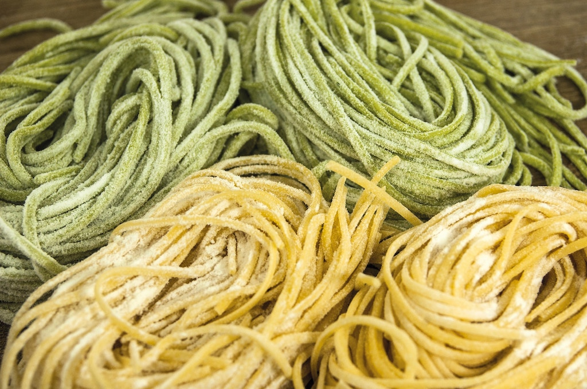
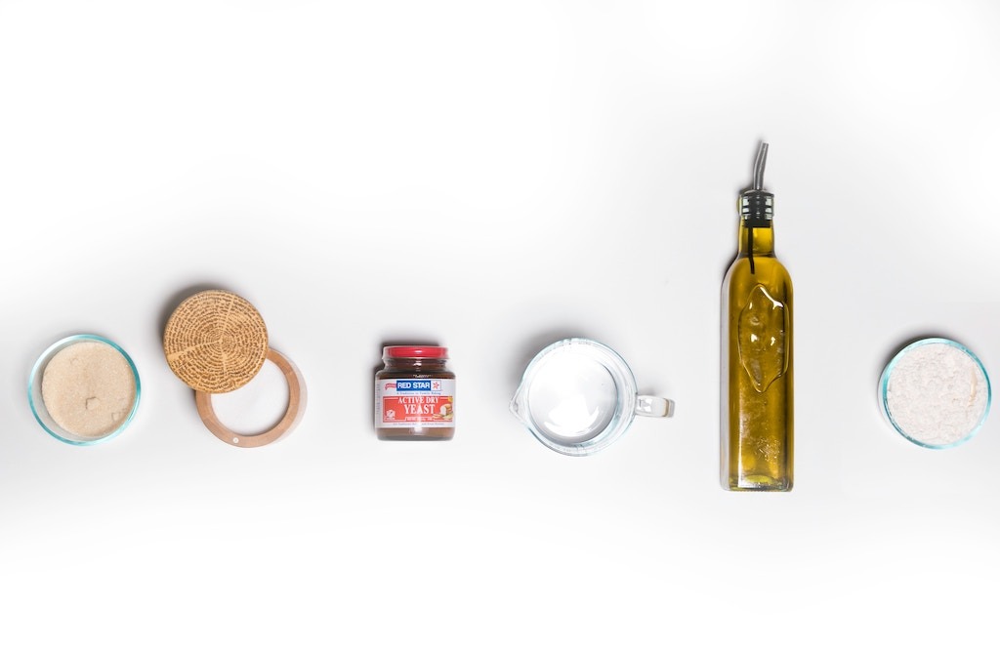

Inflammation is your body's natural response to bacteria, viruses or other pathogens entering your body. It uses inflammation to fight illness and protect it from any harm. Therefore, it's a necessary part of the healing process. However, sometimes the inflammatory response just doesn't stop. That's when acute inflammation becomes chronic inflammation.

One of the best ways to fight and prevent inflammation is by taking a look at your diet. The food we eat can turn on and off inflammatory responses. We've already looked at [foods to eat to fight inflammation](https://www.iamliesa.com/inflammation-food), now let's take a look at what foods to avoid to prevent chronic inflammation from happening.

# Foods to avoid to fight inflammation
**Foods to avoid or limit to decrease chronic inflammation include:**

* gluten 
* wheat
* soy
* corn
* added sugar
* trans fats
* white pasta
* white bread
* processed foods
* processed meats
* sugary drinks

These should not be part of an *oligoantigenic diet*: A diet low in foods that are known to cause immune responses or lead to intolerances.

Apart from the foods listed above, there is another group of foods that might create inflammation for some but not for everybody. It’s the group of *nightshade vegetables*. This is the common name to describe a group of vines, herbs, shrubs, and trees. They are the edible parts  of flowering plants that belong to the *Solanaceae* family. 

**Nightshade vegetables include:**

* tomatoes
* tomatillos
* eggplants
* potatoes
* bell peppers
* pepinos
* pimentos
* sweet and hot peppers

Many people claim that it’s better to avoid nightshade vegetables due to a substance called *alkaloid*. Alkaloids are typically found in the stems of nightshades. They are a natural insect repellent that can be toxic to humans in large amounts. 

Problem is that the edible parts of these plants contain some alkaloids, too. Therefore, extremely sensitive people can’t eat it even when it’s cooked which reduces the alkaloid content by 40 to 50 percent. But it still has damaging effects. For example, it may worsen inflammatory bowel disease as studies found out. [(1,](https://www.ncbi.nlm.nih.gov/pubmed/12479649) [2)](https://www.ncbi.nlm.nih.gov/pubmed/20198430)

Nightshade vegetables also harbor an anti-nutrient called *lectin*, which can activate the immune system and increase inflammation and pain in the body.

[Some evidence](https://pubs.acs.org/doi/abs/10.1021/pr4008199) also suggests that a diet high in carbohydrates, even if it's healthful, may promote inflammation.

# Food that promotes inflammation: The role of vegetable seed oil

At the beginning of the 20th century, the consumption of vegetable seed oil increased dramatically. Most vegetable oils are **high in pro-inflammatory omega-6 while being very low or even nonexistent in omega-3**.

One major culprit of the devastating omega-3/omega-6 ratio is **soybean oil**. Its increased use in the US has decreased the amounts of anti-inflammatory EPA and DHA drastically since it is relatively cheap and prevalent in pretty much every restaurant we eat in and all kinds of processed foods. In fact, soybean oil makes up for [almost 7% of the caloric intake in the US](https://thesoynutritioninstitute.com/soybeans-and-the-u-s-food-supply/) and it is the biggest source of omega-6 fatty acids. One tablespoon of soybean oil provides a whooping 120 calories!

Source: [blendtec](https://www.blendtec.com/blogs/news/dietary-fat-the-good-vs-the-bad)

If you want to know more about fats in the kitchen, have a read of [this article](https://www.iamliesa.com/stocking-healthy-kitchen-fats).

# Sugar in your diet: a major inflammation promoter
In an anti-inflammatory diet you’ll want to decrease your intake of pro-inflammatory foods and step up the intake of anti-inflammatory ones. For so many that means cutting down on sugar as it is a **major culprit in inflammation**. 

The average person consumes about **82 grams** of sugar daily when we should actually not have more than **20 to 40 grams** a day. That’s a huge difference!

Sugar hides everywhere, including the so called “healthy” foods and drinks such as bread, pasta, rice, and potatoes. Also, the “healthier” choice to sugar, like agave or coconut sugar, is really nothing more than a myth. They all basically break down into glucose/fructose with all the negative impact they bring. So don’t be fooled if the food industry lures you with foods without sugar. Always read the labels!

Sugar ramps up inflammation in the body as it releases **large amounts of insulin**, damaging the power plant within your cells, the *mitochondria*. It also puts an enormous toxic burden on your liver as well as the pancreas. 

Generally, lower glucose and insulin levels are considered to be anti-inflammatory, whereas high blood sugar ramps up inflammation. And that’s not all: Sugar is also a potent **immunosuppressant** as it can stun your white blood cells into inactivity for up to 6 hours!

Last but not least, sugar makes us fat by inducing [obesity](https://www.iamliesa.com/inflammation-obesity) triggered by inflammation. More fat cells will lead to more inflammation which leads to more fat. Do you see the vicious cycle here?

Apart from sugar, you should stay away from foods that are **highly processed** as well as **white flour foods** and **low-nutrient packaged foods**. The best advice is really to read the labels to know what’s hiding in your food. Don’t assume anything is healthy. The food industry does an excellent job in fooling us to believe that things are healthy when they are not. 

Also, *trans fats* and *hydrogenated oils* should be avoided at all cost. If you read “partially hydrogenated” on a label, stay clear of it. This only increases a product’s shelf life while shortening your HDL levels (your good cholesterol). It's also shown to increase levels of the inflammatory marker CRP. 

# Foods that may or may not trigger an inflammatory response

There are foods that we definitely know should be avoided in order to prevent inflammation from happening in the body. However, there are also foods that not even scientists are able to put in a box of either inflammation promoting or inflammation fighting foods. Thus, maybe it would be a good idea to not have these foods on a daily basis.

**Dairy**: Scientists are **not enterily sure about the inflammatory effects of dairy**. 
While [some evidence](https://www.arthritis.org/living-with-arthritis/arthritis-diet/healthy-eating/dairy-and-inflammation.php) shows that eating dairy foods increased low-grade inflammation, a [2017 review of 52 clinical trials](https://www.ncbi.nlm.nih.gov/pubmed/26287637) suggested that dairy products appear to have a weak, yet statistically significant anti-inflammatory effect in the body.

So what does that mean? It means that unless you have a milk allergy or are lactose intolerant you probably shouldn't avoid dairy products all together. After all, they still bring a lot of other important nutrients to the table. 

**Legumes**: Legumes are generally healthy. They are a great source of fiber, contain tons of important nutrients and have been shown to help prevent diseases like heart disease and control blood sugar. Still, there are some people claiming that legumes are pro-inflammatory foods. Why is that?

There are several reasons why legumes can be problematic for our bodies. They are generally hard to digest and have the potential to feed the bad bacteria in our stomachs. They also contain a type of protein called *lectin*. The problem with lectins is, that they can bind to the intestinal walls, making it more permeable and triggering *leaky gut*, which in turn promotes inflammation all over the body.

Luckily, there is something you can do to reduce the levels of lectins in your legumes. One option is to sprout it. This doesn't only reduce the amount of lectins in the legumes, it also increases your body's ability to absorb their nutrients.

**Eggs**: Eggs contain a variety of bioactive compounds that can influence pro- and anti-inflammatory pathways. [Research suggests](https://www.ncbi.nlm.nih.gov/pmc/articles/PMC4586567/) that eggs have a pro-inflammatory response on healthy adults, whereas the effect is either anti-inflammatory or neutral in conditions of overweight, insuline resistance, metabolic syndrome, and type 2 diabetes.

Also, eggs are high in pro-inflammatory omega-6 fatty acids, partly because chickens are mostly fed a diet high in corn and soy rather than grass and seeds. Still, researchers suggest that further research into the role of egg intake on immunity is necessary.

<NotADoctor />
