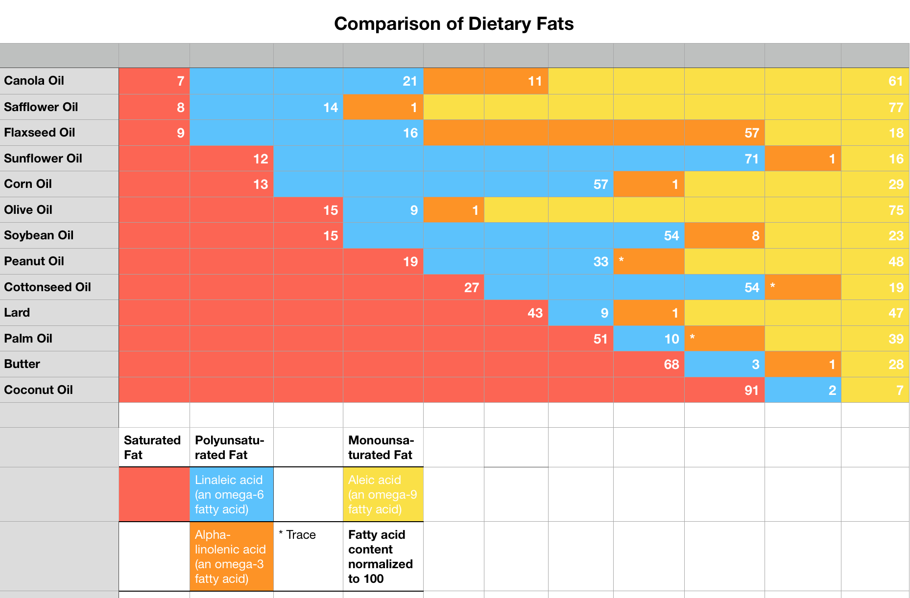
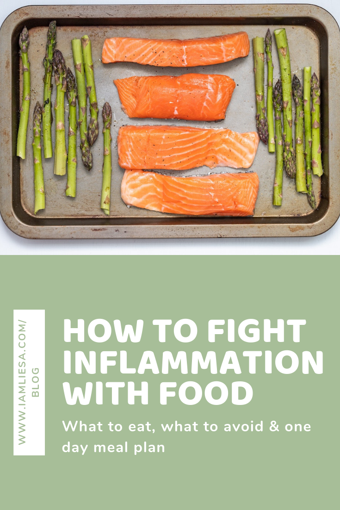

As you might have guessed, your diet plays a major role in inflammation. What you eat sends information to your body so the type of foods that you eat can either **turn on good or bad genes**. Consuming only hamburger and fries will naturally turn on the bad genes that lead to inflammation whereas eating healthy foods like broccoli will turn on good gene pathways that are anti-cancer and anti-inflammatory.

So which foods should you eat in order to eliminate inflammation? You guessed it: **Whole, nutrient-dense and antioxidant rich foods** would be your choice here. Foods high in antioxidants fight oxidative stress which in turn eliminates inflammation. Processed foods full of sugar on the other hand promote inflammation.
 
# Inflammation and essential fatty acids ratio.
As you know by now, what you eat can turn on an inflammatory reaction. Sugary and vegetable oil rich foods and even gluten ramp up inflammation while other foods create anti-inflammatory benefits. Ideally, your body should be able to turn inflammation on and off as needed. You really don’t want inflammation to doze silently in your body, being undiagnosed and wreaking havoc in your body. 

The key to fighting inflammation with food is having the **right ratio of omega-3 and omega-6 fatty acids**. 

Research has shown that [omega-3 fatty acids decrease the production of inflammatory mediators](https://www.ncbi.nlm.nih.gov/pubmed/26745681). As we have learned, this has a positive effect in diseases such as type 2 diabetes and obesity and lowers the risk for cardiovascular events.

One way to increase the intake of omega-3 fatty acids is supplementing with **fish oil**. This is indeed [known to inhibit inflammatory cytokines such as TNF-alpha and IL-1 and pro-inflammatory eicosanoids such as thromboxane-2 and prostaglandin E](https://www.ncbi.nlm.nih.gov/pmc/articles/PMC6269634/).

On the other hand, foods high in *arachidonic acid* such as egg yolk or corn and corn-fed beef should not be part of an anti-inflammatory diet. Arachidonic acid is a compound used in metabolic pathways that **promotes inflammation**. It’s a source of omega-6 fatty acids that provide the body with messenger molecules involved in the inflammatory process. 

[Research has shown](https://www.ncbi.nlm.nih.gov/pmc/articles/PMC6269634/) that the **consumption of seed oils high in omega-6 fatty acids** does not only contribute to **low-grade inflammation** but also to *oxidative stress*, *endothelial dysfunction* and *atherosclerosis*, conditions that [as we know are all related to an inflammatory state of the body link to my article]. 

One study with mice that were fed different diets varying the omega-3/omega-6 ratio also showed that the ones that were fed a diet with the lowest omega-6/3 ratio had [the lowest triglyceride and low-density lipoprotein (LDL - the “bad” cholesterol) levels and the highest high-density lipoprotein (HDL - the “good” cholesterol) levels](https://www.ncbi.nlm.nih.gov/pmc/articles/PMC6269634/).  

## The historical omega-3 to omega-6 fatty acids ratio.
Research suggest that our hunter-gatherer ancestors had about a [1:1 ratio of omega-6 and omega-3 fatty acids](http://www.ajcn.org/cgi/content/full/71/1/179S?ijkey=5c7af875f3dc71a303f7df78c52145e8b7c31643) and they all lived **relatively free from inflammatory diseases** like cancer, diabetes or cardiovascular disease. They had seafood and other food sources rich in omega-3s in abundance and their diet was relatively low in omega-6 seed oils. 

Then, the intake of omega-6 fatty acids increased due to the** advent of the modern vegetable oil industry** and the **increased use of cereal grains**. This lead to a shift in the omega-3/omega-6 ratio which is now estimated to be anywhere between **10:1 to 25:1** in some individuals.

# One major culprit: vegetable seed oil.
At the beginning of the 20th century, the consumption of vegetable seed oil increased dramatically. Most vegetable oils are **high in omega-6 while being very low or even nonexistent in omega-3**.

One major culprit of the devastating omega-3/omega-6 ratio is **soybean oil**. Its increased use in the US has decreased the amounts of anti-inflammatory EPA and DHA drastically since it is relatively cheap and prevalent in pretty much every restaurant we eat in and all kinds of processed foods. In fact, soybean oil makes up for [almost 7% of the caloric intake in the US](https://thesoynutritioninstitute.com/soybeans-and-the-u-s-food-supply/) and it is the biggest source of omega-6 fatty acids. One tablespoon of soybean oil provides a whooping 120 calories!

Source: [blendtec](https://www.blendtec.com/blogs/news/dietary-fat-the-good-vs-the-bad)

If you want to know more about fats in the kitchen, have a read of [this article](https://www.iamliesa.com/stocking-healthy-kitchen-fats).

# The sweet enemy: Sugar.
In an anti-inflammatory diet you’ll want to decrease your intake of pro-inflammatory foods and step up the intake of anti-inflammatory ones. For so many that means cutting down on sugar as it is a **major culprit in inflammation**. 

The average person consumes about **82 grams** of sugar daily when we should actually not have more than **20 to 40 grams** a day. That’s a huge difference!

Sugar hides everywhere, including the so called “healthy” foods and drinks such as bread, pasta, rice, and potatoes. Also, the “healthier” choice to sugar, like agave or coconut sugar, is really nothing more than a myth. They all basically break down into glucose/fructose with all the negative impact they bring. So don’t be fooled if the food industry lures you with foods without sugar. Always read the labels!

Sugar ramps up inflammation in the body as it releases **large amounts of insulin**, damaging the power plant within your cells, the *mitochondria*. It also puts an enormous toxic burden on your liver as well as the pancreas. 

Generally, lower glucose and insulin levels are considered to be anti-inflammatory, whereas high blood sugar ramps up inflammation. And that’s not all: Sugar is also a potent **immunosuppressant** as it can stun your white blood cells into inactivity for up to 6 hours!

Last but not least, sugar makes us fat by inducing [obesity](https://www.iamliesa.com/inflammation-obesity) triggered by inflammation. More fat cells will lead to more inflammation which leads to more fat. Do you see the vicious cycle here?

Besides from sugar, you should stay away from foods that are **highly processed** as well as **white flour foods** and **low-nutrient packaged foods**. The best advice is really to read the labels to know what’s hiding in your food. Don’t assume anything is healthy. The food industry does an excellent job in fooling us to believe that things are healthy when they are not. 

Also, *trans fats* and *hydrogenated oils* should be avoided at all cost. If you read “partially hydrogenated” on a label, stay clear of it. This only increases a product’s shelf life while shortening yours.

# Foods to avoid to fight inflammation.
**Foods to avoid to decrease chronic inflammation include:**

* gluten
* dairy
* wheat
* soy
* corn
* legumes
* added sugar

These should not be part of an *oligoantigenic diet*: A diet low in foods that are known to cause immune responses or lead to intolerances.

Apart from the foods listed above, there is another group of foods that might create inflammation for some but not for everybody. It’s the group of *nightshade vegetables*. This is the common name to describe a group of vines, herbs, shrubs, and trees. They are the edible parts  of flowering plants that belong to the *Solanaceae* family. 

**Nightshade vegetables include:**

* tomatoes
* tomatillos
* eggplants
* potatoes
* bell peppers
* pepinos
* pimentos
* sweet and hot peppers

Many people claim that it’s better to avoid nightshade vegetables due to a substance called *alkaloid*. Alkaloids are typically found in the stems of nightshades. They are a natural insect repellent that can be toxic to humans in large amounts. 

Problem is that the edible parts of these plants contain some alkaloids, too. Therefore, extremely sensitive people can’t eat it even when it’s cooked which reduces the alkaloid content by 40 to 50 percent. But it still has damaging effects. For example, it may worsen inflammatory bowel disease as studies found out. [(1,](https://www.ncbi.nlm.nih.gov/pubmed/12479649) [2)](https://www.ncbi.nlm.nih.gov/pubmed/20198430)

Nightshade vegetables also harbor an anti-nutrient called *lectin*, which can activate the immune system and increase inflammation and pain in the body.

# Foods that prevent or decrease inflammation.
Now that you know which foods to avoid to decrease inflammation, let’s talk about foods to fight chronic inflammation.

As we’ve already covered, there are two flavors of essential fatty acids:

* Omega-6, which provides your body with messenger molecules involved in the **pro-inflammatory response**

* Omega-3, which triggers **anti-inflammatory** messenger molecules.

The goal is to improve the omega-3 to omega-6 ratio in favor of omega-3 to get it as close to the ratio our hunter-gatherer ancestors had. Therefore, an anti-inflammatory diet should always include foods that are high in omega-3 fatty acids such as: 

* wild caught fish
* grass-fed meats
* pasture-raised eggs
* free range chicken and turkey
* freshly ground flax and chia seeds
* almonds
* walnuts
* berries
* avocados
* leafy greens
* cruciferous vegetables

## The 8 best foods to decrease inflammation.
We have covered food groups to avoid and those to get more from. Now let’s get into the specifics of foods to eat to fight inflammation. This is just a small selection. There are so many more foods that help decrease chronic inflammation, but we have to start somewhere, right?

There really is no anti-inflammatory meal plan that doesn’t include wild-caught salmon. **“Wild-caught”** is the important part here as it really differs from farm-raised salmon in that farm-raised contains less omega-3 and may even be harmful to your health due to antibiotics used to treat bacteria. 

* Wild-caught salmon contains an anti-inflammatory antioxidant called *Astaxanthin*, a carotenoid resulting from its natural diet that gives wild salmon its bold, pink color. 

* Another anti-inflammatory staple is **extra-virgin olive oil**. It is high in antioxidant compounds like *phenols*. It also contains a polyphenol called *oleocanthal* that does not only have antioxidant compounds but also anti-inflammatory ones similar to ibuprofen. [(3)](https://www.aceitedelasvaldesas.com/en/faq/propiedades-composicion-aceite-oliva/oleocanthal/)

* Another amazing source of the omega-3 fatty acid alpha linolenic acid is **flaxseed**. It is loaded with fiber, protein, and nutrients and helps improve the omega-3 to omega-6 ratio.
When eating it, remember that flaxseed can’t be eaten whole, it needs to be grounded to be properly absorbed. Add it to your joghurt or your smoothie for an anti-inflammatory boost. 

* **Red cabbage** is a great source of *anthocyanins*, a powerful free radical fighting antioxidant and anti-inflammatory flavonoid. Anthocyanins are the pigments that give red cabbage and other red, purple and blue plants their color.

* **Onions** are another inflammation fighter that is sulfur-rich and packed with *quercetin*, an amazing anti-inflammatory compound.

* **Spinach** is nutrient-rich, packed with antioxidants and contains plenty of anti-inflammatory compounds like *coricidin* as well as body-cleansing *chlorophyll*. It also contains iron, vitamin K and folate.

* **Strawberries** - but really any berries are amazing inflammation fighter. Strawberries are not only delicious, juicy and sweet, but also rich in **antioxidants and anti-inflammatory phenols** like *anthocyanins* and *ellagitannins*.

* **Broccoli** belongs to the cruciferous family of vegetables and is high in phytochemicals called glucosinolates which are powerful antioxidants. It is also rich in sulforaphane, an antioxidant that fights inflammation by **reducing your levels of cytokines**. [(4)](https://www.ncbi.nlm.nih.gov/pubmed/21129940)

## Spices to fight inflammation.
To get even more anti-inflammatory rewards from your food, bring in spices to your cooking. They’ll add flavor to your meals and improve antioxidant function. 

There are many different herbs and spices that can help decrease or prevent inflammation in your body. Here is a small list of my favorites:

* **Ginger**: with its *gingerols*, *shogaols*, *gingerdiones*, and *zingerone*, ginger provides a **powerful antioxidant boost**. Additionally, zingerone and shogaol help fight inflammation. [(5)](https://www.ncbi.nlm.nih.gov/pubmed/26228533) Other medical properties of ginger include the alleviation of nausea, arthritis and pain.

* **Turmeric**: Turmeric is one of the most famous anti-inflammatory spices thanks mainly to its active ingredient known as *curcuminoid*, the most active and most beneficial one to health being *curcumin*. 
Curcumin is known for its antioxidant benefits as well as its anti-inflammatory and anti-tumor effects. [(6)](https://www.ncbi.nlm.nih.gov/pmc/articles/PMC3918523/)
In order to absorb the curcumin, you need to pair it with black pepper.

* **Garlic**: Garlic contains *diallyl disulfide*, a compound that limits the effects of pro-inflammatory cytokines. [(7)](https://www.arthritis.org/living-with-arthritis/arthritis-diet/best-foods-for-arthritis/best-spices-for-arthritis.php)

## Nutrients and supplements to fight inflammation.
Before we talk about supplements to fight inflammation, let’s make one thing clear: Food always comes first. Supplements don’t replace a healthy diet and they won’t get you very far if you don’t put in the work of eating well. However, if you combine anti-inflammatory foods with the right supplements, you can get impressive health results. Let’s talk about supplements to combine with your diet.

* **Fish oil**: If you can’t afford or don’t like to regularly eat wild-caught fish, fish oil is a great addition to your healthy diet. You should aim for a **minimum of 2 grams combined EPA/DHA daily**. Therefore read the label to find out how much EPA and DHA one serving contains. Quality brands also contain tocopherols or other antioxidants to preserve the fish oil.

* **Curcumin**: We have talked already about turmeric and its anti-inflammatory benefits, but to get therapeutic amounts of this powerful compound, you’ll want to take a supplement. Look for those containing **soy or sunflower lecithin** to increase absorption. 
Curcuminoids are **fat-soluble** and therefore hard for your body to absorb. That’s why turmeric as supplement is not going to be very effective on its own. Add a **fat-soluble compound** to enhance the absorption, e.g. coconut or almond milk. Aim for at least **500 mg twice a day** to get the best anti-inflammatory results.

* **Resveratrol**: Resveratrol belongs to the group of *polyphenyl*, found in colorful plants like grapes as well as red wine and chocolate. They’re thought to act like antioxidants, protecting the body from damage to the cells. To get therapeutic amounts, you should take a supplement. Look for one with **at least 50% trans resveratrol**. 

* **Holy basil (tulsi)**: The effects of holy basil are greatly researched. Studies show that holy basil **may protect organs and tissues against chemical stress from pollutants and heavy metals**. It’s also shown to **normalize blood sugar, blood pressure, and lipid levels**. Its anti-inflammatory effects is associated with its *eugenol* and *linoleic acid* compounds. [(8)](https://www.ncbi.nlm.nih.gov/pmc/articles/PMC4296439/) Aim for **at least 500 mg twice a day**.

# Top 3 favorite anti-inflammatory recipes.
There are a ton of healthy, anti-inflammatory recipes out there. Wild salmon, grass-fed meat and the variety of veggies give us so many options to choose from. Just play around a little with different spices and herbs, veggies and your favorite omega-3 source and you’ll see how easy it is to follow an anti-inflammatory diet. Here is what one day in my diet looks like.

**Breakfast**

My go-to breakfast is chia pudding with berries and walnuts. Berries are powerful inflammation fighters as discussed above. They are rich in **antioxidants and anti-inflammatory phenols** like *anthocyanins* and *ellagitannins*. Walnuts are a great source for omega-3 fatty acids. 

**Ingredients:**
* ½ cup almond milk
* 2 tablespoons chia seeds
* ½ cup fresh berries
* one small hand of walnuts

Stir almond milk and chia seeds together in a bowl. Cover it and put it in the fridge. The consistency you want your pudding to have dictates the time it has to stay in the fridge. I like mine to still be a little liquid and not too solid, so I only put it away for half an hour. You can wait up to 8 hours if you want your pudding to have a real solid consistency. 

When ready, stir it again and spoon around half the pudding into a glass. Top it with the berries and some walnuts, then add the rest of the ingredients. 

**Lunch** 

I love a healthy salad for lunch. The curried tuna salad avocado boats are super easy to make, look very fancy and are very yum. Another perk: I don’t feel like I have to go to bed after eating as they are not too heavy on the stomach.

**Ingredients**:
* 4 tablespoons extra-virgin olive oil
* 4 tablespoons apple cider vinegar
* 1 tablespoon curry powder
* ¼ teaspoon salt
* 1 medium pinch ground cinnamon
* ¼ cup finely diced carrots
* 4 teaspoons chopped toasted cashews
* 2 teaspoons roughly chopped raisins
* 1 tablespoon red onion
* 1 medium avocado, sliced in half and seed removed
* 2 teaspoons chopped parsley 
* around 1 lbs. fresh albacore tuna steak

1. First, drizzle the tuna steak with olive oil and sprinkle with salt and pepper, then sear the tuna steaks for 1 to 2 minutes each side over high heat. Then let it cool off. 

2. In a bowl, whisk together the extra-virgin olive oil, vinegar, curry powder, cinnamon and salt.

3. Cut the tuna in pieces and add it in the bowl to coat. 

4. Add the carrot, cashews, raisins, onion and parsley and stir it all well.

5. Scoop half of the mixture into each half of the avocado. When eating, enjoy a little bit of the avocado with each bite. 

**Dinner**: 

Another staple of mine: the salad with salmon and creamy garlic dressing. Kale forms the base of this salad but you can also replace it with spinach if you’re not a fan of kale. 

**Ingredients**:
* 1 pound salmon fillet					
* ½ cup diced walnuts						
* 2 cups finely diced carrots				
* 8 cups chopped curly kale				
* 2 cups chopped broccoli					
* 2 cups chopped red cabbage

**For the dressing**
* about ¼ cup extra-virgin olive oil
* 1 tablespoon ginger, finely chopped
* 1 clove of garlic, minced	
* 1 teaspoon ground turmeric	
* drizzle of honey		
* juice of lemon
* salt and pepper to taste

1. Broil the salmon fillet skin-side down in the oven for about 8 to 12 minutes until the salmon is opaque in the center. Then cut it into 4 portions.

2. Meanwhile, whisk the extra-virgin olive oil with all the other ingredients in a bowl.

3. Then combine kale, broccoli, cabbage, carrots and walnuts in a larger bowl and drizzle with the sauce and toss to coat. But don’t use all of the dressing just yet. Divide the salad among 4 plates and top each of them with a piece of salmon. Then top it with the remaining dressing. 

<Divider />

<NotADoctor />

