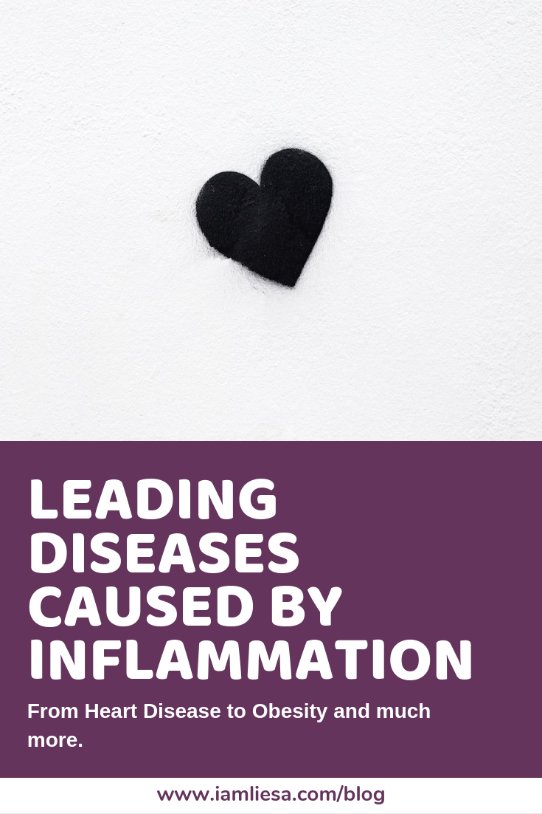
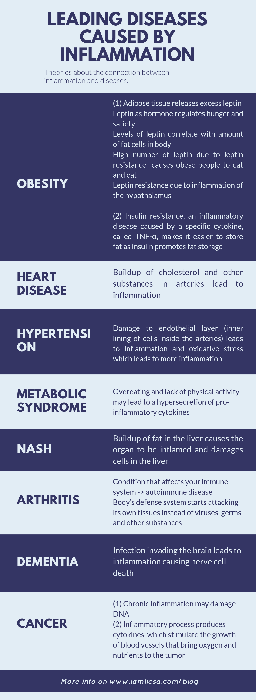

At the core of every disease lies some kind of inflammation. With acute inflammation the body repairs itself and simply moves on from whatever caused the inflammation. With chronic disease it’s not that simple. In the case of chronic inflammation the body is not able to remove the inflammatory agent and that’s when the inflammation becomes chronic and eventually disease occurs. 

Chronic disease are among the top killers in the world, accounting for approximately 60% of all deaths. That’s why getting your blood tested is important as your blood can show important [inflammatory markers](https://www.iamliesa.com/inflammation-cause-definition-treatment-symptoms) that are a good measurement of inflammation in your body.

In this article we want to take a closer look at leading diseases caused by inflammation and at the aspects of inflammation involved in these diseases. Let’s dive into it.
 
# Obesity - an inflammatory disease?
You may be wondering why obesity is in the list of inflammatory diseases as a lot of people don’t know that there is indeed a [connection between the two](https://www.iamliesa.com/inflammation-obesity).

Obesity is an inflammation-induced disease with many cellular and molecular mechanisms at play. It creates chronic, low-grade inflammation, often referred to as metaflammation. In short, macrophages, a type of white blood cell in your body’s adipose tissues and other cells are responsible for the majority of pro-inflammatory cytokine production such as IL-1, IL-6, IL-8, TNF-Alpha, CRP, leptin and resistin, among other. 

The problem with fat is that **it keeps you fat** by causing other inflammatory diseases such as insulin or leptin resistance. These make it easier to put on more weight which will lead to more inflammation. And so the vicious cycle begins. 

What you can do about it? For one, losing weight helps fighting inflammation which again helps to lose more weight. However, you should also address the inflammation in your body as it is part of this vicious cycle. An anti-inflammatory diet can help you fight both issues - weight gain and inflammation.

# Heart disease and inflammation.
You already know that high cholesterol or blood pressure as well as other lifestyle factors are major risk factors for heart diseases. But studies show that inflammation plays a huge role when it comes to heart diseases, too. People even speculate that inflammation and not cholesterol is the real reason why they are still the top killer today. 

Although it is not proven that inflammation is the real culprit to cardiovascular disease, we know that chronic, low-grade inflammation is connected to all stages of atherosclerosis which underlies heart diseases as well as stroke. 

When cholesterol and other substances build up in your arteries (this is called plaques or atherosclerosis), this is when an inflammatory response can set off [1](https://www.hopkinsmedicine.org/health/wellness-and-prevention/fight-inflammation-to-help-prevent-heart-disease). This results in **continuous damage and growth of these plaques**. Inflammation may also trigger *blood clots*, which are the primary cause of heart attacks and strokes.

So what can you do against it? Lifestyle modifications like a healthy diet consisting of fruit, vegetables and whole grains, low in added sugars, salt and saturated fats and an active lifestyle are the foundation for preventing cardiovascular diseases. 

# High blood pressure and inflammation.
Blood pressure is **the force by which your blood exerts against the walls of your blood vessels**. It is [determined by the amount of blood your heart pumps and by the amount of resistance to blood flow in your arteries](https://www.mayoclinic.org/diseases-conditions/high-blood-pressure/symptoms-causes/syc-20373410).

With high blood pressure, also called *hypertension*, your heart pumps a lot of blood while your arteries are narrow. Generally, the more blood you heart pumps and the narrower your arteries are, the higher the blood pressure. 

It appears that hypertension is strongly connected to **endothelial dysfunction**. Your arteries consist of the so called endothelial layer (endothelium) which is the inner lining of cells inside the arteries. It has several important functions. One is the **regulation of the blood pressure by either contracting or relaxing** the smooth muscle in the wall of the artery. A damage that impairs this function is called **endothelial dysfunction** and it will lead to inflammation and oxidative stress. Endothelial dysfunction is also one of the main causes for atherosclerosis, where plaque accumulates inside of the arterial walls. This may eventually lead to heart diseases or stroke. 

High blood pressure and inflammation are directly linked as inflammation clogs up the arterial walls and prevents optimal blood flow. An inflammatory marker that can predict inflammation levels in your body and [plays a direct role in promoting vascular inflammation, vessel damage and CVD events, is CRP - the C-reactive protein. A high CRP level means there is a higher risk for CVD events](https://www.ncbi.nlm.nih.gov/pmc/articles/PMC3945266/).  

# Metabolic syndrome.
Metabolic syndrome is not just one condition, it is a **cluster of conditions** that appear together. These conditions **increase the risk of heart disease, type 2 diabetes, and stroke**. Some of these conditions are **high blood sugar, excess body fat especially around the waist, high blood pressure, insulin resistance as well as abnormal cholesterol or triglyceride levels** [2](https://www.mayoclinic.org/diseases-conditions/metabolic-syndrome/symptoms-causes/syc-20351916).

Having just one of these conditions doesn’t mean that you have the metabolic syndrome. However, it means that your risk for a serious disease is higher. The presence of metabolic syndrome then is highly prognostic of future cardiovascular events.

Chronic inflammation is considered to be a trigger factor for the origin of metabolic syndrome and diabetes, as the metabolic syndrome is actually its precursor. Overeating or a lack of physical activity may lead to a hypersecretion of pro-inflammatory cytokines and eventually lead to *insulin resistance* and *diabetes*. The insulin resistance also causes an increase in these cytokines which again leads to chronic, low-level inflammation forming a vicious cycle [3](https://www.ncbi.nlm.nih.gov/pubmed/15673055). 

So what exactly is insulin resistance? Let’s first look at insulin. Insulin is a [**hormone produced in the pancreas**](https://www.iamliesa.com/achieving-hormonal-balance). Your body needs energy to live and it gets that in the form of *glucose* from the food that you eat. Insulin is responsible for allowing glucose in the blood to enter your cells, reducing blood sugar and provide the cells with the energy needed.

Sometimes, however, the cells **stop responding correctly to insulin**, a phenomenon called insulin resistance. The pancreas then produces even more insulin to lower blood sugar levels which leads to high insulin levels in the blood. Over time, the cells may become increasingly resistant to insulin, resulting in both the rise of insulin and glucose. This condition is very dangerous as it can lead to obesity and eventually heart disease and diabetes. 

# NASH - nonalcoholic fatty liver disease.
NASH, or *nonalcoholic fatty liver disease* is another disease deriving from inflammation, **inflammation of the liver cells** to be exact. In fact, it is one of the main causes of fatty liver and can lead to fibrosis and cirrhosis (scarring of the liver). In the US, it is one of the main reasons for liver transplants. 

NASH is the advanced form of NAFLD which is caused by a buildup of fat in the liver. It is closely allied to [pre-diabetes and metabolic syndrome](https://www.ncbi.nlm.nih.gov/pmc/articles/PMC3343154/) - yet another inflammatory disease. Once NAFLD causes damage and inflammation, this is when NASH occurs.

NASH is directly related to elevated levels of CRP - you remember, the marker for inflammation in your body. 

One cause for the rise of fatty liver is the increased use of added fructose as for example found in high-fructose corn syrup and even in breads. 

# Other diseases caused by inflammation.
This is just a short overview over diseases that are connected to inflammation. Unfortunately, the list could go on and on. 

Other diseases connected to inflammation include:

* arthritis (an autoimmune disease where your body attacks your own tissue)
* dementia (caused by an infection invading the brain causing nerve cell death)
* cancer (damage of DNA by chronic inflammation)

The question that we always have to ask though is, whether inflammation is the cause or the result of a certain disease. In many cases this is not entirely clear. 

<Divider />

<NotADoctor />

