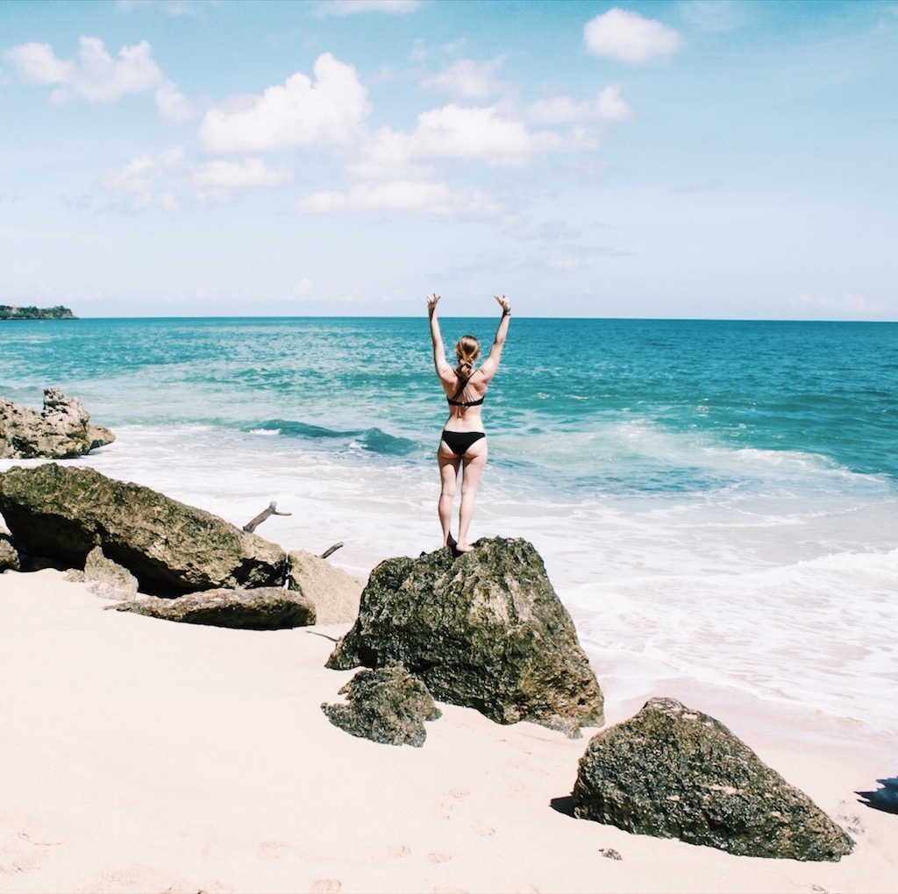
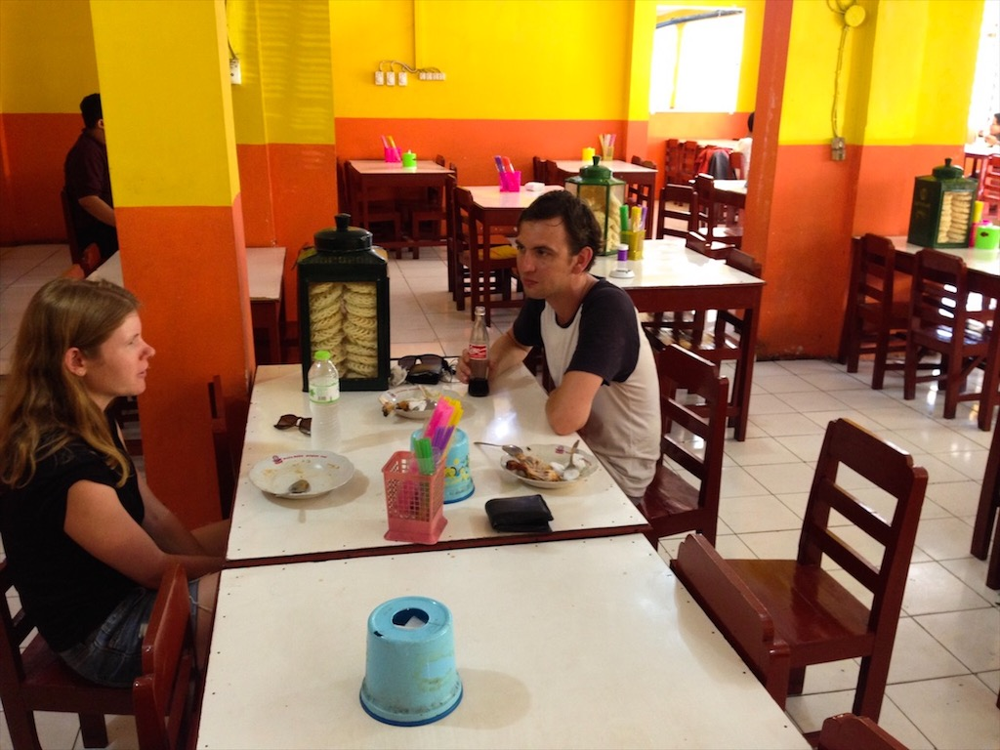
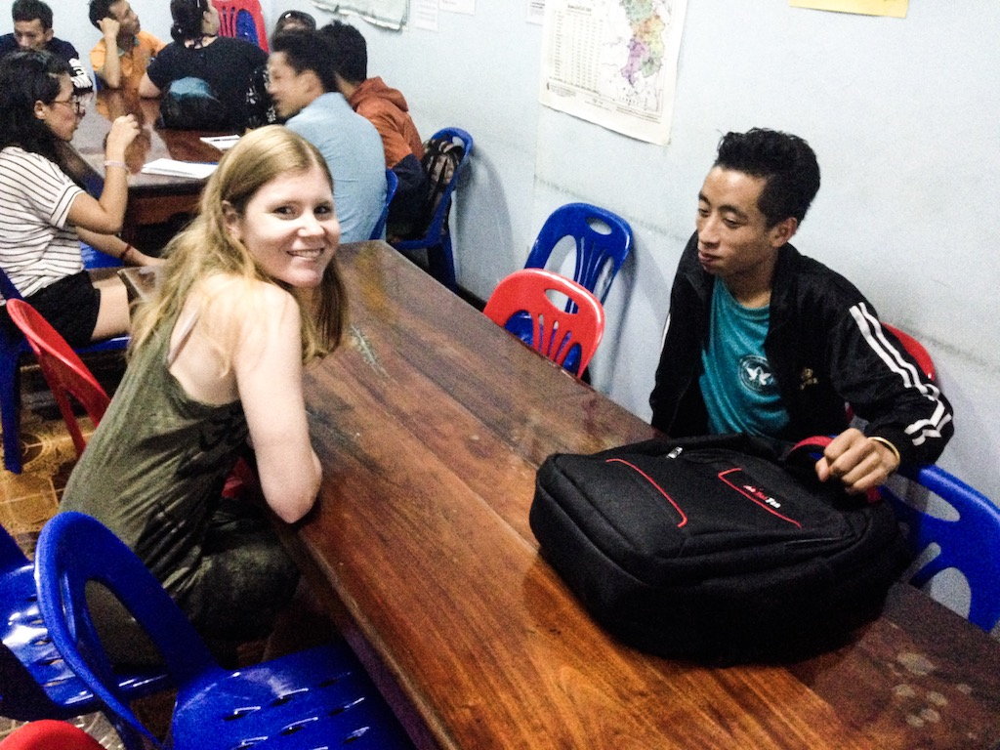
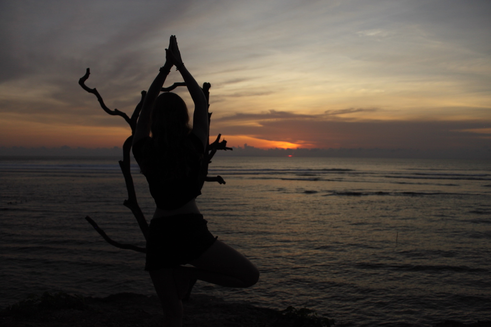
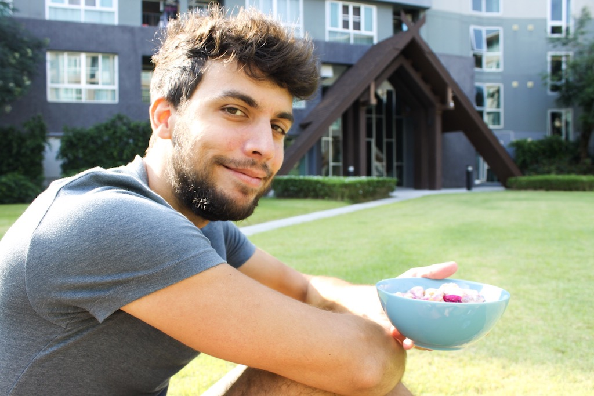

Right now I am sitting in my favorite Café in Chiang Mai writing this article, sipping my cappuccino, feeling the sun on my face and I am thinking: How can life get any better? Since starting being freelancer my life has had constant ups and downs. One day I would feel super motivated and ready to bring it on, the other day I would sit at my desk wondering what the heck I was doing. However, my perspective on things have drastically changed since starting my digital nomad adventure together with Robin. It’s hard to put in words how I feel to be honest. Most of all, I guess, I feel grateful that I can sit here, drink the best cappuccino in town, do work that I have chosen to do and get things done according to my own rules.

Robin and I have been reflecting a lot lately about how we want to spend our lives and thankfully, we are pretty much on the same page here. We are both go-getters because after all you only live once, right? That’s why we want to live the best life possible. No more excuses, no more procrastination (in a reasonable sense, of course ;)

Obviously, a life well lived means something different to all of us. While traveling might be super important for us, you might be the type of person who values quality time spent with the family or climbing up the career ladder. So please don’t take our bucket list for our lives well spent as a universal to-do list for everybody. It is our bucket list. Do you have one as well? What’s on it? We would love to hear, so share it with us in the comments or on our social channels :)

This list is by far not complete, but it contains the things that are most important to us right now in this moment. With this list we want to hold ourselves accountable to always be mindful of our idea of a good and happy life.

# Live your dreams

We have been stuck in the rat race of working for others far too long, at least for our time schedule. We always had so many things we wanted to do but no time at hand due to our busy jobs. Now we finally have time to travel, learn new languages, play an instrument and work on our own terms. YOLO is such an overused acronym, but it fits our situation very well.

# Travel

Traveling has always been super important to us. After all, Robin and I met during one of our first traveling adventures in Australia. Therefore, our dream of traveling the world has always connected us. We are so looking forward to seeing the beauty of the world while making money on the road. Some places that are very high on our travel bucket list is Chile, Japan and Costa Rica. So far we have made it to south east asia a couple of times , because we just love the culture, food and people over there. Especially in Thailand, Vietnam and Indonesia we found our favorite spots.

# Be kind to others and be kind to yourself

In today’s society I feel like one thing isn’t valued very highly anymore and that is kindness. People are focusing on themselves and their businesses far too much. This is one thing that you can actually feel here in Chiang Mai as well. I am missing the genuine question “How are you?”. Fellow travelers often only seem to be interested in you as long as they can pitch you their products  or you have some useful information for them to apply in their businesses. Of course, I don’t want to do any generalizations here. We have also met so many amazing people! Anyways, with us being super lucky to live our dream life, it is extremely important to us to be kind to others. After all, we do believe in karma! At the same time you should also be nice to yourself. It’s so easy to beat yourself up about things that happened in the past, things that weren’t going right. But at the end of the day, the energy you give, is the energy you’ll receive. So it would better be good.

# Help those who aren’t as fortunate as you are

Traveling through Southeast Asia we have experiences a lot of sad situations, or at least circumstances that according to our western standards would be called misery. We talked to kids who want to become a policeman but can’t afford the training, or to people who have never even left their village and can only dream about what we’re doing right now. We know that we are so fortunate to live such a privileged life and therefore we definitely want to help those who are not as lucky, be it with donations, schooling or anything else. One great project we’ve supported is the [Big Brother Mouse Project](http://www.bigbrothermouse.com/) in Luang Prabang, Laos, where tourists simply have a conversation with kids who want to improve their English. We spent a couple of evenings with them and even afterward collected donations for a book event.  It’s often so easy to help, we just have to start somewhere.

# Be grateful

I recently got my first acupuncture here in Chiang Mai and as I was lying on the bed I was thinking about how fortunate I am to be receiving treatment for my migraine, to live at a place that has a pool or to work from the coolest coffee place in Chiang Mai. So often, we take things for granted or worse, are in a bad mood because of the most unnecessary things without even realizing how lucky we are. That’s why we try to practice gratefulness, especially when we’re feeling a little moody.

# Be good to yourself

This goes hand in hand with being kind to yourself as being kind to yourself implies being good to yourself. For us, that means that we are taking care of our bodies with fitness, good and healthy food, breaks from work etc. It is too easy to eat cheap street food most of the time that isn’t healthy in most cases. And it is too easy to miss the time to do something good for your body when working on your own business all the time. So take time off, rest a bit, and recharge your energy again.

# Be your own Boss

Being our own boss hasn’t always been on our bucket list for a life well lived and I still think that there are employers out there who really care about their employees and make their work so rewarding. This feeling of being valued is the greatest feeling and I am happy for everybody who has experienced it. I however, didn’t experience in my former jobs that’s why being my own boss is so important for me. Now I can reward myself and I can work according to my own rules! Robin on the other hand wants to be his own boss for different reasons: He wants to work on his own projects and bring something out into the world that he has created himself. Now he can finally do that and concentrate on the projects that are important to him.

<Divider />

As I said already, this bucket list is far from complete. There are so many things that make for a life well lived but right now in this moment, these are the things I have to think of when thinking about my life right now.

What is written on your bucket list? We would love to hear! Please share it with us in the comments or in our Facebook Group :)

