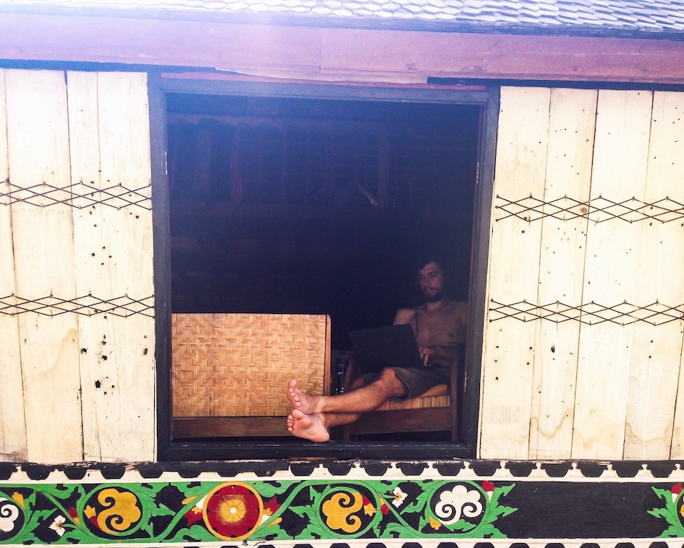
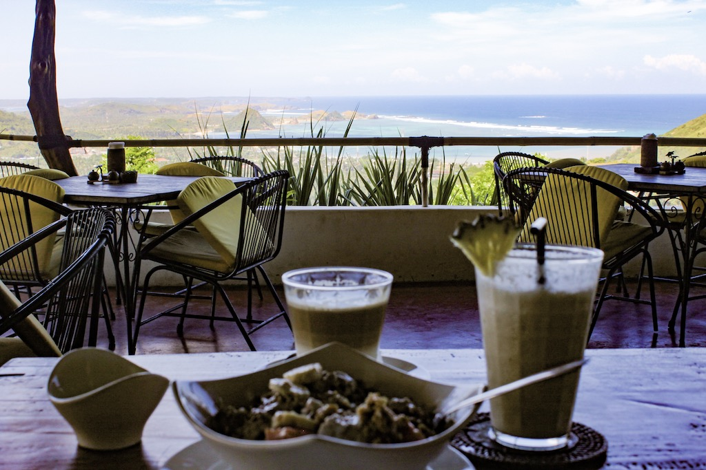

We are on a mission. Not just any mission: It’s the mission to living an independent and self-determined life.

It all started with me being upset with work. I was paid little, had nothing to do at work, yet I was expected to do extra hours just because that’s the way bosses want to see their employees slave away. I felt trapped, I didn’t want to stay at my job but was too scared to quit, too. I applied for several other jobs and even got two offers, but because of my previous and actual work experiences I was too scared to go for either one of them. I only had one question in my head: What if it gets worse at this new job? So I stayed. I stayed until one day, out of the blue I was let down for economic reasons. I cried all weekend, not knowing what to do. It took me a while to realize that this was actually the best thing that could have happened to me.

Robin on the other hand had a great job. He was a software engineer at a startup in Berlin, with a great boss, inspiring colleagues and an office to die for. His boss really knew how to make his employees happy. So when Robin asked him if it was possible to do two weeks of remote working and add them to his six weeks of vacation his boss said yes. And that was the beginning for our digital nomad experiment.

# Location Independent Experiment Succeeded

[After two months of traveling and working](https://www.wayfaringsociety.com/becoming-digital-nomad-experiment), we were happy to see that the lifestyle we were looking for was actually achievable. I found my first clients, Robin was working [on his personal blog](https://www.robinwieruch.de/) and apart from this we were just so happy to be able to travel wherever we wanted, structure our days according to our wishes, meet new people and live the life we had always dreamed of. However, it also came with a lot of challenges.

Now the only question to answer was: Is Robin willing to give up his job for a life full of uncertainties? This was a tough decision to make and it caused us several sleepless nights. But in the end, it was always clear to us, what we wanted to do. And so he quit his job, but leaving on very good terms.

It is always tough to make those decisions. Our whole live we lived up to the expectation of society. We graduated from school and did our studies at university in the bare minimum of time, took several internships and student working jobs along the way, and eventually worked for our first employers in the startup world. The next step would have been to climb the career ladders. But what would you get out of life if you just followed this one script dictated and expected by society? We wanted to escape this lifescript and write our own story.

Just two months later we were sitting in a plane with a one-way ticket to Chiang Mai, Thailand. During our last nomad experiment we found out that Chiang Mai would give us the best combination of everything to get started in this new life.

# Initial Focus on Content Marketing and Web Development

Sure we are afraid of failure, but we live in a world full of opportunities. Looking back, we want to be able to say that we tried rather than regretting that we didn't do it. There seems to be a clear trend of people doing location independent work, taking these opportunities to shape their own lifestyle. Studies show a clear shift to freelance work, remote work is catching on and more people value their freedom over any job opportunity. People want to become nomads and we believe that is the clear trend for a whole generation of workers.

Apart from me working with my clients in content Marketing and [Robin launching his second ebook](https://www.robinwieruch.de/learn-react-redux-mobx-state-management/), we wanted to start the Wayfaring Society to share our experiences as digital nomads. We want to show you what it’s like to live a location independent life, the good and the bad sides of it. Our aim is to give the most authentic picture possible. We don’t want to bullshit you with fake numbers and only happy faces, because it’s not just about that. It’s work and it’s tough but it also comes with so many perks. On our mission we want to give you the real numbers, things we tried and things that we failed in. So how much are we committed to this? We quit our jobs. That’s how much we are committed to it..

However, we don’t only want to talk about us and our experiences. If you’re reading this, you’re probably thinking about becoming a digital nomad yourself, or maybe you actually are one already. Chances are, you want to launch a product, want to start blogging or work with clients. Whatever it is, one thing you need to do to accomplish that is (self-) marketing. That’s why apart from sharing our experiences we also want to give you insights into our fields of expertise. After all, we want as many people as possible to be able to live and sustain this lifestyle.

# Our goal: Creating a community where digital nomads come together

With our blog, we want to help fellow digital nomads tackle the challenges of a location independent solo-preneur. We love creating valuable content for you so that you can stand out in your niche. After all, that’s what we quit our jobs for.

On the other hand, we also have our expenses to pay. That’s why we are still working with our clients. We see freelancing as an enabler to doing what we really want to do: Focussing on the things we are good at, such as content marketing and web development, educating people about it, and creating a community around this lifestyle. So maybe you want to help us with that: Spread the word about the Wayfaring Society or recommend us for freelancing gigs in marketing and web development.

# There is always a turning-back to “normal life”

If you already are a location independent freelancer, congratulations! If you are still eying with the idea of it but can’t really decide, always keep in mind: There is always a turning-back. It’s not a decision you have to stick to forever. You don’t have to commit your lifetime to it because you quit your job. Just give it a try and see if it works for you. We were also super scared to take this step, yet our fear of missing out was greater. We wanted to get control of our life again without following the expected script. At the end of the day, it is not a final decision. You can break out of the experiment at any time. If it doesn’t work out, you can always look for a 9 to 5 job again. There is nothing bad about it.

# What are we up to next?

As for me, I will continue [working with clients](https://www.iamliesa.com/), providing content and marketing expertise. It is my main pillar to enable me working on my fitness blog [21moves](https://www.21moves.com/).
Apart from me working with my clients in content marketing I am also working on a couple of ideas that Robin and I are having.

As already mentioned, Robin just launched his [second ebook](https://www.robinwieruch.de/learn-react-redux-mobx-state-management/) along with a course. He definitely wants to dive deeper into teaching others about web development. For him, that’s a very fulfilling task to do. On the other hand, he is starting to freelance in web development, too.

Our next stop will be Indonesia where I am planning on doing lots of yoga. After all, it’s not all about work, right? We will be back home for Christmas and continue planning our adventures from there. We like to plan on the short-term so we still have no idea where we will be after Christmas. But we will keep you updated of course :)

So, if you are a digital nomad already or want to become one, follow me for insights into this amazing lifestyle. I want to provide you with all the information that are necessary to get started with your online business. Along the way, you will find out about marketing tips to launch your idea and facts to create your personal brand.

I want to share my knowledge with you from zero to location independent. I experience all these things first hand for you, but also want to deliver case studies about our travels and others living this lifestyle as well as insights into my ideas and projects. So follow me on my journey on [Instagram](https://www.instagram.com/i_am_liesa/) or stay updated about the latest Marketing tips and nomad hacks on [Facebook](https://web.facebook.com/iAmLiesa/).

