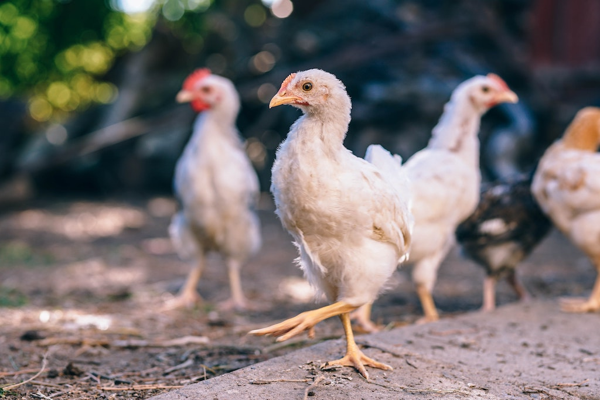
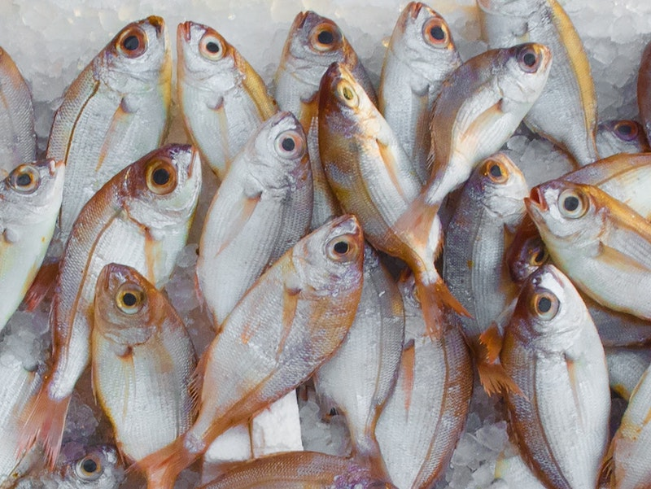

import YouTube from 'react-youtube';
import BlogLink from '$components/Link';
import { Title, Subtitle, Divider } from '$components/mdx';

Protein is essential in the process of stocking a healthy kitchen. 15 to 25 percent of our energy intake (kilojoule) should actually be coming from high quality protein. It is responsible for multiple functions in our body, such as building tissue and cells as well as making hormones and antibodies. They break down into amino acids and are the building blocks for muscles and gaining strength.

Steak, chicken, and fish are often center pieces of dinner or lunch and milk and dairy can be found in every refrigerator. To help you decide for the healthiest options, let’s look at the terminology used to describe sources of protein and what to look out for when stocking your kitchen.

<Title id="healthy-kitchen-stocking-meat">A clean kitchen: Stocking meat</Title>

When it comes to stocking meat such as lamb, sheep, cow, and goat, there are several key terms to understand in order to make a well-thought-out decision during the buying process. Let’s start with **pasture-raised**.

Pasture-raised refers to “animals [that] were raised for at least some portion of their lives on **pasture or with access a pasture**, not continually confined indoors.” The opposite to that would be animals raised on industrial farms or feedlots, that don’t have access to a natural environment.

Pasturing has several **environmental benefits including the reduction of soil erosion, better plant diversity, and better water and air quality**.

Pasture-raised animals are allowed to **eat foods they usually would**, such as grass, plants, and bugs. However, the term pasture-raised isn’t standardized or regulated, meaning there is no definition for pasture and no requirement for the claim to be verified by third party. However, in order for pastured meat to also be labeled certified USDA organic, strict standards apply regarding how the animals are raised:

The animals must have **access to an environment that accommodate their natural behavior** such as pasture grazing
Farmers are **not allowed to give animals growth hormones or antibiotics** unless they are sick. The overuse of antibiotics in farms is a real problem as it contributes to the development of antibiotic-resistant pathogens. Those are becoming increasingly hard to treat in humans.
Animals must be fed 100% organic food sources.

<Title id="healthy-kitchen-animals-diet">The animals diet and the effects on its meat</Title>

The animals people ate in earlier days roamed free and let’s take a look at what they ate? You probably guessed it: They were eating grass. That’s why for beef the **best food is still grass**, after all that’s what they naturally eat. There stomachs weren’t made to eat grains. Thus beef should be grass-fed, not grain-fed. But what does grass-fed actually mean and what doesn’t it mean?

**Grass-fed** means that the animals have **gazed in pasture year-round and haven’t been fed a processed diet**. However, the term isn’t very clearly defined. Generally speaking: Grass-fed animals eat (mostly) grass. While it might be given substitutes like alfalfa in winter, the emphasis is still on providing the closest thing to a natural diet.

But here comes the tricky part: an **animal can be referred to as grass-fed but be fed grain at a later time in their lives**. In order to grow rapidly, add meat to the frame and optimise fat cover, beef animals are often fed an energy-dense diet in preparation for slaughter. This process is called **finishing**, or fattening up with grain-based feeds.

A 100% grass-fed and grass-finished producers are certified by the American Grassfed Organisation and must meet strict rules:

	* Animals must be born and raised on US pasture
	* They are raised on pasture and never confined to a feedlot
	* Animals must only grass and forage
	* They must never been treated with antibiotics or hormones

To reap all the benefits meat coming from grass-fed animals have to offer, grass-finished would be ideal. It means that the animal wasn’t fattened up with any grains but was raised on grass for its whole life.

Grass-fed and especially grass-finished cattle is also associated with certain nutritional benefits.

The cattle’s diet affects the nutrients and fats you get from eating. “You are what you eat” applies for cows too. Meat coming from grass-fed and grass-finished cattle has a far better nutritional profile than meat coming from feedlots. Pastured meats generally contain more of the following:

	* vital omega-3 fatty acids - up to five times as much.
	* vitamin E
	* vitamin C
	* conjugated linoleic acid (CLA)
	* beta-carotene
	* B-vitamins
	* calcium
	* magnesium
	* antioxidants

It also has a lower amount of fat overall. So, when shopping for meat, look for options that are pasture-raised, organic, grass-fed and grass finished.

<Title id="healthy-kitchen-dairy">A healthy kitchen: Stocking dairy products</Title>

The **diet of an animal does not only affect its meat, but also the nutrition of its dairy products**.

For example: <BlogLink to="https://onlinelibrary.wiley.com/doi/abs/10.1002/fsn3.610">studies</BlogLink> show that grass-fed cows produce milk that can contain 2 to 5 times the amount of conjugated linoleic acid compared to industrially-raised or conventional feedlot dairy. It also contains more omega-3. This provides a substantially healthier balance of fatty acids. The improved fatty acid profile brings the omega-6 to omega-3 ratio to a near 1:1 instead of 5.7 to 1 as it is in conventional whole milk. This has a lot of health benefits. CLA is associated with a lot of health benefits such as immune and inflammatory system support, increased insulin sensitivity, reduced risk of heart attack and reduced body fat.

That’s why you should always try to get meat as well as their products from grass-fed, grass-finished producers. Ask for 100% grass-fed milk and don’t get sidetracked by confusing labels stating “natural” or “pasture-raised”. Labeling laws are very vague when it comes to displaying these terms. Thus talk to your grocer or the farmer and find out how animals were actually raised.

Another important thing to know when stocking a healthy kitchen is the **difference between pasteurized and raw or unpasteurized dairy**.

Pasteurization is <BlogLink to="http://www.foodsafetysite.com/educators/competencies/general/foodprocessing/processing2.html">“the process of heat processing a liquid or a food to kill pathogenic bacteria to make the food [respectively the drink] safe to eat.”</BlogLink> That means that milk is heated up to a specific temperature, mostly around 145 °F or 161 °F, for a set period of time. Times and temperature vary depending on the type of food and the result aimed to achieve, e.g. retaining a food’s nutrients, texture, color and flavor.

The problem with pasteurization is, that it **may also kill helpful enzymes, nutrients might be lost and food is harder to digest**. No pasteurization however, brings the **risk of bad bacteria and the potential for food-borne illnesses**. In the end, you have to decide for yourself and weigh the pros and cons.

<Title id="healthy-kitchen-poultry">Poultry as part of a healthy kitchen</Title>

As with cattle it is best to buy **pasture-raised turkey and chicken**. Those birds are raised in a natural outdoor pasture environment and are not trapped indoors. The birds are able to roam **in large areas that have various grasses and eat seeds and insects that are found in the pastures**. This also leads to **more nutritious meat and eggs**.

Another thing to consider is buying **certified organic poultry products**. I would recommend it. To use the label “organic”, a farm must be certified. The **birds must be raised according to USDA National Organic Program Rules starting the second day after hatching**. There are strict rules how birds have to be raised in order to call the products organic. Those rules include:

* **No antibiotic use**: Birds mustn’t be given any drugs, hormones or antibiotics - not even when they are sick. If a chicken gets sick and needs antibiotics, it has to be taken out of the organic program. This is because overuse of antibiotics can lead to strains of bacteria resistant to antibiotics, which might lead to a resistance in the human body.

* **Access to pasture**: There is no rule saying how much time a chicken has to spend outdoors, but it must have access to the outdoors. Raising poultry on pasture has huge nutritional value for eggs. According to several reports, eggs from pasture-raised chicken contain higher levels of omega-3 fatty acids, vitamin A and E, and are supposed to overall be beneficial for human health.

* **Only organic feed**: The chickens must be fed organic feed for their whole lives. This means organic grains, feeds and supplements approved by the NOP standards. The feed mustn’t contain animal byproducts, antibiotics or genetically-engineered grains.

* **Certified organic pasture**: Chickens must be raised on a certified organic farm.

There are certain terms to know about when buying poultry products. Two of them are **“free-range” and “cage-free”**.

Cage-free is a term that is regulated and it means that the birds are **100% free to roam, they are not caged**. However, it’s **not indicated how much space they have or whether or not they even see the outdoors**. They might live their whole lives in a warehouse.

Free-range is a regulated term, too. It means that a bird is **continuously allowed to range outdoors during their production cycle**. It does not mean that a hen has ever stepped foot outside, still, it was given the opportunity. In theory, it sounds a little more humane than cage-free but in reality it might just mean that the birds had access to concrete, cement, dirt, or a modicum of grass. The free-range label is provided even if the access to outdoors was only dirt or concrete.

<Title id="healthy-kitchen-seafood">Stocking a healthy kitchen: Seafood</Title>

Seafood is a nutritious source for **protein**. It contains lots of **omega-3 fatty acids**, which are “good” fats, and vitamins and minerals like selenium, niacin phosphorus, vitamin B6, -12 and D, and magnesium and therefore has a rightful place in a well-balanced diet.

When buying seafood, always read the label first. After all, you want stock your kitchen with the cleanest and most eco-friendly seafood possible. The first thing you should watch out for is the country of origin. The label should also state if the fish is **wild, wild-caught or farm-raised**.

**Wild fish** really is just that: Fish that is a **100% wild**. It **lived in its natural habitat, the ocean, river or lake, for its full lifecycle**, and was caught in the wild. Because wild fish isn’t as abundant as it once was and can’t meet consumers demand, fish is **commercially raised**, which is known as **farm-raised or aquaculture**. These fish-farms have grown significantly over the years, meaning that many fish have never lived in the wild but were always kept in tanks, pens, or ponds. While fish farming is a way to get a much larger amount of fish quickly and cheaply, there is of course a downside to it.

* Pollution: Since quite a lot of fish are cramped into a small space, problems like disease and pollution occur easily.

* Antibiotic Use: To prevent diseases, some aquaculture productions rely on the use of antibiotics.

* Pesticide Use: Due to an increasing problem with sea lice in fisheries around the world, pesticides are sometimes used.

As with all living beings, fish are what they eat. Wild salmon for example eats smaller fish, which eats aquatic plants that is full of beneficial long-chain omega-3 fatty acids DHA and EPA. Farm-raised salmon is fed pellets, which varies in nutritional quality. Therefore **farm-raised salmon is lower in nutrients**.

Last but not least, there is **wild-caught fish**. Wild-caught fish are caught in their natural environment using hands-lines, nets, divers or traps. Some fish, however, can be wild-caught and farm-raised as wild fish are caught as babies, taken to pens and fattened up. Therefore opting for 100% wild fish would be the best option.

Unfortunately, relying on labels doesn’t always protect you from scam. Fish fraud is a global problem. <BlogLink to="https://oceana.org/sites/default/files/reports/Seafood_Traceability_Report_FINAL.pdf">Recent studies</BlogLink> found out that as much as 25 to 70 percent of the labels might actually be wrong. Instead of wild fish you might actually be eating farm-raised fish, or maybe you are just eating a whole other type of fish.

