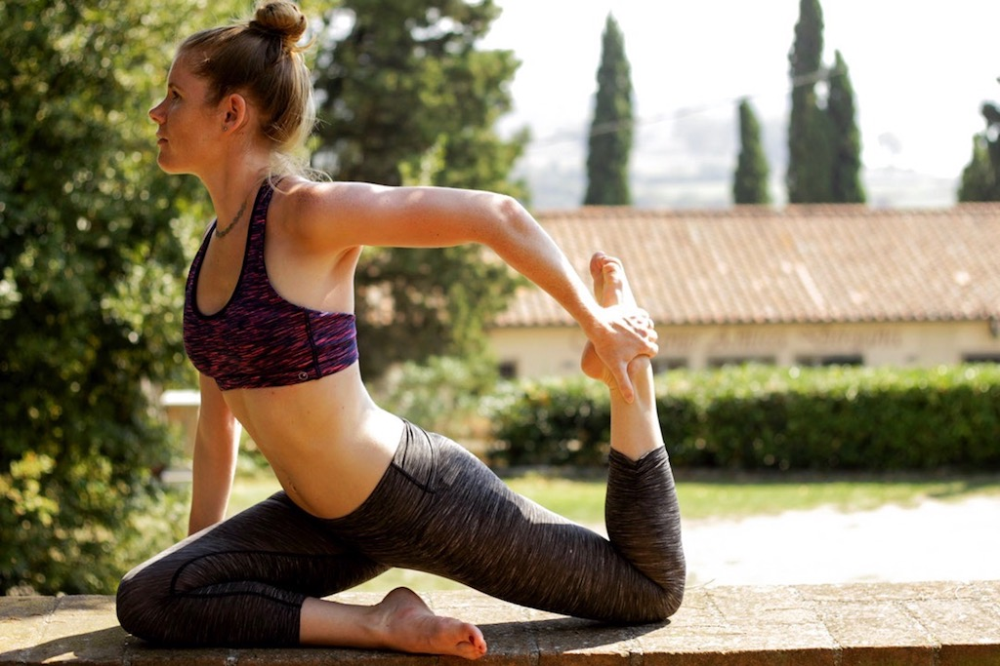
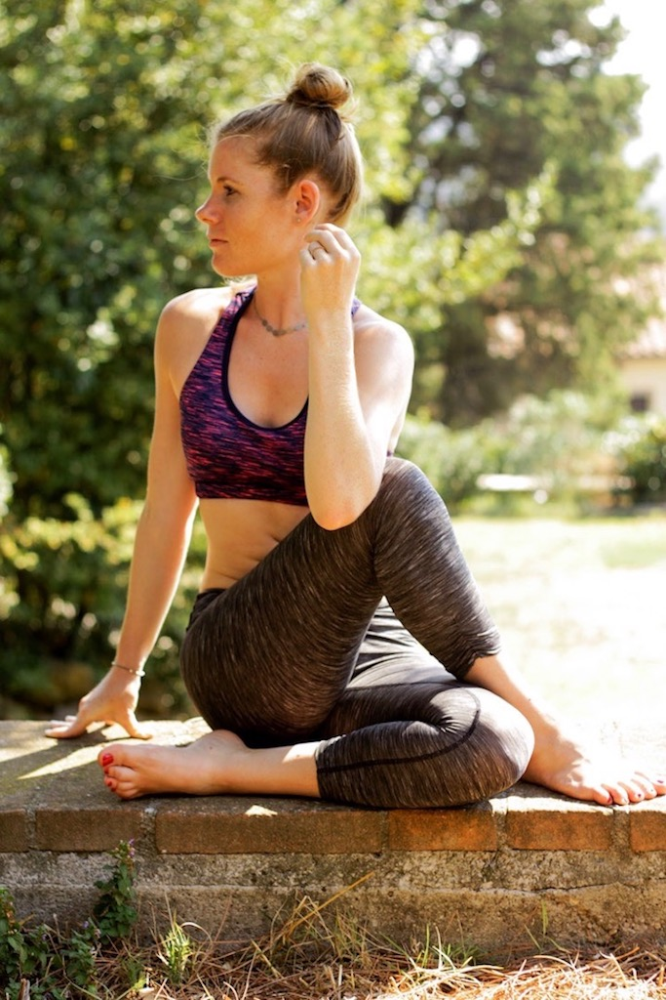
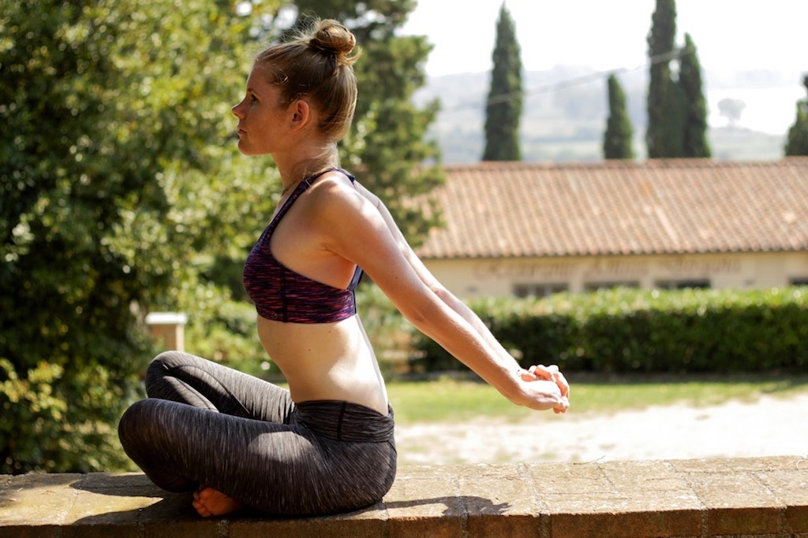
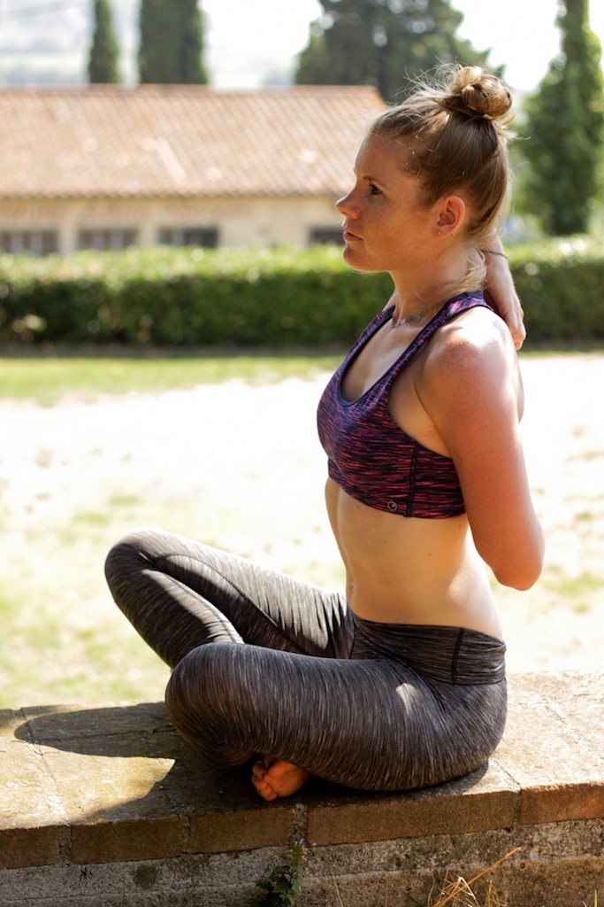
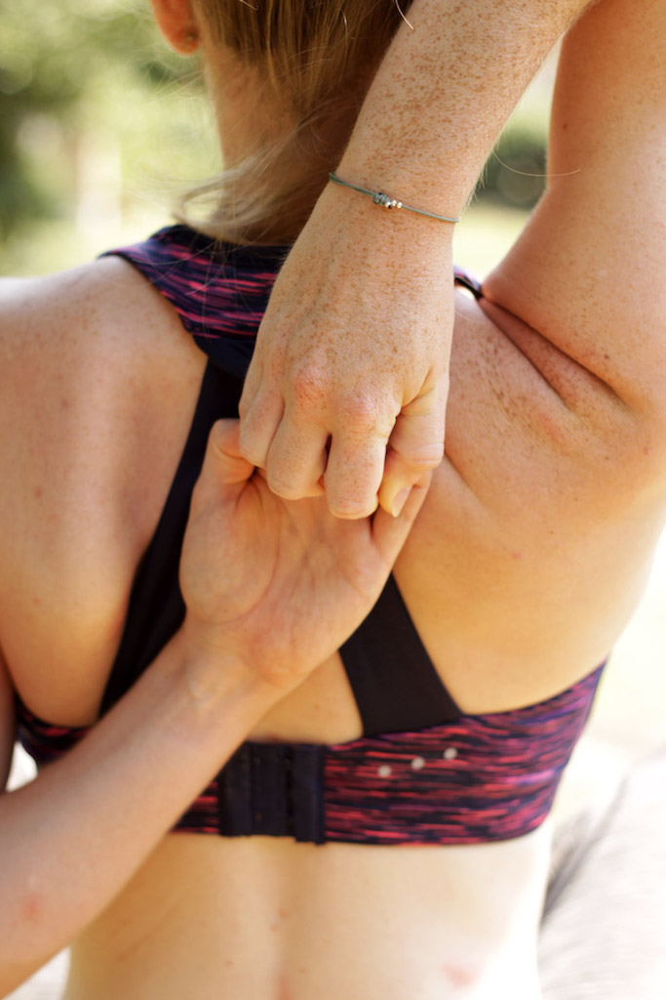
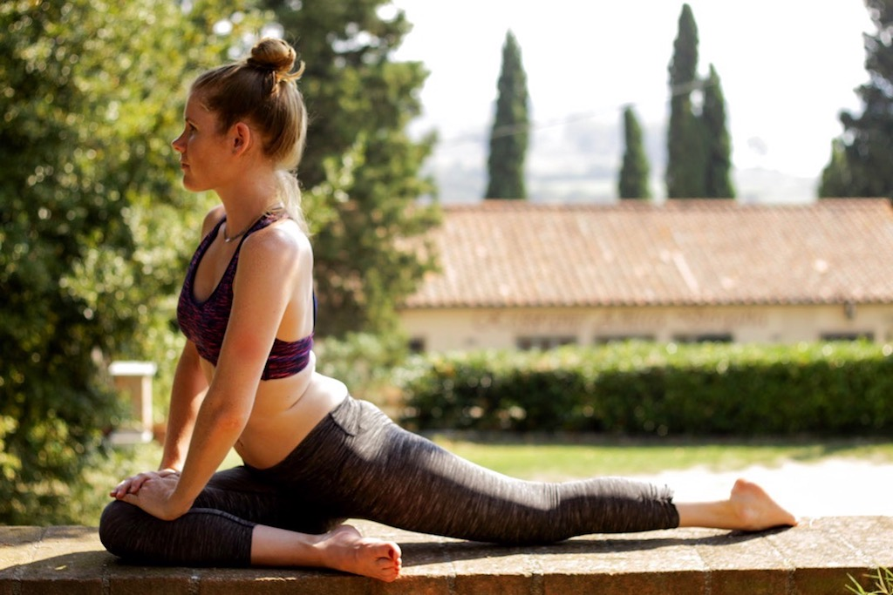

Right now I am sitting on my balcony, enjoying the last ray of sun and wishing I could go back to Italy. I already started complaining about what had gone wrong this week but then I stopped myself. I want this blog to be super positive and get rid of any negative vibe whatsoever. Instead, let me tell you about my new Yoga stretching philosophy, about all the benefits stretching has on your body and let me guide you through my favorite Yoga Stretches.

I have started with stretching a little while ago. My goal was to gain flexibility and ultimately to be able to do splits. So far I am still working on the splits. However, with regards to flexibility, I must say that I have never felt better. I was so inspired by all those Instagram girls that were able to twist their whole body without the slightest hint of pain on their faces.

# The newfound love for feeling good pain

As I shared with you before, I didn’t really pay attention to proper stretching exercises. That was until I’ve started with Yoga. Whenever we were practicing flexibility exercises, I could feel the itching in my whole body. However, I soon realized that this was actually a good pain. Whenever I feel it now, I know I’m coming closer to becoming even more flexible. And besides the feeling of greater flexibility, there are so much more benefits of stretching that I didn't even know about!

**1. Feeling refreshingly flexible**

Ever since I started with my flexibility training, I am feeling fantastic. I have a lot more bounce in my step and my energy level is going up the sky. Usually, I often get tired during the day, which is now so much better. I can also feel it after powerful workouts as I don’t experience muscle fatigue that strongly anymore. I move more freely and I can perform better during the day.

**2. Improving my athletic performance**

Contracted muscles aren’t very efficient during your exercise. I feel like now that I stretch them regularly, my muscles are much more relaxed and therefore more available during my workouts. Naturally, that leaves me with a better performance and of course, I’m much more motivated now.

**3. Reducing stress with flexibility training**

Of course, stretching does not instantly reduce stress and calm you down, but what it does is make you better equip to handle future stressors.

When you stretch, your whole body reacts and gets into a relaxation program. A relaxed body makes your muscles perform so much better. They are able to lengthen, realign and release any pain and tension.

**4. Stretching for better physical and mental performance**

Did you know that stretching increases your body’s blood circulation? When you stretch, a high amount of oxygen and nutrients are delivered to your muscles, organs including your heart and also to your brain. Thus, you do not only benefit from a healthier body but also your brainpower gets a boost. Through an increased supply of fresh oxygen and nutrients, brain cells are nourished, which leads to an improved focus and encourages a stable mood.

**5. Flexibility exercises for an energy boost**

After a night’s sleep, usually, the first thing we do in the morning is stretching. We all do it unconsciously without even realizing that we’re starting our day with a stretch. Doesn’t that prove how good stretching is for our body and our energy level?

Stretching exercises balance your nervous system. Built up energy is un-blocked once you start stretching and nerve receptors in your muscles are stimulated.

Having tight and constricted muscles means that you need more energy to move them. With relaxed muscles, however,  you can move more freely without wasting so much of your energy. By doing a variety of stretches, you can free this built up energy, which can then be used for other important functions in your body.

**6. Regulate your stress hormones and slim down**

We all know this: in situations of stress, we start to eat. But, since stretching calms and relaxes our nervous system, we can finally do something against it. Being less stressed means we produce less stress hormone. And stretching more means fighting tension and stress. This is important because the stress hormone makes us want to eat more, it represses “feel good” hormones and it lowers our energy level. An everyday stretching routine, however, reduces that stress, we produce more of those “feel good” hormones and we are more active throughout the day. All of this has a positive influence on our weight management.

# My new Yoga Stretching Routine

Now I want to share with you my favorite yoga stretches. Make sure you hold each of these positions for at least 30 seconds otherwise your muscles won’t have the time to adjust.

**Cow Face Pose for arms** (*Gomukhasana Arms*)

This Yoga pose stretches the **shoulders, armpits,** and the **triceps**.

Sit down crossed-legged or in *Dandasana* (staff pose), back straight. Reach the right arm up the sky; left arm comes from below behind your back and reaches up. Now bend your right elbow, let your hand come down behind your back too and start reaching your fingertips toward each other until your hands meet. The right elbow should always point upward, the other down. Stay in this position for 10 breaths and then switch arms.  If you can’t reach your left and with your right hand, use a [yoga strap](https://www.amazon.com/Sukhi-Yoga-Stretching-Improving-Flexibility/dp/B010U4UMKI/ref=as_li_ss_tl?s=sports-and-fitness&ie=UTF8&qid=1481382025&sr=1-4&keywords=yoga+straps&linkCode=ll1&tag=21moves-20&linkId=53afb1f75bccfac9b4898758e10f2f44) and slowly start inching your fingers closer towards each other.

**Half Spinal Twist** (*Ardha Matsyendrasana*)

This Yoga pose is beneficial for the **elasticity of the spine** and makes it supple. It also **opens the chest** and **increases the oxygen supply to the lunges**.

While being seated, extend both of your legs straight in front of you. Bend your right knee, cross the left leg and place the sole of your right foot on the outer side of your left thigh. Bend the left knee, your heel almost touching your outer hip. Slowly, start twisting your upper body toward the right, bringing the right hand behind you. Now gently press with your left elbow against the outside of the right knee. Gaze over your right shoulder. Stay in this position for five to ten breaths, then repeat it on the other side.

**Pigeon Pose** (*Kapotasana*)

The pigeon pose is a **hip opener that increases the external range of motion of the femur in the hip socket and lengthens the hip flexors**.

Begin the pigeon pose with a downward facing dog. Then raise your right leg straight up to the sky. Slide it forward, bend your right knee so that the outside of your shin is placed under your torso and your foot behind your left wrist. Now slide your left leg back behind you and let the front of your thigh sit on the floor. Next, lower the outside of your right buttock to the floor. The right heel should now be in front of your left hip and both hands on either side of your leg.

**Mermaid pose** (*Eka Pada Rajakapotasana*)

This pose actually evolves from the pigeon pose. **It strengthens the core and pelvic floor, stretches the lower back, quad muscles, and hip flexors and opens the chest and shoulders**.

Start in a pigeon pose with your right leg forward, hands beside your hips and the right heel in line with your left hip. Look over your left shoulder and bend your left knee. Now reach back and grab your foot with your left hand. Now bend your left elbow around your foot until it lands in the crook of your elbow. Slowly lift your upper body up so you can lift your right hand up the sky. Then bend your right elbow and grab your left hand.

**Breathing**
While doing these poses, never forget to breathe. In tense positions we tend to forget to breathe, making them even harder for us. Always inhale slowly and while exhaling try to get even deeper into your position.

# Recommendations

If you'd like to get more information on Yoga stretching and flexibility, I highly recommend these reads:

* [Restoring Flexibility](https://www.amazon.com/Restoring-Flexibility-Yoga-Based-Practice-Increase/dp/1612434916/ref=as_li_ss_tl?s=books&ie=UTF8&qid=1481387313&sr=1-10&keywords=yoga+stretching&linkCode=ll1&tag=21moves-20&linkId=9a42dc382c2075854ce2aa1e2d379954)

* [Anatomy, Stretching & Yoga Training](https://www.amazon.com/Anatomy-Stretching-Training-Step-Step/dp/1628736372/ref=as_li_ss_tl?s=books&ie=UTF8&qid=1481387313&sr=1-2&keywords=yoga+stretching&linkCode=ll1&tag=21moves-20&linkId=e25c07f904b741ba1623d899381c1de1)

Also, these further yoga props could help you at the beginning of your practice:

* [yoga blocks](https://www.amazon.com/Clever-Yoga-Durable-Friendly-Recycled/dp/B00UUPK6FE/ref=as_li_ss_tl?s=sports-and-fitness&ie=UTF8&qid=1481382169&sr=1-2-spons&keywords=yoga+blocks&refinements=p_72:1248957011&psc=1&linkCode=ll1&tag=21moves-20&linkId=0932d99a57f2968477d353013ad2c2c2)

* [yoga wheel](https://www.amazon.com/Yoga-Wheel-Light-Bonus-eBook/dp/B01DTLS4O0/ref=as_li_ss_tl?s=sports-and-fitness&ie=UTF8&qid=1481387044&sr=1-3&keywords=yoga+wheel&linkCode=ll1&tag=21moves-20&linkId=8cf667c2fba72a8cffae743bfc12aa4b)

* [yoga mat](https://www.amazon.com/RatMat-PRINTED-YOGA-MAT-construction/dp/B00A3F8IEC/ref=as_li_ss_tl?s=sports-and-fitness&ie=UTF8&qid=1481387132&sr=1-22&keywords=yoga+mat&linkCode=ll1&tag=21moves-20&linkId=cb01151e80f81172daab6d3909720f6b)

* [yoga cushion](https://www.amazon.com/Bean-Products-Meditation-Cotton-Cushions/dp/B005LNA4MU/ref=as_li_ss_tl?s=sports-and-fitness&ie=UTF8&qid=1481387244&sr=1-5&keywords=yoga+cushion&linkCode=ll1&tag=21moves-20&linkId=c0a34958e54ed63f146be253e09ac4821387132&sr=1-22&keywords=yoga+mat&linkCode=ll1&tag=21moves-20&linkId=cb01151e80f81172daab6d3909720f6b)

