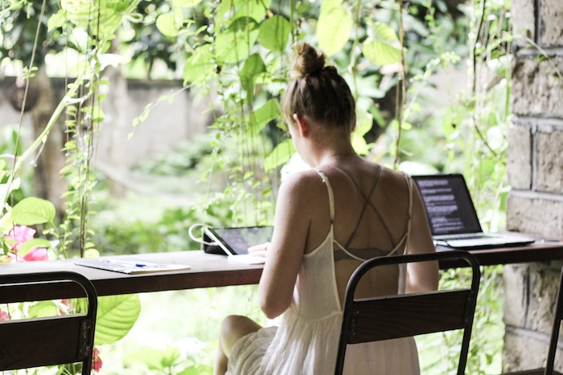

As I am sitting here writing this post, I am looking at the most beautiful landscape there is. I am in Bali, enjoying the sun, the palm trees, and my newfound freedom.

I have started freelancing in January after a very disappointing job experience. I felt lost in the work I was doing at that time and didn’t know what to do next. It was during that time that I discovered Yoga. I started practicing every day and day by day I became more confident and more comfortable in my own skin.

{}

# Becoming a Freelancer and Starting my Journey

I finished my job in November last year and after a lot of struggling I decided to start freelancing. It was the best decision I could make. In March, me and my boyfriend packed our bags and left Germany to travel through South-East Asia. Meanwhile, I had picked up a few clients and worked remotely.

Luckily, I am very disciplined and whenever I got a job, I tried to finish it as soon as possible. However, it didn’t really feel like work. Suddenly, I started to like what I was doing again. The things, that I didn’t like doing before, were now fun for me again. Although I had the freedom to postpone work a bit and go for the beach first or jump into the pool, I was really immersed into my work whenever I had a job.

# Travel, Work, and a lot of Yoga

Doing Yoga while traveling was really important to me. I have been practicing a lot back in Germany, but I had never really established a routine. Now I really wanted to do Yoga everyday. This has actually worked out quite well. At every place we visited I asked the locals for advice on where to go. Since Yoga is a big trend all over the world right now, studios are popping out of the floor everywhere so it wasn’t hard to find the ones that suited me.

My days always started with Yoga in the morning, sightseeing afterward, then lunch and some work in the afternoon until it was dinner time. That way, I felt like I was still doing what I loved (traveling and Yoga) but at the same time I didn’t neglect my work.

{}

# The Struggles

While the structure of my day worked out perfectly, my constant struggle was the reliability of the internet. I had internet wherever I went, however, the connection quite often failed. That made my work a little difficult, especially when I wanted to write for the blog but had to do some research first. It was really frustrating when I had an idea in my mind but couldn’t bring it to paper as I needed more information.

Also, I wanted to create a lot more visual content for the blog but was missing certain props. I didn’t bring a Yoga mat or blocks or a strap and for certain exercises I just needed these. Still, you definitely have the most beautiful scenery to record your exercises.

# My new Life, my new Love, and my new Freedom

The title of this paragraph sounds so cheesy, yet it is exactly the way I feel right now. Ever since we started this journey I feel like a whole new person. I feel that I finally love my life again and also what I am doing. I have the freedom to go wherever I want whenever I want and I feel so grateful to be able to combine my work, my travel, and my Yoga. I thought that freelancing would scare the hell out of me but actually, right now I am just super excited about what’s going to happen next. I don’t know where I am going tomorrow, I don’t know if I am able to keep my clients, and I don’t know which challenges lie ahead of me. But rather than being scared about that as I used to be, I am excited. Life is full of surprises and I am finally able to enjoy that.

<Divider />

As I am reading through my text again, I realize how cheesy that must sound for you. Still I want to publish this post and don’t want to change a thing, because this is me and this is exactly the way I feel.

{}

