If you’re anything like me you’ve probably seen a BOSU Ball at your gym, wondering what that strange “half-ball thingy” is. I had never really known what to do with it until I saw a great Bosu Ball workout. That’s when I started researching what workouts to do with it and collected the best BOSU Ball workouts here.

A little bit on the history of the BOSU Ball first: The BOSU Ball is a balance trainer that can be used on both sides. That’s where it got its name from: Both sides utilized. On the one side, it is completely flat and it can lie on the ground while on the other side it is essentially an exercise ball cut in half. The ball provides different challenges for your muscles, no matter which side you use.

David Weck is the inventor of the Bosu Ball. He invented it in 1999. By this time it was mainly used in physiotherapy and by sport medicine specialists. Nowadays, it found its way into most gyms and home gyms.
With its combination of stable/unstable surface it offers a wide range of possibilities for the daily workout. The BOSU Ball can be used for functional training, balance training, stabilization workouts and for strength training. With these exercises, you will improve your posture and body control and you'll also strengthen the back- and ab muscles.

# Table of Contents

* [Why work out with a Bosu Ball?](#whyWorkoutWithBosu)
  * [Bosu Ball workout in sports rehab](#sportsRehab)
  * [Balance exercises](#BalanceExercises)
  * [Flexibility Training with the Bosu Ball](#FlexibilityWithBosuBall)
  * [New challenges and workout variety](#ChallengesAndVariety)
  * [Bosu Ball for runners](#BosuRunner)
* [Classic exercises on a Bosu Ball](#ClassicExercisesBosu)
  * [Bosu Ball exercises for the core](#Core)
  * [Bosu Ball exercises for legs and glutes](#legsAndGlutes)
  * [Bosu Ball exercise for shoulders/arms](#shoulders)
* [Bosu Ball workout routine](#workoutRoutine)
  * [Bosu Ball full body workout exercises](#fullBodyWorkout)
  * [Bosu Ball upper body workout](#upperBodyWorkout)
  * [Bosu Ball Butt Workouts](#ButtWorkout)
  * [Bosu Ball Abs Workout](#AbsWorkout)
  * [Bosu Ball Cardio Exercises](#cardioExercises)
* [Be careful when using a BOSU Ball](#carefulWithBosu)
* [Calories burnt with a BOSU Ball workout](#caloriesBurntWithBosu)
* [Where to buy the Bosu Ball](#WhereToBuyBosu)
* [BOSU Ball Test](#bosuTest)
* [Further equipments for a BOSU Ball workout](#furtherSupplementsBosu)
* [Further Bosu Ball Workouts](#furtherWorkouts)
* [All the great Workouts at a glance](#atAGlance)

# Benefits of Bosu Ball exercises

The Bosu Ball is a robust, varied training tool, which can be combined with many classic exercises. Thus, its possible application is very versatile and every part of the body can be trained.
Because of the unstable surface of the Bosu Ball, the muscles, ligaments and tendons have to always carry out little compensatory movements. This additional challenge intensifies the workout and even the deep muscles are trained through the balancing act. Many professional athletes use the Bosu Ball because strengthening the micro muscles and increasing their stability can prevent serious injuries.

## Bosu Ball workout in sports rehab

When having problems with the ankle joint, knee, hip or back, the Bosu Ball is the perfect workout partner. In sports rehab, the strengthening of the deep muscles is extremely important, this is exactly what the Bosu Ball does. Because of its size, the "half-ball" offers a very good basic stability. This makes it very suitable for re-building ones coordinating. That’s why the Bosu Ball is very famous in the field of sports medicine.

## Balance exercises

Bosu Ball balance exercises train your stability like no other fitness tool. When using the ball, you have to keep yourself steady while it slightly moves under you. This is a great challenge for your muscles. Your core is constantly forced to work throughout the entire motion. You can also incorporate classic fitness exercises like pushups, lunges or squats into your Bosu Ball workout.

## Flexibility Training with the Bosu Ball

Just like an exercise ball, the Bosu Ball’s rounded top supports your back and abdominal stretches very well. That makes it an excellent tool for flexibility training. Drape yourself over the ball’s soft dome, facing up or down, and enjoy the stretch. You can also stretch your calves with it using it as a “slant board” when facing the Bosu Ball dome-side down.

## New challenges and workout variety

The Bosu Ball is a great fitness tool if you feel bored from your classic fitness exercises or just not challenged enough anymore. Using a Bosu Ball, your body needs to adapt to new stimuli and you need to focus on the execution of your fitness exercises extra hard. And of course, it will also keep you entertained and introduce you to a whole new way of fitness exercises.

## Bosu Ball for runners

Also runners benefit from a good Bosu Ball workout and improve performance and speed. In addition to that, addressing muscular imbalances and training muscles and joints with a Bosu Ball can prevent the risk of serious injuries that easily happen while running.

# Classic exercises on a Bosu Ball

Most of the classic exercises you usually do on an even ground can be done on a BOSU Ball. This adds an extra balance challenge so that your muscles are demanded even more.

## Bosu Ball exercises for the core

**Planks on a Bosu Ball:**
Most of you are familiar with a simple plank. The bodyweight exercise is very effective since it doesn't require a huge investment on your part and you will see results very quickly. When performing a plank on a Bosu Ball, the exercise will become even more challenging. Here is how you do it:

To target your obliques and your shoulders you can also try to do a **side plank** and a **plank with a leg lift** on the Bosu Ball:

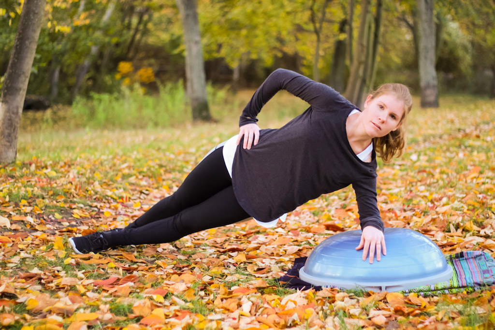
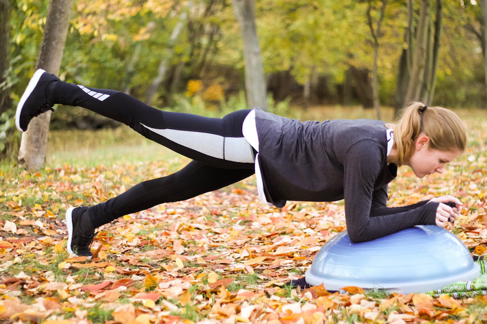

## Bosu Ball exercises for legs and glutes

**Lunge, Reverse Lunge and Side Lunge on a Bosu Ball:**
To work on your leg muscles and improve your balance, lunges on a Bosu Ball are the perfect exercises. Here is how you do them:

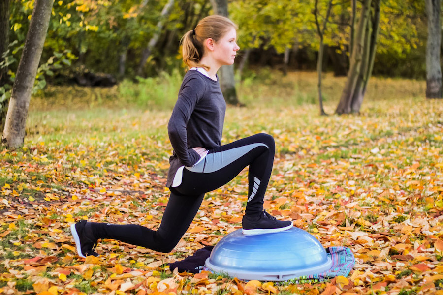
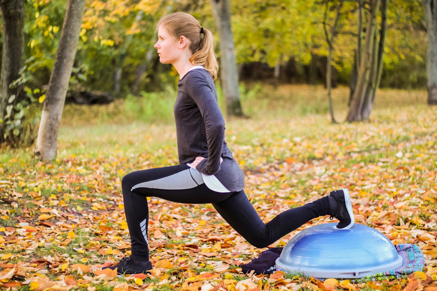
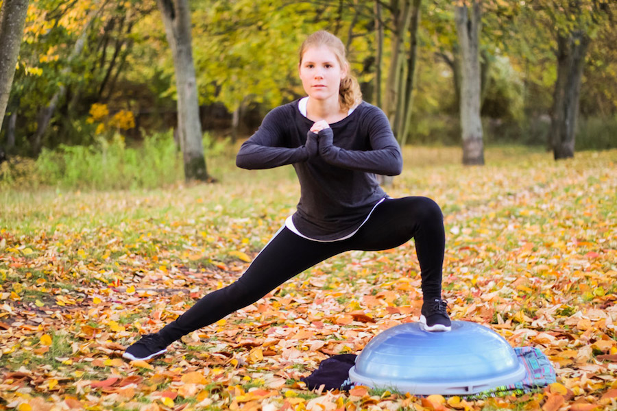

**Bosu Ball jumping side squats**
Place your foot in the middle of the Bosu Ball and get down into a squat. In a quick motion jump sideways over the Bosu Ball and land with your other foot on the Bosu. Your feet should be parallel to each other. Keep your body in a squat position and jump back over the Bosu.

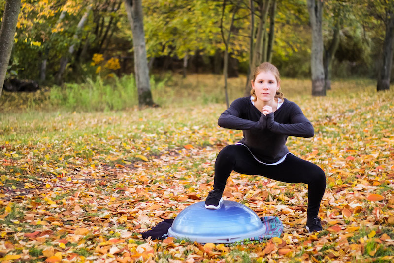
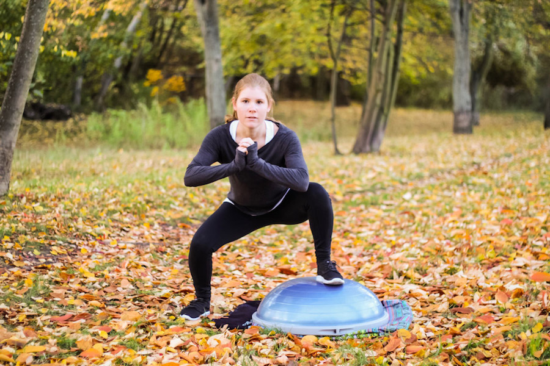

If you also want to work on your upper body while performing a squat on a Bosu Ball, simply add a shoulder press. For that lift your weights just to shoulder level with the palms facing outward and then squat downward on the dome-side of the BOSU, come up again and push those dumb-bells up overhead.

## Bosu Ball exercise for shoulders/arms

**Push-ups with a Bosu Ball:**
If you want to target your arms, chest and shoulders there is no better exercise than a push-up. Performing a push-up with a Bosu Ball, however, is even more challenging. Place the ball dome-side down and grab the sides of the Bosu Ball. Then get down and perform a push-up. Pay attention to your whole body, it should be in a straight line.

If you're looking for an extra challenge, try the BOSU **alternating push-ups**. This time, place the Bosu Ball dome-side up, put your hands flat on the ball and get down into a push-up position. Take your right hand off the BOSU and onto the floor. Then get down into the push-up. Press back up and place your hand on the BOSU again, keeping the plank position. Repeat this on the other side.

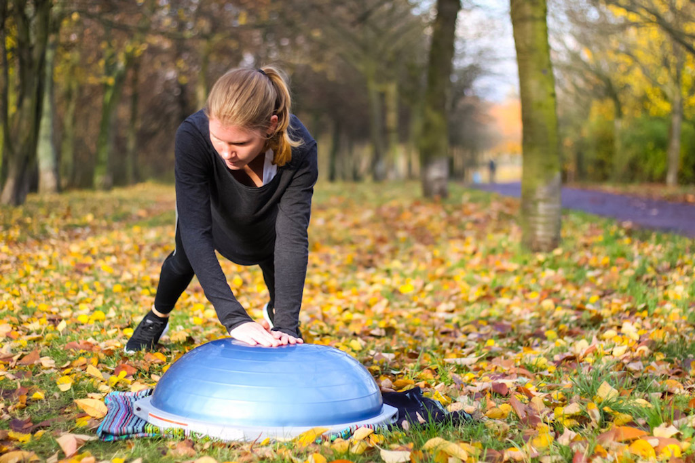
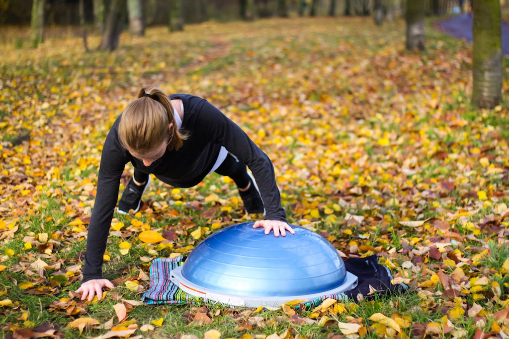

When working on your arms and shoulders, why not also do something for your butt with a combination of **push-up and glute lift**? This BOSU exercise for glutes is a perfect butt-maker. Place your BOSU dome-side down and grab the sides of the Bosu with both hands. Then come into a push-up position. Make sure that your head is slightly over your hands and not even with them, your abs should be tight. If this is too hard you can also perform the push-up on your knees. Get down into the push-up, come back up and lift your leg. Make sure to really stabilize the movement of the ball. You will feel your arms and butt burning! Push up.jpeg push up with leg lift.jpeg

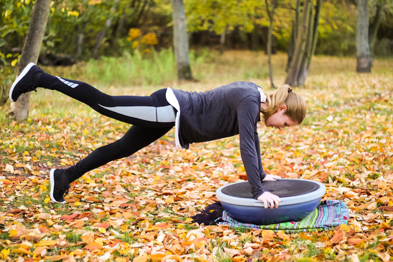

# Bosu Ball workout routine

A Bosu Ball is the perfect tool to train every part of your body. In this section, I want to present five different type of Bosu Ball workouts: a Bosu Ball full body workout, a Bosu Ball cardio workout, a Bosu Ball upper body workout, a Bosu Ball workout for your glutes and a Bosu Ball workout for abs.

## Bosu Ball total body workout exercises

If you only have 30 minutes of time to complete your workout, use the Bosu Ball full body workout to burn calories. You may even want to include a few cardio sequences like burpees or skipping into your workout to really get your heart rate up. Do three sets of each move and repeat them 12 to 15 times.

**Push-ups for arms and shoulders:**
Start with some good old push-ups on the Bosu Ball to work on your core, triceps, shoulders, and chest. The BOSU should be dome-side down. As you have to balance your body on the BOSU, the push-up gets even more challenging.

**Side Plank:**
Place the BOSU flat-side down and put one forearm on it. Extend your feet so that you are lying on one side. Now tighten your core, lift your side up and get into a side plank position. Hold it statically for 30 seconds.

**Sit-up and Bosu V-Sit for your abs:**
Start out by lying on the dome-side of the Bosu Ball, your hips should be just off the edge of the BOSU. Just like with a normal sit-up, put your hands behind your neck giving it support. While exhaling, curl your upper body over the BOSU. Your lower back should be tightly attached to the BOSU. Hold that position on the top for a few seconds, then get slowly down again.

For the **Bosu V-Sit**, sit in the middle of the dome-side of the Bosu Ball and find a stable position. Once you're stable lift your legs up, reaching them out long and holding them at a 45-degree angle. Hold that position for 15 seconds, then slowly lower your feet again.

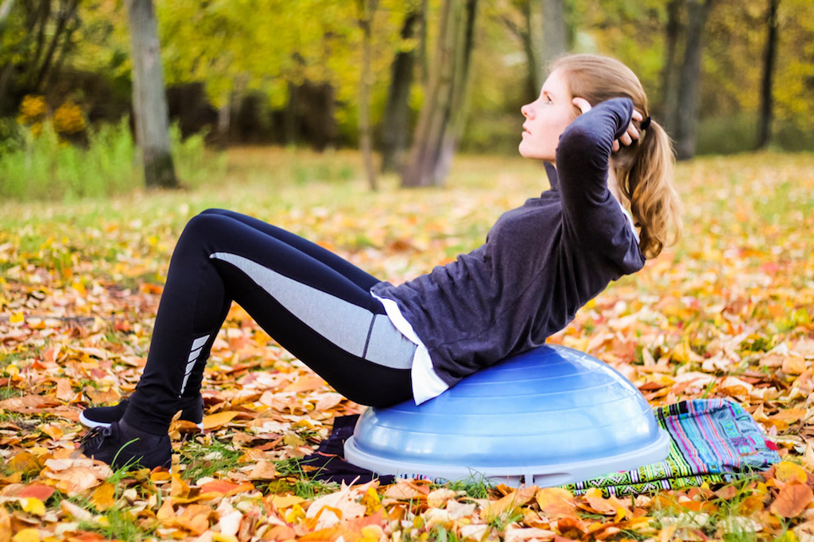
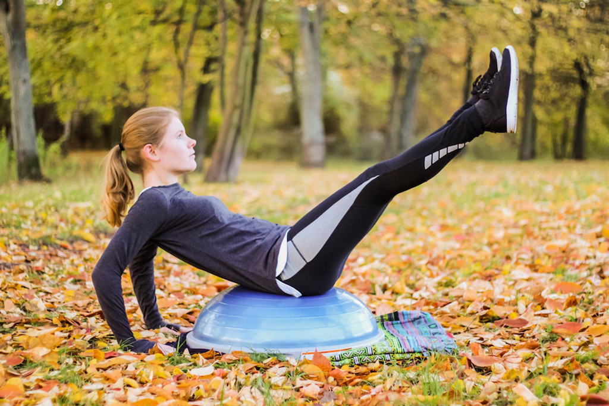

**One-legged Bridge and Single-leg Romanian Deadlifts for butt and legs:**
Lie on your back and place one heel firmly on the dome-side of the Bosu Ball, knees are bent. The other leg should be lifted straight, parallel to the other legs thigh. Lift your hips up to the sky, squeezing your glutes. Hold that position and then lower back down very slowly.

For the **Single-Leg Romanian Deadlift** stand with one leg on the dome-side of the Bosu Ball. The knee should be slightly bent. Then bend your hips and lower your torso until it's almost parallel to the ground. Extend your free leg behind you, holding it parallel to the ground. Slowly get back to the upright position. To make this exercise even more challenging, hold a kettlebell or a dumbbell in the one hand opposite from the leg that is standing on the Bosu Ball.

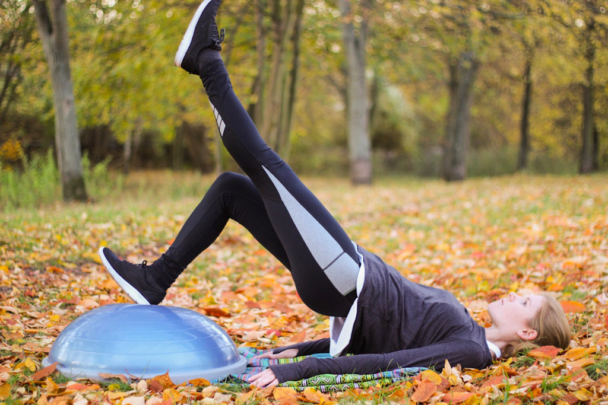
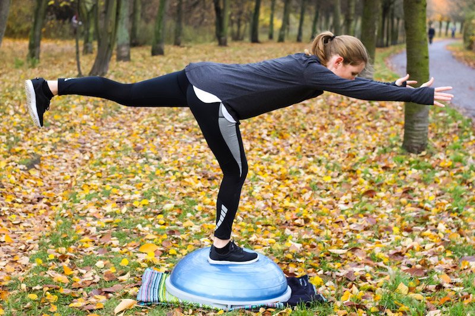

**Front Lunge for the legs:**
The Bosu Ball is placed dome-side up in front of you. Step onto it with one leg and slowly get down into a lunge position. Drive off the BOSU, pushing through your front leg. Stand back and repeat with the other leg.

**Single-leg Plank for abs and butt:**
Put your forearms on top of the dome-side of the Bosu Ball and get into a plank position. Lift one leg off the ground, keeping it straight. Hold that position for a few seconds. Make sure that your core is tight. Your stomach or hips shouldn’t be dropping.

**Side Lunges for your legs:**
Start by placing your right foot in the middle of the dome-side of the BOSU and make a big step to the left with your left foot. Then squat. Change your leg.

## Bosu Ball upper body workout

The Bosu Ball is a great tool to train your upper body. It can be used as a weight and you can spice up your classic exercises by performing them on a Bosu Ball.

**Bosu Push-Up for toned arms:**
Place the Bosu dome side up. Put your hands on the ball, come into a push-up position and get down into a push-up.

**Squat with Bosu press:**
Grab the Bosu Ball on both sides, your feet are hip-width apart and remain proportional, knees are bent slightly, glutes squeezed and shoulders back and down. Perform a squat and while doing so, press the Bosu straight out in front of you, arms are straight. Press the Bosu up overhead, as you get back to a stand.

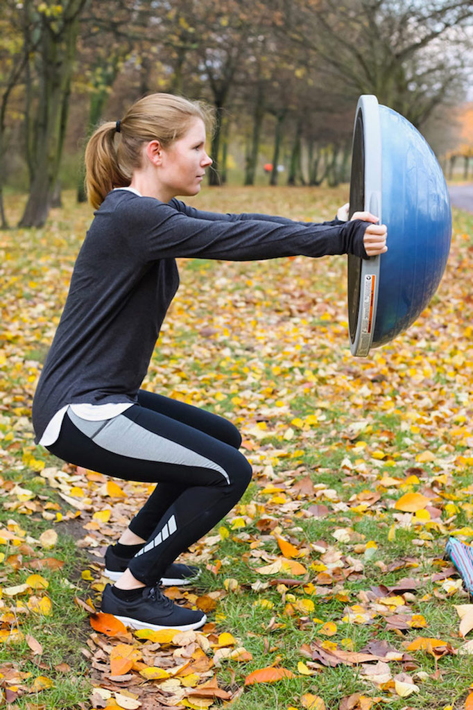
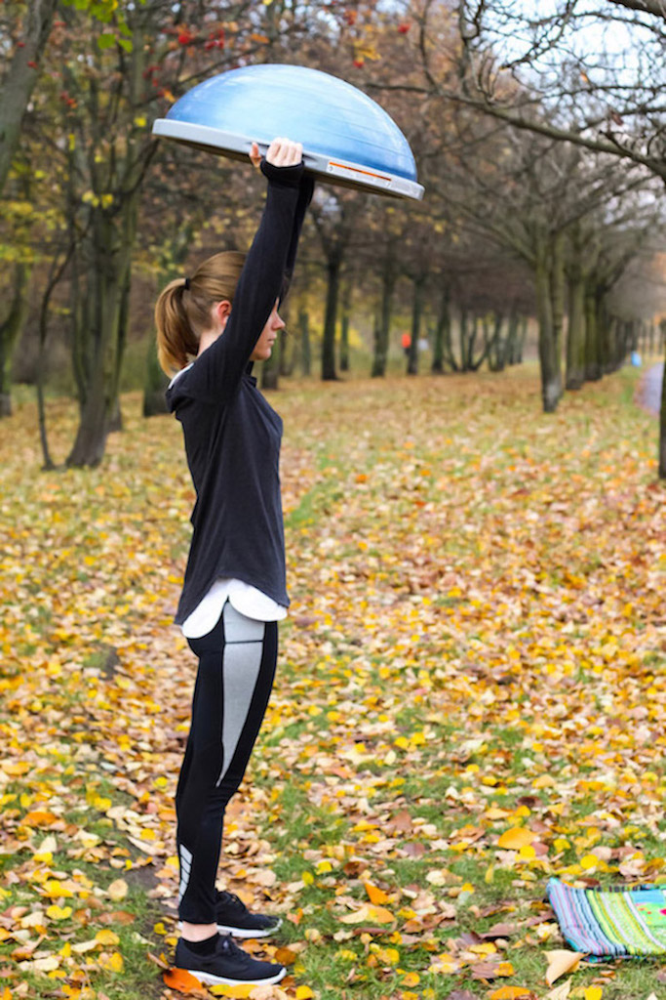

**Burpee with Bosu Ball:**
First, come into a deep squat holding the Bosu at chest hight. Place the Bosu dome side down on the ground, your hands are positioned flat on the top of the Bosu and jump back into a plank position. Then do a push-up. Jump forward and come into a deep squat again. Get up and lift the Bosu overhead. Pay attention to your core to prevent arching your back. Stay strong. Then repeat.

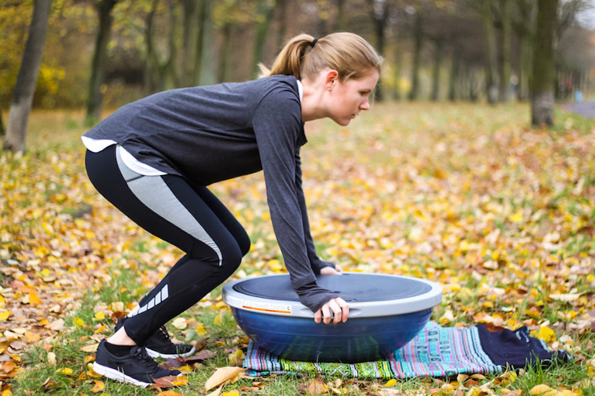
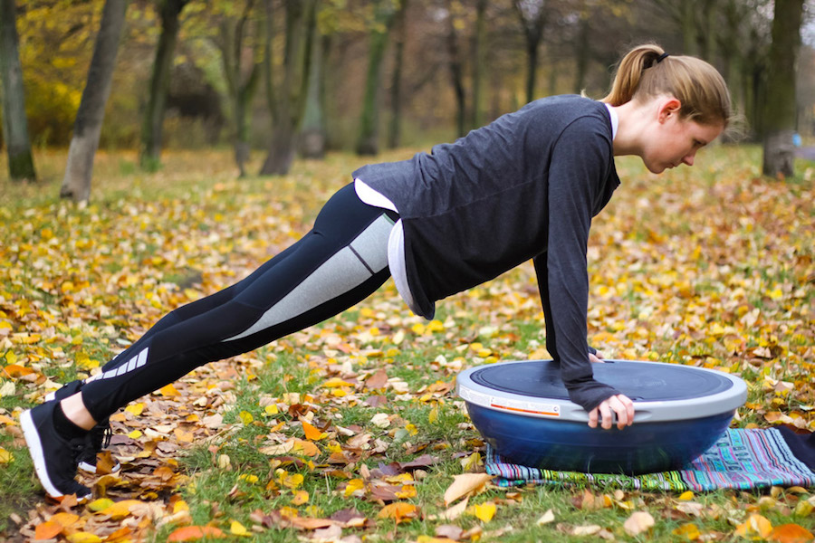

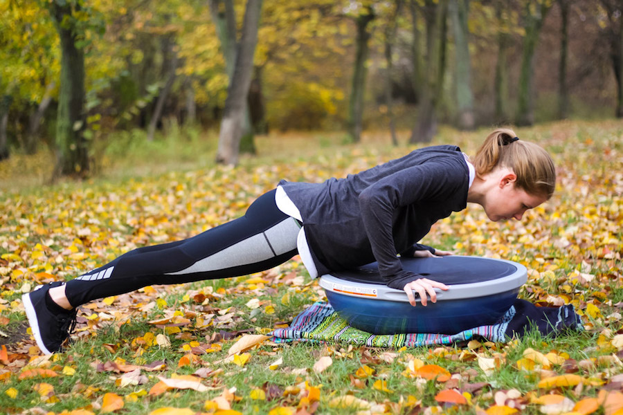
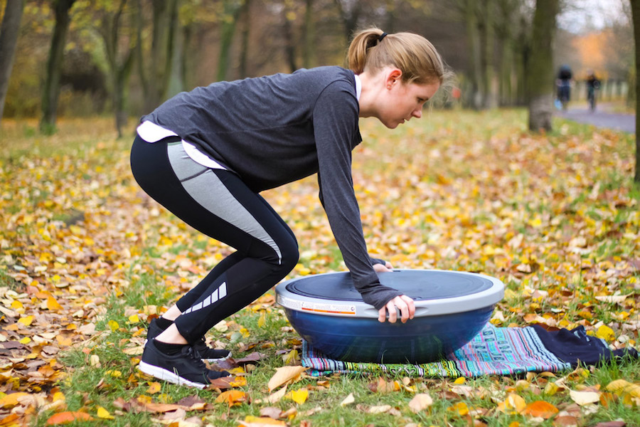

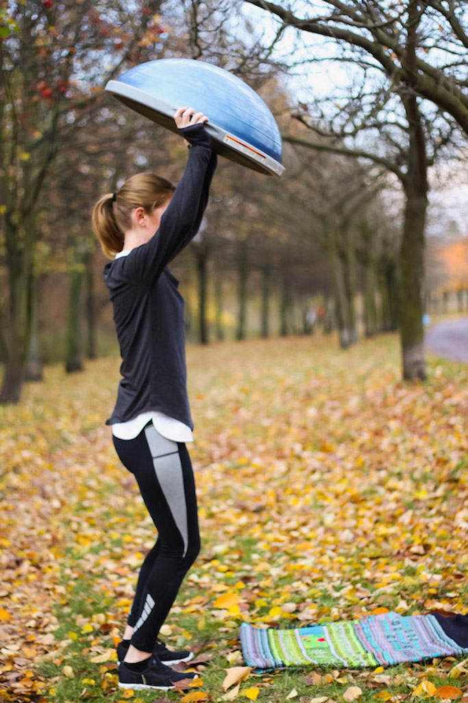

**Overhead BOSU triceps extension:**
Grab the BOSU on both sides, feet are hip-width apart and remain proportional, knees are bent slightly, glutes squeezed and shoulders are back and down. Press the BOSU up over your head with your shoulders still down. Then bend at the elbows and bring the BOSU down to the middle of your back. Use your triceps to bring the Bosu Ball back up. Always keep your biceps close to your ears.

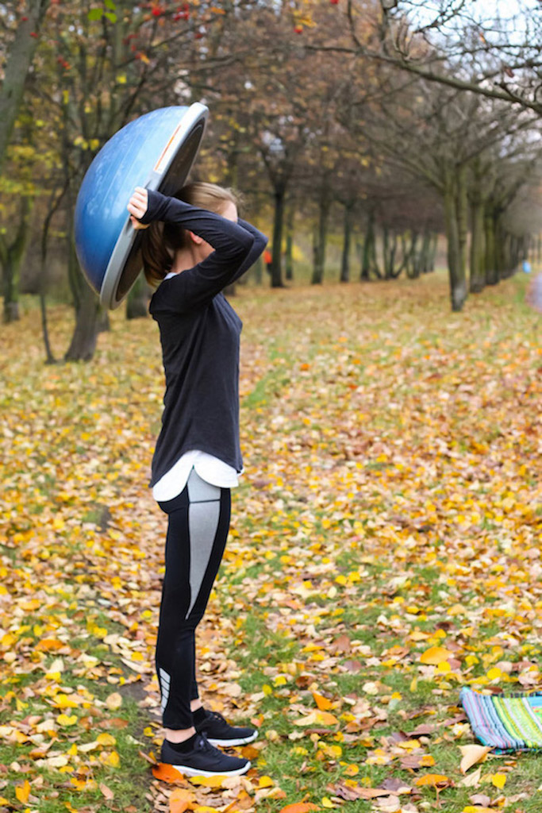

## Bosu Ball Butt Workouts

Everybody wants to have the perfect butt. These five Bosu Ball butt exercises will help you to get it. Always do a set of three with 12 to 15 repetitions and your glutes will burn!

**Bridging:**
Place your Bosu Ball dome-side down before you, lie down, back on the floor with knees bent and put your feet flat on the flat side of the BOSU. Press your arms into the ground then lift your butt up slowly. Push it up as high as you can and really squeeze your glutes.

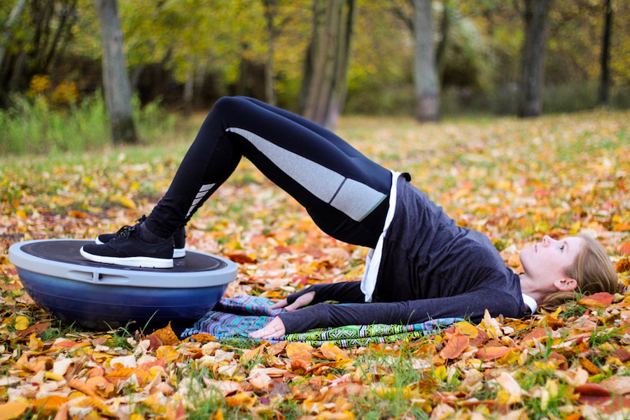

**Prone Hip Extension:**
Roll over the Bosu Ball, face down and with your hips on the dome.  Keep your arms down in front for stability and then lift your legs off the floor, extend through the hip, and then drop down again. If you want this exercise to be even more challenging, you can also lift your arms while lifting the legs off the ground.

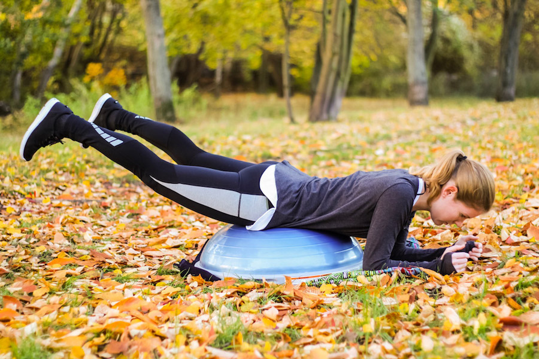

**BOSU Heel Kick:**
This exercise is great for the hamstrings and the butt. Place your knees in the center of the dome-side of the Bosu Ball, get down into an all-four position with your hands before your knees on the BOSU. Slowly lift your right knee and stretch your leg backward so that it is parallel to the ground. Then get back on the BOSU again. After you've repeated that exercise 12 to 15 times, change the leg.

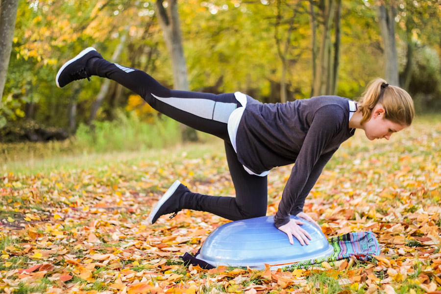

**BOSU single Leg Glute Bridge:**
This exercise targets your buttocks and your hamstrings. Lie down on the back and place your heels on the dome-side of the BOSU. Just like you did before push your butt up into the sky, then lift one leg off the BOSU and stretch it out. Get up and down with your butt. Really squeeze your glutes.

**BOSU Side Glute Kick-Outs:**
Place your knees in the center of the dome-side of the Bosu Ball, get down into an all-four position with your hands before your knees on the BOSU. Slowly lift your right knee. But instead of stretching it backward, lift it up to the side and then kick it out straight. After your repetitions do the same with your other leg.

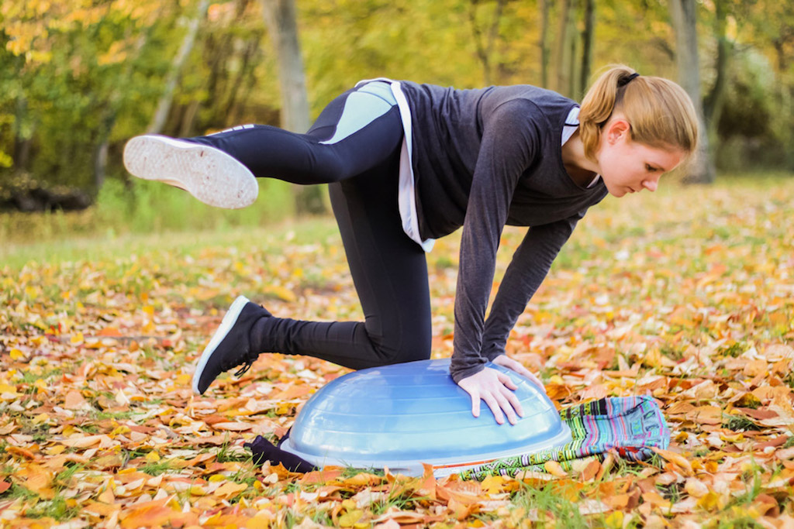

## Bosu Ball Abs Workout

We all want a tighter tummy and constantly sweat to achieve the sexy flat belly. Most of you have probably done countless crunches and other abs exercises. Adding instability to your workout, however, might give your workout the final touch.

**Crunches:**
Lie down on the dome-side of the Bosu ball with your bottom relatively close to the floor and your middle and upper part of your back at the top of the ball for back support. Bring your hands behind your head with the elbows pointing outside, your feet should be shoulder-width open. Then lift your body up. Always pay attention to your elbows; they should still be pointing outside. You don’t have to go all the way up to your knees; a little lift is enough.

**Scissor Kicks on the Bosu Ball:**
Sit in the middle of the dome-side of the Bosu Ball and put your hands behind the ball for support. Extend your legs straight in front of you at about a 45-degree angle. Keep your stomach muscles tight and your legs straight. Then cross your right leg over the left one. Before repeating this with your other leg, separate your legs in the middle.

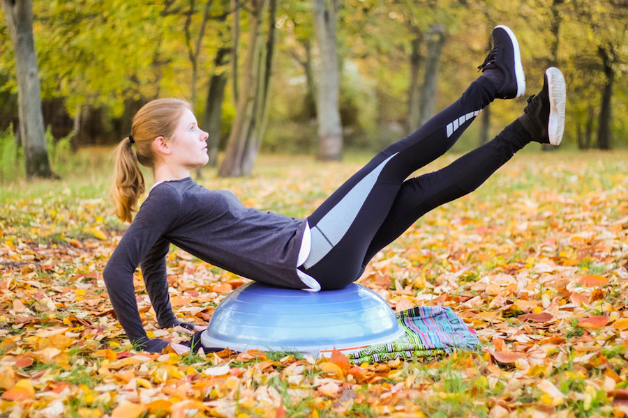

**Russian Twist on a Bosu Ball:**
Place yourself on the dome-side of the BOSU and bring your knees towards your chest. Hold a medicine ball in both of your hands. Then twist to the left with your upper body and the medicine ball. The lower body should be stable. Then change to the other side.

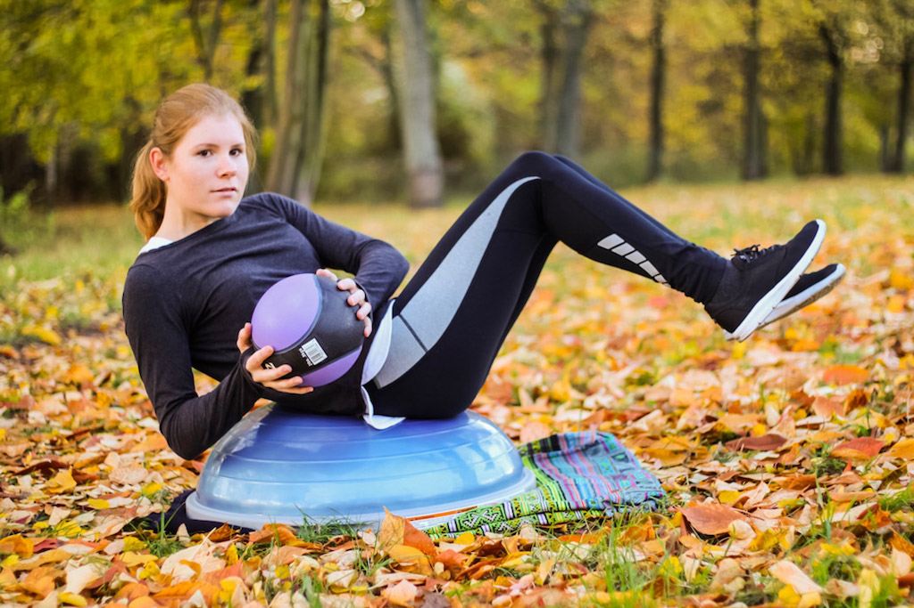

**BOSU Side Crunches:**
Lay with your hip and side on the BOSU, your waistline should be on top of the dome side. Place your hand behind your head just like you do with a classic crunch. Now lift your upper body. Your oblique muscles will be burning.

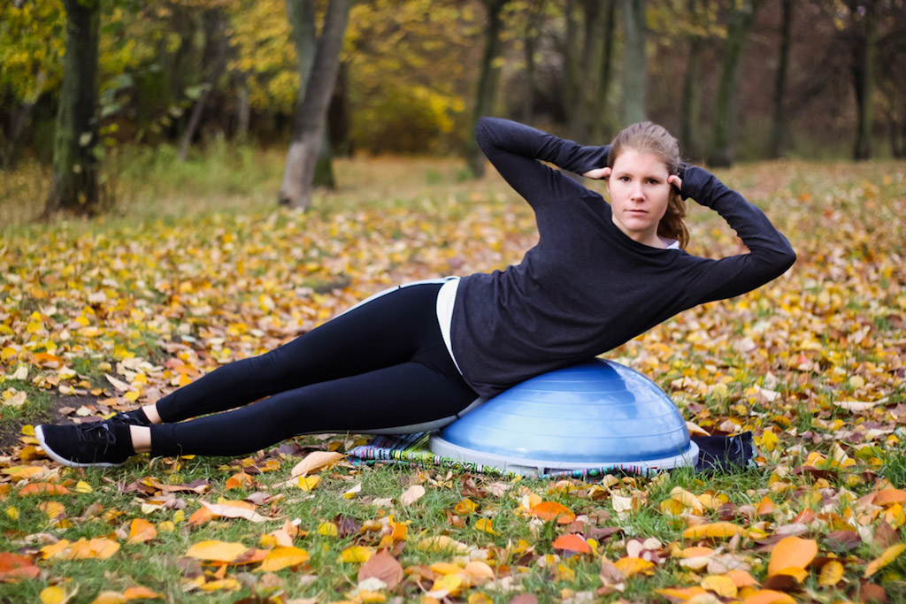

**Twisting Plank:**
Place your hands at the side of the flat side of the BOSU and come into a push-up position. Now bring your right knee to your left elbow. Also twist your upper body accordingly.

## Bosu Ball Cardio Exercises

**Mountain Climber:**
For this Bosu Ball cardio workout place, the BOSU dome-side down in front of you. Come into a push-up position, hands underneath your shoulders grabbing the outside of the ball. Now drive one knee up towards your chest, hands always in place. Bring the leg back down. Now bring the other knee up. Alternate between both legs quickly as if you were running.

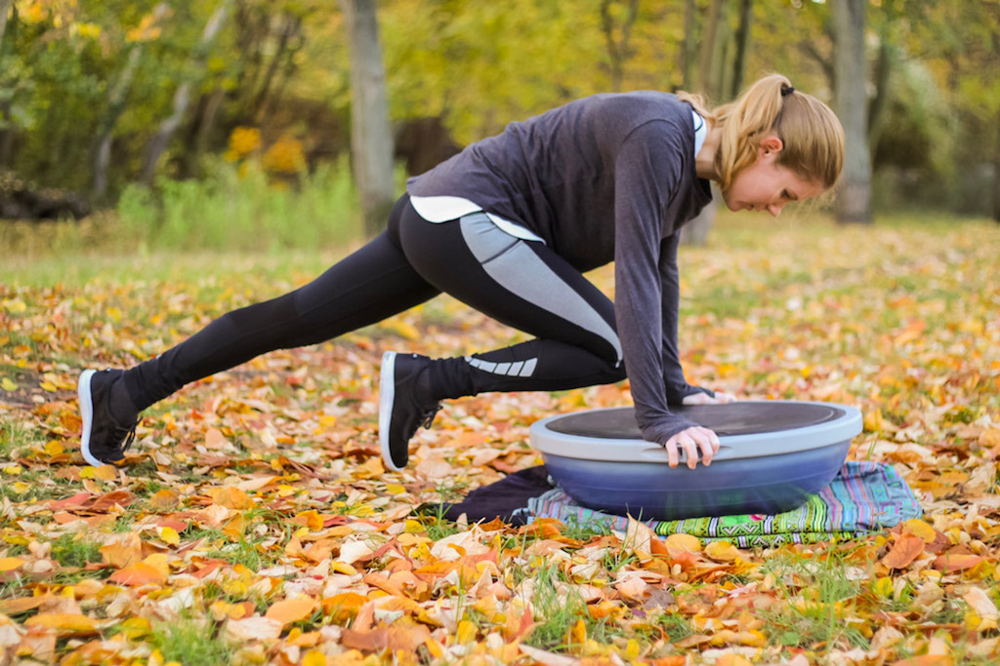

**Bosu Ball Burpee:**
Stand with the BOSU in your hands, holding it on the outside. The flat side should be facing your body. Now bend your knees and place the Bosu Ball on the ground, dome-side down. Make sure that your hands are secure on the side of the BOSU, then jump back into a push-up. Perform a push-up, then jump your feet back to the BOSU and get up again. Lift the Bosu Ball up to the sky and repeat this exercise. You can find a pictured instruction in the chapter [Bosu Ball upper body workout](#upperBodyWorkout)

**Jump Squats:**
Place the Bosu Ball dome-side up and stand behind it with your feet hip-width apart. Now take a jump on top of the Bosu Ball and come into a squat position. Hold it for just a brief moment, then jump back behind the BOSU. Repeat this Bosu Ball cardio exercise for as long you have breath.

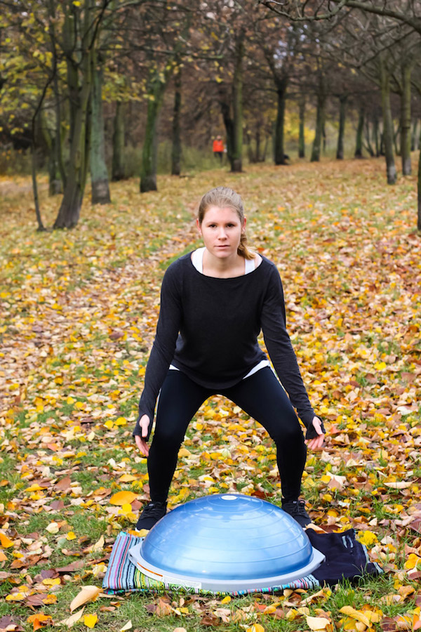
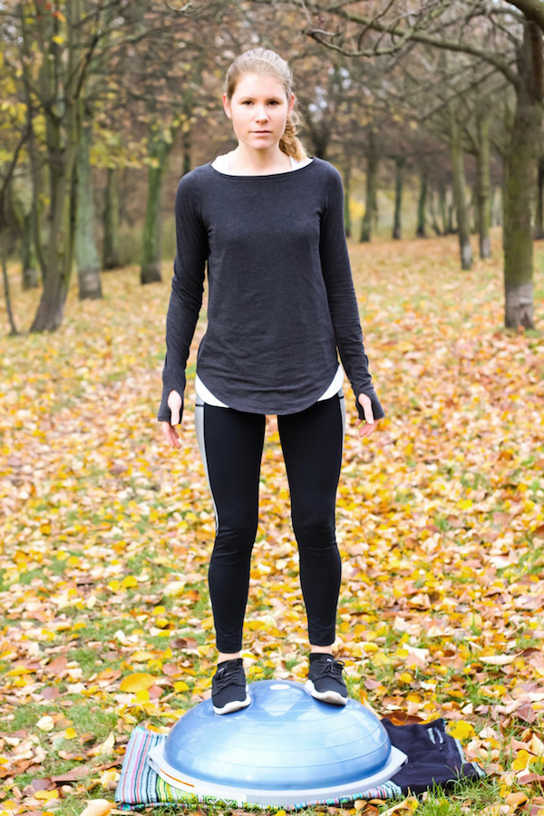

# Be careful when using a BOSU Ball

Because of the BOSU ball’s inherent instability, it is extremely important to always be cautious when working out with one. Start out slowly if you’re new to the Bosu Ball, balancing will be difficult in the beginning. Also, always use your core to stabilize your entire body.

# Calories burnt with a BOSU Ball workout

Have you ever heard of the MET value? MET means metabolic equivalence and it is a number that represents the energy used while being active. For a light or moderate Bosu Ball workout, the MET value would be around 3.5. If you’re also using some light weights or doing some aerobic movements along the Bosu Ball, the MET value would be around 8.0.
Now, how many calories do you burn during your Bosu Ball workout?
To calculate the calories burnt during a Bosu Ball workout, simply use this formula: (METs x weight in kg) x (workout time / 60).
However, one must differentiate between a woman and a man working out. One MET equals 1.05 calories burnt for a man (METm), and 0.96 calories burnt for a woman (METf). That needs to be added to the formula: METs x METm/f x weight in kg x (workout time / 60). For a woman of 56kg, working out 30 minutes with a Bosu Ball, this would make: 3.5 x 0.96 x 56 x (30 / 60) = 94.08.

# Where to buy the Bosu Ball

If you want to buy an original Bosu Ball by Bosu, you can choose between three different types: “Sport”, “Pro” and “Elite”. All of these differ in aperture, height, weight and resilience.

[Bosu Ball Trainer Sport](https://www.amazon.com/gp/product/B00MP7V3OS/ref=as_li_tl?ie=UTF8&tag=21moves-20&camp=1789&creative=9325&linkCode=as2&creativeASIN=B00MP7V3OS&linkId=6063eed74dc6246b054551428d58ab59)

* Diameter: ca. 50 cm
* Max. height: ca. 18 cm
* Weight: ca. 5 kg
* Resilience: ca. 140 kg

[Bosu Ball Trainer Pro](https://www.amazon.com/gp/product/B00BL83I22/ref=as_li_tl?ie=UTF8&tag=21moves-20&camp=1789&creative=9325&linkCode=as2&creativeASIN=B00BL83I22&linkId=10af414e7a5218203041424df39b3ca5)

* Diameter: ca. 65 cm
* Max. height: ca. 23 cm
* Weight: ca. 7.5 kg
* Resilience: ca. 140 kg

[Bosu Ball Trainer Elite](https://www.amazon.com/gp/product/B00QBW8Z08/ref=as_li_tl?ie=UTF8&tag=21moves-20&camp=1789&creative=9325&linkCode=as2&creativeASIN=B00QBW8Z08&linkId=a460e24772b86d81325a8bcd648b6ad6)

* Diameter: ca. 64 cm
* Max. height: ca. 22 cm
* Weight: ca. 8.8 kg
* Resilience: ca. 180 kg

# BOSU Ball Test

With a price of almost 250 Euro, the Bosu Balance Trainer Elite is the most expensive one of the three. If you’re simply looking for a home workout gear, this one might already be too much. With its special marking “PowerLine” and “PowerZone”, the Bosu Trainer Elite is rather suitable for professional usage, e.g. in athletics workouts.

The BOSU Trainer “Sport” is with 50 cm diameter the smallest of the three. This is extremely practical if you want to take your Bosu Ball with you on vacation. When not inflated, the BOSU Trainer "Sport" fits easily into a suitcase. However, because it's so small, the product is rather recommended for vertical workouts or very petite individuals, rather than e.g. Pilates. When it comes to the pump, reviews for the BOSU Trainer "Sport" aren't as good. Some refer to it as a "piece of junk". So you'd better get a new one. This, however, is affordable with a price of around 80 Euros.
I personally think that when it comes to price-performance ratio, the BOSU Trainer "Pro" is a perfect choice. With a price of around 135 Euro, this BOSU is a nice compromise between the BOSU "Elite" and BOSU "Sport". It is very sturdy and even if you're more than a 100-kilo, you can still jump on it. Also, the handling was complimented by a lot of users. However, as with the BOSU Trainer "Sport", the included pump is criticized.

# Further equipments for a BOSU Ball workout

To add an extra challenge to your Bosu Ball Workout, you can always opt for further supplements to get your muscles burning even more.

* [Kettlebell](https://www.amazon.com/gp/product/B0062ORZSS/ref=as_li_tl?ie=UTF8&tag=21moves-20&camp=1789&creative=9325&linkCode=as2&creativeASIN=B0062ORZSS&linkId=e12b5a4520db5eedebbfeae46a3be394)
* [Medicine ball](https://www.amazon.com/gp/product/B001DNB48A/ref=as_li_tl?ie=UTF8&tag=21moves-20&camp=1789&creative=9325&linkCode=as2&creativeASIN=B001DNB48A&linkId=7c92684dd3a4902be5f3ae0818afb2a6)
* [Further workouts](https://www.amazon.com/gp/product/1569755892/ref=as_li_tl?ie=UTF8&tag=21moves-20&camp=1789&creative=9325&linkCode=as2&creativeASIN=1569755892&linkId=9063b37a98016b6a5927875d856ae129)
* [dumbbells](https://www.amazon.com/gp/product/B008DSK434/ref=as_li_tl?ie=UTF8&tag=21moves-20&camp=1789&creative=9325&linkCode=as2&creativeASIN=B008DSK434&linkId=cbb31a2676e0cbb09f0a63e42af0aac0)

# Further Bosu Ball Workouts
There are tons of further really great Bosu Ball Workouts out there. I personally totally love these ones:

* [thelivefitgirls](http://thelivefitgirls.com/2015/10/the-best-bosu-ab-workout/)
* [paleohacks](http://blog.paleohacks.com/bosu-ball-exercises/)
* [thefitfoodiemama](http://thefitfoodiemama.com/bosustrong-6-ways-i-stay-balanced/)
* [nataliejillfitness](https://www.nataliejillfitness.com/best-bosu-ball-exercises-for-abs-and-core/)

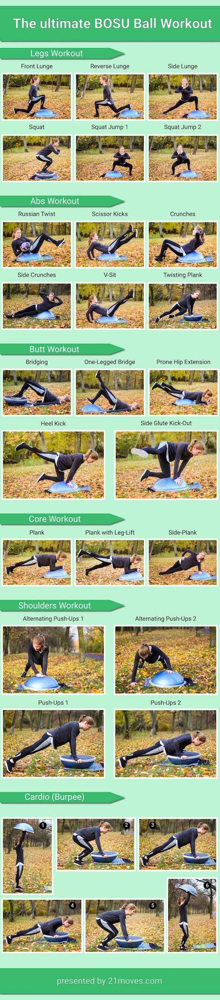
