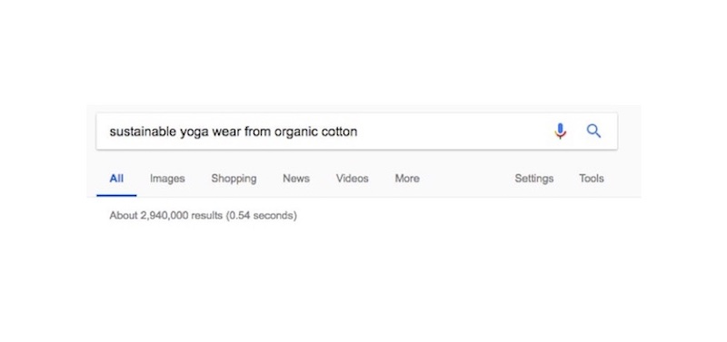
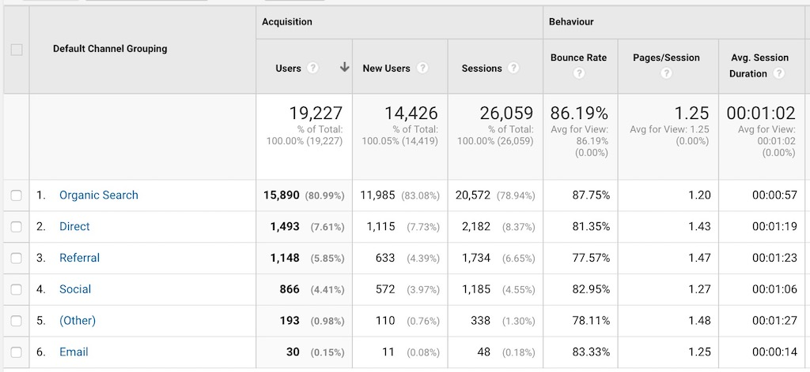
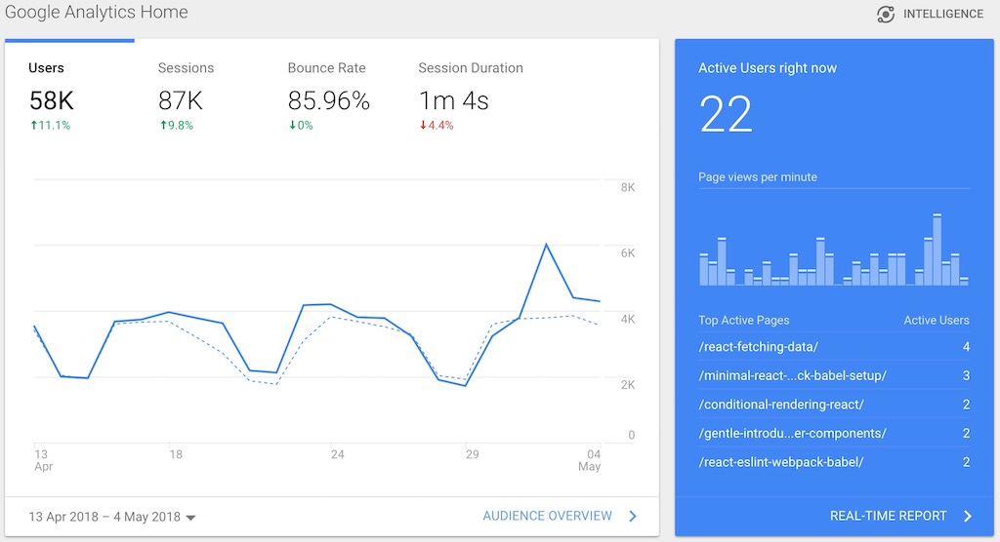

import { BlogLink } from '$components/Link';
import { Title, Subtitle, Divider } from '$components/mdx';

According to HubSpot, generating traffic and leads is one of the biggest struggle for companies. With 63%, getting people on the website it is actually their number one problem.

One approach to tackle this problem, as shown in last week’s blog post, is by starting a company blog. That’s why <BlogLink to="https://www.hubspot.com/marketing-statistics">53% of marketers say that blog content creation is their top inbound marketing priority</BlogLink>.

However, merely creating a blog doesn’t guarantee getting new visitors on your website.

A lot of people are frustrated when they start a blog and the visitors don’t show up. Of course, starting a blog is a great first step, but there is so much more to it then just writing a post now and then. You need to have a proper strategy in place to attract people to your blog.

So apart from producing great content, which is obviously the number one rule in content marketing, what can you do to increase your (company’s) blog traffic?

<Title id="promote-content">1. Promote your Content</Title>

A lot of people pat themselves on the back for a job well done after publishing  a new blog article and then shut off their computers.

However, writing blog content is only half of content marketing. How do you think people will know about you? How will they find your company’s blog?

That’s where the other half of content marketing comes into play: You have to promote your content. “Where should I promote it?” you might ask.

The first thing that comes to mind is social media. Even if you don’t have a huge following yet social media is key to becoming more visible.

You could search for relevant Facebook groups and proactively promote your content there. Or add the right hashtags as well as a captivating picture and share it on Twitter.

Pay attention to your audience’s peak social activity times and try to share your content according to these times. Don’t just share your content once on your social channels, share it multiple times.

And don’t forget to add those sharing buttons to your blog! Just don’t overdo it. Studies show that the more sharing buttons you have, the lower your conversion rate gets. So stick to the three that are most relevant to you.

Another great strategy that works well is to promote your content on forums like Quora or Reddit. Answer people’s questions and add your blog post as an extra. Try to provide as much value as possible with your content.

Pinterest is also a great platform to promote your content. And the best part is: You don’t need a huge following for it to work.

Since Pinterest works like a search engine, you just have to know the best keywords to add. Of course, that’s not all that’s to it to promote your pins on Pinterest, but read the rest about it on my big Guide to Pinterest.

<Title id="focus-on-longtail-keywords">2. Focus on long tail keywords</Title>

No guide on how to drive traffic to your website would be complete without the mentioning of SEO.

SEO seems to be fairly common knowledge these days. Keywords is the buzzword here. But while most people know about the power of keywords and the importance of the google ranking, they disregard the role of competition. Finding a keyword is easy, but the question is: Is it the right keyword? Can I actually rank for it.

If your blog is new, the answer in most cases is: No.

So how should you approach SEO then? The solution is research and target long tail keywords. Long tail keywords are three or four keyword phrases, that are very specific to the topic you’re covering. These keywords usually have a lower search volume but are easier to target as the competition is much smaller.

Thus, instead of landing on page ten on Google for a high volume keyword, try to target page one for a long tail keyword. After all, almost 95% of web traffic goes to pages listed on Google’s first page. That only leaves five percent at best for remaining search result pages.

For more information on SEO and long tail keywords, read my guide on search engine optimization.

<Title id="google-analytics">3. Use Results from Google Analytics</Title>

Most people who have a blog have installed Google Analytics to keep track of the number of visitors they have on it. If you don’t, go ahead and install it or else you’re missing out.

Google analytics is a great tool to get insights into your audience’s browsing behavior. You can see where visits originate, how long people spend on your website, or what your most popular post is. These insights then help repeat the success.

Looking at Google analytics helps you analyze where you’re succeeding, and what kind of content or sources you can leverage. Thus, it is critical to know your numbers.

<Title id="guest-posts">4. Write Guest Blog Posts</Title>

Writing guest posts is a great way to drive traffic to your website. It spreads your brand to new folks and earns you a link and reference back to your site at the same time. This will not only bring you new traffic but also help your search ranking.

When looking for guest blogging opportunities it is important to find sites that have a relevant audience for you. Only if you can target the right type of audience, your post will show an effect otherwise you will just see it fizzle.

Thus, invest a little time into researching your target site. Investigate the type of content, look at comments and social shares, and research the makeup of the audience.

Also, check your target blog’s <BlogLink to="https://moz.com/learn/seo/domain-authority">domain and page authority</BlogLink>. The higher the authority, the more valuable the site  for your link-building efforts.

The downside to guest blogging however, is that especially in the beginning when you’re still small it can be tough to convince people to let you publish content on their site.

<Title id="be-consistent">5. Write more and be consistent</Title>

Studies show that the more often you update your website, the more traffic it will receive. HubSpot found out that B2C companies that <BlogLink to="https://www.hubspot.com/marketing-statistics">blogged more than 11 times per months got more than four times as many leads as those companies that only blogged four to five times per months</BlogLink>.

Updated content also puts you in favor with Google as Google gives higher priority to websites with fresh content.

<Title id="best-content">6. Create the best Content you can think of</Title>

I have emphasized this so often: Content is King. Thus, if you want to increase your website traffic and want your readers to stick with you, you need to create the best content you can think of.

Create content, that people are actually interested in by researching your target audience’s  questions on forums or social media channels.

Create visually appealing content. Leverage the power of pictures.

Add interesting statistics.

Craft headlines that make people want to read on.

And last but not least, try to create evergreen content: content that doesn’t get old and can live on the web forever.

If you’re having trouble coming up with content that people want to read or if your blog resembles a ghost town rather than a lively content platform - I am here to help. Together with you I will create a content strategy and help you get the word out  about your company.

