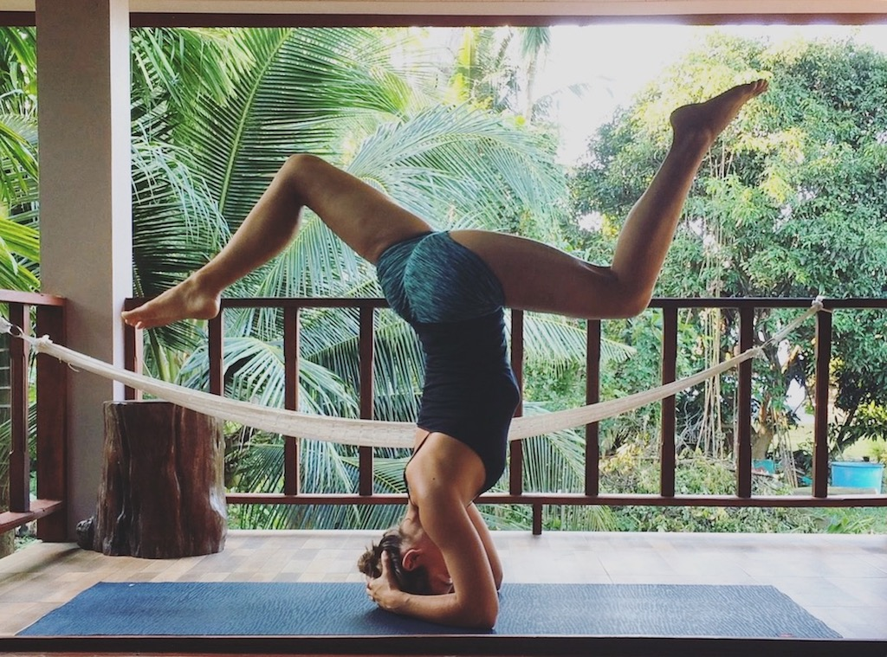
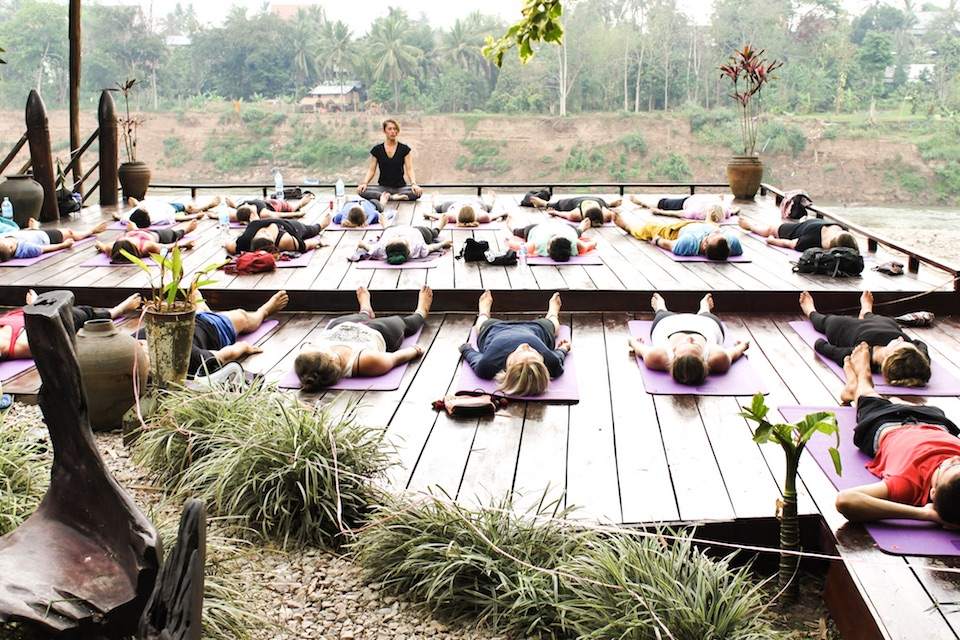
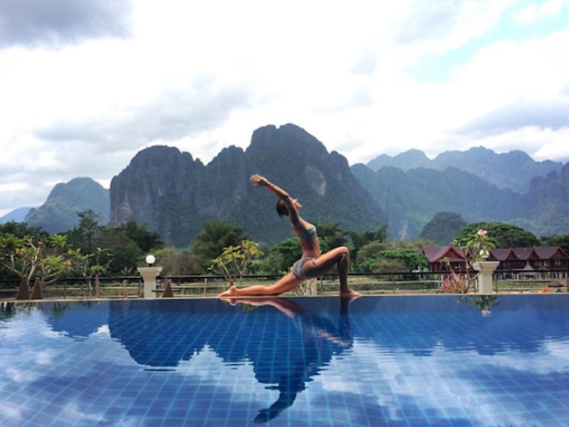

While I was traveling in Luang Prabang, Laos, I had the pleasure to meet Tasha from [Tasha plus Yoga](http://tashaplusyoga.com/). Tasha is a traveling yoga teacher from New Jersey who has been traveling for more than one year by the time I met her. She was a teacher at [Utopia Bar](https://www.21moves.com/yoga-luang-prabang-laos-utopia) in Luang Prabang, where I met her. I was lucky to be able to take two classes of yoga with her and I immediately felt connected to her because of her gentle style of yoga, her beautiful flow, and her peaceful attitude. When I asked her if I could interview her for my blog, she was immediately willing to go for it. In this interview she shares her story of how she got into yoga, what it's like to be traveling so much and how she found her first yoga teacher gig while traveling. I hope you'll find her story as exciting and inspiring as I do!

# Getting to know Tasha

> *"My career was not bringing me the happiness or lifestyle I craved.*"

**Hi Tasha, could you first tell us a little bit about you? Where are you from originally?**
I was born in Arizona, but lived my whole life on the New Jersey coast!

**What did you do back home?**
My previous career was Interior Design and decorating work.

**When and why did you decide to quit your job? Was there a specific reason?**
I had the desire to leave long before it was feasible, but I eventually left the USA on New Year's Eve 2015. Although I still hold love and passion for design, art, and architecture, my career was not bringing me the happiness or lifestyle I craved. I commuted a long 3-4 hours total daily. My job consisted of mainly work on a computer in an office, not the creative outlet I hoped it would be. I had no life balance for my own personal pursuits and pleasures, not enough sleep, and not enough time for my own yoga practice.

**So you decided to start traveling then. How long have you been traveling?**
It will be one and a half years end of June!

**Where have you been traveling?**
My travels began in Europe, starting in London, a small trip through southern Germany, Belgium, Netherlands, and ending in Portugal. I then flew to Asia, beginning in Nepal, Thailand, Laos, and am now in Cambodia!

**One and a half years is a long time! How many countries have you seen so far?**
Including one other trip to Europe a few years ago, 12 in total!

**What would you say, how has your life changed while traveling?**
It has changed massively! It's a very alternative lifestyle, how I live, but I can now say that I am truly living each and every day, pursuing something so dear to me, cultivating my own happiness and joy, rather than filling someone else's pockets with cash!

# Tasha and Yoga

> *"Post-breakup and coming out of a long depression - that's when I decided to go for yoga."*

**When did you start to do yoga?**
I began with my first ever yoga class in March of 2014.

**Can you tell us what brought you to yoga?**
While on a trip to a California, post-breakup and coming out of a long depression, I decided to go do a very "Cali" thing - sunset beach yoga! And although a basic class, the feeling I had afterwards while watching the sun set, I will never forget.

**And when did you become a teacher?**
I completed my official training in February 2016. Prior to this, while still in my past corporate life, I was leading informal chair yoga and meditation sessions out of our conference room!

**Where did you do your teacher training?**
I completed my 200 hour teacher training at the Sivananda Yoga Centre of London.

**A lot of people are eyeing with the thought of doing a teacher training but don't feel like they've been practicing long enough. How long had you been practicing when you started your teacher training?**
Just under two years. You don't have to be perfect when starting your teacher training. You will learn so much during that time and you can always decide afterward whether you feel ready to be a teacher or not.

**Have you been teaching right away?**
After my training, I began by assisting in my local studio, and also began a MeetUp group to teach small classes in local parks of London!

**How did you get the idea of teaching and traveling?**
It happened by accident! I moved to London to do the TTC, but due to visa issues I had to unexpectedly leave the country! I went to Germany to visit a friend, and that's when I began seeking yoga opportunities through Europe!

**Do you feel that yoga is different in each country you teach?**
Every yoga class and teacher is unique, but yoga is a universal practice. Modalities and styles may vary, but the underlying current and parallels exist amongst all yoga.

# Traveling and Working as a Yoga Teacher

> *"I honestly don't think that I will ever get used to a normal life without traveling again."*

**I imagine it must be difficult finding yoga teacher jobs while traveling. How did you land your first gig?**
I was in Germany with no where to live, and so began scouring the internet for yoga jobs. After finding a few good resources and and a slew of emails later, after just 3 days I was thrilled to learn I'd be in Portugal for the summer teaching!

**Generally, how do you find jobs?**
There are many great resources online for both paid and volunteer gigs. My personal favorite is [Yoga Trade](https://yogatrade.com/). There are also groups on Facebook that post job listings for traveling teachers.

**Do you work for money or accommodation then?**
The majority of my work is volunteering in exchange for accommodation and food. Occasionally a paid opportunity arises, but it is difficult to find short-term paid teaching.

**If it's not for accommodation, do studio owners provide one or how do you find places to stay? Where do you usually stay then?**
Typically, I will find local guest houses or bungalows/flats in the area, and negotiate weekly or monthly rentals. Tip: if you teach early in the morning, stay close to your center! You'll be glad you did!

**How often do you have to teach? Do you only ever teach at one place?**
I only ever teach one location at a time, and classes can vary from 1-3 per day, dependent on their schedule.

**Is it possible to live from teaching yoga while traveling?**
So far! I have very little savings, but with volunteering arrangements, it's easy to not spend your money if you're frugal like I am! Although I will likely be going to Australia for the working holiday visa to replenish the travel budget soon!

**Since you're traveling all by yourself, do you find it hard to manage everything on your own while traveling, like preparing classes, traveling and finding places to stay as well as finding new jobs?**
Absolutely not! I have nothing but time for myself. That's the beauty of this lifestyle. I'm not trying to "fit in" yoga around another job or life. I dedicate my life to travel and teaching, and when you're passionate, it never feels like work! But constantly moving month after month does get tiring, so taking holidays to yourself between volunteering or work is still very important, or setting down places for a few months is also nice.

**So when you started traveling, did you actually know what you were doing? Did you always have the idea of combining yoga and traveling? Did you have a “business” plan in mind?**
Do any of us *actually* know what we are doing?? I sure as hell don't! No business plan, no travel plan. I typically am at a location, and about a month before my time is up, I will set up my next gig. I never really have a plan more than a few months out. I had never traveled or backpacked properly in my life. So I've had to learn it all the easy and hard ways!

**Now that you've been traveling for such a long time, do you think you will ever get used to “normal” life without traveling again? Maybe even in a corporate job?**
I honestly don't think so... the idea of a corporate job is actually quite nauseating, and would only be out of desperation for money. I am not opposed to "settling down" or "living" in a single place again, but I would likely still want to drift a few months a year. Thankfully, all these things are far from my thoughts and not needed at the moment!

**What do you think will your future look like?**
This is a question I both contemplate and avoid. I am not about future planning, as circumstances of life are so unpredictable. Planning can lead to too much distraction for a future happiness rather than being immersed in your present state, and cultivating happiness here and now. But I could potentially see myself with a spiritual partner, perhaps another teacher or someone involved in the spiritual and holistic world, perhaps a family, perhaps my own retreat center or yoga studio, perhaps I stay free and floating about the universe with no strings attached...Lots of "perhaps" and no plans is how I like it! I allow the universe to unfold for me.

**Do you ever think about a lack of security e.g. with regards to your pension? Do you have any financial precautions while working remotely?**
Honestly, financial security is not something I ever think about. No plan, no back-up plan, no emergency oh-shit plan (I guess that's what credit cards are for!) Growing up, my family was quite poor, but we were all warm, fed, and most times happy. These are the values instilled in me - there was never financial security, or the desires to amass mountains of money. If you have food and clean drinking water at your disposal, which most us Westerners do, we're better off than more than half of the world. I am grateful to the ends of the earth that my family instilled these values in me rather than materialism. To some, this is reckless. For me, it's normality. Is it any different than living paycheck to paycheck as I did in my corporate job? No!!!

**Besides from yoga, do you work on other projects that let you earn money?**
When I first left the USA, I did continue a small amount of remote work for my old job, which was a nice couple pennies now and again. But too much of that corporate energy and anxiety was bleeding into my new life, so I let it go.

**What would you advise someone who wants to become a (digital) nomad?**
You must have a very deep level of acceptance. Accept the lack of stability, unpredictability, different standards of living, inferior Internet connections. Use your remote work to live the life you really want. Doing remote work but still being a slave to a system doesn't change a thing, no matter the view you have from your window or the type of currency in your pocket. Also, embracing the fear of the ride. Alternative lifestyles are possible, but their frightening! But in the way of a roller coaster ride - I'm scared shitless, I have no idea what's over this next hill, it's maybe going to make me pass out, yet I can't wipe this smile of excitement from my face!

**Do you still have an apartment at home where you could go back to?**
Yes! This is my hidden bit of help and "security" as I travel. I do own a home which I rent to a lovely family, so this very small bit of rental income allows me to keep going. I don't save a dime, but I haven't had to skip dinner yet!

**Thank you so much for the interview!**