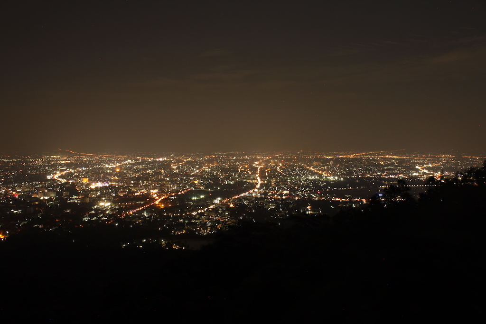
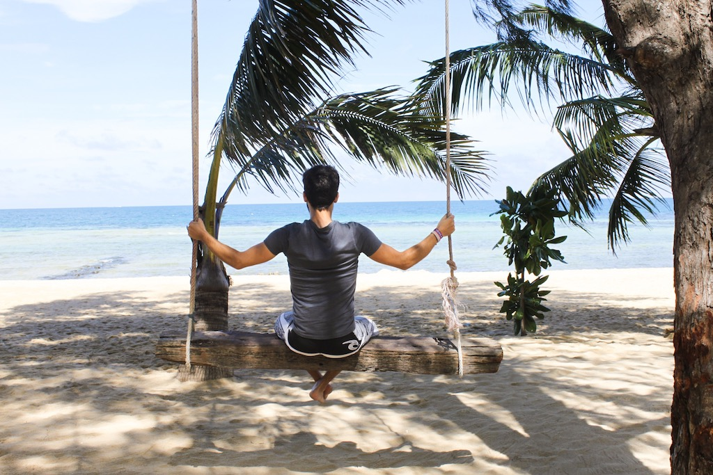
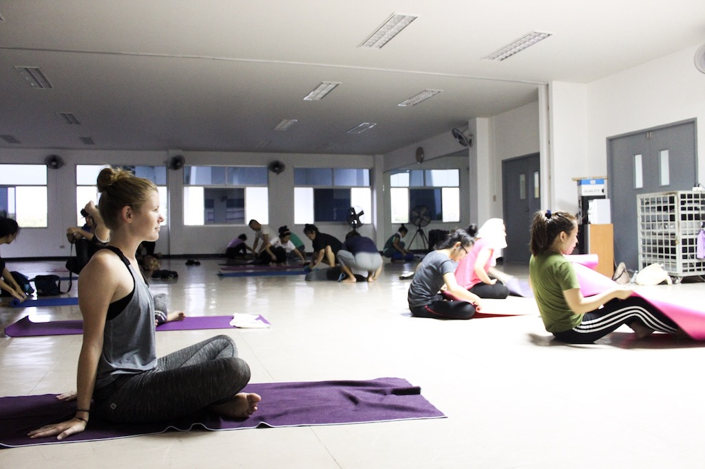
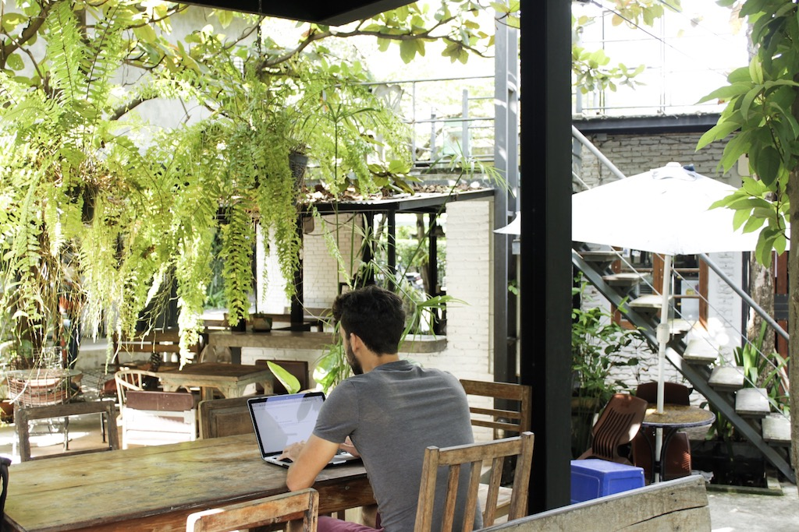
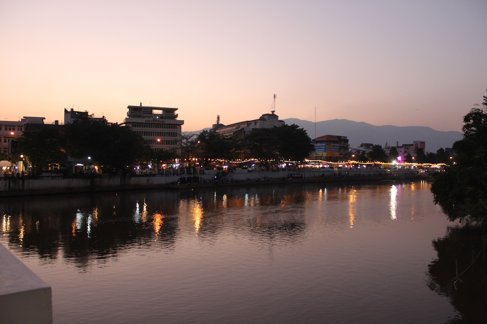

In April of 2017 we visited Chiang Mai for the first time. We actually already wanted to go there six years ago, however a nasty food poisoning didn’t allow it. This time, we were determined to make it. We booked our accommodation on Airbnb and checked out how to get to Chiang Mai the easiest way. We ended up not taking the easiest way though, as we wanted to stop in Sukhothai, a little town with amazing temples. That’s why we took the train which took us about six hours from Bangkok to get there and another six hours to get to Chiang Mai.

When we got to our apartment, we were so happy to see that we had landed in the greatest area of Chiang Mai: Almost no tourists, amazing (and cheap) coffee places and the best (and again, cheapest) food ever. Also our apartment didn’t disappoint. It was on the Chiang Mai University campus, so it was packed with students who were all so friendly. While staying there, we found out that it is actually quite cheap to rent a one-room apartment. If you stay there for a month, it’s only around 300$ and obviously it gets cheaper the longer you stay.

However, it wasn’t only the great apartment or the cheap prices that convinced us to start our digital nomad adventure in Chiang Mai. There are a couple of things that we truly value about Chiang Mai.

# Chiang Mai’s Digital Nomad Culture

Chiang Mai is famous for its digital nomad culture. So many nomads are coming here every year to start their online business or promote their products. You can find them everywhere, in coworking spaces, cafés, in shopping malls or at the airport. That makes it very easy to connect and it is usually really interesting to hear what others, who are trying to establish the same lifestyle as you, are hustling with. There are also almost daily meet-ups for digital nomads, which makes it fairly easy to get to know people. However, always keep in mind that even though people are super nice and talkative, in the end a lot of them will try to sell you on their business, which makes it harder to focus on your work and differentiate between people who are really interested in you and those who just want to sell their product.

# Chiang Mai Infrastructure

Getting around in Chiang Mai is so convenient. You can rent a scooter for the cost of 2500 Baht per month (we found that to be the cheapest) and drive yourself. However, always consider the traffic. It’s crazy in Chiang Mai (maybe not as crazy as in e.g. Hanoi, though) and you’re most likely going to be pulled out by the police at least once, so make sure to have an international driver's license and never ever have too much money in your wallet. If you only have 300 Baht, the police will usually be fine with that, whereas if you have 1000 Baht, don’t expect a change.

If you don’t want to drive yourself, you can always order an Uber or Grab (the asian version of Uber), which are quite cheap.
You will probably also see red trucks driving around. They usually cost 30 Baht per person, but make sure to just hop on without asking how much it actually is. That will most likely increase the price.

Another great thing about Chiang Mai is that the airport is so close. It has really good connections and there usually isn’t a lot of hassle at baggage drop-offs or at security screening. So you are able to get around in Thailand and outside of the country very quickly and easily.

# Awesome Lifestyle in Chiang Mai

We immediately fell in love with Chiang Mai when we first came here. People are so much friendlier than for example in Bangkok or the south, you have great coffee places and restaurant as well as (food) markets, and there is a broad variety of fitness offers from yoga to boxing, weight training, or swimming. And let’s not forget to mention the massages. You’ll get one hour for $5 here!

Another thing that was really important to us was the fact that Chiang Mai doesn’t have a beach. This may sound strange to you. Who doesn’t love beaches, right? And don’t get me wrong: We love the beach! But we were really determined to get things done here! The beach would have been a massive distraction. And we felt that although Chiang Mai obviously doesn’t have a beach and isn’t even close to one, it offered the perfect lifestyle for us. Which brings me to my next point.

# Taking Trips to the Beach from Chiang Mai

As I already mentioned, Chiang Mai airport is very conveniently located and has good connections that are pretty cheap, too. So it’s easy to take a weekend off and fly to the beach. That was our reward for working hard during the week. We’d book a nice hotel for two or three nights and enjoyed our free time. During that time we knew that it was ok to simply do nothing and relax. There was no work, no emails, or online-courses. We found that it was much easier to unwind, knowing that we had worked all week and deserved a treat.

# Taking Trips around Chiang Mai

Apart from our trips to the south (for example to Koh Phangan), we took the weekends to explore Chiang Mai’s surroundings. The north of Thailand is beautiful and has a lot to offer. We would just take our scooter and drive up to Pai or Chiang Rai and stayed there for two nights or do a one-day trip to the Sticky Waterfalls or Doi Suthep, which also has a great hiking trail.

# Yoga in Chiang Mai

Fitness is a daily must-do in our lives and also yoga has become an important part of my fitness routine. However, yoga in Germany is expensive! When I came to Chiang Mai for the first time, I tried [YogaAnanda](https://www.yogaananda.net/) at Nimmanhaemin and loved it. The instructors are so good and every class is so fun as they are always in a good mood. And you won’t believe how cheap the classes are: For one class you would pay 250 Baht, which is around $6.50. If you’re staying longer it definitely makes sense to buy a package straight away. 20 classes are as cheap as 2500 Baht, which means you don’t even pay $3.50 per class. Talking about a bargain! And I even found a cheaper option than that, with a price of 30 Baht!

**7. Amazing Chiang Mai Coffee Places (to work from)**

Maybe you only knew Chiang Mai as the place for digital nomads but it actually also has a serious coffee culture. The coffee is so good, however the prices aren’t as cheap as they used to be. Depending on where you’re going, a cappuccino might cost you around $2 (which is actually around the price that you would pay for a small cup in Germany as well). But of course you can also find cheaper places. By far our favorite place (and we’re telling you our biggest secret here!) was Sodecafé on Suthep Road. A cappuccino is 35 Baht and it is so good! You also have a lot of food places around that are usually also only around 35 to 50 Baht per dish. Sodecafé is also a great place to work from. The owner is super nice, a lot of local students are hanging around there, the tables are as ergonomic as it can get at a coffee place, and there are fans to cool you down everywhere, because it’s actually an outdoor place. The only downside is that the Internet isn’t very reliable. Still it does its job.

Another great coffee place yet working place as well would be Camp at Maya’s. It is huge and packed with students and digital nomads. The sitting accommodation is great and the internet fast. However, you have to buy a drink or something to eat for at least 50 Baht for two hours of Internet. For a cappuccino you would pay 75 Baht. Of course, there are many more places to go to as really almost every café has Wifi.

# Chiang Mai has a lot of Coworking Spaces

As Chiang Mai has such a vivid digital nomad community, it’s only natural that there are a lot of coworking spaces. The most famous one would probably be [Punspace](http://punspace.com/), which starts at 289 Baht for a day pass. If you know you have to get shit done, need to do a Skype call with a quite room and a reliable internet connection, or really need to focus on your work, this is your place to go to. Punspace is also not too crowded, so the working atmosphere is quite nice. The only thing I was missing was coffee. They offer instant coffee, but for any “real” coffee you have to pay extra again.

# Great Accommodations in Chiang Mai

Finding an accommodation in Chiang Mai is pretty easy. Now that we’ve been here twice, we would suggest to come here and book something in advance for a couple of days and just walk into all those condos and ask for accommodation. A furnished condo of 30 square meters in Nimman for example would start at around 7500 Baht per month, which isn’t even $200! Usually, the longer you stay, the cheaper it gets. Most condos also have a little gym with a treadmill, a stepper, a bike, and some weight machines, and some even have a pool. In addition, you’ll usually find washing machines (around 30 Baht) and water supply (1 Baht / 1 liter).

# It still feels relatively local

Chiang Mai has become quite famous not only for its digital nomad culture but also for simply being a great tourist spot. We totally get that: Chiang Mai’s surrounding is beautiful, the old town is nice to see, too, and the markets are great for tourists who like to shop. But despite all that, Chiang Mai still feels relatively local, especially compared to busy Bangkok. If you don’t spend too much time in the old town, you will realize that there are corners where almost no tourist can be found because only the locals know about them. Especially the district where we lived (Temple District), was very local and packed with Thai students. That’s why this district was so cheap, too. It’s the place where you still get local prices!

All these facts made Chiang Mai the perfect place to start our digital nomad adventure. Have you been to Chiang Mai as well? We would be keen to hear your thoughts about it and your secret tips!

So, if you are a digital nomad already or want to become one, follow me for insights into this amazing lifestyle. I want to provide you with all the information that are necessary to get started with your online business. Along the way, you will find out about marketing tips to launch your idea and facts to create your personal brand.

I want to share my knowledge with you from zero to location independent. I experience all these things first hand for you, but also want to deliver case studies about our travels and others living this lifestyle as well as insights into my ideas and projects. So follow me on my journey on [Instagram](https://www.instagram.com/i_am_liesa/) or stay updated about the latest Marketing tips and nomad hacks on [Facebook](https://web.facebook.com/iAmLiesa/).

