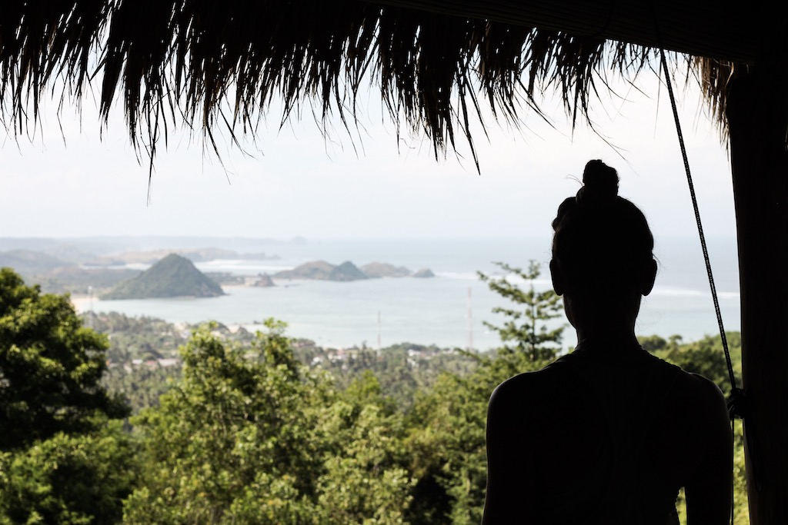
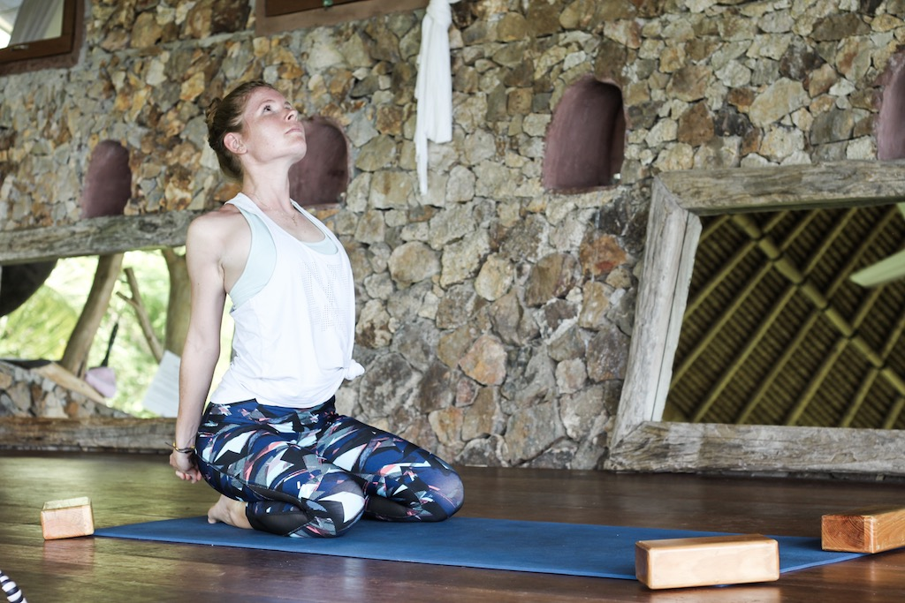
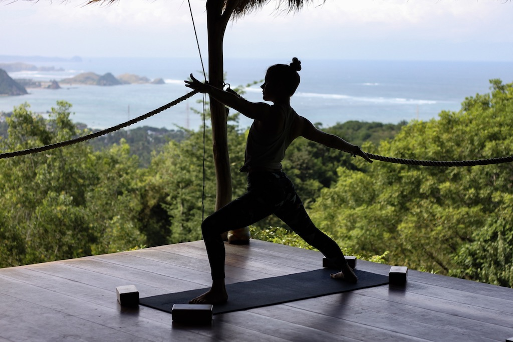

After being in Bali and checking out all these great yoga places, I thought it couldn’t get any better - if only, I thought yoga classes would get worse. My, was I wrong.

Our next stop was Lombok, Bali’s not so well-known but equally amazing little sister. There, we stayed in Kuta Lombok, thus in the south of the island. Naturally, the first thing that I did was looking for yoga classes. I didn’t have to search for long as there were giant poster for all kinds of yoga classes. I quickly checked some reviews on the internet and decided to try Ashtari Oceanview. Today I want to tell you all my experience at Ashtari Lombok and show you a little yoga sequence I filmed there.

# Yoga at Ashtari Lombok

Ashtari is not only a yoga place. It is also a Restaurant with the most amazing healthy dishes. Having a great breakfast with the most amazing view on the ocean is all you need to start the day right.

Ashtari offers several different yoga classes, from the classic Hatha and Yin yoga to Power Yoga and Vinyasa Flow. As usual, I tried Power Yoga and the Vinyasa Flow.

The class took place on a little terrace overlooking the ocean. Doing yoga at such a serene place was amazing. I could barely take my eyes of the blue water surrounded by mountains. Usually, around five to ten people attend a yoga class at Ashtari Oceanview and there would probably not be space for a whole lot of more students. This is really nice because it creates a really comfortable and relaxed energy.

# The Yoga Class at Ashtari

Classes at Ashtari start at seven am. The last one would be at five pm. I loved taking the morning classes because that way you could first take your yoga class and then enjoy a delicious and healthy breakfast afterward.

Contrary to other classes I have taken on my trip, classes at Ashtari were solely taught by indonesian people and not by traveling yogis. I enjoyed that a lot because I find it so interesting to see what yoga is like with people of different cultures.

The flow the teacher created was challenging enough for beginner students while leaving space for more advanced students to push themselves more and get into advanced poses.

The Power Yoga focussed on the core which for us traveler is such an important part of the body. I usually do a lot of core exercises, still the ones that the teacher made us do were super challenging for me. Holding positions for a longer time or slowly transitioning from one pose to another isn’t usually something I do when working my core.

# Everything else you need to know about Yoga at Ashtari

**When should I be there?**
If you want a front row spot with ocean view, I would suggest you to be at Ashtari a couple of minutes before class starts. Classes fill up quickly and of course everybody wants a front row spot for an amazing view.

**Do I need to bring props?**
You don’t have to bring anything. Ashtari provides mats, straps and blocks. Even the nice ones from wood. These are necessary though, because it can get pretty windy and all the other blocks would just get blown away.

**How much does one class cost and how long is it?**
One class costs 100k IDR, which is around 7,5 US Dollar. Depending on the class you take, it’s one hour or 1.5 hours long.

**Is there a discount if you come more often?**
Yes, there is. You can buy a 3-class pass for 250k IDR, giving you a 50k discount, a 5-class pass for 400k IDR, and a 10-class pass for 700k IDR. These passes are also transferable, so you could share them with your friends. If you’re staying longer in Lombok, you also have the opportunity to get a monthly unlimited pass for 900k IDR.

# A little Yoga Flow to move along

This video was taken at a beach not far from Ashtari. We took the motorbike and only had to drive around ten to fifteen minutes to get to this beautiful place. It was an amazing day and we had the beach all to ourselves.

Start in puppy pose, meaning you have to get in an all four position, then lower your chest to the ground while still remaining in the same position with your thighs, and spread your arms in front of you. Then, get on your left hand and into a side plank. Move your upper foot (the right one) to your knee as if wanting to form a triangle and take your arm over your head to get a nice stretch in the side of your body. Get down into plank position without letting your right foot touch the ground (or at least try ;). Pull your right knee to your chin, then thread it underneath your body and stretch it to the left side. Lift the left arm off the ground and reach it over your head to open your chest. Lead the knee back to your chin, straighten it without putting it on the ground, and do a chaturanga with your right leg lifted. From there, get into downward facing do. Then, first take your right foot, then your left foot to the front of your mat and lift your body up while extending your arms.

* [YouTube](https://www.youtube.com/embed/yGUAn8pVp8o)

# If you like the Article, share the Love

* [Pinterest](https://www.pinterest.com/pin/488570259567196062/)
