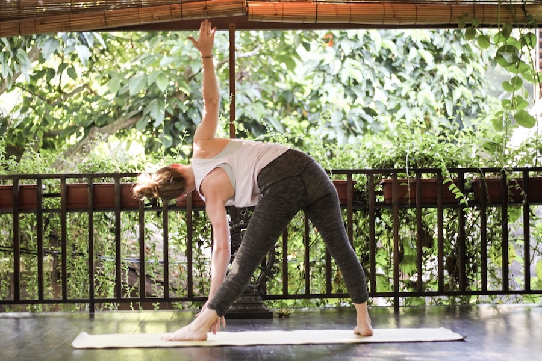
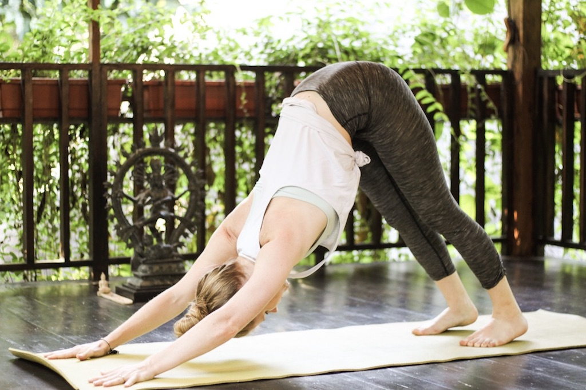
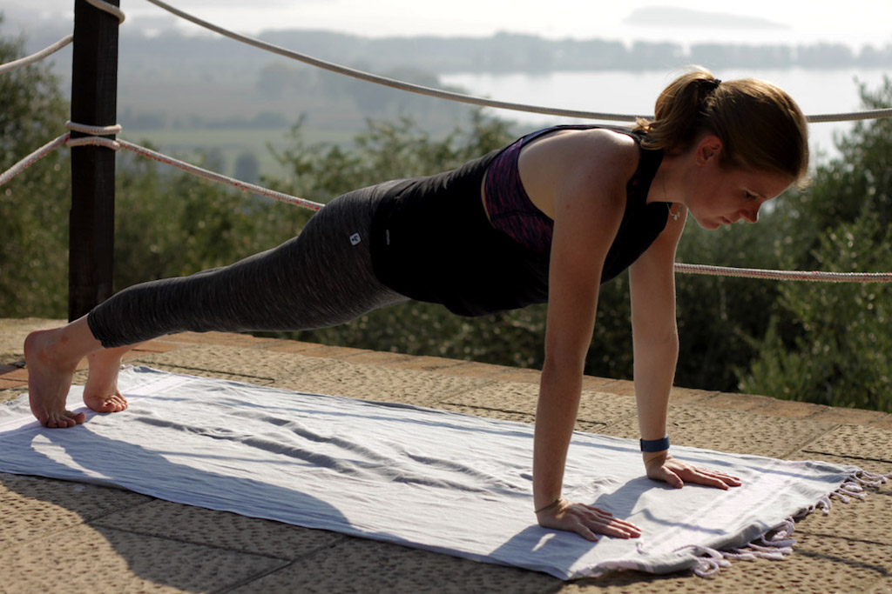
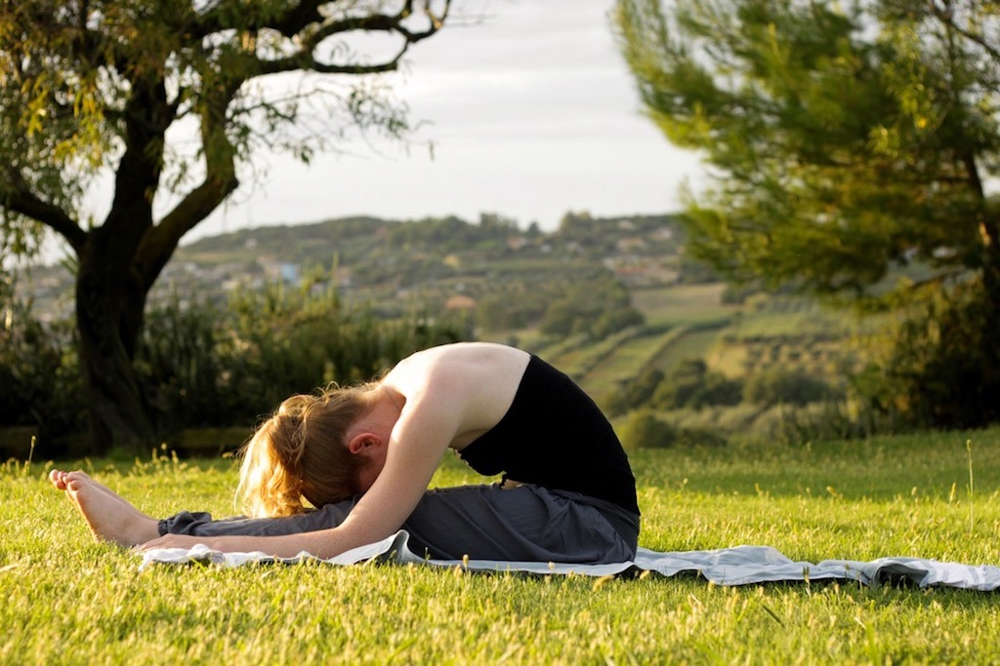
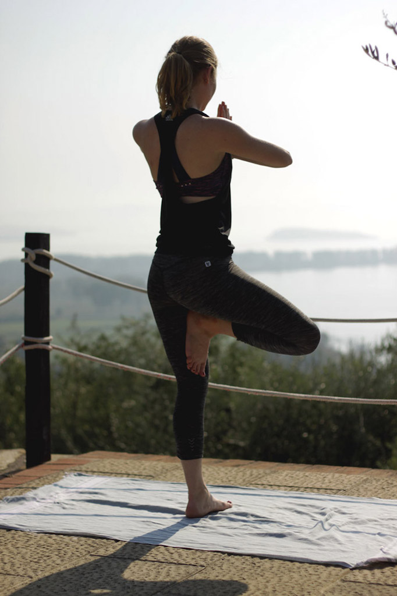

So you’re thinking about starting to do yoga? That’s great! First, let me ask you: What led you to do yoga? Was it the search for inner peace, health reasons, or do you want to become more flexible? Whatever it is, you will find it in yoga!

I remember when I started yoga years ago, things were so different. Nobody was talking about the hottest yoga trends and even though I am sure that there were different yoga styles, the most common one would simply be vinyasa. I didn’t hear about any other style.

These days, there are so many yoga styles to choose from which can make it hard for beginners to decide where they want to go. However, I don’t really think that the style is of such importance. They are all similar in their poses, thus I think it is much more important to learn about beginner’s poses. That’s what todays blog post is about. But first, let’s talk about the importance of finding a great teacher.

# Find a good teacher

Finding a good teacher was crucial to me in order to stick to yoga. When I first started, the teachers I had didn’t really suit my prefered style of working out. The classes were so boring to me, I didn’t feel anything happening within my body and the teacher didn’t really care to do any adjustments to my poses. That’s why in the beginning my practice was very on and off and I didn’t experience any changes within my body or my mind. However, everything changed when I found the right teachers. When I am doing yoga, I need to move a lot. I know that for some people the relaxing side of yoga is more important but for me it is definitely the physical one. It’s important to know what you expect from a class and see where you can get that. If you find that one teacher that lives up to your expectations, it changes everything.

A lot of people start out by using apps or following along youtube videos. I really wouldn’t recommend that. Even as an advanced yogini, the teacher is still always doing adjustments to my poses and I appreciate that a lot. If you’re just starting with yoga and don’t know the proper alignment of a certain pose, you shouldn’t do it. Of course, the online teacher will try her/his best to guide you, but nobody will tell you if you’re doing it right.

I remember when I started with yoga in the gym and nobody cared to align my poses, they all felt way too easy. I didn’t understand why everybody was saying yoga was so hard. I clearly didn’t feel it but it was just because I had the wrong alignment. This might also demotivate you and trick you into thinking that yoga is an easy practice when really it is not. So my advice to you would be to look for a teacher rather than for an online class.

# Learning to breathe

You might wonder why I am starting to talk about breathing when this post is about yoga poses. Yoga breathing, or Pranayama, really is the foundation of your yoga practice. Prana means breath or vital force. For different types of actions our body requires a changing amount of oxygen or pranic energy. Naturally, if we move we need more prana. By focussing on our breathing, the control of breathing shifts from brain stem / medulla oblongata to cerebral cortex. That way we can experience focus, be calmer and more aware of the situation. We can even let go of stress and random thoughts.

Focussing on our breath also makes us focus more on our movements. That way, chances of injury are being lowered.

Generally, you should focus on a relaxed breathing with long inhalation and exhalation. Movements that involve expansion of the chest are usually associated with inhalation. Contraction of the chest, however, is associated with exhalation. Furthermore, movements that go against gravity should have inhalation with them, if movements are made with gravity, then exhalation is recommended.

# Five basic yoga poses a beginner should know about

Even though I am against online classes, it doesn’t hurt to read a bit about basic yoga poses for beginners, right? These poses will help you build a strong foundation and will hopefully awaken your love for yoga.

**1. Downward-facing Dog**

There is no such yoga beginner’s guide without downward-facing dog and that’s not because they all copy each other but really because it is such an important pose to start with. It comes with so many health benefits because it is one of the so called inversion poses, meaning the heart is higher than the head. This brings blood flow to your head and lifts your energy. It also stretches the spine and strengthens the back as well as lengthening the calves and hamstrings.

From a table position with your hands under your shoulders and your knees under your hips, tuck the toes under, firmly press into your hands and bring your hips towards the ceiling by lifting them up. For a more elaborated instruction go to my downward-facing dog guide.

**2.Plank**

You are probably familiar with the plank position. It belongs to the the arm balancing poses and tones the abdominal muscles while also strengthening the spine and arms. It’s the perfect pose to improve posture and build muscles in order to build the power you need to transition between poses. It also teaches you to hold your own bodyweight for a longer while.

Start out on all fours with your wrists underneath your shoulders and your knees under your hips. Then step one foot back and ground the toes; now step back your other foot. Make sure your legs and glutes are firm, heels are reaching back and you’re body is building one straight line.

**3. Seated forward bend**

A seated forward bend is said to help a distracted mind and make you focus. The more obvious benefit however, is the stretch in your hamstrings and the entire backside of your body.

Sit on your mat, legs straight. Now take a big inhale and reach your arms up over your head to lengthen your spine. Exhale and fold at your hips, bringing your upper body on your legs while keeping your spine straight. Reach your hands to your ankles or if that’s too much to your knees or shins.

**4. Child’s pose**

Child’s pose is your pose to come back to whenever you need a break. It is a great rest pose between more challenging poses while also calming your mind. Other great benefits include opening your hips, elongating your lower back, and improving digestion.

Start in a kneeling position, toes touching. Then lower your butt on your heels and separate your knees around as wide as your hips. Exhale and rest your upper body on your thighs while your forehead rests on the ground. Lay your hands alongside your body with your palms up. Stay here for a few breaths.

**5. Tree pose**

Tree pose is a great beginners balancing posture to try out. An engaged core is key to keeping the balance here. This pose increases your focus and concentration while also strengthening your knees and ankles.

Start in a standing position and bring all the weight in your left leg. Now lift your right leg and bring your foot to the inside of your left thigh. Once you’ve found your balance, bring your palms together in prayer pose in front of your heart. Try to stay focused by staring at a focal point and don’t forget to engage your core. Next, lift your hands over your head, palms still together. Try to keep your balance there for a couple of breaths.

<Divider />

In my opinion, these five exercises will prepare you perfectly for your yoga praxis. With them, you're training your balance and core, you're doing a simple inversion, you know a resting pose and you're stretching your hamstrings.

* [Jade Harmony Professional](https://www.amazon.com/Jade-Harmony-Professional-68-Inch-Yoga/dp/B000ECBQRU/ref=as_li_ss_il?s=sports-and-fitness&ie=UTF8&qid=1491922559&sr=1-1&keywords=jade+yoga+mat&linkCode=li2&tag=21moves-20&linkId=8de31d061c976e6be1590d36a34b3029)
