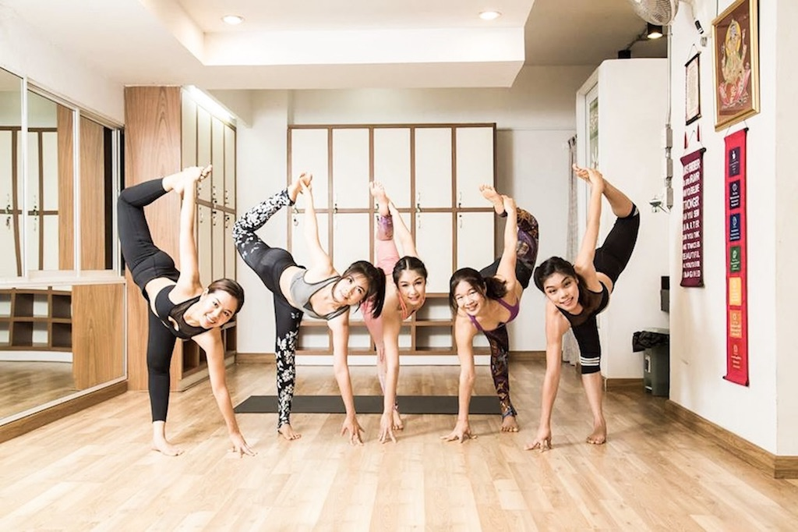
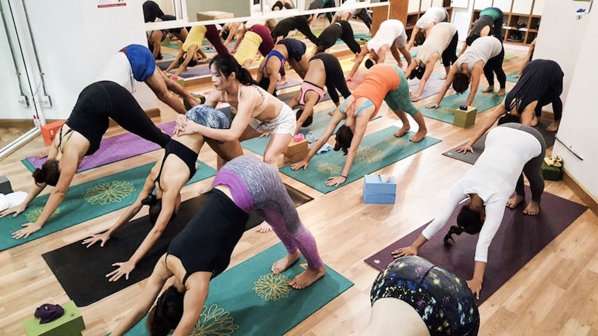
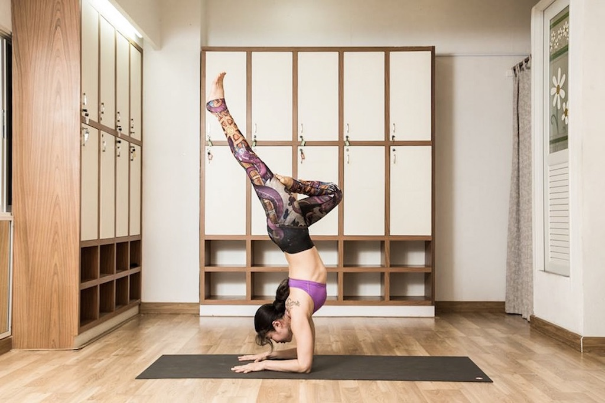

When I planned my trip to Thailand, I was sure that I wanted to do some Yoga there. I read so many articles about Yoga teacher training in Thailand, retreats, and classes and I heard so many good things about Thailand's Yoga practice that I definitely wanted to experience it myself.

At my first stop in Bangkok I didn’t have the time to visit some local classes at all. Everything was so new and hectic and I only had four days in Bangkok. Thus, sightseeing and eating was pretty much all I did there.

My next destination was Chiangmai in the north of Thailand. I have never been there before but heard that it was a great place to work remotely. And actually, I wanted to see this place five years ago already but a nasty food-poisoning came in between. Not so this time, so I stayed for a full week. During this week I wasn't only able to workout in the fabulous gym my Airbnb offered (I stayed right on the university campus in a student housing - must have been a fancy one ;), I was also able to finally take my Yoga class. After a little research and some talking to the Airbnb host, I decided to try out [YogaAnanda](https://www.yogaananda.net/) and what shall I say, I didn't get disappointed.

# Yoga in Thailand

When I took the Uber from our apartment to get to the yoga studio, I started a conversation with the Uber driver about the massive yoga trend in Thailand. He told me that about five years ago it seemed like many yoga studios were popping out of the ground. Suddenly everybody wanted to do yoga. As Thailand is also very well known for its backpacking culture, a lot of amazing teachers make the rounds through the country on a regular basis and many world-class yoga instructors now call Thailand their home. And of course also the tourism industry wanted to have its piece of cake and so you can find yoga retreats and teacher trainings almost everywhere.

# Yoga Ananda in Chiang Mai

The yoga studio is located on the ground floor of the Hillside Condo. It’s not a fancy studio but it is equipped with everything you need: mats, blocks, and straps. There is also one shower and a sink to wash after a sweaty yoga class. Classes are one hour and cost 250 Baht which is around seven $ which is an absolute fair price.

Kru Nok is the owner of Yoga Ananda and also the main instructor. She was amazing as well as the other yoga teacher. Right when I entered the class I felt the warm welcome and her positive energy. I was the only newbie in the class but she never let me feel that. Her creativity and positive attitude made the each class unique and so much fun. Kru Nok was also very helpful with assisting with my form or helping me getting that extra stretch. She did a lot of adjustments to my poses. However, she was always very considerate and always asked if everybody was feeling ok in order to not get “too far” into one pose. That was actually one thing I really enjoyed about yoga in Thailand: I felt like people always tried to get a little deeper into one pose, even if it meant that it hurt a little, yet never too much. I really enjoyed challenging me that way and seeing how far I can go. In that way, the classes were definitely not as gentle as other classes I have visited, but as I said, I really enjoy that as it helps me to get better.

# How I found the Class

As I said, I stayed in an AirBnB and the owner herself was a passionate yogini. She recommended the studio as she went there herself. I loved to see that the studio wasn’t only a tourist go-to but that also locals loved to take classes there.
I also googled for yoga classes in Chiang Mai and was happy to see that Yoga Ananda had only five star ratings.
Another way I always find great classes is through tripadvisor. The reviews are mostly really helpful and draw a good picture of what you can expect from a yoga studio.

# Yoga in Thailand compared to other Western Yoga Classes

For me, yoga in Thailand was a whole new experience. For starters, the class didn’t open with the traditional om chanting that I am used to in Germany. In fact, it didn’t have any spiritual references at all. Also the choice of music was different. Mostly, the music that is played in western yoga classes is without any vocals, purely instrumental. Not so in Thailand. They even played charts music like Robin Schulz. However, of course the music was just playing in the background and it was fitting very well as it also had a lot of instrumental in it. So of course they also choose music that fits the practice.

Another thing I realized was the different way of practicing. I mentioned it already: Thais go really deep into one position. Whereas in western classes teachers tend to say: Be gentle to your body, don’t go too deep. Thais tend to try to always get a little deeper so that it almost hurts a little. But they go never too far and they never do anything that doesn’t feel right for your body. I was really happy about that way of practicing because it showed my how far I could actually go. And in the end, you don’t get better if you don’t try to go beyond your limits.

