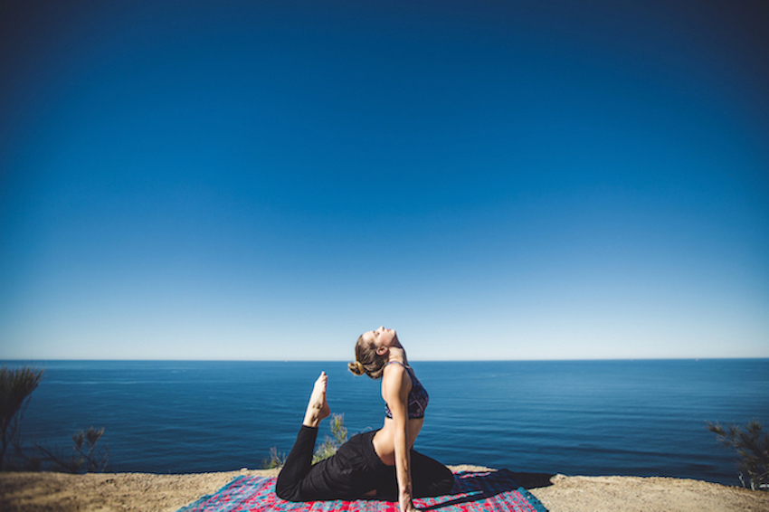
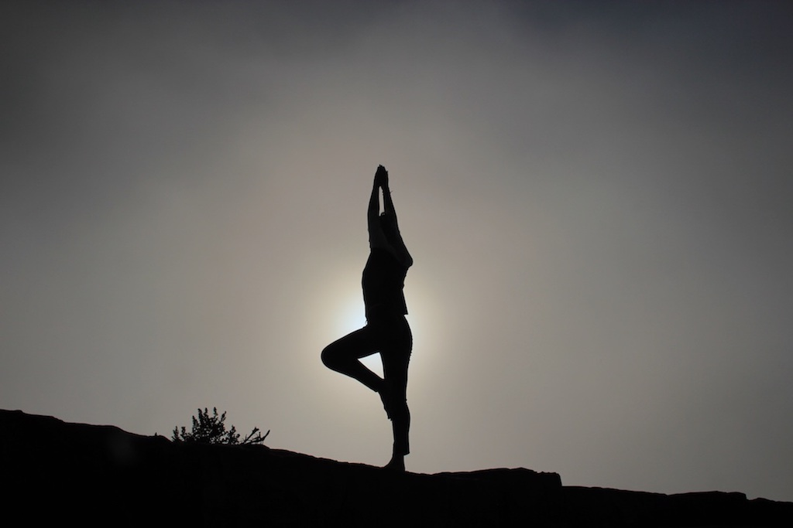
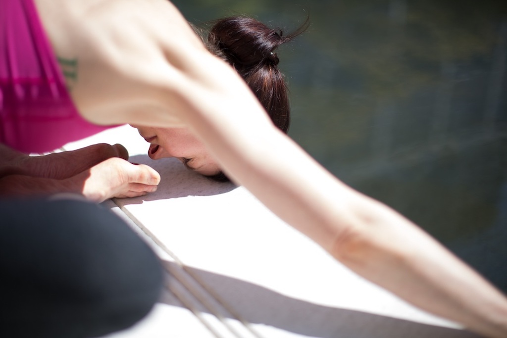
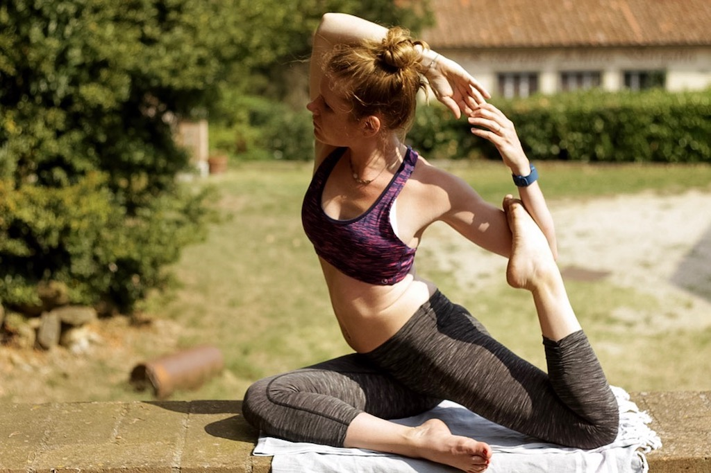

I remember very clearly when I started to do Yoga. It’s actually not that long ago. I am always so impressed whenever I talk to Yoga teachers and they tell me that they have been practicing for over ten years! My journey is still at the beginning but I am happily looking at the road ahead of me.

For those of you who are just getting started with Yoga, I have some Yoga practice tips that I found very helpful in the beginning. It’s mostly a collection of the yoga tips that I received from experienced yogis. I hope they are just as helpful to you as they were to me.

*[© Matthew Kane](https://au.ryderwear.com/)*

# 1. Give yourself the time to be a real Beginner

I wanted to start off with this tip because I feel like with all those impressive Instagram yogis everybody wants to jump right into the super advanced poses and skip the basics. In a few months you might be able to get into your first more advanced poses but until then work on the basics first. It’s so important to build stability within your practice and to not ask too much from yourself at the beginning. Head to your mat with a “beginner’s attitude”, not expecting too much from yourself and simply keeping a positive outlook at what is going to happen to your body.

# 2. Don’t forget to breathe

It’s not a secret that Yoga is all about breathing. At the beginning it might be difficult to align your breath with your movement but after a while it will come totally naturally.
Breath is life and it will always get you back into your Yoga practice. Whenever you feel your mind wandering, lengthen your inhales and exhales. When practiced regularly, you will feel how proper breathing can calm you down and give you a feeling of relaxation. Also, breathing will help you hold your yoga poses a great deal.

# 3. Don’t underestimate the Props

Especially beginners see it as a sign of weakness when they have to grab props to help them. Yoga blocks can make all the difference to your triangle pose and straps can help you enormously in your Dancer’s Pose. Don’t let your pride take away the opportunity to deepen and stabilize your poses, props are there for a reason. It doesn’t make any sense to remain in a pose if it is done wrong. In the worst case you might even hurt yourself. Keep in mind, you are not weak when having to use yoga props, even experienced and well trained yogis use them for a better practice.

* [Jade Harmony Professional](https://www.amazon.com/Jade-Harmony-Professional-68-Inch-Yoga/dp/B000ECBQRU/ref=as_li_ss_il?s=sports-and-fitness&ie=UTF8&qid=1491922559&sr=1-1&keywords=jade+yoga+mat&linkCode=li2&tag=21moves-20&linkId=8de31d061c976e6be1590d36a34b3029)

# 4. Don’t arrive last Minute

We all know it: we’re still home packing our things and in 15 minutes class is going to start. This happens to all of us. However, try to be ready for class at least five minutes before it starts, meaning be changed, have your mat rolled out and your props ready.
Whenever we are late for something, our body is totally stressed and under pressure and it is hard to relax right away. For your yoga practice, however, it is extremely important to calm down, order the thoughts and have free the mind. Don’t waste your first five minutes trying to calm down from being late and being stressed about it. Simply be there early. Arrive in the room and start your practice independently, whatever it is you feel like doing.

# 5. When your Arms feel weak get back to Child’s Pose

Look at Child’s Pose as a sort of rescue pose where you can always go back to. Whenever you feel that your arms are getting weak or you’re losing connection to your breath, go back there. This pose will help you zen out and get your focus straight again. Also remember that it is no shame to go back to Child’s Pose and relax for a few seconds. This is your practice and you should do what feels good to you.

# 6. Don’t judge a class by a one-time visit

I remember feeling pretty overwhelmed when I first started to take Yoga classes. The chanting kind of creeped me out and the fast pace of the class was a little too much for me. Although I had been working out for such a long time already, I felt super inflexible and not fit at all which frustrated me a lot. But as with all things in life it takes time to get used to things and to get better. This class, that I almost quit going to, is now one of my favorite classes ever. I got used to the chanting and can even enjoy it now and the fast pace isn’t an excessive demand anymore but a challenge.

# 7. Find out what you like best

There are so many Yoga styles: Hatha, Vinyasa, Ashtanga, Bikram, Kundalini or Yin Yoga just to name a few. They all have their particularities and with so many different styles it can be tough to find the one that works best for you. Don’t be afraid to try a different style when you feel that the one you’re doing doesn’t really suit you. I am sure there is a Yoga style for everyone, but to find it you have to try them out.

# 8. Visit several Yoga studios

Just as with different Yoga styles, there are also different types of Yoga studios. You might feel huge differences in teaching styles not even depending on the class you visit but the studio you go to. They all have their own “Yoga philosophy” which is represented in the whole studio. Thus, before fully committing to one studio, check out others too. You might be surprised about the differences. I had to test so many Yoga studios before I finally found my favorite with [Chimosa](https://www.chimosa.de) in Berlin.

# 9. Don’t skip the relaxation

Just as with relaxation at the beginning of class, relaxation at the end of class is equally important. Many people like to skip it because of lack of time or just because they think they don’t need it. However, relaxation at the end of practice is super important to process the Yoga class, the thoughts you had, the experiences with your body during class and the day ahead of you. So, don’t skip the relaxing part. Learn to let loose and just enjoy the relaxation.

# 10. Invest in a sticky mat

I made the mistake that when I started doing Yoga, I only bought a cheap Yoga mat off the rags. I didn’t want to invest a lot of money in a mat when I didn’t even know if I would fully commit to Yoga. However, especially in the beginning it is no fun to slip on your mat. Of course it is no fun later either, but in the beginning it might even make you quit Yoga all together. Not sticking on your mat is super annoying and even dangerous. Thus, before buying a cheap one that you’ll regret, borrow one in the beginning and if you know you’re gonna stick to Yoga, get a good sticky mat.

