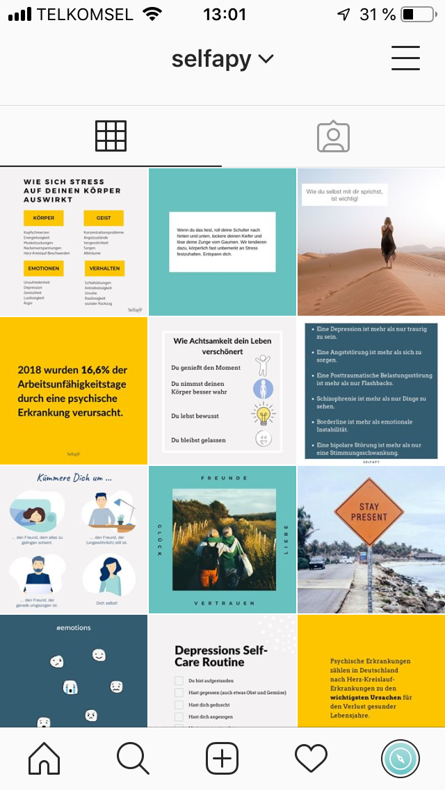
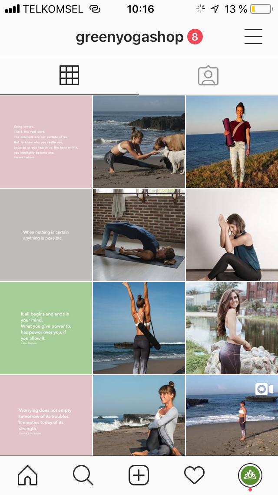

**As a copywriter, I am writing for clients from various industries. Some of my latest work as freelance copywriter:**

* [Blog for a video-marketing company](https://blog.mynd.com/de/author/liesa-huppertz)
* [Blog and Copywriting for a Yoga-wear Company: Greenyogashop](https://www.greenyogashop.com/blog/)
* [Blog for a fitness company](https://www.gymondo.de/magazin/author/liesa-huppertz)
* [Blog for a mental health company, June until August](https://www.selfapy.de/blog/)
* [Blog for a dietary supplement company for better concentration, until August 29th](https://www.concentrix.eu/magazin/)
* [Website Texting for an architect: Fischerplan](http://fischerplan.com/de/)
* [PR for a Dental Care Shop: Wawibox](http://epaper.dental-tribune.com/dti/59afa644020e4/page31.html#/16)

**Instagram Accounts I took care of:**

* Selfapy: Growing the account by 50% in three months 

* Greenyogashop: Growing the account by 50% 

**Photoshootings I organized:**

* [Greenyogashop](https://photos.app.goo.gl/d6sDF4cHDi8VtAVp7) Pictures are not for use!

**While working at Wimdu, my press releases were published in (but not only):**

* [Focus](http://www.focus.de/reisen/staedtereisen/wlan-rauchen-geschirrspueler-andere-laender-andere-zimmer-so-unterschiedlich-wohnt-der-westen_id_4895112.html)
* [Welt](https://www.welt.de/finanzen/immobilien/article140964011/Beim-Spuelen-sind-die-Daenen-besonders-faul.html)
* [Madame](http://www.madame.de/top-8-fashion-week-hangouts-933817.html)
* [Stern](http://www.stern.de/genuss/trinken/cocktails--das-sind-die-5-besten-sommerdrinks-6381732.html)
* [W&V](http://www.wuv.de/digital/instagram_studie_das_sind_die_beliebtesten_trips_mit_freunden)

**Some of my older work as copywriter at Wortweiss:**

* [Website for craftsmen](http://hwso.de/)
* [Website for pyrotechnician](http://feuerwerke-kuerbs.de/)